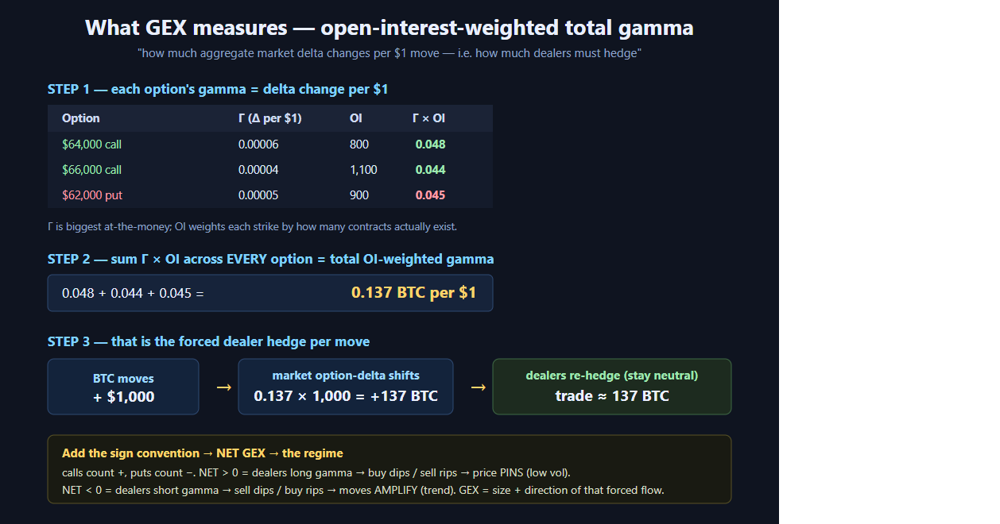

# 📖 What Gamma Exposure (GEX) Is

> The single concept the whole vault rests on. Read this first. Every cited line below
> survived 3-vote adversarial verification (sources at the bottom).

---

## 1. The one-sentence definition
**GEX = the open-interest-weighted total gamma across every listed option** — it quantifies **how much aggregate market delta changes per $1 (or 1%) move in BTC**, i.e. *how much options dealers are forced to hedge as price moves.* (CryptoGamma, verified 3-0)


*The definition visualized: (1) each option's Γ = delta change per $1, OI-weighted → (2) summed across every option = total OI-weighted gamma (0.137 BTC per $1 in this mini-chain) → (3) that is exactly the size dealers must trade to re-hedge. Add the sign convention (calls +, puts −) to get **net GEX** and the regime.*

> [!example] Plain-English example of the definition
> Suppose across all BTC options the aggregate gamma says: *"for every $1 BTC moves up, the whole market's delta increases by 5 BTC."* If dealers are **net short** that gamma, then a $1 rise just made them **5 BTC too short** — they must **buy 5 BTC** to get back to neutral. GEX is the number that tells you that hedging size and which way it points.

## 2. Why dealers must hedge (the mechanism)
- Options market-makers (dealers) stay **delta-neutral**. When BTC moves, their delta changes — by an amount governed by **gamma**.
- To re-neutralize, they **buy or sell the underlying** (spot/perp/futures). That hedging is *mechanical, predictable flow* — and GEX maps where it concentrates.
- GEX is therefore **"a measure of where options market-makers are forced to hedge."** (GammaFlip, verified 3-0)

> [!example] Worked example — one dealer, one option, two regimes
> A dealer is hedged on a BTC $64,000 call with gamma such that **delta rises 0.10 per $200 move**. BTC ticks from $63,300 → $63,500.
> - **If the dealer is LONG the option (long gamma):** their delta just rose, so they're now too *long* → they **sell** BTC into the rise. Net effect across the market = **selling rallies / buying dips → price gets dampened and pinned.**
> - **If the dealer is SHORT the option (short gamma):** their delta just *fell* relative to neutral, so they're too *short* → they **buy** BTC into the rise. Net effect = **buying rallies / selling dips → the move accelerates.**
> Same option, same tick — the **sign of the dealer's position flips the hedging flow**, and that is the entire game. (This is why the sign convention in §5 matters so much.)

## 3. The two regimes — the heart of it
| | **Positive / Long Gamma** | **Negative / Short Gamma** |
|---|---|---|
| Dealer position | Long gamma | Short gamma |
| Hedge on a **dip** | **Buy** (absorb) | **Sell** (accelerate) |
| Hedge on a **rip** | **Sell** (absorb) | **Buy** (accelerate) |
| Effect on price | **Dampens / pins** | **Amplifies / trends** |
| Volatility | Compresses | Expands |
| You should | Fade extremes, mean-revert | Trade momentum, respect breakouts |

> Verified phrasings:
> - "**Positive GEX**: dealers are long gamma and dampen volatility by buying dips and selling rips … **Negative GEX**: dealers are short gamma and amplify moves as they hedge." (CryptoGamma, 3-0)
> - "Positive GEX zones: dealers … typically buy on dips and sell on rallies, which dampens volatility. Negative GEX zones: dealers sell as prices fall and buy as prices rise." (Glassnode, 3-0)
> - Amberdata frames it as positive gamma = stabilizing "buy low, sell high"; negative gamma = destabilizing "sell low, buy high." (3-0)

> [!example] The two regimes as a picture (hedging-flow arrows)
> ```
> POSITIVE GEX (long gamma) — dealer flow OPPOSES the move → spring-back / pin
>
>   price ↑ rip  →  dealer SELLS ↓   ┐
>                                     ├─►  price squeezed back to center → RANGE
>   price ↓ dip  →  dealer BUYS  ↑   ┘
>
>   $63,000 ───────●───────── $64,000      ← price oscillates, low volatility
>                 pin
>
> NEGATIVE GEX (short gamma) — dealer flow FEEDS the move → trend / squeeze
>
>   price ↑ rip  →  dealer BUYS  ↑   ┐
>                                     ├─►  move amplified → TREND / breakout
>   price ↓ dip  →  dealer SELLS ↓   ┘
>
>   $63,000 ─────────────────►►► $66,000   ← price runs, volatility expands
> ```
> **Real read (BTC, 2026-06-20 capture):** net gamma was **−96.37K** (call +162.75K, put −259.12K) → **negative/short-gamma**, "bearish" 38.6% call-weighted. Interpretation: this was a **trend/amplify** environment, not a pin — fade setups were *lower* probability, breakout/momentum *higher*. (Numbers from the live CryptoGamma snapshot.)

## 4. The structural levels GEX gives you
- **Gamma Flip / Zero-Gamma:** the price where **net GEX crosses zero** — *"the boundary between low-volatility and high-volatility regimes."* (GammaFlip, 3-0). **The most important single level.**
- **Gamma Wall:** the strike with the largest gamma concentration → acts as a **magnet/barrier** (pin in long-gamma, hard level in short-gamma).
- **Call Wall / Put Wall:** largest call-side / put-side exposure → soft **resistance / support**.

> [!example] The structural levels on an annotated GEX-by-strike chart
> Each bar = net dollar GEX at that strike (▇ above zero = positive/call-side, ▁ below = negative/put-side). Read it like a topographic map of dealer hedging:
> ```
>   net GEX
>   ($ per 1% move)
>        +│                      ▇▇▇▇        ← CALL WALL ($66,000): biggest positive
>        +│            ▇▇        ▇▇▇▇           bar = strongest resistance / pin-up cap
>        +│   ▇        ▇▇        ▇▇▇▇
>     ────┼───▇──┬─────▇▇──────────────  price → 
>        −│   ▁  │     ▁▁
>        −│   ▁  │ ZERO-GAMMA (~$63,800):  ← regime boundary. ABOVE → long-gamma/pin,
>        −│ ▁▁▁  │ net GEX crosses 0          BELOW → short-gamma/trend
>        −│ ▁▁▁
>        −│ ▁▁▁▁                            ← PUT WALL ($61,000): biggest negative
>          $61k  $63.3k(spot)  $64k  $66k     bar = strongest support / air-pocket edge
> ```
> **How to read this exact picture:** spot $63.3k sits **just below** zero-gamma $63.8k → you're in the **short-gamma half** (trend-prone). The **put wall $61k** is your downside magnet/support; the **call wall $66k** caps rallies. A break *below* $61k = air-pocket (no dealer support beneath); a reclaim *above* $63.8k flips you into the pinning regime. Full reading guide: [[03 — How to Read a GEX Chart (interpretation)]].

(Math + how each is computed: [[02 — The Math — Greeks to Dollar GEX (with code)]]. Reading them live: [[03 — How to Read a GEX Chart (interpretation)]].)

## 5. Crypto vs equities — a crucial nuance
- The classic equity GEX **assumes dealers are long calls / short puts** (SpotGamma, gex-tracker — verified). This is a *convention*, not a measurement.
- In crypto there's no OCC-style customer/dealer tagging — BUT **Deribit exposes the taker on each trade**, so the *better* crypto method infers **dealer = mirror of the taker** (Glassnode, 3-0). Most free dashboards still use the naive equity assumption.
- → This sign question is the #1 reason two BTC GEX dashboards disagree. See [[08 — Pitfalls and Misconceptions (what NOT to do)]].

## 6. What GEX is **not**
- ❌ Not a directional signal (it's about *environment + levels*, not "up or down").
- ❌ Not a guarantee (walls break; models assume sign).
- ❌ Not real-time-perfect (OI is delayed; dashboards refresh on 1–15 min cadences).

---

### Sources (all verified 3-0 unless noted)
- CryptoGamma — https://cryptogamma.io/ (definition, regimes, Deribit source)
- GammaFlip.io — https://gammaflip.io/ (gamma flip, hedging framing)
- Glassnode — https://research.glassnode.com/gamma-exposure/ (taker-flow method, regimes)
- Amberdata — https://docs.amberdata.io/http/analytics/derivatives/gamma-snapshots-gex (MM hedging definition)
- SpotGamma — https://spotgamma.com/gamma-exposure-gex/ (canonical equity formula)
