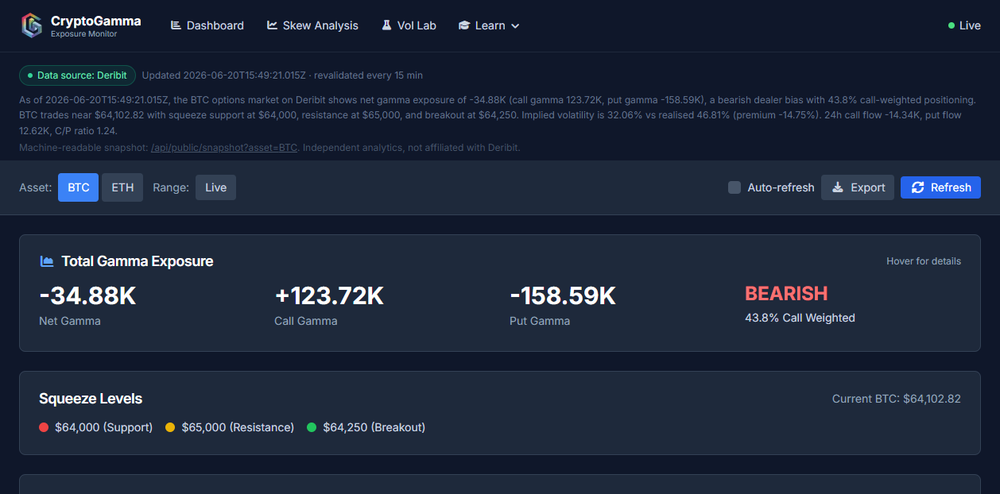
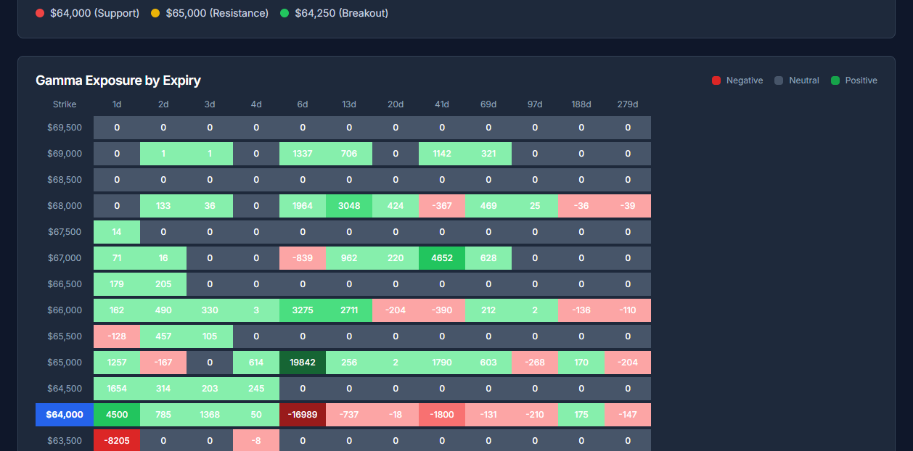
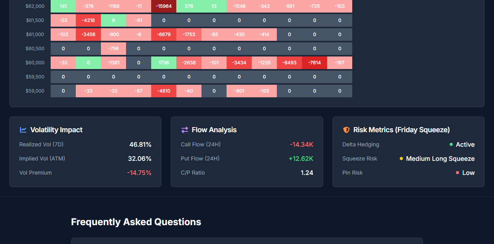

# 🔬 Deep-Dive: CryptoGamma.io

**URL:** https://cryptogamma.io/dashboard/ · **API:** https://cryptogamma.io/api/public/snapshot?asset=BTC
**One line:** Free, Deribit-derived BTC/ETH gamma dashboard with actionable squeeze/pin levels and a public JSON API.

---

## 1. What it is & what problem it solves
A hosted dashboard that turns the raw Deribit options chain into a **single decision screen**: net/call/put gamma, a directional bias, and the price levels where dealer hedging should pin or squeeze BTC. It saves you from building your own engine.

## 2. End-to-end architecture (how data flows)
```
Deribit public API (orderbook, OI, mark IV, index price)
        │  (server-side fetch)
        ▼
CryptoGamma compute layer  →  naive GEX = Σ strike  OI × Γ × sign
        │   + squeeze model (support/resistance/breakout)
        │   + riskMetrics (deltaHedging, squeezeRisk, pinRisk)
        ▼
Next.js cache (ISR, revalidate ~15 min)
        ├──► /dashboard/  (rendered UI)
        └──► /api/public/snapshot?asset=BTC  (JSON)
```
- **Stack signal:** Next.js with Incremental Static Regeneration (the "revalidated every 15 min" string is the ISR cache TTL).
- **Sign convention:** call gamma positive, put gamma negative (naive model — see [[02 — The Math — Greeks to Dollar GEX (with code)]]).

## 2b. The dashboard UI, panel by panel (captured live 2026-06-20)



### Header summary + "Total Gamma Exposure" panel
- **What it is:** a plain-English sentence (auto-generated from the snapshot) + four big numbers: **Net Gamma −34.88K**, **Call Gamma +123.72K**, **Put Gamma −158.59K**, and a **BEARISH / 43.8% Call Weighted** verdict. Header shows **Data source: Deribit · revalidated every 15 min** and a link to the JSON API.
- **How to read it:** Net sign = the regime (**negative here → short-gamma → trends amplify**). "Call weighted %" <50% = puts dominate the book (bearish dealer lean). The one-liner restates it for you.
- **Logic:** `Net = ΣcallΓ·OI − Σ|putΓ·OI|`; bias = call share of total |gamma|.
- **Limitation:** it's the **naive** sign model (calls +, puts −) — the "BEARISH" label is a *positioning* read, **not** a price forecast.

### "Squeeze Levels" panel
- **What it is:** three coloured levels — **🔴 $64,000 Support · 🟡 $65,000 Resistance · 🟢 $64,250 Breakout** — vs **Current BTC $64,102.82**.
- **How to read it:** support/resistance = where dealer hedging should defend; **breakout** = the level beyond which the squeeze accelerates. Price sitting *between* support and breakout = coiled.
- **Use it to:** drop these three lines straight onto your chart as the day's map.
- **Limitation:** in tight regimes support and resistance can nearly coincide (here $64.0k/$65.0k are close); treat as zones, and a 15-min refresh lags fast moves.



### "Gamma Exposure by Expiry" heatmap — the centrepiece
- **What it is:** a **matrix**: rows = **strikes** ($59k–$69.5k), columns = **days-to-expiry** (1d, 2d, 3d, 4d, 6d, 13d, 20d, 41d, 69d, 97d, 188d, 279d). Each cell = the GEX at that strike *for that expiry*, coloured **🟢 positive / 🔴 negative / ⚪ neutral**, intensity = magnitude. The current-price row ($64,000) is highlighted blue.
- **How to read it:** scan **down a column** to see a single expiry's wall structure; scan **across a row** to see how one strike's gamma builds/decays over time. Big saturated cells = the dominant walls. Live extremes: **$65,000 / 6d = +19,842** (deep green pin) vs **$64,000 / 6d = −16,989** (deep red), and **$62,000 / 6d = −15,964** — i.e. the 6-day expiry holds a strong positive wall at $65k and a negative air-pocket at $62–64k.
- **Logic:** per-strike-per-expiry `Γ·OI·sign`, the building blocks that sum to the Net Gamma up top.
- **Use it to:** see **which expiry owns a level** (a $65k wall that's all in the 6d column evaporates after that expiry) and where the near-term (1–6d) pin/air-pockets sit.
- **Limitation:** dense and easy to over-read; the far columns (97–279d) are thin/illiquid — focus on 1d–20d. Naive sign applies per cell.



### Bottom trio — Volatility / Flow / Risk
- **Volatility Impact:** **Realized Vol (7D) 46.81%** vs **Implied Vol (ATM) 32.06%** → **Vol Premium −14.75%** (IV *below* realized = options relatively cheap; unusual, means recent moves bigger than priced).
- **Flow Analysis:** **Call Flow (24H) −14.34K**, **Put Flow (24H) +12.62K**, **C/P Ratio 1.24** → net put buying / call unwinding = bearish-leaning 24h flow.
- **Risk Metrics (Friday Squeeze):** **Delta Hedging Active**, **Squeeze Risk = Medium Long Squeeze**, **Pin Risk Low** → mechanical hedging on, moderate upside-squeeze potential, little pinning (consistent with the short-gamma read).
- **How to use the trio:** they *qualify* the headline regime — e.g. short-gamma + "Medium Long Squeeze" + low pin = trend/breakout bias, not fade. 
- **Limitation:** "squeeze/pin risk" are model labels, not probabilities; vol premium sign can flip intraday.

## 3. The data fields (what every number means)
From the live `/api/public/snapshot?asset=BTC` payload + dashboard:

| Field | Meaning | How to read it |
|-------|---------|----------------|
| `netGamma` | Call gamma + put gamma (net dealer exposure) | **Negative → short-gamma, trends amplify**; positive → pinning |
| `callGamma` / `putGamma` | Side breakdown | Magnitude & balance → who dominates |
| `bias` | BEARISH / BULLISH / NEUTRAL + "% call weighted" | Quick read of net positioning skew |
| `squeeze.support` / `.resistance` | Nearest gamma-derived defended levels | Where pinning/bounce is likely |
| `squeeze.breakout` | Level beyond which squeeze accelerates | Break → momentum/vol expansion |
| `realized` vs `implied` vol + premium | IV richness vs delivered vol | High premium → options "expensive", vol-sellers active |
| `flow` (24h call/put) + C/P ratio | Recent volume tilt | Demand pressure direction |
| `riskMetrics.deltaHedging` | Expected dealer hedge intensity | Higher → more mechanical flow |
| `riskMetrics.squeezeRisk` | Likelihood of a squeeze | Rising → fragile, trend-prone |
| `riskMetrics.pinRisk` | Likelihood price pins a strike near expiry | High → range/mean-revert into expiry |
| `generatedAt` | Snapshot timestamp (UTC) | Confirm freshness (≤15 min old) |

## 4. How to actually use it
- **Open the dashboard**, read `bias` + `netGamma` sign → decide regime (pin vs trend).
- Mark `squeeze.support / resistance / breakout` on your TradingView chart as horizontal lines.
- Near expiry, watch `pinRisk` → fade extensions back toward the pin.
- For automation: poll the JSON API (code in [[05 — APIs and Data Sources (Deribit etc.)]]).

## 5. What NOT to do / limitations
- **Naive model:** no true customer/dealer tagging — sign is assumed, not measured. Don't treat "BEARISH bias" as a directional signal; it's a *positioning* read.
- **Single venue (Deribit only).** Misses CME/OKX/Bybit/IBIT context.
- **15-min cadence** → useless for sub-15-min scalps; levels can be stale around fast moves.
- **Squeeze support==resistance** sometimes collapses to the same number in tight regimes — that's a degenerate output, not a high-conviction level.

## 6. Verdict
🥇 **Rank #1 for retail.** Best free "look once, get levels + an API" tool. Pair with GEX Terminal Pro for the intraday chart. → [[04 — Dashboards Directory + RANKING]]
