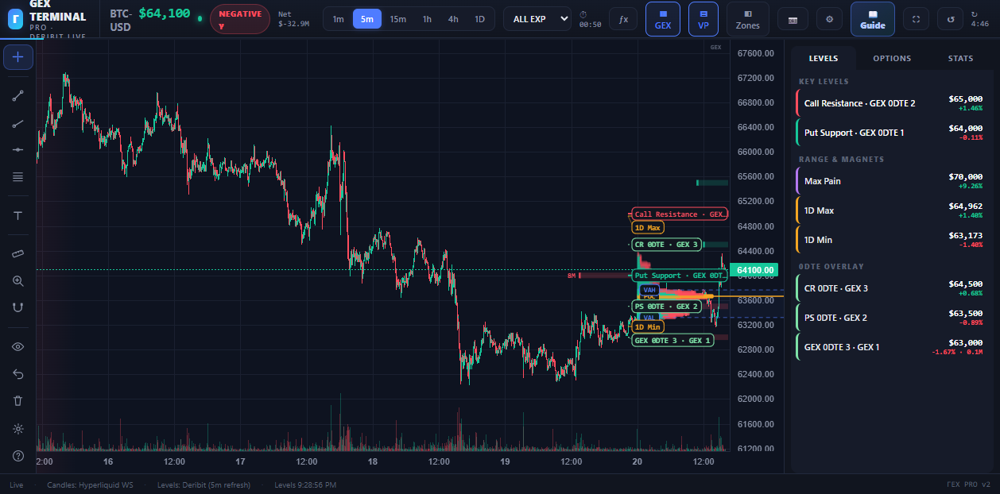

# 🔬 Deep-Dive: GEX Terminal Pro (gexterminal.net)

**URL:** https://gexterminal.net/
**One line:** Free intraday charting terminal that overlays Deribit GEX/DEX levels + IBIT flow + classic TA and scores "confluence" trade zones.
**⚠️ Not the same as** the `zrack/gex-terminal` GitHub repo — unrelated.

---

## 1. What it is
A browser trading terminal (TradingView-like) purpose-built for BTC options structure. Instead of a static GEX bar chart, it draws the **levels on a live candle chart** and tells you where multiple signals stack up.

## 2. Architecture / data flow
```
Hyperliquid WebSocket ───► live BTC candles (1m..1D)
Deribit options chain ───► GEX + DEX levels (5-min refresh)
Tradier API (your key) ──► IBIT (US ETF) options levels overlay
        │
        ▼
Confluence engine: score = agreement across
   GEX clusters · DEX bias · IBIT walls · VWAP · EMAs(9/21/50/200)
   · RSI(ob/os) · Volume Profile(POC/VA) · 1D range · Max Pain
        ▼
Chart UI: Levels / Options / Stats panels + drawing tools + replay
```

## 2b. The live terminal, dissected (captured 2026-06-20)



### Header strip
- **BTC-USD $64,100 · NEGATIVE Γ badge · Net $−32.9M** — the regime read is *front and center*: negative gamma → trend/amplify. Timeframe tabs **1m·5m·15m·1h·4h·1D**, **ALL EXP / 0DTE** expiry toggle, a countdown to next refresh, and **GEX / VP / Zones** layer toggles + **Guide**.
- **How to read it:** the **NEGATIVE Γ** pill + net $ is your one-glance regime; flip to 0DTE to isolate today's expiry walls.

### The chart (centre)
- **What it is:** **Hyperliquid candles** with **Deribit GEX levels drawn as horizontal lines** + a **volume profile** (VAH/POC/VAL) on the right edge and a volume histogram beneath.
- **Levels visible (how to read each):**
  - **Call Resistance · GEX** (~$65,000) — positive-GEX cap; rallies stall here.
  - **Put Support · GEX 0DTE** ($64,000) — downside dealer defence.
  - **CR 0DTE · GEX 3** ($64,500) / **PS 0DTE · GEX 2** ($63,500) / **GEX 0DTE 3 · GEX 1** ($63,000) — ranked 0DTE walls (GEX 1/2/3 = strength tiers).
  - **1D Max $64,962 / 1D Min $63,173** — the day's expected range edges.
  - **VAH / POC / VAL** — volume-profile value area (fair-price magnet), an independent confluence with the GEX levels.
- **How to use it:** trade **where GEX + VP + the 1D range agree** (the confluence idea); in this **negative-Γ** book, respect breaks of $64k support / $65k resistance as accelerants rather than fades.

### Right panel — LEVELS / OPTIONS / STATS
- **LEVELS tab (shown), three groups:**
  - **KEY LEVELS:** Call Resistance GEX 0DTE 2 **$65,000 (+1.46%)**, Put Support GEX 0DTE 1 **$64,000 (−0.11%)**.
  - **RANGE & MAGNETS:** **Max Pain $70,000 (+9.26%)**, 1D Max $64,962, 1D Min $63,173.
  - **0DTE OVERLAY:** CR 0DTE GEX 3 $64,500, PS 0DTE GEX 2 $63,500, GEX 0DTE 3 GEX 1 $63,000 (with % distance from spot and GEX magnitude e.g. 0.1M).
- **OPTIONS / STATS tabs:** options-flow detail and session stats (not expanded here).
- **How to read it:** the panel is the **numeric table** behind the drawn lines — each level with its **% distance from spot** (how close = how imminent) and GEX size (how strong).
- **Footer:** **Live · Candles: Hyperliquid WS · Levels: Deribit (5m refresh)** — confirms the two-venue architecture.

### Logic, assumptions, limitations
- **Logic:** Deribit options → GEX/DEX levels (5-min) scored for **confluence** with VWAP/EMA/RSI/VP/IBIT; candles streamed from Hyperliquid.
- **Assumptions:** naive sign model; **GEX 1/2/3 tiering and the confluence score are proprietary** (thresholds undisclosed).
- **Limitations:** **no data export/API** (eyes-on-glass only); levels lag at **5-min**; candles (Hyperliquid) and levels (Deribit) are **two different venues** → small basis differences are normal; IBIT overlay needs your own Tradier key.

## 3. What every overlay means (where & how to read)
| Overlay | Where | Meaning |
|---------|-------|---------|
| **GEX clusters** (CR / PS / walls) | Horizontal levels | Call Resistance, Put Support, gamma walls = hedging magnets/barriers |
| **DEX** (delta exposure) | Bias indicator | Directional hedging pressure (not just magnitude) |
| **IBIT walls** | Levels (if Tradier key set) | US ETF options structure — cross-market confluence |
| **Volume Profile** POC/VA | Side histogram | Acceptance/value area, fair-price magnet |
| **VWAP / EMAs 9·21·50·200** | On candles | Trend/mean context |
| **RSI ob/os** | Sub-pane | Momentum extension |
| **1D Range** edges | Levels | Intraday boundaries |
| **Max Pain** | Level | Strike that maximizes option-writer profit at expiry |
| **Confluence score** | Zone shading | More signals agree → higher-quality zone |

## 4. How to use it
- Pick timeframe (0DTE/1m for scalps, 4h/1D for swing). Identify the **highest-confluence zone** near price.
- Trade *toward* confluence in positive-gamma (pin) regimes; respect *breaks* of walls in negative-gamma regimes.
- Add your free **Tradier API key** to unlock the IBIT overlay (extra confirmation from US flow).

## 5. What NOT to do / limits
- **No data API/export** — you can't automate or backtest off it; it's eyes-on-glass only.
- **Confluence scoring is a black box** — don't outsource judgment to the score; verify each component.
- Levels refresh **~5 min** — fine for intraday, not tick-level.
- Candles come from **Hyperliquid**, levels from **Deribit** — two venues; minor basis differences are normal.

## 6. Verdict
🥈 **Rank #2 for retail** — the best *free intraday visual*. Use alongside CryptoGamma (which adds the API + explicit pin/squeeze metrics). → [[04 — Dashboards Directory + RANKING]]
