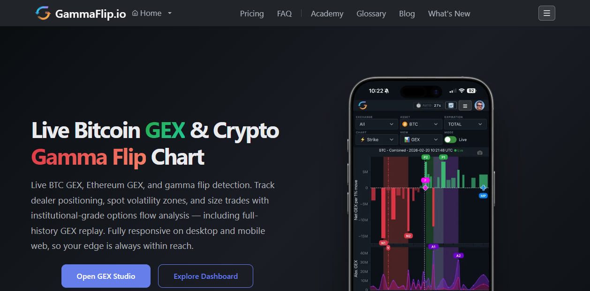
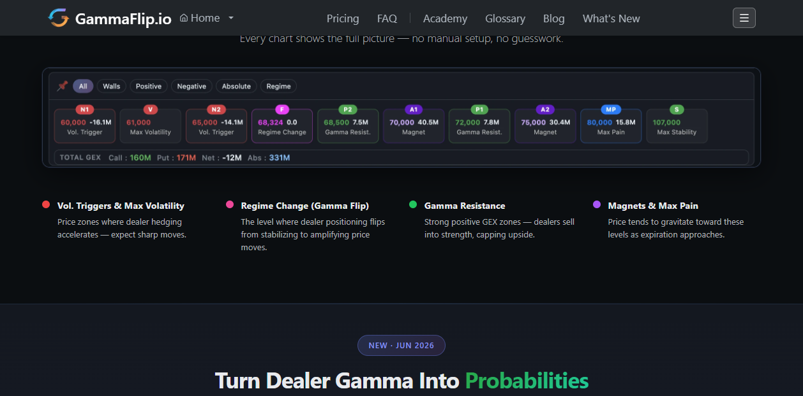

# 🔬 Deep-Dive: GammaFlip.io

**URL:** https://gammaflip.io/
**One line:** Free, fast (~60s) **multi-exchange** crypto GEX dashboard centered on the **gamma flip** level; broadest market coverage of the free tools.

---

## 1. What it is & why it matters
A live GEX dashboard whose headline feature is the **gamma flip** — the price where **net GEX crosses zero**, i.e. the boundary between the low-vol (dealers dampen) and high-vol (dealers amplify) regimes. Its edge over CryptoGamma: **faster refresh and multi-exchange aggregation.**

## 2. Coverage & data (verified 3-0)
| Attribute | Value |
|-----------|-------|
| Exchanges | **Deribit + Bybit + OKX** (aggregated) |
| Assets | BTC, ETH, SOL, XRP |
| Market coverage | claims **"99.5% of the crypto options market"** |
| Refresh | **~60 seconds** (vs CryptoGamma's ~15 min) |

## 2b. The UI, dissected (captured 2026-06-20)
> ⚠️ **Access note:** the **live app (`/app`, `/dashboard`) is behind a 14-day free-trial sign-up** (no card, but account required). The captures below are the **public landing-page product previews** — real UI, representative of the paid tool. I did not create an account.

### The GEX chart
- **What it is:** a **GEX-by-strike** bar chart (green = positive, red = negative) on a **"BTC – Combined"** multi-exchange book, with a spot line and overlaid **markers** (walls, flip). Controls (top): asset, exchange, expiry, and a **Strike** view.
- **How to read it:** same wall/flip logic as the others, but the headline is the **marker overlay** (below) — GammaFlip *labels* the levels for you rather than making you eyeball the bars.
- **Edge:** the book is **aggregated across Deribit + Bybit + OKX** and refreshes **~60s** — the fastest, broadest of the free-ish tools.

### The marker taxonomy — GammaFlip's signature
A horizontal strip labels every key level with a tag, price, and GEX value. From the live capture:
| Tag | Name | Example | Meaning / how to read |
|-----|------|---------|-----------------------|
| **N1 / N2** | Vol. Trigger | $60,000 (−16.1M), $65,000 (−14.1M) | negative-GEX zones where **hedging accelerates → expect sharp moves** |
| **V** | Max Volatility | $61,000 | the most volatility-prone strike |
| **F** | Regime Change (**Gamma Flip**) | **$68,324 (0.0)** | net GEX = 0 → **dealers flip from stabilizing to amplifying**. The key line. |
| **P1 / P2** | Gamma Resistance | $72,000 (7.8M), $68,500 (7.5M) | strong **positive**-GEX zones → dealers **sell into strength → caps upside** |
| **A1 / A2** | Magnet | $70,000 (40.5M), $75,000 (30.4M) | price **gravitates toward** these into expiration |
| **MP** | Max Pain | $80,000 (15.8M) | option-writer max-profit strike → pin target |
| **S** | Max Stability | $107,000 | the calmest/highest-positive zone |
- **TOTAL GEX bar:** **Call 160M · Put 171M · Net −12M · Abs 331M** — the whole-book regime at a glance (net negative → short-gamma).
- **How to use it:** read **F (flip)** first for the regime boundary, then trade toward **A (magnets)** / fade **P (resistance)** in pinning, and respect **N (vol triggers)** as breakout accelerants in short-gamma.
- **Limitations:** the taxonomy is **GammaFlip's own interpretation layer** (proprietary thresholds — not a standard) → don't treat the labels as ground truth, and **the live values are paywalled** after trial. Still the naive aggregated model under the hood.

## 3. The core concept it teaches
> "The gamma flip [is] the price level where net GEX crosses zero — the boundary between
> low-volatility (dealers dampen moves) and high-volatility (dealers amplify moves) regimes."

- **Above the flip** → typically long-gamma → mean-reversion, pinning.
- **Below the flip** → typically short-gamma → momentum, squeezes, vol expansion.
- Framing (verified): *Positive GEX → dealers buy dips & sell rallies (compress vol); Negative GEX → amplify moves both directions.*

## 4. How to use it
- Use the **flip level as your regime switch**: trade mean-reversion above it, momentum/breakouts below it.
- Because it **aggregates 3 venues**, its flip is less single-venue-biased than Deribit-only tools.
- Cross-check its flip against CryptoGamma's `squeeze.breakout` and GEX Terminal's zero-gamma cluster — agreement = high conviction.

## 5. What NOT to do / limits
- API availability not confirmed (treat as a **monitoring** tool, not an automation source — unlike CryptoGamma/Laevitas).
- "99.5% coverage" and "~60s" are **vendor self-report** (verified as *stated*, not independently load-tested).
- Still a **naive/aggregated** model — the flip is an estimate, not a hard line. → [[08 — Pitfalls and Misconceptions (what NOT to do)]]

## 6. Verdict
**Co-leader of the free tier** — arguably the best *live monitor* (fastest + broadest), while CryptoGamma wins on the **API**. Use both. → [[04 — Dashboards Directory + RANKING]]
