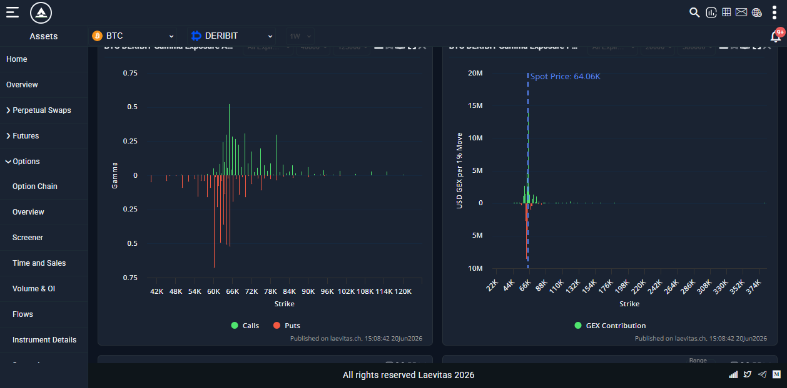
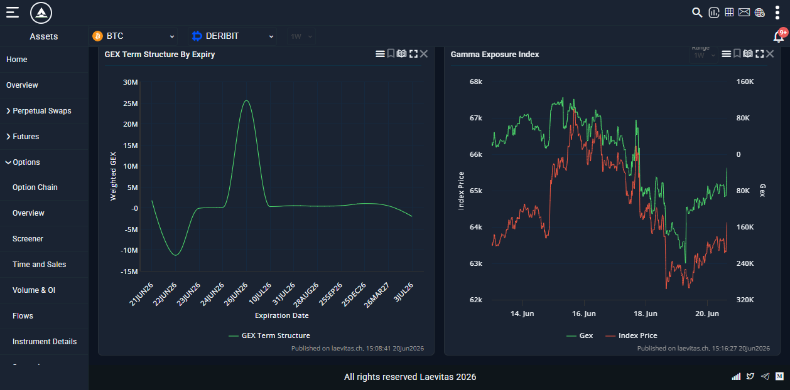

# 🔬 Deep-Dive: Laevitas

**BTC GEX page:** https://app.laevitas.ch/assets/options/gex/btc/deribit
**API docs:** https://docs.laevitas.ch/options/analytic
**One line:** Institutional crypto-derivatives analytics suite with a dedicated BTC-Deribit GEX dashboard and a documented REST API across 15+ exchanges.

---

## 1. What it is
A full options-analytics platform (not just GEX). The GEX page is one module inside a suite: Option Chain, Overview, Screener, Time & Sales, Volume & OI, Flows, Strategies, Volatility, Skew & BF, Vol Monitor, Vol Run, GEX, Max Pain.

## 2. The BTC GEX dashboard — the 4 charts, dissected
Captured live via agent-browser on 2026-06-20 (Highcharts 11.4.8; spot $64.06K). The GEX page renders **four** charts. Top controls: **Asset (BTC)**, **Exchange (Deribit)**, **window (1W)**, plus per-chart **Expiry** and **Min/Max Strike** filters, a **fullscreen** toggle, and **"View as data table"** (exports exact numbers).

### Chart 1 — "Gamma Exposure (All Expirations)" — raw gamma by strike
- **What it is:** for every strike, the summed **option gamma**, split **green = Calls (above 0)** and **red = Puts (below 0)**. Y-axis = *Gamma* (not dollarized). X-axis = strike ($40k–$125k filterable).
- **How to read it:** tall bars = strikes where a $1 move flips the most delta = the **gamma walls**. From the live data table: **call gamma** peaks at **$65,000 (0.52)**, $64,000 (0.30), $66,000 (0.28), $67,000 (0.26); **put gamma** peaks (most negative) at **$60,000 (−0.68)**, $65,000 (−0.52), $64,000 (−0.51), $62,000 (−0.50). So $64–65k = the contested gamma cluster around spot.
- **Logic:** raw Black-Scholes Γ × OI per strike, calls +, puts − (the naive convention — [[02 — The Math — Greeks to Dollar GEX (with code)]]).
- **Use it to:** locate the wall/ support/ resistance strikes at a glance.
- **Limitation:** "raw gamma" isn't dollar-scaled, so a far-OTM strike's bar can look meaningful when its *dollar* hedging impact is tiny — which is exactly why chart 2 exists.

### Chart 2 — "Gamma Exposure (Per 1% Move)" — USD GEX, the actionable one
- **What it is:** the same gamma **dollarized per 1% move** (`Γ·OI·S²·0.01`), with a blue **Spot Price $64.06K** marker line. Y-axis = *USD GEX per 1% Move* (peaks ~20M).
- **How to read it:** the bars **collapse almost entirely onto the strikes nearest spot** — because dollar-gamma is largest at-the-money. The single dominant bar at/near spot = where real dealer hedging actually concentrates *right now*.
- **Why both charts:** chart 1 shows the *whole-chain structure*; chart 2 shows *where the money/hedging truly is today*. Trade off chart 2's near-spot concentration; use chart 1 for the wider wall map.
- **Limitation:** because it's so spot-concentrated it tells you little about far levels — read it *with* chart 1.

### Chart 3 — "GEX Term Structure By Expiry" — GEX across expiries
- **What it is:** a line of **Weighted GEX vs expiration date** (21JUN26 → 3JUL26 …). Live shape: dips **negative (~−10M) at the 22–23JUN** front expiries, then spikes **strongly positive (~+25M) at 26JUN26**, then flattens.
- **How to read it:** tells you **which expiry is driving the gamma**. The +25M spike at 26JUN = a big positive-gamma (pinning) expiry; the negative front = near-term short-gamma (trend-prone). Front-week dominates behavior into its 08:00 UTC expiry.
- **Use it to:** know *when* the pinning vs trending pressure peaks — plan around the expiry that owns the gamma.
- **Limitation:** "weighted GEX" weighting isn't fully published; treat the *shape* (which expiry is +/−) as the signal, not the absolute number.

### Chart 4 — "Gamma Exposure Index" — GEX vs price over time
- **What it is:** a dual-axis **time series**: **Index Price** (left, green/red, last ~7 days) overlaid with **GEX** (right axis, **inverted**, orange). 
- **How to read it:** watch whether **price and GEX diverge/converge** — e.g. price falling while GEX rises (toward short-gamma) flags a regime tipping into trend/expansion. It's the historical context the snapshot charts lack.
- **Use it to:** see the *trajectory* of the regime (is the book getting more positive or more negative as price moves?), not just today's snapshot.
- **Limitation:** the inverted right axis is a common misread — **down on the orange line = more positive GEX**; read the axis before concluding direction.

> **Putting the 4 together:** Chart 1 = *where the walls are* · Chart 2 = *where hedging is concentrated now* · Chart 3 = *which expiry drives it* · Chart 4 = *which way the regime is trending*. That's the full spatial-plus-temporal picture, which is Laevitas's edge over single-snapshot tools.

## 3. The REST API (V1.0) — endpoints, params, returns
| Endpoint | Params | Returns |
|----------|--------|---------|
| `GET /analytics/options/gex_date_all/{market}/{currency}` | market=`deribit`, currency=`BTC` | All options: `strike`, option type (P/C), GEX value |
| `GET /analytics/options/gex_date/{market}/{currency}/{maturity}` | + `maturity` (e.g. `24DEC26`) | Single-maturity per-strike GEX |
- Deribit currencies supported: **BTC, ETH, PAXG, SOL, XRP**.
- Auth via API key (paid tiers). Use it to pull per-strike GEX into your own scripts/alerts → [[05 — APIs and Data Sources (Deribit etc.)]].

## 4. Pricing (per seat, Jun 2026)
| Tier | Price | Key unlocks |
|------|-------|-------------|
| Free | **$0** | Live dashboards, ~**1 week** history |
| Premium | **$50/mo** | **1 year** history, 3 custom dashboards, unlimited charting, full toolkit, **CSV export** |
| Enterprise | **$500/mo** | Unlimited dashboards, **API historical data access**, priority support |
| Custom | contact | Bespoke |
> The GEX page itself is **free to view**. The **API + deep history** is what you pay for.

## 5. How to use it
- **Free:** eyeball the BTC GEX page for cross-checking CryptoGamma's levels against a second computation.
- **Premium+:** export CSV / hit the API for **per-strike GEX history**, build alerts, compare exchanges.
- Strength = **cross-exchange + history + a real API**; the only hosted tool here with all three.

## 6. What NOT to do / limits
- Don't expect the **API/history on the free tier** — it's ≈1 week and no API key.
- Heavier, busier UI than CryptoGamma; overkill if you only want one number.
- Still vendor-computed GEX (methodology not fully published) — validate against your own engine for anything you size on.

## 7. Verdict
🥉 **Rank #3 / best paid all-rounder.** The upgrade path once free tools aren't enough (history, automation, cross-exchange). → [[04 — Dashboards Directory + RANKING]]
