# Fakeout Reversal Trading — Trading the Failed Breakout

> **The offensive twin of [[Breakout Trading/note|Breakout Trading]].** Same instrument (Nifty / Nifty-futures intraday, executed through ATM / near-ATM CE & PE), same top-down funnel — but here the funnel reads **1h for the regime + level → 15m for the sweep level → 5m for the reclaim trigger.**
> Built from *Street Smarts* (Raschke & Connors), ICT/SMC, the Wyckoff Spring/Upthrust, *Mind Over Markets* (Dalton), VPA (Coulling), Order Flow & Volume Profile (Trader Dale), *The Disciplined Trader* (Douglas), and the India-specific OI / dealer-gamma / options-flow notes in this repo.
> Full research with citations: [[research]]. The schematics here are textbook-clean; real, correct-context Nifty / Nifty-futures captures get layered on top in a follow-up pass — see [[capture_plan]].

## TL;DR — the strategy in one breath

A breakout is the transition from **balance to imbalance**. A **fakeout reversal trades the moment that transition FAILS** — price sweeps an obvious level, *cannot find acceptance beyond it*, closes back inside, and reverts toward the mean. It is only worth trading when **all three of the breakout's witnesses REFUSE to confirm**:

1. **Effort fails** — the push beyond the level is a low-volume poke, or it meets **absorption** (heavy aggressive volume, no price progress), or **cumulative delta diverges** at the new extreme.
2. **Structure sweeps-and-reverses** — price grabs the liquidity and *closes back inside* the range, then prints a **Change of Character (CHoCH)** against the break — a sweep-and-**reverse**, not a sweep-and-go.
3. **The options tape re-defends** — the **OI wall holds** (OI *rising*, not unwinding, at the tested strike), there is **no OI migration** to the next strike, the breakout side's **premium won't expand / IV bleeds**, **dealer gamma is positive** (pinning), and price is **pulled back toward max-pain**.

> [!important] The one line that ties this note to its twin
> **The breakout note's "abort / fade instead" conditions ARE this note's entry checklist.** Read the regime first (GEX + structure): **positive-GEX / balance / pinning → trade reversals (this note); negative-GEX / trend / expansion → trade breakouts (the twin).** Fading a real negative-GEX trend is the cardinal error.

Run that through the **MTF funnel** — *1h decides the regime & the level, 15m decides the swept edge, 5m decides the reclaim* — then **grade the trade by counting confluences**: A+ (≥8/10) gets full size, A (6–7) gets reduced size, anything less waits. **Enter on the reclaim / failed-retest** of the swept level for the tightest stop, place the **SL just beyond the sweep extreme + an ATR buffer**, **ladder targets** back to the range mid / POC then the opposite edge (**the range itself is the measured move**), and risk **1–2% per trade**. The sweep is *engineered* to reach the stops at the range edges — which is exactly why the reversal's stop and target are anchored to the same distance, giving the setup naturally superior R:R.

> [!tip] How this guide is organised
> **Part 1 — Foundations** (the inverted 3-witness thesis, the lifecycle, why fakeouts are your edge, the sweep-and-reverse vs sweep-and-go fork, the named-patterns family) · **Part 2 — The Five Lenses, read for failure** (VPA absorption, profile poor-highs/naked-POC, CVD divergence, SMC sweep→CHoCH→reclaim, price-action triggers) · **Part 3 — MTF & the Indian session** (the reversal funnel, when fakeouts dominate, the opening-range fake & VWAP reject, expiry pinning, the regime decision) · **Part 4 — The India options edge, inverted** (OI re-defense, failed migration, premium non-expansion, positive-GEX regime, max-pain target, the fakeout checklist) · **Part 5 — Execution** (entries, SL beyond the sweep, targets, R:R & sizing, the reversal scorecard, the SOP, worked long & short setups, psychology, the one-page summary).


## 1. The one-sentence thesis & the inverted 3-witness model

**A fakeout reversal trades the FAILED transition — price attempts to move from balance to imbalance, sweeps a known liquidity pool, then finds no acceptance beyond the level and reverts into the range — and it is only worth trading when the same three witnesses that confirm a breakout simultaneously flash FAILURE.**

Read that sentence carefully, because the entire guide hangs off it. The [[Breakout Trading/note|Breakout Trading]] note builds its framework around one idea: a real breakout is the transition from balance (rotation, value, agreement) to imbalance (initiative, trend, disagreement), and it needs three independent witnesses to agree before it can be trusted. This note is the offensive twin. Its thesis is: **the failed transition is a structurally distinct event with its own mechanism, its own fingerprint, and its own edge** — not a breakout that went wrong, but a deliberately recognised setup. And those same three witnesses, inverted, give you the entry checklist.

The breakout note's "abort / fade instead" conditions — the ones that tell a breakout trader to stand down — are this note's A+ entry signal. You are reading the same market from the other seat.

### The inverted 3-witness table

| Witness | What CONFIRMS a fakeout reversal | Primary tools |
|---|---|---|
| **EFFORT** (volume / order flow) | Wide sweep on *low* volume (no committed money, trap/test) — OR — narrow result on *ultra-high* volume (absorption, passive player soaking the move). Either way, effort and result are in disharmony. CVD **diverges**: price makes a new extreme but cumulative delta does NOT — buyers or sellers are exhausting into the spike. | Volume histogram vs 20-bar avg; CVD on 1m chart; footprint absorption cells |
| **STRUCTURE** (price action / SMC) | Sweep wick prints beyond the level; candle **CLOSES back inside** the prior range (no conviction close beyond). No displacement. No BOS. Instead: a CHoCH (Change of Character) forms — the first counter-structural close in the reversal direction. The candle face is a shooting star, pin bar, or rejection hammer at the extreme. | SFP / Turtle Soup close rule; CHoCH vs BOS distinction; rejection wick inspection |
| **OPTIONS** (OI / IV / GEX — India edge) | OI at the **swept** strike **rises or holds flat** — writers are re-defending, not covering. No OI migration to the next strike (the range band does not expand). ATM option premium **fails to expand** or bleeds during the spike. Positive-GEX pinning regime active (dealers fade moves). Price still gravitationally anchored to max-pain. | NSE option chain OI change-in-OI; Sensibull / Opstra; stockmojo / justticks GEX; India VIX |

> [!important] The one rule that organises the entire guide
> The same standard that filters a genuine breakout (agreement across at least two witnesses, ideally all three) is required to trade the reversal. One witness flashing failure is ambient noise — it happens on every sweep. When **all three simultaneously signal failure**, you are looking at an A+ fakeout reversal. When only one or two agree, you are looking at a lower-grade setup or a stand-aside situation.

### The structural R:R advantage — why this is YOUR edge

The fakeout reversal has a built-in R:R architecture that the breakout trade cannot match. The stop is anchored precisely just beyond the sweep extreme — a tight, geometrically clear invalidation point (if price trades even one tick beyond the sweep, the reversal thesis is cancelled because the break would then be real). The target, however, is the full width of the prior range, because the range is exactly what the liquidity grab was designed to cover before reversing. The breakout chaser holds a wide, imprecise stop and chases a move that may be small. The reversal trader holds a tight, precise stop and rides the full measured move in the other direction. This is Trader Dale's "Reversal Setup" asymmetry stated plainly.

> [!note] Cross-reference
> The liquidity-engineering mechanism behind why this asymmetry exists is shared with the breakout note. See §3 here and [[Breakout Trading/note|Breakout Trading]] §3 for the full derivation — this note builds on it rather than re-deriving it.

---

## 2. The fakeout-reversal lifecycle (range → sweep → rejection → revert)


*The fakeout-reversal lifecycle: up-drive → coil → sweep above (bull trap) → close back inside → CHoCH → failed retest → revert to the mean. The whole game: was the break ACCEPTED (real, stand aside) or REJECTED (failed, fade it)?*

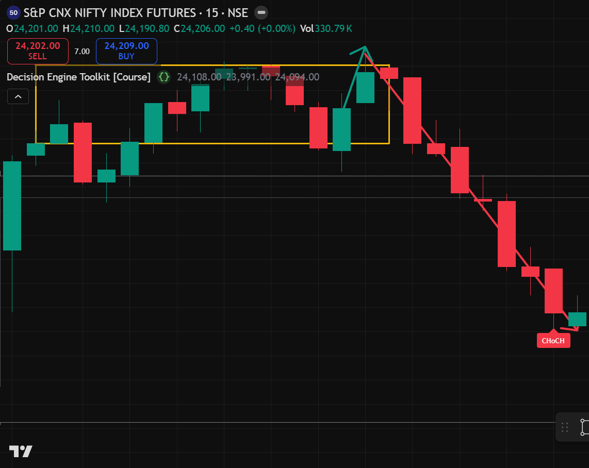
*The same lifecycle on real Nifty futures (15m): a consolidation range (gold box) is swept on the upside, the break is rejected, and price reverses all the way down through the range to a Change-of-Character — the textbook sequence surviving contact with live price.*

A fakeout reversal is not an event; it is a **sequence of eight stages**. Arriving late — at the moment the price snaps back — is the most common error. You must be reading the chart *before* the sweep so that you know the level, know the liquidity pool, and know what to watch for when the spike happens. The trader's job changes at every stage. Miss a stage, and you misread the next one.

### Stage 1 — Prior drive / context read

Before anything: what is the HTF story? On the 1h, is price in a downtrend (lower highs, lower lows), an uptrend, or chop? Where are the prior-day high (PDH), prior-day low (PDL), VAH, VAL, and any naked POC? Is price approaching a level from premium (above value — bearish fakeout setup) or from discount (below value — bullish fakeout setup)?

**Your job at this stage: form a directional bias and pre-mark the level being tested. No position. No order. Pure map-making.** A fakeout reversal that opposes the prior drive (e.g., an upside sweep when the 1h trend is bearish) is structurally the highest-conviction scenario — the sweep is fighting the dominant flow.

### Stage 2 — Coil / equal highs or equal lows building

Price compresses against the key level, making repeated touches without breaking through. Volume contracts. Spreads narrow. On the volume profile this looks like a tight D-shape balance forming right beneath the level. Crucially: each touch of the same price creates **equal highs** (above) or **equal lows** (below) — clusters of resting buy-stops (if above) or sell-stops (if below).

**Your job: identify and mark the equal highs/lows precisely. This is where you label the liquidity pool.** The more equal the highs — the more they sit at exactly the same price — the denser the stop cluster and the more attractive the sweep.

### Stage 3 — Liquidity pool concentration

Every retail breakout trader puts a buy stop just above the equal highs (planning to enter on the break). Every short seller puts a stop-loss just above the same level. Breakout-buy orders and stop-loss orders stack in the same spot. This is not coincidence — it is the predictable consequence of widely shared technical analysis.

**Your job: reframe the level not as "resistance" but as "a concentrated pool of resting orders that a large participant will want to access."** This is the mental shift that makes the fakeout setup legible rather than random.

### Stage 4 — The sweep / stop-raid

Price spikes just beyond the equal highs (or lows). The stop-loss and breakout-buy orders all fill simultaneously, handing the large passive participant the opposite-side liquidity they needed to fill their position — in the direction *against* the break. This is the moment of maximum danger for a reactive trader: the spike looks like a breakout. The alarm bells of FOMO ring loudest here.

**Your job: DO NOT react to the spike in isolation. Watch two things and nothing else: (1) where does the candle CLOSE relative to the level? (2) what is CVD doing on the 1m during the spike?** These two reads in the next 30–90 seconds tell you whether you are watching a sweep-and-go (real break, stand aside) or a sweep-and-reverse (fakeout, the trade).

### Stage 5 — Rejection close-back-inside

The sweep candle closes **inside the prior range** — below the equal highs if it was an upside sweep, above the equal lows if it was a downside sweep. The candle face is a shooting star (long upper wick, small body low in the range) or a hammer (long lower wick, small body high in the range). This is the structural confirmation gate. Without a close back inside, there is no fakeout setup — there is only a breakout in progress.

**Your job: confirm the close and immediately size up the position for entry (Model A — aggressive) or get ready for the CHoCH (Model B — conservative).** The close back inside is the SFP (Swing Failure Pattern) / Turtle Soup confirmation. It is the minimum bar for the fakeout reversal thesis.

### Stage 6 — CHoCH (Change of Character)

Within one to three 5m candles after the rejection close, price forms the first counter-structural move in the reversal direction. For a bearish fakeout: a candle closes below a prior micro-swing low — the first lower low after the sweep extreme. This is the CHoCH: not a confirmed Break of Structure yet (that requires a swing close), but the first evidence that structure is shifting.

**Your job: if you took the aggressive entry at Stage 5, the CHoCH is confirmation your entry was correct and you can tighten the mental stop. If you are waiting for Model B, the CHoCH tells you the reversal is developing — prepare for the failed retest.** Note: CHoCH ≠ BOS. The CHoCH is tentative; the BOS confirms. Aggressive traders use CHoCH; conservative traders wait for Stage 7.

### Stage 7 — Failed retest

Price often makes a shallow pullback toward the swept level from the inside — climbing back up toward the former high (in a bearish fakeout) but failing to reclaim it. This retest candle is narrow-spread, below-average-volume, and closes below the swept level. It is the "no-demand" confirmation from VPA — the market tested whether buyers would come back to defend the level and they did not.

**Your job: this is the A+ Model B entry candle. Enter short (or long, in a bullish fakeout) on or just after the close of the failed-retest candle. Stop goes above the failed-retest high.** This is a tighter stop than Stage 5 because you now have structural evidence from three consecutive confirming signals — rejection close, CHoCH, and no-demand retest.

### Stage 8 — Revert to mid / opposite edge

The reversal move accelerates into the range interior. It moves fastest through the LVN (low-volume node) that sits between the sweep extreme and the first HVN inside the range — that thin zone is a vacuum with no significant historical participants to slow it. It decelerates at the first HVN (T1 target: the range interior POC / VWAP / prior 50% level). If the reversal has momentum and the options regime supports it (positive GEX active, max-pain inside the range), it extends to the opposite edge of the range (T2: prior put wall / session low / prior VAL).

**Your job: trail the trade behind 5m swing structure in the reversal direction. Take partial profits at T1 (50–60%), move stop to breakeven on residual, and let T2 ride.** On expiry afternoon, the T3 target is max-pain — see §17 (expiry/regime nuances) and §23 (options-flow checklist) for the options execution detail.

> [!tip] Patience filter: name the stage you are in
> The most common error — entering on the spike (Stage 4) rather than the close-back-inside (Stage 5) — collapses four stages into one reactive click. Naming the stage out loud ("this is Stage 4, the sweep — I wait") is a mechanical discipline that costs nothing and improves entries materially.

---

## 3. Why fakeouts happen — and why they are YOUR edge

> [!note] Shared foundations
> The mechanism described here is the same liquidity-engineering framework that the [[Breakout Trading/note|Breakout Trading]] note covers in its §3. Rather than re-derive it, this section reads it **from the other seat** — the seat of the trader deliberately trading the reversal, not the breakout.

Here is the mechanism stated plainly: **the obvious level IS the liquidity pool.** Above every well-known resistance level — every equal high, every prior-day high, every call wall on the option chain — sits a dense cluster of resting orders: stop-losses from shorts, buy-stop entries from breakout traders, and conditional orders from systematic strategies. This is not coincidence. It is the predictable consequence of widely taught technical analysis. Every trader who reads a chart the same way places orders in the same location. The more obvious the level, the denser the cluster.

A large participant — an institution, a market maker, a heavy prop desk — cannot fill a significant position at a single price without moving the market against themselves. They need to buy from someone. And where is the largest pool of sellers available at a known price? Right at the level where shorts have their stops (they will be forced to sell to cover, creating liquidity for the buyer). The large player therefore **engineers the sweep**: drives price up through the level, triggers those stops and buy orders simultaneously (receiving their short fill in the opposite direction from all the triggered buy orders), then allows price to revert as they now have their full position. ICT calls this cycle simply: build up liquidity → grab liquidity → deliver the real move.

> [!example] The bull trap, step by step
> 1. Equal highs form at 24,150 on the Nifty 15m chart. Every breakout buyer has a buy-stop at 24,155.
> 2. A large seller needs to short 5,000 lots. If they hit the bid at 24,140, they move the market against themselves immediately.
> 3. Instead, they push price up to 24,155–24,165. Every buy-stop triggers, flooding the tape with market buy orders.
> 4. The large seller sells into that buy flood — filling 5,000 lots at 24,155–24,165 without moving the market against themselves.
> 5. Once filled, they no longer have any reason to push price higher. The buy orders are exhausted. Price reverts.
> 6. The retail breakout buyers are now long at 24,155–24,165 with stops below 24,145. Their stops are the fuel for the next leg down.

This is the fakeout mechanism in full. ICT names it **inducement** when a minor obvious level is placed *specifically* to lure breakout traders before the real move. The same logic applies to the large level: the call wall, the prior-day high, the Opening Range high. These are all liquidity pools. They get swept because they need to be swept.

### Why this is YOUR edge — reading from the opposite seat

The breakout trader's nightmare is your setup. The trapped breakout buyer (long at 24,155, stop at 24,145) is not just a victim — they are the **inventory that drives your reversal**. Every stop hit below their entry adds to the downward momentum of your trade. Every new short-seller who enters after the CHoCH confirms the reversal adds to your inventory. The fakeout reversal trader is, structurally, on the same side as the large participant who engineered the sweep.

> [!warning] The same mechanism that creates your edge also creates the trap you must avoid
> Not every sweep is a fakeout. The same sweep-and-close-back-inside pattern occasionally precedes a re-test-and-go: price sweeps the level, closes back inside momentarily, then immediately re-sweeps and closes beyond with displacement. This is the "sweep-and-go with a headfake" — it punishes traders who entered on Stage 5 without waiting for Stage 7. The CVD divergence and OI re-defense reads (§4) are the discriminators that separate the genuine fakeout from the headfake. Neither is optional.

### The asymmetric R:R — built into the mechanism

Because the fakeout reversal stop belongs just beyond the sweep extreme (the precise point where the thesis is cancelled — a new high beyond the sweep would mean the break is real) and the target belongs at the opposite edge of the range (where the liquidity grab started), the trade geometry is inherently asymmetric. The range was the measured move all along. Turtle Soup logic, Trader Dale's Reversal Setup, and the Wyckoff Spring measured move all converge on this: **the range IS the measured move for the reversal.**

---

## 4. The fork: sweep-and-reverse (the trade) vs sweep-and-go (stand aside)

This is the most important read in the entire guide. Get it wrong and the fakeout reversal strategy becomes random fading — catching knives with a probabilistic story attached. Get it right and you are systematically identifying a high-precision structural edge.

The sweep is the **common preamble** to both a real breakout and a fakeout reversal. The sweep itself tells you nothing about which follows. The **fork** — the divergence between the two outcomes — lives in the next one to three candles. Here is every discriminator, organised by witness:

### The comparison table

| Discriminator | **Sweep-and-Reverse (FAKEOUT — trade it)** | **Sweep-and-Go (REAL BREAK — stand aside)** |
|---|---|---|
| **Candle close** | Closes **inside** the prior range — shooting star / pin bar / doji. Body in the lower half (upside sweep) or upper half (downside sweep). | Closes **beyond** the level — wide marubozu-like body, ≥60–70% of candle range, small opposing wick. |
| **Volume** | Low volume (thin air sweep, no commitment) **OR** ultra-high volume with tiny price progress (absorption). Either is disharmony. | Well above average (~1.5–2× 20-bar avg). Effort matches result. |
| **CVD / delta** | CVD **diverges** — price reaches the new extreme but delta fails to make a new extreme. Buyers (in an upside sweep) are exhausting. | Delta expands *with* price. CVD makes a new high concurrent with the price new high. No divergence. |
| **Close location** | Inside the range = structural rejection confirmed. | Beyond the level = structural acceptance in progress. |
| **Value acceptance** | Price snaps back into the old Value Area within 1–3 candles. No new volume builds outside value. Profile shows a spike, not a value migration. | Fresh volume begins building beyond the level within 2–4 candles. The profile starts forming a p-shape (upside break) or b-shape (downside break) outside old value. |
| **Options (India)** | OI at swept strike **rises or holds** (writers defending). No OI migration to next strike. ATM premium flat or bleeding. | OI at swept strike **drops** (writers covering). Fresh OI builds at next strike. ATM premium expands. |

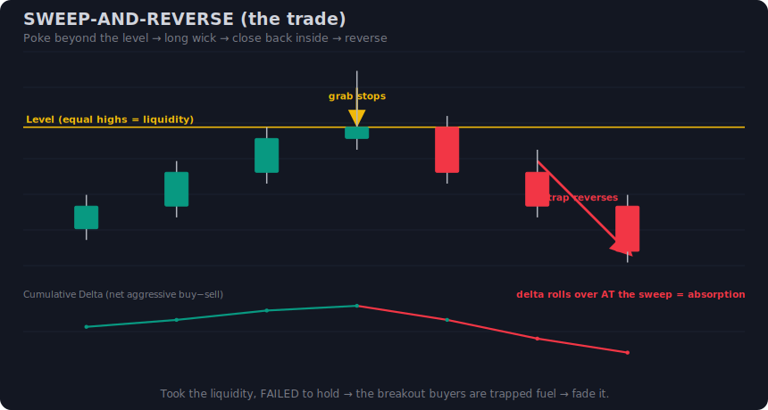
*Sweep-and-reverse: price takes the liquidity beyond the level, prints a long rejection wick, and CLOSES back inside as cumulative delta rolls over (absorption) — the breakout buyers are trapped fuel. Fade it.*

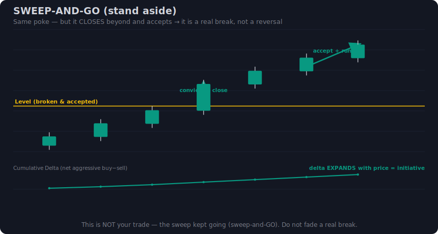
*Sweep-and-go: the same poke, but it CLOSES beyond and accepts, delta expanding with price — this is a real break, NOT your trade. Do not fade it.*


*Sweep-and-reverse, step by step.*

### The two-second decision framework at the sweep

In live trading, the moment the sweep candle closes you have approximately two seconds of "decision bandwidth" before the reversal move begins. This is the sequence:

1. **Where did the candle CLOSE?** Inside the range = fakeout candidate. Beyond = stand aside.
2. **What did CVD do on the 1m during the spike?** Diverge (price new high, delta flat/down) = fakeout confirmed. Expanding (delta new high concurrent) = real break.
3. **What is the ATM option premium doing?** Flat or bleeding = no conviction behind the move. Expanding = real break with options confirmation.

If two of three say failure, the reversal thesis is live and you are looking for your entry. If all three say failure, it is an A+ setup.

> [!warning] The headfake trap: do NOT enter on the wick
> The most expensive single error in this strategy is entering during the wick — seeing the rejection forming in real time and jumping in before the candle closes. Wicks turn into conviction-close breakouts constantly during fast markets. The candle's **close** is the confirmation gate. Entering before the close is speculation, not analysis. The few ticks of earlier entry are not worth the increased false-entry rate. Wait for the close.

### What to do when you cannot tell

If the candle body straddles the level — half inside, half beyond — that is a 50/50 structural read. In that case, move to the options witness only: is OI re-defending or migrating? If OI is ambiguous too, this is a stand-aside situation. There will be another setup. The discipline to stand aside on ambiguous forks is itself a large edge.

---

## 5. The named-patterns family (one engine, five names)

The fakeout reversal is not a modern concept. It appears under at least five different names across a century of market analysis, each framework discovering the same structural event from a different angle: **price sweeps a key level, finds no acceptance, and reverses to deliver the opposite move.** The engine is identical in each case. The names differ because the frameworks differ — Wyckoff in the 1930s, auction theory in the 1980s, Turtle Soup in 1996, ICT/SMC in the 2010s. Understanding all five names means you can read the same fakeout through whichever lens your chart data best supports.

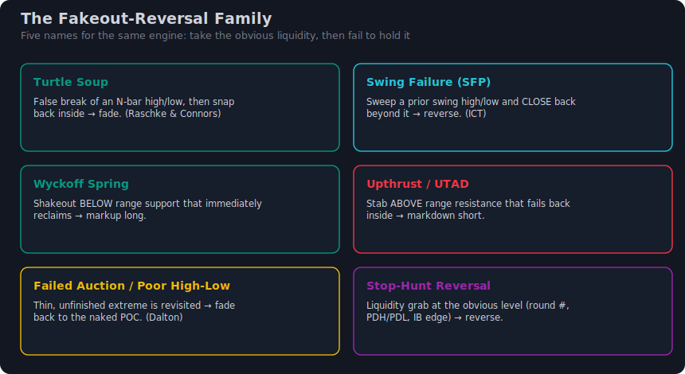
*The fakeout-reversal family: five names for the same engine — take the obvious liquidity, then fail to hold it.*

| Pattern name | Direction (primary) | Source / era | Minimum age rule | Entry trigger |
|---|---|---|---|---|
| **Turtle Soup** | Long (sweep of prior low) & Short (sweep of prior high) | Raschke & Connors, *Street Smarts*, 1996 | Prior high/low must be ≥4 bars old | Sell stop below the prior high (for short); buy stop above the prior low (for long) — triggered when price reverses back through |
| **SFP (Swing Failure Pattern)** | Both | ICT / SMC, 2010s | Significant prior swing, unspecified age | Close of the candle back inside the range |
| **Wyckoff Spring** | Long (sweep of support lows) | Wyckoff, 1930s; Coulling VPA | Accumulation range must be established (multiple touches of support) | Low-volume retest of the Spring low (the "Test") |
| **Upthrust / UTAD** | Short (sweep of resistance highs) | Wyckoff, 1930s (distribution) | Distribution range must be established | Rejection close back inside the range; retest of swept high from below |
| **Failed Auction / Poor High** | Both | Jim Dalton, Auction Market Theory, *Mind Over Markets* | N/A — any incomplete auction | Close back inside value / failure to attract responsive activity |

### 5.1 Turtle Soup (Raschke & Connors, *Street Smarts*, 1996)

**Origin:** Linda Raschke and Larry Connors inverted the original Turtle Trader rule, which *bought* new 20-bar highs. Turtle Soup *fades* the exact same signal — it sells the moment a new 20-bar high is made, if that high sweeps a prior 20-bar high that is at least 4 bars old.

**The 4-bar minimum age rule** is the critical discriminator. A prior high that was set less than 4 bars earlier has not had enough time for stop orders to concentrate above it — the liquidity pool has not built up. Turtle Soup requires the prior high/low to be **at least 4 bars old** (on whatever timeframe you are running) so that a dense cluster of stops is guaranteed. Without the age requirement, you are fading a new high with no structural reason for a liquidity pool above it.

**Exact rules (short trade / upside fakeout):**
1. Price makes a new 20-bar high (the breakout trigger fires).
2. The *previous* 20-bar high was set **at least 4 bars ago** (age rule — liquidity pool confirmed).
3. The close of the new-high bar is at or above the prior 20-bar high (sweep confirmed).
4. Enter: place a sell-stop 5–10 ticks below the prior 20-bar high. Fill triggers only if price reverses back through the level.
5. Stop: one tick above today's high (the sweep extreme — precise invalidation).
6. Target: the range interior, prior POC, or the measured move (the full 20-bar range).

Long trade is the exact mirror: new 20-bar low, prior low ≥4 bars earlier; buy-stop above the prior 20-bar low; stop below today's low.

**India mapping on Nifty 15m:** the "20 bars" approximates the Opening Range / Initial Balance when the IB has formed multiple near-equal highs. The prior high must be at least 4 bars (60 minutes) old — meaning it was set in a prior session or at least an hour ago — to have concentrated enough stop liquidity. The pattern fires most cleanly against the 9:15–10:15 IB high or low, which has had the full first hour to accumulate stops.

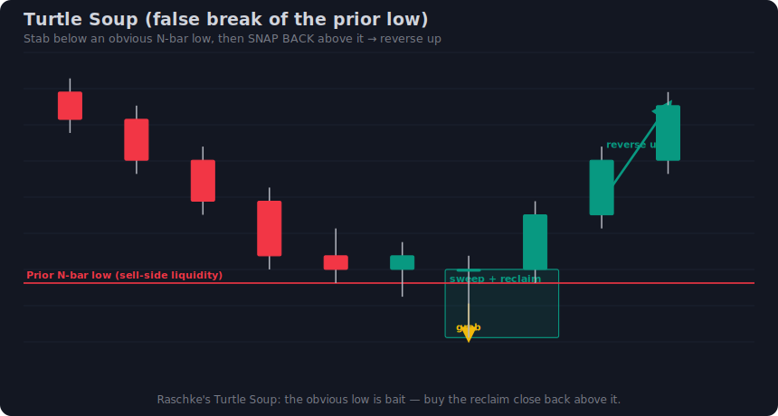
*Turtle Soup (the long / mirror version shown here): a new 20-bar low sweeps a prior low that is ≥4 bars old, then closes back **above** it — buy the reclaim, stop one tick below the sweep. The short is the exact inverse (sell a swept 20-bar high, per the rules above).*

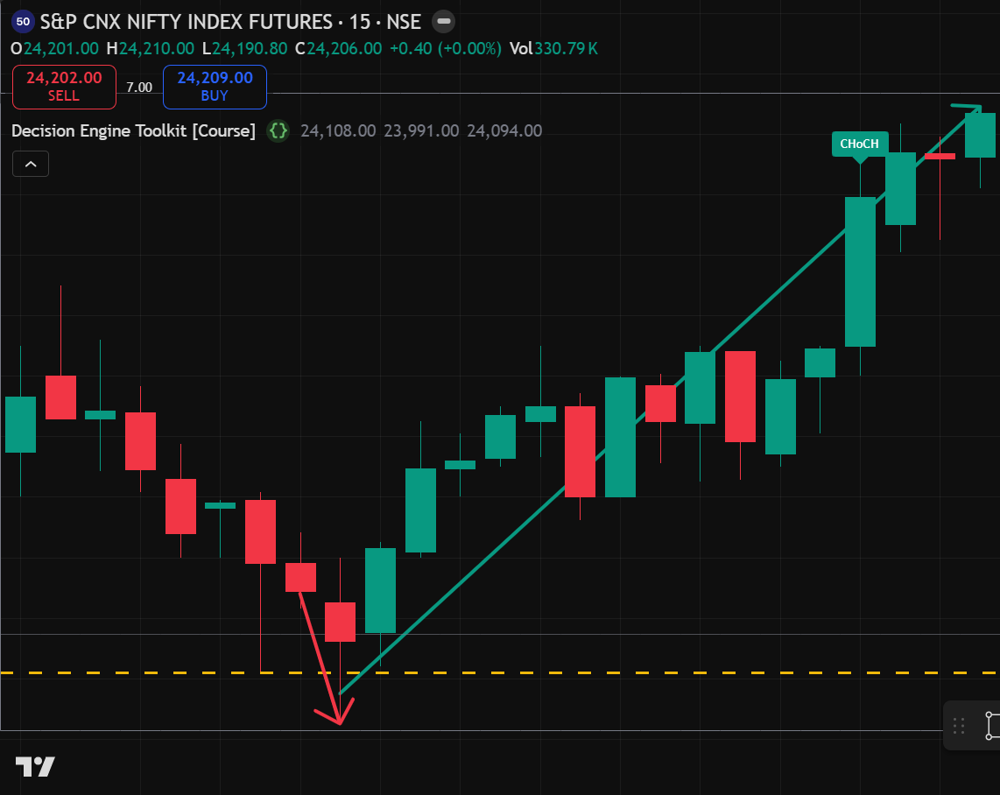
*The long version on real Nifty futures (15m): price sweeps a prior swing low, closes back above it, and reverses up — the concentrated stop cluster below the low becomes the fuel for the rally.*


*Turtle Soup, stage by stage: equal highs build, stop cluster concentrates, the sweep fires all orders simultaneously, the reversal candle closes inside, sell-stop entry triggers below the prior high.*

### 5.2 Swing Failure Pattern (SFP) — ICT / SMC

**Definition:** price sweeps just beyond a prior significant swing high or low (triggering those stops), then closes the candle entirely back inside the prior range. The SFP is defined solely by the **close**, not the wick. A wick beyond + body inside = SFP. A wide-body close beyond = displacement, not an SFP.

**Mechanics:** the brief breach above a swing high triggers buy-stop orders (held by shorts as stop-losses and by breakout traders as entries). The large participant who engineered the sweep needed those buy orders to fill their short position at scale. Once filled, there is no further reason to drive price up — the reversal begins. The SFP candle's wick is the visual evidence of the liquidity grab; the body's return inside is the evidence of the reversal.

**Entry:** two choices depending on risk tolerance:
- *Aggressive:* enter short on the close of the SFP candle itself.
- *Conservative:* wait for price to retest the swept level from inside the range (a shallow pullback back up toward the former high that fails to close above it) — enter on the failed-retest candle. This is the standard recommended approach for Nifty options where tighter stops improve net R:R after spread costs.

**Stop:** beyond the SFP wick — 1 to 3 Nifty points past the sweep extreme. This is inherently tight because the trade's structural invalidation is precisely "a new high beyond the sweep" — anything more is a real break, not a failed SFP.

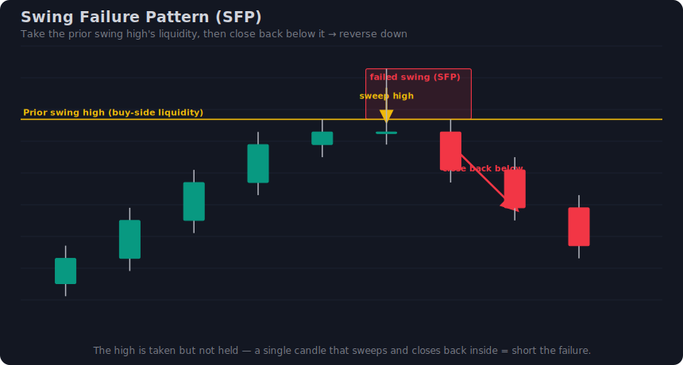
*SFP short: the wick takes out the prior swing high (triggering stops and breakout buys), but the candle closes back inside — that close is the sole entry gate. The wick is information; the close is the trade.*

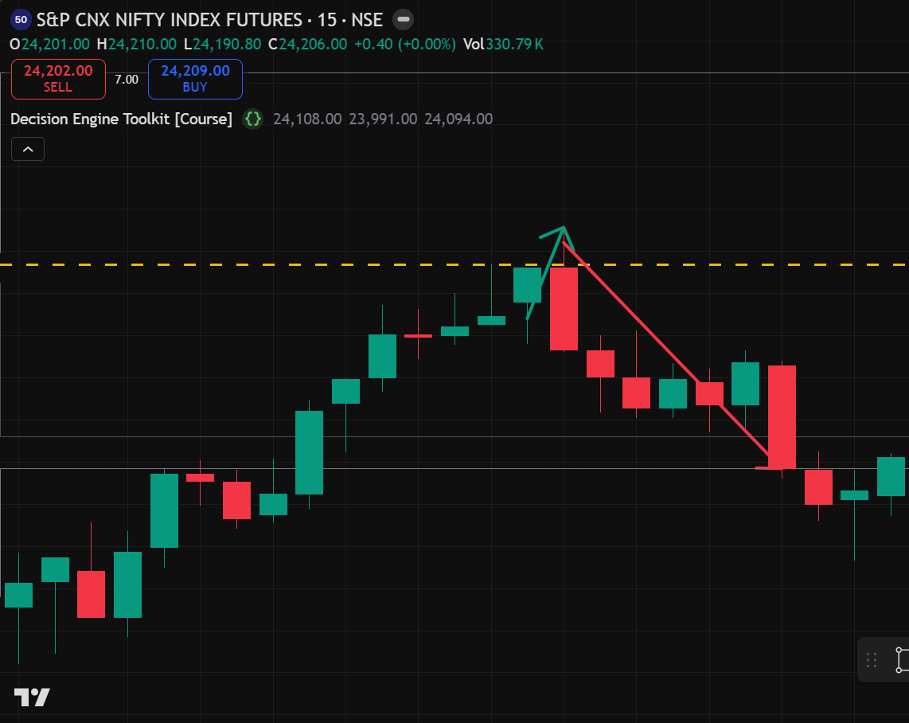
*A clean SFP on real Nifty futures (15m): the wick takes out the prior swing high (gold level), the candle closes back below it, and price reverses down — the close-back-inside is the trade.*

### 5.3 Wyckoff Spring (Accumulation Phase C)

**Definition:** a false breakdown below the support of an established accumulation range. Price penetrates the prior range lows, triggering sell-stop orders and encouraging new short entries, then immediately reclaims support and closes back inside the range. The Spring looks like a breakdown; it is the opposite.

**Volume signature:** the classic Spring has **low-to-average volume on the breakdown** — the selling pressure that drove price below support was insufficient (not many genuine sellers came in; the insider absorbed what little supply existed). The recovery back above support happens quickly, often on improving volume. A "high-volume Spring" (also valid) is a climactic shakeout — mass panic selling absorbed by the insider accumulating at the low. Wyckoff's distinction: a low-volume Spring means supply has already been absorbed from prior consolidation; a high-volume Spring means the insider is absorbing the last panic wave.

**The Test — the required second signal:** Wyckoff does not enter on the Spring candle itself. After a Spring, he requires a **test** — a subsequent low-volume, shallow retest of the Spring low that holds. The test candle is narrow-spread, below-average-volume, and closes above the Spring low. This confirms that supply has genuinely dried up — the insiders can now mark prices up without meeting further selling pressure. **The Test is the entry signal, not the Spring.** On Nifty this maps directly to Stage 7 of the lifecycle — the failed retest — making the Wyckoff Spring the most structurally complete version of the fakeout reversal framework.

**India translation:** the Spring maps to the sweep of the ORB low at the open or the prior-day low into the early session. The Test maps to the 5m/15m failed retest of the swept low on below-average volume. This two-step entry — Spring then Test — is the A+ Model B entry described in §2 Stage 7.

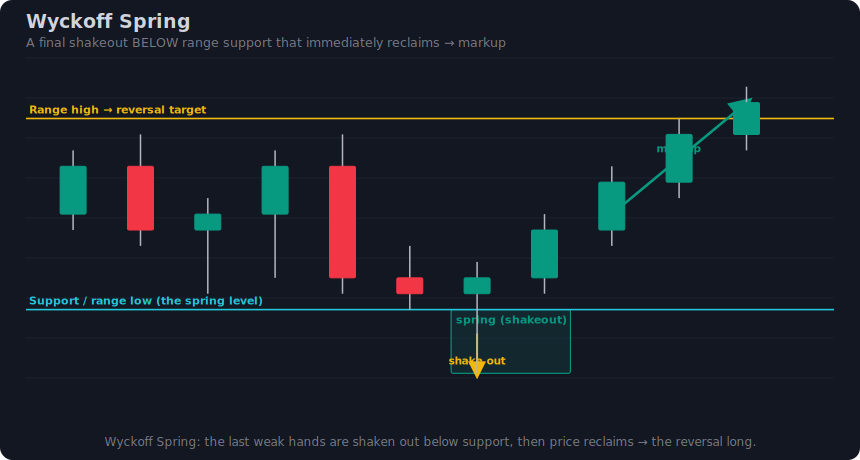
*Wyckoff Spring: the range support is breached below on low volume (the Spring), then price recovers. The entry is the low-volume TEST of the Spring low that holds — not the Spring candle itself.*


*Wyckoff Spring lifecycle: accumulation range builds → Phase C Spring punctures the lows → recovery → low-volume Test holds the Spring low → markup begins.*

### 5.4 Upthrust / UTAD (Wyckoff Distribution Phase C)

**Definition:** the bear-market mirror of the Spring. An **Upthrust** (UT) is a false breakout above the trading range high during Wyckoff distribution. A **UTAD (Upthrust After Distribution)** is a Phase C upthrust that occurs after a well-established distribution range, often the final bull trap before the markdown begins.

**Mechanism:** price thrusts above resistance (the Buying Climax level or the range high), triggering breakout buy orders and trapping late bulls, then quickly reverses and closes back inside the range. The large seller used the false breakout to distribute their remaining inventory into the breakout buyers' orders — the same liquidity-engineering mechanism as the SFP, but framed in the Wyckoff distribution context. After the UTAD, the markdown begins.

**Volume signature:** the UTAD often shows **lower volume than prior thrusts** to the same level (buying interest has waned with each test of the highs) — the classic "effort diminishing on each re-test" pattern. Alternatively, it shows ultra-high volume that fails to extend price (absorption / selling climax by the insiders). A low-volume UTAD is the cleanest — the insiders barely need to defend it because there are almost no genuine buyers left.

**India translation:** the UTAD maps to a sweep of the Day High / prior-session high / call wall on a Nifty morning when GEX is positive and the option chain shows call OI rising at the swept strike. The India UTAD signal: sweep of the call wall → call OI rises or holds (writers defending) → price closes back inside → short the retest of the wall from below. This is the most India-specific Wyckoff application because the OI re-defense tells confirm the "insiders selling into breakout buyers" mechanism in real time.

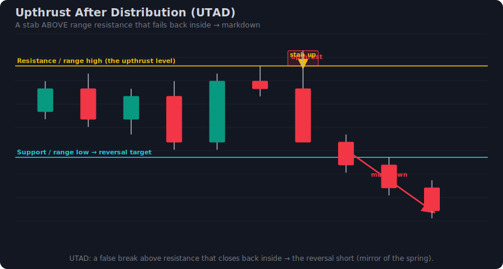
*Wyckoff Upthrust: the range high is breached above (trapping breakout buyers), but price closes back inside — the large seller has distributed into the buy orders. Short the retest of the top from below.*

### 5.5 Failed Auction / Poor High / Poor Low (Jim Dalton, Auction Market Theory)

**Definition:** in Auction Market Theory, price is always conducting a two-way auction — searching for the price that facilitates the most trade. A **failed auction** is when a new auction extreme (a move to a new high or low) **fails to attract responsive activity**: the new high attracts no significant selling response, or the new low attracts no significant buying response. The market "tested the price and found no one willing to trade there." Price returns to the prior range to complete the auction where participants do exist.

**Poor high:** the session's high was set in a single thin price period (a "single print" in Market Profile language) with no volume accumulation there. The auction was incomplete — the auctioneer called a price, received no meaningful bids, and must lower the price to find trade. Trader Dale describes this as "an imperfection the market tends to fix" — the naked/virgin POC analogue at the bar level.

**Poor low:** the mirror. The session's low formed without attracting buying volume sufficient to absorb the selling. The auction will return to that level (and eventually below it) to find the buyers that were not there the first time.

**Trading the failed auction:** a poor high on the daily or 15m chart is a **reversal zone**, not a breakout target. The fakeout reversal trade is: price sweeps the poor high (completing the failed auction by running the stops) → fails to hold beyond → enter short targeting the range interior POC (the centre of the prior auction), with stop just above the failed high. The naked/virgin POC inside the range is the primary target — it is the "imperfection the market wants to fix" that draws price back.

**India integration:** failed auctions on the Nifty 15m/30m form naturally at OI wall strike levels. The most powerful failed-auction reversals on Nifty occur when the poor high coincides with the call wall AND a CVD divergence on the sweep. The three-way confirmation — failed auction + OI wall + CVD divergence — is the closest this strategy comes to a certainty.

> [!summary] One engine, five frameworks — how to use them together
> The Turtle Soup tells you the age rule (≥4 bars). The SFP tells you the close rule (back inside = the gate). The Wyckoff Spring/Upthrust tells you the volume signature and the two-step entry (Spring then Test). The failed auction tells you why the target is the POC (the incomplete auction's centre). ICT/SMC (research.md §3.6) tells you the CHoCH and the micro-OB entry zone. Use whichever framework's language matches your current chart read — they are five entry routes to the same trade.

---

## 6. How to read this guide / legend

### Colour code

Every schematic, animation, and chart annotation in this guide follows a consistent colour system. Learn it once and every visual becomes immediately readable:

| Colour | Meaning |
|---|---|
| **Green** | Bullish — long bias, demand zone, bullish setup direction, Spring / Turtle Soup long |
| **Red** | Bearish — short bias, supply zone, bearish setup direction, Upthrust / SFP short |
| **Gold** | The level — the swept line, OI wall, equal highs/lows, liquidity pool marker |
| **Blue** | Entry — the trigger candle, the Model A or Model B entry bar, the Order Block zone |
| **Teal** | Targets — T1 (range interior / POC), T2 (opposite edge), T3 (max-pain on expiry) |

### Schematic vs real convention

Diagrams marked **schematic** are textbook-clean, idealised geometry designed to teach the *shape* of a concept in isolation from the noise of a live tape. They are not real charts. Later parts of this guide layer real Nifty / Nifty-futures captures — marked with actual price levels, marked with entry/SL/target overlays — on top of those same shapes, so you can see whether the concept survives contact with messy price.

Animations walk a sequence stage-by-stage. Static SVGs freeze one moment for close reading. Where both exist for the same concept, read the animation first (to understand the sequence), then the static (to study a single frame in detail).

### Both directions — the symmetric lens

This guide covers **both** directions of the fakeout reversal with equal depth:
- **Bullish fakeout reversal** (false break of support): Spring, Turtle Soup long, SFP long — the sweep goes *below* support (equal lows, prior-day low, put wall), closes back inside, and reverses upward. Buy the PE sell-off; enter long via ATM CE.
- **Bearish fakeout reversal** (false break of resistance): Upthrust/UTAD, Turtle Soup short, SFP short — the sweep goes *above* resistance (equal highs, prior-day high, call wall), closes back inside, and reverses downward. Sell the CE spike; enter short via ATM PE.

The mechanism is symmetric. The same three witnesses apply in both directions. The only asymmetry in Indian markets is the tendency for option writers (who skew call-selling) to defend the upside more aggressively than the downside — making bearish fakeout reversals slightly more frequent at call walls, and bullish ones slightly more dependent on VIX / put-wall OI for confirmation.

### MTF lens order

Every subsequent section of this guide reads in the same top-down order:
1. **1h** — HTF regime and directional bias (is the HTF trend opposing the sweep direction? That's the A+ condition).
2. **15m** — the level being swept and the range to trade back into (this is the measured-move target).
3. **5m** — the trigger: sweep candle close, CVD divergence, CHoCH, failed-retest entry.

Lens order within each timeframe: structure (what is the level?) → effort (what did volume do at the sweep?) → order flow (what did delta do?) → options (is OI re-defending?) → entry trigger (Stage 5 or Stage 7?).

### Important hedge on exchange-set values

All Nifty lot sizes, margin rates, STT calculations, expiry calendars, and OI change-in-OI update frequencies mentioned in this guide are based on information current as of June 2026. SEBI and NSE revised the derivatives framework significantly in late 2024 (including lot sizes and minimum contract values). **Verify current lot size, margin requirements, and any OI reporting latency on NSE.in before sizing any live position.** The principles and pattern mechanics are timeless; the numbers must be confirmed with the exchange.

> [!tip] Bridge to Part 2
> You now have the complete foundations: the inverted 3-witness thesis, the eight-stage lifecycle, the liquidity-engineering mechanism, the sweep-and-reverse vs sweep-and-go fork table, the five-name pattern taxonomy, and the reading conventions. **Part 2 — The Five Lenses** takes each witness from §1 and turns it into a specific, actionable reading instrument you can point at a live Nifty chart: VPA failure signatures (low-vol spike, absorption, topping-out volume), Volume Profile rejection reads (value snap-back, poor high/low, naked POC as reversal magnet), Order Flow / CVD divergence (the most trustworthy read on India's Grade-2 feeds), SMC structure (CHoCH, micro-OB entry zone, fake BMS), and Price Action (the rejection candle, the no-demand retest). Each lens is one witness, testifying in more detail. Keep the 3-witness spine from §1 in your head as you go.


## 7. The structures that produce fakeouts

Not every level generates a fakeout reversal worth trading. The ones that do share a common property: they are so **obvious** that retail crowd behaviour is predictable enough to be exploited. The level's obviousness is not a weakness — it is the mechanism. The more traders park stops and breakout-entry orders at a level, the larger the liquidity pool that forms there, and the more attractive that pool becomes to a large participant who needs the opposite side of a position.

The best fakeout fuel is found at levels where *everyone knows the level exists*, which guarantees the stop cluster is dense.

### 7.1 The six structural types that trap most reliably

**Equal highs / equal lows (EQH / EQL).**  Two or more swing highs that printed at virtually the same price are a magnet for buy-stop orders (breakout entries) and sell-stop orders (the longs' hedges). Every retail chart reader sees the flat ceiling; every platform draws a horizontal line. The ICT framing is exact: these are **buy-side liquidity pools** (above equal highs) and **sell-side liquidity pools** (below equal lows), placed there by the crowd and harvested by the smart money (ICT, §148: "strong or weak high/low"). On Nifty, equal highs formed on the 15m chart during a morning range are the single most common intraday fakeout trigger.

**Prior Day High / Prior Day Low (PDH / PDL).**  Every swing trader and trend-following algo eyes PDH and PDL as their breakout line. Enormous stop clusters build just beyond these levels overnight. The PDH fakeout on a gap-down open — where price briefly spikes above PDH at the 9:15 open, printing a shooting star before reversing — is one of the most reliable Opening Range patterns on Nifty.

**Initial Balance / Opening Range edges.**  The IB high and low (first 15–60 minutes of NSE trade, depending on your convention) concentrate the densest intraday stop clusters because every ORB strategy uses these as entry triggers. Per research.md (§5), the pre-real-move sweep of one IB edge before the real session direction declares is the *most frequent* Nifty fakeout pattern. The IB edge is also where the OI call/put wall is likely to be situated, creating an options-level reinforcement of the structural trap.

**Round numbers and OI concentration strikes.**  On Nifty, strike prices in multiples of 100 (and especially 50) accumulate disproportionate OI. The market gravitates toward these levels to harvest stops; price often overshoots by 10–20 points — just enough to trigger the stops — before snapping back. India-specific: these are exactly the call-wall and put-wall strikes; the options fingerprint (research.md §6) confirms the level's nature in real time.

**Prior-session Value Area High / Value Area Low (VAH / VAL) and naked POCs.**  These levels are less visually obvious to retail but heavily referenced by institutional algos and volume-profile traders. A sweep of the prior VAH that immediately closes back inside the current day's value area is a textbook volume-profile failed auction (§9 below). Naked / virgin POCs from prior sessions sit *inside* the range being traded, acting as reversal magnets and target anchors rather than sweep levels.

**Wedge / triangle apex.**  As price compresses toward the apex of a converging structure, the "correct" breakout direction becomes ambiguous and both sides park stops just beyond each converging trendline. The first break out of the wedge is statistically the most likely to be a fakeout of any structure — Wyckoff's shakeout precedes the genuine move with high frequency here. Wedge apexes should be traded as reversal setups first; only confirm real breaks with the full five-lens stack.

### 7.2 Why these levels trap — the mechanism

The structural reason is identical for all six: the level is *known in advance*, so stop placement is *predictable*, so the stop cluster is *dense*. A large participant executing the opposite trade needs that density. They need your buy stops to fill their large sell order (or your sell stops to fill their buy order) at a price they have already calculated as value. The sweep is therefore deliberate inventory management, not random noise.

ICT's language is most precise: **"build liquidity → grab liquidity → deliver the real move."** The structural types above are different recipes for the liquidity-building phase. After the grab, the real move delivers in the opposite direction. The reversal trader's job is to read whether the grab was followed by immediate continuation (sweep-and-go) or immediate rejection (sweep-and-reverse).

### 7.3 Structure — fakeout tendency table

| Structure | Why it traps | Which reversal it tends to produce |
|---|---|---|
| Equal highs / EQL | Densest and most predictable stop cluster; every retail eye sees it | SFP / CHoCH reversal; the horizontal line becomes new resistance on retest |
| PDH / PDL | Overnight orders + swing-trader stops; algo breakout triggers at open | ORB fakeout / Turtle Soup; PDH becomes intraday resistance from above |
| IB / ORB edge | Intraday equivalent of PDH/PDL; ORB algos and directional stops cluster | ORB fakeout-before-real-direction; the real move often goes the *other* way from the first sweep |
| Round number / OI-wall strike | Retail visual magnet + options OI concentration; stops placed "above 24,000" cluster predictably | Reversal back toward max-pain / prior POC; options fingerprint (OI re-defense) confirms |
| Prior VAH / VAL (naked POC inside) | Volume-profile algo reference; institutional sell-at-value / buy-at-value orders | Failed-auction reversal; naked POC inside the range becomes T2 target for the reversal |
| Wedge / triangle apex | Ambiguous direction; stops on both converging trendlines | First-break fakeout → reversal → real break in opposite direction (shakeout then mark-up/down) |

> [!warning]
> Counter-trend sweeps of a level carry higher reversal conviction than same-trend sweeps. A PDH sweep during a 1h bearish session (the HTF is already down, price briefly spikes above PDH) is a high-probability fakeout; a PDH sweep in a 1h bullish session may be the real continuation break. Always check the HTF bias before committing the fakeout thesis.

---

## 8. Lens 1 — Volume / VPA (read for failure)

> For the shared mechanics of Volume Price Analysis — the wholesaler's perspective, Coulling's Principle No 6, and the baseline validation signatures — see [[Breakout Trading/note|Breakout Trading]] §7. Here we go deep only on the **failure-read inversion**: what the same volume bars tell you when the break is not real.

Volume is the effort. When effort and result are in harmony on a breakout bar, the break is real. When they are in disharmony, the break is failing. On a bar-by-bar basis, disharmony shows up in exactly three shapes.

### 8.1 The three VPA failure signatures

**Signature 1: Wide poke on LOW volume (trap / test).**  A wide-spread candle makes a new extreme beyond the level — but the volume bar underneath it is *below average*, typically less than 0.8× the 20-bar rolling average on the Nifty future. The price moved but no committed, large-lot volume supported it. VPA theory (Coulling, Ch.4, Fig 4.12) calls this a test: "the market makers are testing the levels of buying and selling interest… if there is little or no buying interest, the price will be marked back down." On Nifty the opening spike at 9:15–9:25 IST is the most common occurrence — a thin pre-market or early-session probe that triggers stops on no real conviction, then snaps back as the actual session participants arrive. Wide break on low volume = **do not trade the break; watch for the close-back-inside.**

**Signature 2: Narrow bar on ULTRA-HIGH volume — absorption (the strongest single-bar fakeout tell).**  A narrow-spread candle (or a brief doji) prints at the sweep extreme, but the volume histogram shows a spike that towers over the surrounding bars. Huge effort, tiny result. A passive participant — almost certainly a large institution defending the level with resting limit orders — absorbed every aggressive market order that came through. Coulling describes it as "driving up an icy hill on full power, going nowhere" (VPA, Coulling). This is a *deliberate act* by a passive defender, not a random coincidence. It is the more reliable of the two fakeout signals precisely because the passive participant has a position that requires defending that level, meaning they are likely to continue leaning against the price and fuelling the reversal. On the footprint (Lens 3, §10), this same moment shows as absorption — large delta with no price progress. When VPA's narrow-bar/high-volume anomaly and the footprint's absorption read coincide, the fakeout conviction reaches its highest single-moment peak.

**Signature 3: Climactic / exhaustion volume sequence INTO the level (topping-out or stopping-volume).**  Three or more consecutive candles arrive at the sweep extreme with *rising volume but narrowing spread*: Candle 1 is wide and high-volume; Candle 2 is narrower on equal or higher volume; Candle 3 is narrower still. The trend is consuming fuel faster than it is producing price progress. This is the "topping-out volume" sequence (Coulling, Ch.6). Its most extreme form is the selling climax (at a top) or buying climax (at a bottom): an ultra-high-volume bar that represents the smart money distributing into breakout chasers or accumulating from panic sellers. Climactic volume *into* a level is a reversal precursor, not a breakout confirmation — a counterintuitive read that catches most retail traders wrong. Wyckoff's UTAD (research.md §3.4) and the buying climax at the Spring (research.md §3.3) are its named forms.

### 8.2 Reading from the wholesaler's side

VPA only makes sense when you ask: who is on the *other* side of this volume? A climactic spike of selling at the top is the *retail panic sellers* who hit market orders — and the *smart money* who bought every one of those market orders with limit bids. The bar looks bearish from the retail side and bullish from the wholesaler's side. The narrow absorption bar looks like "consolidation" to the uninformed but is a defensive block-buy by a large passive participant. Always invert: ask who *needed* that volume, not who created it.

### 8.3 India: read on the Nifty future, not the option

This is non-negotiable for India. Option-strike volume on a single ATM CE or PE is thin, distorted by the bid-ask spread, and unreliable for VPA inference. The Nifty future carries genuine institutional volume at a level where aggressor inference is meaningful. Run VPA on the future's volume bars, draw the conclusion (real break or fakeout), then execute the trade via the ATM option. Never infer effort from the option's own volume histogram (repo: volume-footprint-and-data-feeds-india.md §6).

> [!tip]
> The ordering of reliability among the three VPA failure signals for Nifty intraday: **(1) narrow-bar high-volume absorption** is the most deliberate and repeatable; **(2) climactic sequence** is the most time-consuming but highest conviction; **(3) wide-break low-volume trap** fires most frequently (especially at open) but also generates the most false positives, because some low-volume openings do run. Weight absorption highest, treat low-volume traps as "watch and wait" not immediate entries.

---

## 9. Lens 2 — Volume Profile (read for failure)

> For the foundational mechanics — POC, VAH/VAL, HVN/LVN, acceptance vs rejection, profile shapes — see [[Breakout Trading/note|Breakout Trading]] §8. Here we focus exclusively on the three profile reads that identify a *failed* break and set up the reversal trade.

Volume Profile answers a different question than VPA. Where VPA asks "was the effort real?" at each time-bar, Profile asks "did this auction find acceptance?" at each price. The failure version of the acceptance test is what you care about for fakeout reversals.

### 9.1 Rejection back inside value — the failed auction

When price breaks a Value Area edge (VAH or VAL) but immediately snaps back inside the old value area without building any fresh volume cluster beyond it, the auction has formally *failed*. The break left only a single-print spike — a thin vertical line on the profile — not a new value cluster. In Trader Dale's language: "acceptance = a fresh volume cluster forms outside value; rejection = a thin spike or single print that is immediately retested from the inside" (Trader Dale, VP book, "Acceptance vs Rejection").

For the reversal trader: this is the structural definition of the fakeout. You do not need to see it in real time on every bar. Check the developing 15m profile: is volume accumulating beyond the broken VAH, or is the profile still "poking through" with nothing sticking? If the 15m footprint shows a single-print spike at the extreme with no volume building, the auction is failing and the reversal is the primary thesis. The snap-back to the POC is the expected resolution — the auction defaults to its balance centre.

### 9.2 Poor high / poor low — the unfinished auction that invites a revisit

A **poor high** is a session (or swing) high formed with no significant volume at the exact high price — the candle wick touched the level, briefly traded there, and immediately retreated. In Market Profile language it is a "single print." In Trader Dale's framework it is a "weak high" or "failed auction at the high": "the reason the market tends to test those weak swing points is that there wasn't any strong rejection at the swing point — the market wants to try and test if there isn't somebody willing to trade above the weak highs" (Trader Dale, VP book). In other words, the auction's first visit to that price was *inconclusive* — no supply or demand was large enough to create a genuine high-volume cluster — so the market will return to test whether the balance point has changed.

**The fakeout reversal creates the poor high deliberately.** The sweep candle pokes above the level on low or absorbed volume, creating exactly this thin, single-print high. The profile will show it as a spike with no volume behind it. That spike is both the fakeout signal (the wick-and-close-back-inside) and the future reversal target (price will return to re-test below it). On Nifty 15m, watch for the session high being formed in a single candle's spike with no follow-through volume building there in the next 2–3 candles — that is the poor high structure announcing itself.

**Poor low** is the mirror: the session low formed as a single thin print, visited briefly and rejected upward, now a future magnet for downside re-tests. The Wyckoff Spring produces exactly this profile shape at the downside sweep.

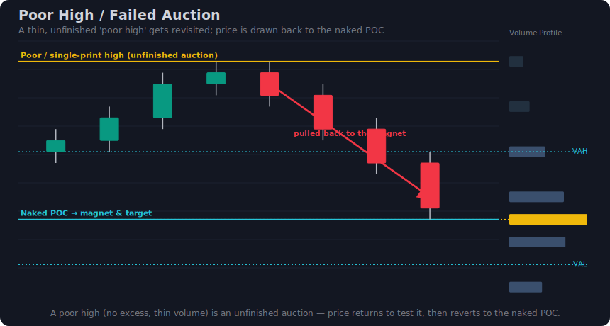
*A poor / single-print high (thin, unfinished auction) is revisited; price is then drawn back to the naked POC — the reversal target.*

### 9.3 The naked / virgin POC as a magnet and reversal target

A **naked POC** (sometimes called a virgin POC) is the Point of Control from a prior session or swing that has never been revisited by subsequent price action. These naked POCs are *imperfections* in the auction — they represent the price where the most volume transacted in a prior period, meaning the most institutional business was done there, meaning the market has not yet re-verified whether that price is still "fair value." The market returns to test these nodes: "price is drawn to it to test the imperfection" (Trader Dale, VP book).

For fakeout reversal trading, the naked POC inside the current range (below an upside sweep, or above a downside sweep) serves as the **primary T2 reversal target**. Do not set the target short of the naked POC; stretch it to just beyond. Trader Dale is explicit on this: price overshoots the naked POC to "complete the auction" — the imbalance that created the virgin POC gets resolved by trading *through* it, not just touching it. On Nifty, overshoot is typically 5–15 points past the naked POC price. Set T2 at POC + 10 points (for a downside reversal, POC − 10; hedge with a 5-point range and verify on the day's profile).

> [!note]
> The naked POC also tells you where **not** to set a reversal target. If a naked POC sits *between your entry and T1*, expect price to pause or stall there — it is a mid-range obstacle, not a clear run. Either set T1 at the naked POC and plan the re-entry if it holds, or skip T1 and wait for the full T2 beyond the POC, because the intermediate cluster will absorb momentum and may produce a false reversal of the reversal.

### 9.4 LVN as the vacuum that accelerates the reversal

Between the sweep extreme (the poor high) and the first HVN inside the range, there is almost always an LVN — a thin price zone where few participants transacted on the way up. In a reversal, this LVN is a **vacuum** that the reversal move runs through quickly. This is the same LVN logic as the breakout note (§8, [[Breakout Trading/note|Breakout Trading]]) but now in the other direction: the reversal accelerates *through* the LVN just as a breakout accelerates through an LVN. The difference is direction. On the reversal, the LVN is between the entry (near the sweep extreme) and T1 (first HVN inside the range). Expect fast, low-friction price action through the LVN — this is where the trade feels best and the exit discipline matters most.

> [!important]
> The profile-based reversal target hierarchy: **T1 = first HVN inside the range** (where the reversal will slow); **T2 = naked POC / prior-session POC** (the auction-completion level, set target 5–15 points beyond); **T3 on expiry day = max-pain strike** (gravitational pull dominates into expiry). Never set T2 short of a naked POC that lies in the path of the reversal.

---

## 10. Lens 3 — Order flow & cumulative delta (the top tell)

> For the foundational mechanics of footprint, delta, stacked imbalances, and the real-break order-flow signature, see [[Breakout Trading/note|Breakout Trading]] §9. Here we go deep on the *failure* reads: absorption and CVD divergence.

Order flow is the granular truth underneath the price bar. Where VPA reads the bar's external geometry (spread, volume), and Profile reads the volume-at-price history, footprint order flow reads the *internal* mechanics of each bar — bid vs ask volume at each price tick. The two failure reads from order flow are also the two most powerful fakeout confirmations available on NSE.

### 10.1 Absorption at the level — the footprint tell

Absorption is the footprint manifestation of VPA's narrow-bar/high-volume anomaly, but it gives you more: you can see *both sides* of the transaction. At the sweep extreme, the footprint shows:

- **Large ask volume** (aggressive buyers pushing price up) on the right side of the footprint cells.
- **Large bid volume** (passive limit sellers absorbing those buys) on the left side.
- **Price does not progress** — delta is large and positive but price barely moves tick to tick.

Trader Dale describes it: "when you see huge volumes traded on the Bid and Ask (both!) around some S/R zone, it is most likely Absorption taking place" (Trader Dale, Order Flow book, "Absorption" §4). The large passive participant positioned their limit-sell orders at exactly this price and absorbed every aggressive buyer that arrived. Once their limit book is filled, they are short at the level with a position that requires the price to fall — they will continue defending that level on any subsequent test.

For a bullish fakeout (downside sweep → bullish reversal): the same logic applies in reverse. The footprint at the sweep low shows large bid volume (passive buyers absorbing aggressive sellers), large ask volume (selling climax), price stalls. The passive accumulator is now long at the sweep low.

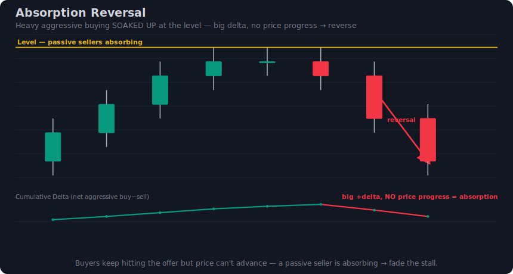
*Absorption reversal: heavy aggressive buying is soaked up at the level — big delta, no price progress → fade the stall.*

### 10.2 CVD divergence at the swept extreme — the single most trustworthy reversal read on NSE

Cumulative Delta Divergence (CVD divergence) is when price makes a *new extreme* but CVD does not confirm it. For a bearish fakeout (upside sweep):

- Price prints a higher high, ticking above the prior swing high or the key level.
- CVD, which should also make a new higher high if genuine buyers were in control, instead stays flat or makes a lower high.
- The implication: the buyers who drove price to the new high are exhausting. Each additional tick of new price high required fewer net buyers to achieve it — the market is running on fumes (Trader Dale, Order Flow book, §5, "Price and Delta Divergence").

For a bullish fakeout (downside sweep): price makes a new lower low but CVD makes a higher low — sellers exhausting, reversal imminent.

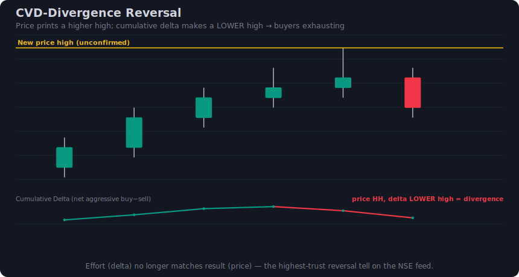
*CVD-divergence reversal: price prints a higher high but cumulative delta makes a lower high — buyers exhausting.*

### 10.3 Why CVD divergence is the most trustworthy read on Indian NSE feeds

This is a critical India-specific point. NSE does not publish true aggressor-side data (no true bid/ask breakdown per trade, per Level 2 tick). Platforms like GoCharting and ATAS use "inferred aggressor" methodology (Grade 2): if the trade price was at or above the mid-price it is classified as ask; below mid = bid. This inference is imperfect per trade — individual cells in the footprint can be misclassified, especially in fast-moving markets with wide spreads.

However, CVD divergence **survives this misclassification** because it measures the *shape* and *direction* of the cumulative delta over many ticks and candles, not the precise count at any single price level. A misclassified trade shifts the CVD by a small, uncorrelated amount; the divergence pattern — the trend of CVD versus the trend of price — remains visible because it accumulates over hundreds of trades. The footprint's per-cell absorption counts (left-side bid vs right-side ask at a specific tick) are probabilistic estimates; the CVD divergence signal is far less sensitive to that noise (repo: volume-footprint-and-data-feeds-india.md §10; order-flow-options-backtesting-india-reference.md §2).

**Practical consequence:** in a live NSE session, trust CVD divergence as a strong signal; treat per-cell footprint counts as contextual support. If CVD is diverging at the sweep extreme, that is your primary order-flow fakeout confirmation. If the footprint cells appear to show absorption but CVD is *also* making a new high, the absorption read is less reliable — the CVD overrules it.

### 10.4 Failed stacked imbalances — the absence of initiative

In a real breakout, stacked imbalances (ask ≥ 3× bid diagonally across 3+ consecutive cells) mark where initiative buying cleared the level. In a fakeout, the 5m footprint at the sweep candle shows one of two patterns:

1. **No stacked imbalances despite a new high** — the push above the level was not driven by initiative order flow; it was thin and likely stop-triggered.
2. **Stacked imbalances that immediately reverse** — imbalances appear at the new high but within the same candle or the next, delta goes negative and CVD diverges. The imbalances were the last gasp, not the start.

Either pattern, combined with VPA anomaly (§8) or CVD divergence, constitutes a high-confidence fakeout fingerprint.

> [!tip]
> **India implementation:** run footprint and CVD on the **Nifty future** only. GoCharting (Grade-2 inferred aggressor) is the recommended platform for Indian index futures footprint. Look for CVD divergence on the 1m chart during the sweep candle, then confirm with the 5m footprint's absorption / failed imbalances. Never attempt footprint reads on an options strike — the liquidity is too thin for meaningful inference.

---

## 11. Lens 4 — Smart Money Concepts / ICT (the structural backbone)

> For the foundational SMC/ICT vocabulary — BOS, liquidity sweep mechanics, OB formation, FVG, and the sweep-and-go fingerprint — see [[Breakout Trading/note|Breakout Trading]] §10. Here we define the *reversal* structural sequence in full: sweep → CHoCH → reclaim → entry.

ICT's cycle ("build liquidity → grab liquidity → deliver the real move") frames the fakeout reversal at the structural level. The delivery of the real move after the liquidity grab is the trade. ICT names each stage precisely.

### 11.1 The reversal sequence: sweep → CHoCH → reclaim → micro-OB/FVG pullback → entry

**Stage 1 — Sweep of liquidity (stop-hunt).**  Price reaches above equal highs (BSL) or below equal lows (SSL), triggering the resting stop-loss orders and breakout-entry orders there. This is the grab. The candle that executes the grab is the SFP candle — it prints a wick through the level and, critically, **closes back inside the prior range**. A close beyond the level on a wide body is displacement, not a sweep — that is the sweep-and-go (real break). The distinction is the close location relative to the level.

**Stage 2 — Change of Character (CHoCH).**  After the sweep extreme is set, the first structural close in the *opposite* direction to the prevailing micro-structure is the CHoCH. For a bearish fakeout (upside sweep): the micro-structure had been printing higher highs and higher lows as price approached the sweep level. The CHoCH is the *first lower low* — the first 5m close that breaks a prior micro swing low in the downward direction. This is not the same as a Break of Structure (BOS). The CHoCH is *earlier and lower confidence* — it is the first evidence that structure is changing. A BOS is the confirmed structural break after the CHoCH has been followed by a lower high formation and a subsequent new low below the CHoCH level.

**Practical implication:** the CHoCH gives an *aggressive* entry. The BOS gives a *conservative* entry. For Nifty options where every candle-width of delay costs premium, the CHoCH entry offers a tighter stop (still close to the sweep extreme) and a larger measured move — but it carries the risk that the CHoCH fails and the sweep is actually a sweep-and-go. Waiting for the BOS reduces risk but may cost 20–30 Nifty points of entry price, eating into the R:R.

**Stage 3 — Reclaim of the level.**  After the CHoCH, price often pulls back up toward the swept level (for a bearish reversal) but *fails to reclaim it* — it cannot close above the level on the 5m. This failed reclaim is the pivot from "possible reversal" to "probable reversal." The swept level has now transitioned from prior support to new resistance (the polarity flip). ICT explicitly names this: the swept level becomes a resistance zone on the retest. On Nifty, this polarity flip is observable as the call wall transitioning from a ceiling that was briefly pierced to a ceiling now being defended from below.

**Stage 4 — Pullback into the micro-OB / FVG.**  The displacement candle that created the CHoCH leaves behind a **micro-Order Block** (the last bullish candle before the CHoCH displacement candle in a bearish reversal) and typically a **micro-Fair Value Gap** (a price range left by the fast displacement where few transactions occurred). This micro-OB / FVG zone is the *optimal entry zone* on the pullback. Price returns to this zone, partially fills the FVG (a 50–62% retracement is common), and then resumes the reversal direction.

**Stage 5 — Confirmation candle → entry.**  The entry trigger within the micro-OB / FVG is a bearish confirmation candle (for a bearish reversal): a wide-body, high-close candle that breaks away from the OB/FVG zone in the reversal direction. This is the CHoCH + failed-retest = two-confirmation entry — CHoCH confirms structure has turned, and the failed reclaim confirms the level has changed polarity.


*The CHoCH-reclaim entry, step by step: sweep → CHoCH → pullback into the micro-OB/FVG → confirmation candle → enter.*

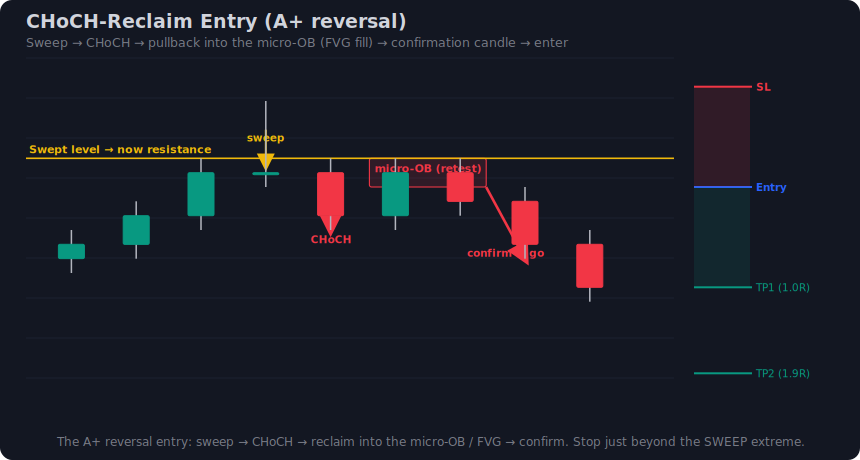
*The A+ reversal entry with the stop just beyond the sweep extreme — the tightest, cleanest stop in trading.*

### 11.2 Defining CHoCH vs BOS precisely

| Signal | Definition | Confidence | Entry timing |
|---|---|---|---|
| **CHoCH** | First structural close *against* the prior micro-swing sequence | Lower — first evidence of change | Earlier entry, tighter stop (near sweep extreme), requires subsequent confirmation |
| **BOS** | Confirmed structural break — a close that takes out a prior swing in the reversal direction after the CHoCH has already been formed | Higher — structural shift confirmed | Later entry, wider stop (below the CHoCH swing), more certainty |
| **CHoCH + failed retest** | CHoCH formed, price retests the swept level and fails to close back beyond it | Highest — two sequential structural confirmations | Conservative entry, slightly wider stop than CHoCH alone, best overall R:R on Nifty |

> [!important]
> The CHoCH alone is an aggressive entry, suitable when CVD divergence and absorption are also present. CHoCH + failed retest is the **A+ structural signal** — it is Wyckoff's "test" transposed into ICT language: the retest of the sweep level on low volume and narrow spread that fails to reclaim it. Do not force entry on the CHoCH without at least one other lens confirming.

### 11.3 SFP, inducement, and the polarity flip

**Swing Failure Pattern (SFP):** when the sweep candle's close falls back entirely inside the prior range, the candle is an SFP by definition. The SFP's structural role in ICT is identical to the Turtle Soup (research.md §3.1) but framed around *individual swing highs/lows* rather than the 20-bar high/low. The SFP candle is the earliest possible structural reversal signal — it appears on the same bar as the sweep.

**Inducement:** ICT uses this term for a minor, obvious high or low placed *deliberately* to lure breakout traders into the wrong direction before the real move. The inducement high is a "weak high" (ICT, §148) — one that never broke structure but sits above a prior swing in a tempting position. When price runs the inducement (sweeps it), it is doing so to collect the buy-stop orders parked there by the traders who were "waiting for the break above this level." The inducement sweep is a sub-category of the fakeout: a planned, deliberate fake-out at a smaller, tactical level rather than a major structure. Look for inducement sweeps on 5m charts at minor swing highs/lows that were formed during HTF compression; they are the most frequent small-frame fakeout on Nifty intraday.

**Polarity flip:** the swept level — which was resistance (or support) — becomes the opposite after a genuine reversal. The call wall (at the swept call-OI strike) that was ceiling becomes resistance from below after the upside sweep fails and price retreats. If price returns to the swept strike from below and the OI there is still elevated (writers defending), the polarity flip is confirmed and that level is now a short-entry zone. On Nifty, this polarity flip often persists for the remainder of the session — the call wall that was swept and rejected acts as a resistance cap for the rest of the day.

### 11.4 Strong vs weak highs — identifying the fakeout target in advance

ICT distinguishes strong highs (those that caused a structural BOS) from weak highs (those formed during a pullback inside a trend, that never broke structure). **Weak highs get run** — they are inherently pools of stop-loss orders waiting to be collected. On a Nifty 15m chart, look for highs that were formed in a consolidation phase, that never resulted in a BOS of the prior swing, and that now sit above the current price. These are the sweep targets. The fakeout reversal is most probable when a weak high is swept into an HTF Order Block from above — the HTF OB provides the opposing institutional reference that will defend the level.

---

## 12. Lens 5 — Price action / candlesticks at the level

Price action is the most accessible and the most abused of the five lenses. It is the layer most retail traders lead with — and the one that creates the most false entries when used alone. In the context of the fakeout reversal, price action's role is to be the *final visual confirmation*, not the initiating signal. When the other four lenses have already voted for a reversal, the price action pattern is the gate that lets you in.

### 12.1 The rejection wick (long wick beyond the level)

The most visually obvious fakeout signal: a candle that extends *well beyond* the key level with a long wick, while the candle's body closes back toward or inside the prior range. For an upside sweep: upper wick longer than the body, body closing in the lower half of the candle's range, body optionally closing back inside the prior level.

The wick is the footprint of the stop-hunt: every tick of that upper wick above the level represents the sweep of stop orders and breakout entries. The wick's length tells you how far the sweep had to reach to collect those orders. A very long wick means the stops were spread out over a wider zone and the market had to reach further to collect them all. A short wick means the stop cluster was dense and compact. Neither is inherently better; the key is the *close location*.

> [!warning]
> Do not enter on a live wick. The wick is forming in real time; what looks like a rejection wick at 9:20 IST may become a wide-body close beyond the level at 9:30 IST. Enter only after the candle closes. Entering on the wick is the single most common price-action error in fakeout reversal trading and the one that consistently produces losses despite a correct directional read.

### 12.2 The reclaim / close-back-inside candle

The objective gate for fakeout reversal entry. A candle that closes *inside the prior range* after the wick poked beyond it satisfies the structural minimum. This is the SFP confirmation, the Turtle Soup trigger, and the Wyckoff Spring close all at once — different names, one candlestick fact.

For an upside sweep: the candle closes *below* the key level. For a downside sweep: the candle closes *above* the key level. The body's position relative to the key level is the test. A candle that closed one tick inside the level is a close-back-inside; a candle that closed one tick outside is not.

The close-back-inside candle forms the basis for the **aggressive entry** (Model A in the execution framework — see §24 of this note; also research.md §7.1): enter on the close of this candle, stop just beyond the wick. This is the earliest entry, best R:R, lowest confirmation.

### 12.3 The pin bar and engulfing at the extreme

More specific than the general rejection wick, these named patterns strengthen the reversal signal:

**Pin bar / hammer / shooting star:** the classic single-candle reversal signal, where the body is in the top or bottom third of the candle range and the wick comprises the majority of the candle. At a sweep extreme, a shooting star (body in lower third, long upper wick) above a key level is a pin-bar fakeout signal. A hammer (body in upper third, long lower wick) below a key level is its bullish mirror. The pin bar's reliability is higher when it appears on volume anomaly (low volume = low-commitment trap; high volume = absorption/climax).

**Engulfing off the extreme:** a two-candle pattern where the reversal candle's body completely engulfs the prior sweep candle's body in the opposite direction. For a bearish fakeout: the sweep candle's body was green (buyers drove it up); the reversal candle's body is red and wider than the green body. This pattern requires less wick interpretation and focuses purely on the body-vs-body relationship. At the sweep extreme, an engulfing reversal is the price-action equivalent of the CVD divergence confirming then flipping — a complete, two-bar structural reversal.

### 12.4 The failed retest — the A+ conservative trigger (the Wyckoff test)

This is the highest-probability, most structurally confirmed price-action entry for the fakeout reversal. It is called the *Wyckoff test* in classical volume analysis ("testing supply" after a Spring, research.md §3.3), the *failed retest* in SFP mechanics, and the *CHoCH + failed reclaim* in ICT/SMC (§11 above). All three names describe the same two-candle sequence:

1. **After the sweep-and-close-back-inside**, price makes a *shallow, low-range, below-average-volume pullback* back toward the swept level from the inside.
2. **This pullback candle fails to close back beyond the key level.** It either reaches the level and prints a doji/narrow bar, or it approaches but falls short.

The failed retest on low volume and narrow spread is Wyckoff's "no-supply" signal for a bullish reversal (or "no-demand" for a bearish reversal): the market just demonstrated that at the price of the former high, there are no more buyers interested in pushing through. The sellers (or buyers in the mirror case) remain in control. This two-candle pattern — close-back-inside, then failed-low-volume-retest — provides *two sequential price-action confirmations*. Entry is on the close of the failed-retest candle, stop just beyond the retest high (which is tighter than the stop on the sweep wick itself, because the retest high is lower than the sweep extreme).

> [!note]
> The failed retest entry trades 3–8 Nifty points worse than the aggressive close-back-inside entry, but it provides: (a) a tighter stop, (b) two-signal structural confirmation, and (c) a higher win rate. For Nifty options where bid-ask spread and STT are fixed costs, the tighter stop often more than compensates for the worse entry price. Use the aggressive entry only when CVD divergence and absorption are both already confirmed — i.e., when the other lenses have already given maximum confidence.

### 12.5 The abort signal — close back beyond the level

The single most important price-action rule for risk management: **if price closes a 5m candle back beyond the sweep extreme (above the swept high for a bearish fakeout, below the swept low for a bullish fakeout), the fakeout thesis is invalidated. Stand down immediately.**

A close beyond the sweep extreme means the level was not rejected — the sweep was the initiation of a real break. Every indicator on your screen may still look like a reversal; ignore them. The close location is the objective, non-discretionary exit gate. The most expensive mistake in fakeout reversal trading is rationalising a close-beyond as "just a wick" or "it'll come back" — it will not reliably do so, and holding against a confirmed close-beyond is the transition from a disciplined reversal trade into a hope trade. Exit on the close, not after several more candles of hope.

---

## 13. Stacking the lenses → reversal conviction

The fakeout reversal, like the breakout, derives its edge from **lens confluence** — the individual signals are probabilistic; their intersection is where a genuine edge exists. No single lens alone is sufficient to trade. Absorption alone (Lens 3) can appear in a real accumulation zone that then breaks higher. A CVD divergence alone (Lens 3) can appear in a strong trend as a brief pause before continuation. A CHoCH alone (Lens 4) can appear at any structure level that gets reclaimed. A rejection wick alone (Lens 5) is perhaps the most commonly misread pattern in all of retail trading. The power emerges from their cross-validation.

### 13.1 How the lenses cross-check each other

The most important cross-check in fakeout reversal trading is the relationship between Lens 1 (VPA) and Lens 3 (Order Flow). The **narrow-bar high-volume VPA anomaly** (§8.1, Signature 2) and the **footprint absorption read** (§10.1) are two different instruments measuring the same physical event — a passive participant absorbing aggressive flow at the level. When both register simultaneously, the signal is not merely confirmed; it is *measured from two different angles* and both angles point to the same defender. This two-lens absorption confirmation is the highest-conviction single-moment fakeout signal available to an NSE intraday trader.

A second critical cross-check: Lens 2 (Volume Profile) and Lens 4 (SMC). The **poor high / single-print volume profile** and the **SFP / CHoCH structural sequence** are also independently measuring the same event — the lack of acceptance at the sweep price. The profile says "no volume transacted here" (thin spike); the structure says "the candle closed back inside" (the SFP). Together, they confirm from different evidence types that the level was not accepted.

The third cross-check is between Lens 3 CVD divergence (§10.2) and Lens 5 rejection wick (§12.1). CVD divergence says the internal delta mechanics of the sweep candle were trending the wrong direction for a genuine break; the wick says the candle's external geometry showed rejection. Internal and external confirmation of the same rejection event.

### 13.2 Real fakeout vs NOT-a-fakeout — the five-lens signature table

| Lens | REAL FAKEOUT signature | NOT-a-fakeout (stand down) |
|---|---|---|
| **1 — VPA** | Wide poke on low volume (trap), OR narrow bar on ultra-high volume (absorption), OR climactic narrowing sequence at the extreme | Wide-body breakout candle on ≥1.5–2× average volume; effort = result |
| **2 — Volume Profile** | Single-print / no-volume spike at the new extreme; price snaps back into the prior value area; poor high forming | Fresh volume cluster building beyond old VAH/VAL; acceptance outside value; new balance forming |
| **3 — Order Flow / CVD** | CVD diverges at the new extreme (price new high, CVD lower high); footprint shows absorption (large bid + ask, price stalls) | CVD makes a new extreme with price; stacked ask imbalances clearing the level; delta expanding |
| **4 — SMC / ICT** | Wick-and-close-back-inside (SFP); CHoCH forming; swept level is a weak high / inducement; micro-OB left behind | Wide-body close beyond the level; BOS confirmed; displacement with FVG left on the break side; no CHoCH |
| **5 — Price action** | Rejection wick, shooting star, or hammer at the extreme; close back inside; failed retest on low volume (Wyckoff test) | Wide engulfing close beyond the level; no rejection wick; retest holds above the broken level |

> [!tip] Reading order when you see a sweep forming in real time
> 1. **First (before the candle closes):** check Volume Profile — is this sweep hitting a poor high / single print zone or a fresh level with volume? Check CVD — is it diverging or confirming?
> 2. **On the candle close:** check Price Action — did it close back inside (SFP) or beyond (real break)?
> 3. **Within 2 candles after:** check VPA — was the volume anomalous (absorption / low volume) or confirmatory?
> 4. **5–10 minutes after (OI update lag):** check India options — did OI at the swept strike rise or hold (fakeout) or fall (real break)?
> 5. **Over the next 1–2 candles:** check SMC — is a CHoCH forming? Is there a micro-OB / FVG to enter on the retest?
>
> This sequence is the fastest reliable reading order. The pre-close CVD check and the post-close price-action check are the two time-critical gates; the others can be assessed without urgency.

### 13.3 The §28 scorecard — preview

The full quantitative scoring of these lenses is laid out in the §28 reversal scorecard (Part 5, §24–32). Each of the five lenses contributes specific checklist items: VPA failure signature (1 point), profile poor high (1 point), CVD divergence (1 point), absorption (1 point), close-back-inside (1 point), CHoCH (1 point), failed retest on low volume (1 point), OI re-defense (1 point), IV non-expansion (1 point), GEX / expiry regime (1 point). A+ grade = ≥8/10; A grade = 6–7; below 6 = stand aside. The scorecard is designed to make the five-lens verdict explicit and prevent single-lens rationalisation (the "it looks like a fakeout because the wick is long" error).

> [!summary]
> The five lenses converge on one event from five different measurement angles. VPA measures effort at each time-bar. Volume Profile measures volume at each price. Order flow measures the internal bid/ask mechanics at each tick. SMC/ICT measures the structural close and its relationship to the prior swing sequence. Price action measures the candlestick geometry at the extreme. When all five say the same thing — low commitment, poor high, CVD diverging, close-back-inside, wick rejection — the fakeout is not a hypothesis; it is the most probable structural outcome for which the options-layer confirmation (Lens 0, India-specific, Part 4, §18–23) provides the final, corroborating vote. That is when you size full and execute with conviction.


## 14. Multi-timeframe nesting for reversals (1h regime → 15m sweep → 5m reclaim)

The three-stage funnel from [[Breakout Trading/note|Breakout Trading]] §13 applies here with one inversion: instead of asking "is a breakout allowed at each frame?", you ask "is a *fade* allowed, and what exactly is being faded?" Each timeframe still answers exactly one question — and none is permitted to answer a question that belongs to a higher frame.

| TF | Role (Reversal) | The one question it answers |
|---|---|---|
| **1h (HTF)** | **Regime + major level** | Is a fade *structurally allowed* today? (Is the market in balance / range / positive-GEX pinning?) And what is the major swept edge — PDH/PDL, prior VAH/VAL, OI wall, HTF OB — that would be a meaningful fake? |
| **15m (MTF)** | **The exact swept edge** | Which named, pre-existing level is price currently poking above or below — IB high/low, equal highs/lows, consolidation edge, OI wall strike? This is the level the reversal must close back inside. |
| **5m (LTF)** | **The reclaim trigger** | Has the sweep-and-close-back-inside happened yet? Is there CVD divergence on the 1m? Has a CHoCH printed, and has the subsequent failed retest of the swept level confirmed re-entry? |

The logic that is identical to the breakout note: **the 5m never invents the level.** The swept level must pre-exist on the 1h or 15m — drawn before the sweep candle ever prints — or there is no trade. A fakeout off a minor 5m pivot is noise, not signal. You are fading a structural event (stop-hunt of a major level), not a candle.

### What the 1h is really answering

The 1h has two jobs in the reversal playbook, not one:

**Job 1 — Is a fade *allowed*?** The regime filter. If the 1h is in a confirmed structural downtrend (lower highs, lower lows, price below HTF OB, negative-GEX expansion day), a fade of every spike is a knife-catch. The 1h must show one of: (a) balance / sideways range — the market is in equilibrium; (b) a clear premium zone above value — price has pushed into "expensive" territory relative to the 1h range and is statistically likely to mean-revert; or (c) a conflict between the sweep direction and the HTF trend — you are fading *with* the dominant 1h trend even though you are fading *against* the immediate 5m spike. A bullish-sweep fakeout in a 1h bearish structure is the highest-conviction case: the HTF is bearish, the 5m tried to run the equal highs and failed, the reversal *is* the HTF continuation.

**Job 2 — Where is the major level?** Mark these on the 1h *before the session opens*: PDH, PDL, prior VAH, prior VAL, any naked POC, the call-wall and put-wall strikes, any HTF OB or FVG. These are the candidate fakeout levels for the day. A sweep of any of these is automatically a *named* major level sweep. A sweep of an unlabelled 5m dip is not.

**The "fade against the poke, with the higher frame" principle.** This is the conceptual heart of MTF reversal reading and it confuses many traders: the trade feels like it is going *against* the move you just watched, but it is actually going *with* the dominant regime. A 5m upside sweep of the prior day's VAH, when the 1h is ranging inside yesterday's value, is faded *down* — but that downward fade is *back into* higher-timeframe value, which is the direction the 1h has been trying to sustain. You are not contrarian; you are mean-reverting to the frame that actually matters.

### What the 15m is really answering

The 15m's only job is to identify the exact swept edge and the range to trade back into. Draw these on the 15m:
- The Initial Balance / Opening Range high and low (first 60 minutes of the session)
- Equal highs or equal lows (two or more tests at the same price = a dense liquidity pool)
- Prior consolidation edges (the high/low of yesterday's 15m value area)
- The OI wall strikes (call wall above, put wall below — these are the IB-equivalent for the option chain)

When the 5m sweeps one of these 15m levels, the reversal target is *the opposite edge of the 15m range*. The range width is the measured move. This is not a guess — it is the exact logic of Turtle Soup (Raschke) and the Wyckoff Spring/Upthrust: the range that was providing support/resistance is the distance the reversal delivers, because the range is the region of value that the sweep was pretending to escape.

### What the 5m is really answering

The 5m answers only: has the structural trigger fired? The sequence to look for, in order:

1. **Sweep + candle close back inside** — the sweep candle's *close* (not the wick) lands back inside the 15m range. This is the SFP / Turtle Soup confirmation. If the candle closes beyond the level on a wide body, it is displacement; stand aside.
2. **CVD divergence on the 1m** — during the sweep, the Nifty future's CVD failed to make a new extreme in the sweep direction. Buyers (upside sweep) or sellers (downside sweep) exhausted at the level. This is the most reliable confirmation available on NSE Grade-2 inferred feeds.
3. **CHoCH** — the first counter-structural close after the sweep. For a bearish reversal: the first 5m candle that closes below a prior micro-swing low, confirming that local structure has shifted from higher-highs to lower-highs.
4. **Failed retest** — after the CHoCH, price makes a shallow pullback toward the swept level from the inside. If this pullback prints a narrow-spread, below-average-volume bar that *fails to close above (or below) the swept level*, that is the no-demand / no-supply confirmation. This is the Model B conservative entry — slightly later but with the tightest possible stop, because the invalidation (a reclaim of the swept level) is now only a few points away.

### The hard rules table

> [!warning] Non-negotiable. Breaking any one of these turns a structural edge into a gamble.

| Rule | For reversals |
|---|---|
| **The level must be pre-existing on 1h or 15m** | Never fade a 5m pivot that was not marked on the higher frame before the sweep. |
| **The swept level must be a named major level** | PDH/PDL, IB high/low, equal-highs/lows, OI wall strike, HTF OB/FVG edge, naked POC. Minor intraday swing highs do not count. |
| **Do not fade into a higher-TF FVG / OB pulling the opposite way** | If a 1h bullish FVG sits below your short entry (or a 1h bearish OB sits above your long entry), the HTF structure is pulling price *toward* your enemy. The higher frame wins; stand aside. "HTFFVG > LTFFVG" (ICT; repo: breakout note §13). |
| **The 1h regime must permit fading** | If the 1h is in a confirmed negative-GEX expansion / strong directional trend, every spike is a "sweep-and-go" until proved otherwise. Do not apply this playbook on trend days. |
| **The reclaim trigger on the 5m must complete fully** | You need the close-back-inside AND either CVD divergence OR CHoCH AND either OI re-defense OR IV non-expansion. One candle plus a guess is not a trigger. (Details: §18–23.) |

### Worked top-down read — short via PE off a swept HIGH

*(The long via CE off a swept low is the mirror and is used in the worked setup in §30.)*

**Step 1 — 1h (regime + level).**
Open the 1h chart at the start of the session. Nifty has been ranging for three sessions; yesterday's 1h closed inside prior value with no BOS. GEX reading on stockmojo/justticks shows positive net GEX — dealers are long gamma, providing a structural bid for mean-reversion. The highest call-OI strike on the NSE chain is 24,500 CE, sitting 80 points above yesterday's close. Mark 24,500 as the call wall and the primary fakeout candidate for today. Mark PDH at 24,480. These two levels are within 20 points — they form a dense resistance cluster. **Regime = balance / positive-GEX / mean-reversion allowed. Bias = fade rallies toward 24,480–24,500 if a sweep appears.**

**Step 2 — 15m (swept edge).**
The 15m IB completes by 10:15. The IB high prints at 24,370; the call wall (24,500) and PDH (24,480) are *above* the IB, making them the candidate swept targets. Equal highs from yesterday's afternoon session sit at 24,460. The three levels — 24,460 equal-highs, 24,480 PDH, 24,500 call wall — form a cluster. This cluster is the liquidity pool. If price rallies into this zone and the sweep candle closes back inside the IB, the reversal is on. **Range to trade back into = IB interior, 24,370 down to IB low ~24,290. Target: 24,330 (T1, interior POC on 15m), 24,290 (T2, IB low / put wall proximity).**

**Step 3 — 5m (reclaim trigger).**
At 11:20, a wide-range 5m candle pushes Nifty futures to 24,508 — a touch of the call wall, a touch of the PDH cluster — and then closes at 24,461, back inside the equal-highs zone. The candle is a clear shooting star: long upper wick, body in the lower third. On the 1m, CVD peaked at 24,495 and rolled over while price extended to 24,508 — CVD divergence confirmed. The ATM call (24,500 CE) premium, which was at ₹28 pre-spike, is at ₹26 after the sweep — non-expansion confirmed. Call OI at 24,500 CE on Sensibull has *not* dropped; in fact it is flat-to-rising — OI re-defense confirmed.

The 5m CHoCH prints when the candle closing at 24,461 breaks below the prior micro-swing low at 24,465. Price then attempts a retest at 11:30, pushing back to 24,475, printing a narrow doji on below-average volume — the failed retest. **Entry: short on the failed-retest close at 24,474, buying the ATM/near-ATM 24,500 PE or 24,450 PE.** Stop on the underlying: 24,512 (2 points above the sweep wick at 24,508 + 4-point ATR buffer). T1: 24,330 (15m interior POC). T2: 24,290 (IB low). R = 24,512 − 24,474 = 38 pts. Gross R:R to T1 ≈ 1:3.8 (144 pts gain); to T2 ≈ 1:4.8 (184 pts gain).

This is the funnel working end to end: the 1h confirmed the regime and the level, the 15m confirmed the exact swept cluster and the range to trade back into, the 5m confirmed the reclaim trigger. The short is *with* the positive-GEX mean-reversion regime even though it is *against* the 5m upside poke.

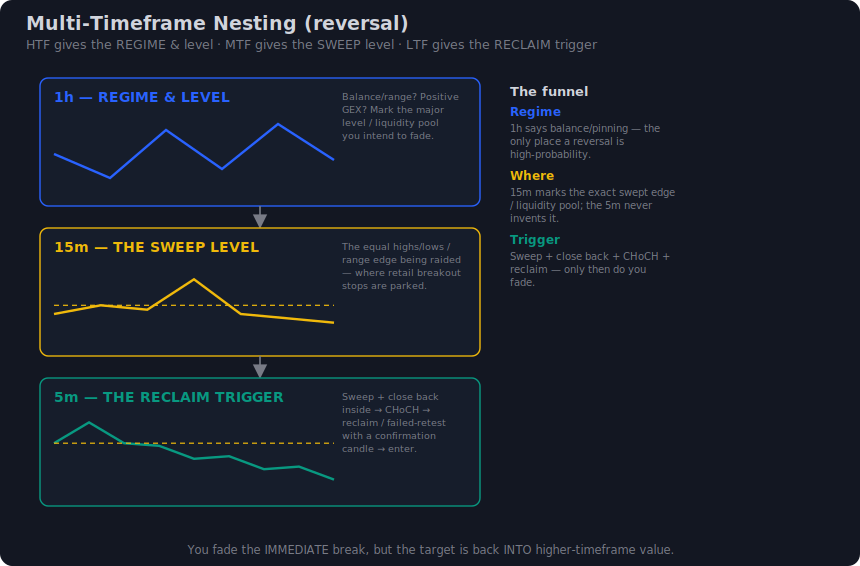
*Multi-timeframe nesting for reversals: the 1h gives the regime & level, the 15m gives the swept edge, the 5m gives the reclaim trigger. You fade the immediate break but target back into higher-timeframe value.*

---

## 15. The Indian session — WHEN fakeouts dominate

The NSE cash/derivatives session runs 9:15 to 15:30 IST. The [[Breakout Trading/note|Breakout Trading]] §14 note maps the same session from the breakout lens — A-grade breaks live in the opening drive. Here the map is inverted: certain windows *produce fakeouts structurally*, not by accident, and knowing which ones they are is a timing edge in itself.

### Why the session structure generates predictable fakeouts

At 9:15, the gap open and the first minutes of price discovery create a window of maximum uncertainty and minimum liquidity. The dominant pattern is a **"feel-out" poke**: one side of the opening range is tested — often on thin volume, often within the first 5–15 minutes — and that poke fails before the real directional move emerges. This is not random. It is the mechanism by which the session clears the liquidity on one side of the range before the actual initiative direction is established. ICT's description applies directly: "the real move frequently comes *after* a sweep of the opening range" (repo: research.md §5).

Lunch chop is a different mechanism: here, fakeouts multiply because the *input* that would confirm a real break (volume, OI migration, fresh delta) is simply absent. The market generates noise but not signal.

Expiry afternoon is the third mechanism: structural pinning (gamma hedging) creates a gravitational pull toward max-pain, so any break away from max-pain that lacks OI-migration confirmation is almost certainly temporary.

### Time-of-day map — reversed for the reversal lens

| Window (IST) | Phase | Fakeout character | Reversal playbook |
|---|---|---|---|
| **9:15–9:30** | Opening 15-min | **The "feel-out" poke** — the single highest-frequency fakeout window of the day. One side of the IB is probed on thin, pre-discovery volume before the real move starts. | Mark the OR high and low immediately. *Do not enter the poke direction.* Watch for the close-back-inside on the 5m. If the sweep candle closes back inside and CVD diverged during the poke, the OR fakeout trigger is live. See §16. |
| **9:15–10:15** | **Opening drive / IB** | ORB fakeouts are live throughout the IB-formation window. Many IB-high sweeps close back inside before the real trend direction is established. | The ORB fakeout (§16) is the primary setup here. Use the full 3-witness model: close-back-inside + CVD divergence + OI re-defense. Do not fade the *first* strong impulse if it has volume and OI migration — that may be the real break. |
| **10:15–12:00** | Mid-morning continuation | Lower fakeout density vs the open, but continuation fakeouts appear at VWAP and secondary levels. | VWAP-rejection reversals (§16) are the main setup. A failed VWAP reclaim on below-average volume after a mid-morning thrust is the cleanest mid-morning fade. |
| **12:00–13:30** | **Lunch chop — the highest fakeout density window** | The density of fakeout patterns is at maximum here. Volume dries up, spread widens, and every minor breakout attempt reverses quickly. BUT: amplitude is low — the range is narrow, and cost-of-carry (spread + STT + brokerage ≈ 3–6 points round-trip on ATM Nifty weeklies) eats thin reversals. | **Filter for major named levels only.** Fading a minor 5m pivot in the lunch window is a net-negative expectancy trade once costs are accounted for. Only trade the lunch-chop fakeout if the swept level is a named 15m/1h level (IB edge, call/put wall, PDH/PDL) AND the scorecard (§28 of this note; research.md §7.5) grades ≥8/10 (A+). Skip everything else. |
| **13:30–14:45** | Afternoon trend / expiry pin | On normal sessions: trend continuation or mild chop. On expiry afternoon: the max-pain pin dominates — the best fakeout-reversal environment of the week. | On expiry day, treat any move away from max-pain that lacks OI-migration confirmation as a reversal candidate. See §17. On non-expiry days, this window requires a 1h-confirmed bias for any reversal. |
| **14:45–15:30** | Last hour / EOD | Position squaring produces rapid reversals as intraday books flatten. A directional break in this window that fails to follow through within 10–15 minutes is structurally suspect (volume drops off sharply at 15:15+). | EOD reversals favour the *direction of the dominant day trend* — shorts covering, longs closing. The EOD fakeout setup: a 5m break against the day's direction at 14:45–15:00 that immediately reverses. Very tight time window; manage position to close before 15:15 (IV collapse and thin markets distort option pricing). |

### The critical contrast with the breakout note

> [!tip] The breakout note (§14) says: "A-grade breaks live in the opening drive." The reversal note says: the opening drive also produces the day's highest-quality ORB fakeouts — the same 9:15–10:15 window is the prime time for *both* strategies. The regime determines which playbook fires. Read the 1h and GEX before 9:15: positive-GEX / balance day = fakeout note; negative-GEX / trend day = breakout note. They do not fire at the same time on the same level — that is the regime decision (§17).

> [!warning] **The lunch-chop trap.** The 12:00–13:30 window has the *highest* number of fakeout patterns visible on the chart, but the *lowest* net R:R once costs are deducted. Beginners see constant reversals in this window and assume it is high-probability. It is only high-probability when the swept level is major and the amplitude of the reversal can cover costs. A Nifty ATM option costs ~₹4–6 in round-trip friction; a lunch-chop reversal off a minor 5m level that delivers 20 points of Nifty movement may net only ₹4–8 of option premium after costs. The session filter saves you from grinding away a profitable morning in a low-amplitude afternoon. When in doubt about the lunch window, do not trade it.

---

## 16. The opening-range fakeout & the VWAP-rejection reversal

The opening-range fakeout is the bread-and-butter reversal on Nifty — structurally the same setup as Raschke's Turtle Soup applied to the IB, the ICT Opening-Range-Manipulation model, and the Wyckoff Spring/Upthrust, all firing on the same candle. This is the highest-frequency A-grade reversal setup of the NSE session.

### Why the OR is structurally a fakeout magnet

The IB high and low are *doubly* significant: they are the primary intraday levels *and* the densest stop-liquidity clusters of the session (every breakout trader's stop sits just outside the IB). A sweep of the IB high triggers buy-stop orders from shorts (their stops), buy-entry orders from breakout buyers, and retail FOMO. The combined liquidity from all three groups is the fuel the smart money needs to fill the *opposite-direction* position. The IB high/low is structurally the most efficient stop-hunt location in the session. (ICT; repo: research.md §3.1, 3.2.)

### OR fakeout SHORT (sweep of OR high → fade down)

**The setup:** the IB completes. The IB high is clearly marked on the 15m. One of the following must also be present at or near the IB high to make it a *named major level*: equal highs from a prior session, the call-wall OI strike, PDH. These pile-ons increase the density of the stop cluster and the probability that the sweep is a genuine stop-hunt.

**Step-by-step:**

1. **Mark the OR high** after the first 60 minutes (or 30 minutes, depending on your IB definition — be consistent). Mark any secondary levels within 20–30 Nifty points of the OR high.
2. **Wait for the sweep candle.** Price pushes above the OR high. *Do not act on the wick — wait for the candle close.* The sweep candle must close **back inside the IB** (body closes below the OR high). Long upper wick, close in the lower half. A wide-body close above the OR high = real breakout — stand aside and re-evaluate (repo: breakout note §15).
3. **Read the three witnesses on the sweep candle:**
   - CVD on the 1m: did it diverge (price new-high, CVD flat or down)? ✓
   - Volume: is it low (trap/test) or narrow-spread-ultra-high (absorption)? ✓
   - OI re-defense: on Sensibull/Opstra, is call OI at the swept strike rising or flat (writers defending)? ✓
4. **VWAP as the confirming filter.** At the time of the sweep candle's close, where is VWAP? If VWAP is *below* the OR high (which it almost always is early in the session), then the sweep ran price into the "premium above VWAP" zone. A close back below the OR high that then *also* loses VWAP is a double-structural failure: OR high rejected AND VWAP lost. This is the highest-conviction OR fakeout short. A lose-VWAP confirmation strengthens the entry from A to A+.
5. **The CHoCH / failed-retest entry.** After the sweep-and-close-back-inside, wait for the 5m CHoCH (first micro-swing break to the downside) and the failed retest of the OR high from below. Entry: ATM/near-ATM PE at the close of the failed-retest bar. Stop: 1–3 points above the wick of the sweep candle + 0.3–0.5× 5m ATR (the precise invalidation — a new high beyond the sweep extreme = real breakout, not fakeout).
6. **Targets.** T1: interior POC / VWAP (price has just snapped back; VWAP is now your first magnet if you lost it above). T2: IB low / prior put-wall strike. On expiry day, T3: max-pain. Scale: take 50–60% off at T1, move stop to breakeven on residual, trail behind 5m swing highs to T2.
7. **Cost check.** Gross R:R from entry to T1 must be ≥ 1:2 before option friction (≈ 3–6 Nifty points round-trip equivalent in ATM premium). Verify current lot size (NSE SEBI 2024 revision; confirm with your broker). Verify current STT / exchange charges — they move with regulatory framework changes.

### OR fakeout LONG (sweep of OR low → fade up)

Mirror of the above:

1. **Mark the OR low.** Secondary support levels within 20–30 points: equal lows from a prior session, the put-wall OI strike, PDL. These make the OR low a named major level.
2. **Wait for the sweep candle.** Price pushes below the OR low. Wait for candle *close*. The candle must close back inside the IB (close above the OR low). Long lower wick, close in the upper half.
3. **Three witnesses:** CVD divergence (price new-low, CVD flat or rising); VPA signal (low-vol spike = Wyckoff Spring; or narrow-bar ultra-high-vol = absorption); OI re-defense (put OI at the swept strike rising or flat — writers defending the floor).
4. **VWAP as the confirming filter.** If VWAP is above the OR low (normal early session), the sweep ran into "discount below VWAP." A close back above the OR low that *also reclaims VWAP* is the double-structural A+ long signal: OR low held AND VWAP reclaimed.
5. **CHoCH / failed-retest entry.** After CHoCH (first micro-swing high broken to the upside), wait for the failed retest of the OR low from above — a shallow pullback that cannot push below the OR low again. Entry: ATM/near-ATM CE. Stop: just below the wick of the sweep candle + ATR buffer. Invalidation: a close back below the OR low.
6. **Targets.** T1: interior POC / VWAP. T2: IB high / prior call-wall strike. T3 (expiry): max-pain. Same scale-out discipline.

### VWAP-rejection reversal — the standalone intraday trigger

Beyond the ORB, VWAP itself is a recurring reversal trigger throughout the session. As the institutional benchmark (FII / MF average price), a failed tag of VWAP from the wrong side is a structural signal that the initiative buyer or seller could not hold the level.

**VWAP-rejection SHORT:**
Price approaches VWAP from below (in a session that has been trading beneath VWAP — distribution day), tags VWAP, fails to close above it, and prints a narrow-bodied or shooting-star candle at VWAP. The fail-to-close-above is the signal. Entry: ATM PE on the next candle's open (aggressive) or on the failed retest of VWAP from below (conservative). Stop: above the VWAP-rejection candle's high. Target: day's POC or prior support / put-wall.

**VWAP-rejection LONG:**
Price approaches VWAP from above (in a session trading above VWAP — accumulation day), tags VWAP, fails to close below it, prints a hammer or long-lower-wick candle at VWAP. Entry: ATM CE. Stop: below the VWAP-rejection candle's low. Target: session high / call-wall.

**VWAP reclaim — the OR fakeout "lost VWAP → reclaims VWAP" sequence:**
The most powerful VWAP reversal signal on Nifty is the OR-fakeout linked sequence: price sweeps the OR high, drops, loses VWAP, then — on the reversal — *reclaims VWAP* from below with a conviction close. The reclaim is the fakeout reversal's structural "green light." Conversely, a swept OR low with a subsequent VWAP reclaim from above confirms the OR fakeout long.

> [!tip] VWAP is computed from the 9:15 session open on NSE. In the first 30 minutes it is noisy and wide (few data points). It becomes a high-trust level after approximately 10:00–10:15 when sufficient volume has been processed. Before 10:00, treat VWAP as a soft level, not a hard trigger.

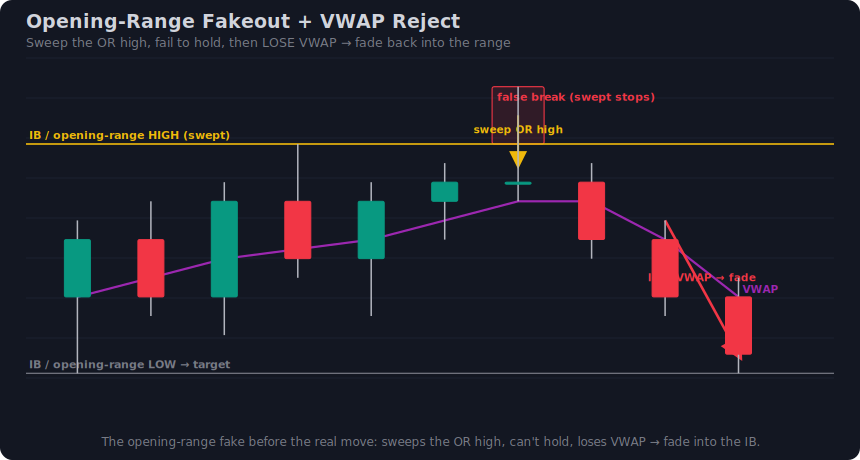
*The opening-range fakeout: price sweeps the OR high, can't hold, loses VWAP → fade back into the initial-balance range.*

---

## 17. Expiry-day & event nuances — the reversal's best friend (+ the regime decision)

### Expiry afternoon — the ideal fakeout-reversal environment

The [[Breakout Trading/note|Breakout Trading]] §16 note establishes the fundamental point: expiry afternoon is **low-probability for breakouts** because gamma pinning dominates. The mirror is equally fundamental: expiry afternoon is **the highest-probability environment for fakeout reversals** on the entire weekly calendar.

Here is why: as the weekly options approach expiry (verify the current Nifty expiry weekday on NSE — NSE has revised this more than once), dealer gamma becomes enormous and concentrated near the ATM strikes. Dealers who are long gamma (positive-GEX regime) automatically fade moves away from their gamma-maximum strike: as price rises above their hedge level, they sell futures to re-hedge; as price falls below, they buy futures. This mechanical behaviour is the structural bid for mean-reversion that the reversal trader piggybacks on. The max-pain strike — the strike where aggregate OI losses are minimized for the option writers — acts as a gravitational attractor that intensifies through the afternoon.

**The expiry-afternoon reversal fingerprint:**
- Spot pushes above (or below) the nearest OI wall in the afternoon session
- Call OI at the wall does not drop — writers defend (OI re-defense)
- ATM CE (or PE) premium fails to expand on the move
- Max-pain strike is 50–150+ Nifty points *below* (or above) the current spike
- GEX is positive / neutral (not a negative-GEX expansion day)
- Time is 13:30–15:00 IST on expiry day

When all five align, the reversal target is not the interior POC or the IB low — it is max-pain. The gravitational pull of max-pain on expiry afternoon can deliver 80–150 Nifty points of movement within 60–90 minutes. This gives a materially larger measured move than a non-expiry fakeout off the same level. "Fade failed moves away from Max Pain — if Nifty briefly spikes away and then stalls, the reversion is often quick" (web: Medium; stockmojo; research.md §6.5).

**The expiry-afternoon PE play (example):**
Spot is at 24,550 on expiry afternoon. Max-pain is 24,300. The call wall (24,600 CE) has been holding all morning; call OI is rising through the session (writers defending). At 13:45 spot pushes to 24,615 — a sweep of the 24,600 wall. The sweep candle closes at 24,558 (back inside). CVD diverged on the 1m push. ATM CE (24,600) premium went from ₹35 to ₹33 on the spike — non-expansion. Target: max-pain at 24,300 = 250 Nifty points potential. Stop: above 24,620 (sweep wick + buffer). Gross R:R to max-pain ≈ 1:4.3. This is the expiry reversal's peak-quality setup.

### Event days — the reversal's opportunity and its IV trap

Budget day, RBI policy decisions, major index constituent earnings, and global shock events (US CPI, FOMC spillover) widen Nifty's intraday range significantly and spike India VIX. Violent failed spikes are common — the initial news-reaction move is frequently *excessive*, driven by retail panic and algorithmic over-extension, and mean-reverts sharply once the initial vol spike is absorbed.

**However, event days carry a specific option-buyer trap:**

The first test of a fakeout reversal on an event day is often *lower quality* than the second test, for this reason: IV is at its peak during the initial spike. If you buy a PE to fade an upside spike at the moment of maximum IV, and the reversal does occur but IV simultaneously collapses (the event is "known," VIX reverts), your option's delta gain may be fully or partially offset by vega loss. You win directionally and lose on IV-crush.

**The event-day reversal protocol:**
1. Do not enter the reversal on the *initial* vol spike. Let the first test of the swept level play out. Watch IV on the ATM option.
2. If the first test holds (price cannot reclaim the swept level), wait for the **second test** — a second push toward the swept level that fails *on lower IV*. This is the Wyckoff "test" after the Spring/Upthrust, now with IV already partially collapsed.
3. On the second test, the option trade is cleaner: IV is lower (less vega risk), the structural signal has two confirmations (two failed tests), and the initial panic has been digested.
4. Recalibrate all target distances upward on event days. The range is wider; the reversal delivers more points. But also widen stops proportionally (at minimum 1.5× the normal ATR buffer).

*(See §18–23 for the full options-edge mechanics for event-day sizing.)*

### The regime decision — the tie that binds the twin notes

The most important single concept in both notes is this: **the regime decides which playbook fires, not the pattern.** The same price-level sweep looks identical on the chart whether it is a genuine breakout or a fakeout reversal — the regime is the discriminator.

The regime decision is made on the 1h *before* the session begins and updated only when the 1h structure changes:

| Regime signal | What it means | Which note fires |
|---|---|---|
| **Positive GEX** (dealers long gamma) | Dealers mechanically fade moves; mean-reversion is structural; breakouts are absorbed | **This note — fakeout reversal** |
| **Balance / sideways range on 1h** (higher highs AND higher lows absent; price rotating inside value) | Market is in equilibrium; no directional conviction; moves to range edges are statistically likely to reverse | **This note — fakeout reversal** |
| **Pinning / max-pain anchor** (expiry afternoon; spot oscillating between call wall and put wall without escape) | Gamma hedging drives reversion; any breakout attempt is resisted mechanically | **This note — fakeout reversal** |
| **Negative GEX** (dealers short gamma) | Dealers hedge *with* the move, amplifying it; momentum sustains; sweeps become breakouts | **Breakout note — trade the break** |
| **Expansion / trend on 1h** (confirmed BOS, structural lower highs or higher lows, directional OI build-up) | Market has chosen a direction; initiative is dominant; fading moves is catching knives | **Breakout note — trade the break** |
| **OI migration confirmed** (call OI dropped at broken strike; fresh OI builds at next strike in break direction) | The wall is dissolving; the range is expanding; real directional move is underway | **Breakout note — trade the break** |

No pattern in this note is actionable if the regime signals point to the breakout note. The most important use of this framework is not to tell you when to take a reversal trade — it is to tell you when *not* to.

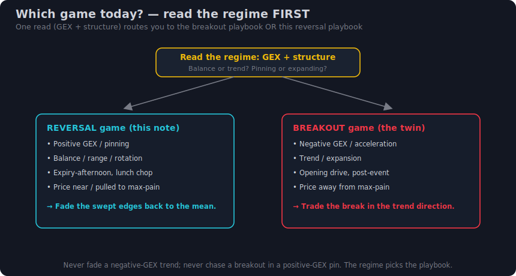
*One read routes you: positive-GEX / balance / pinning → fade the swept edges (this note); negative-GEX / trend / expansion → trade the break (the twin). The regime picks the playbook.*

> [!warning] **The cardinal error: fading a negative-GEX trend.** Applying the fakeout reversal playbook on a confirmed negative-GEX expansion day — a day where the 1h has made a structural BOS, OI migration has confirmed the break direction, and dealers are short gamma and hedging *with* the trend — is the single largest risk in this strategy. Every spike will look like a CVD divergence. Every high-volume bar will look like absorption. Some candles will close back inside levels. None of it matters, because the regime is expansion and the fakeout reversal's structural preconditions (dealers fading, OI defending, mean-reversion structural) do not exist. The market will grind straight through your stop. Mark Douglas: "prices are going to go in the direction of the greatest force" (*The Disciplined Trader*, p.435). The greatest force on a negative-GEX trend day is the trend. **If your GEX read shows negative / dealers short gamma AND the 1h has printed a confirmed BOS in the move direction: close this note, open the breakout note.** There is no fakeout reversal edge in that environment.


## 18. OI re-defense — the wall HOLDS

> [!info] Part 4 of 5 — The India Options Edge (§18–§23)
> India's option chain is not a passive mirror of price — it is a live, tick-refreshed vote by tens of thousands of option writers on whether a price level will hold. This part reads that vote in reverse relative to [[Breakout Trading/note|Breakout Trading]] §18–§22: where the breakout note demands that OI walls *dissolve* (writers capitulate) and premium *expands* (the market believes the move), the fakeout reversal demands the opposite — walls *re-defend*, premium *fails to expand*, and the gamma environment *punishes* the move rather than amplifying it. The India-exclusive edge here is that none of this is available to any Western reversal framework. Lead with OI re-defense (§18–§19), confirm with IV non-expansion (§20), gate with GEX (§21), and sanity-check against max-pain (§22). The full ordered checklist is in §23.

The single most powerful India-exclusive tell that a breakout is false is not on the price chart at all — it is on the option chain, at the exact strike that price just poked through. When the fakeout is real, the writers at that strike do not run. They add.

### The mechanism

Option writers (sellers) at a key strike — say the 23,000 call — are short gamma. They collected premium in exchange for the obligation to pay out if Nifty closes above 23,000 on expiry. When price sweeps above 23,000 intraday, writers face a live mark-to-market loss on those short calls. In a **real breakout**, that pain is unbearable: writers cover (buy back their short calls), OI at the 23,000 strike drops, and the wall dissolves. In a **fakeout**, the writers' conviction exceeds the panic: they read the same price action, decide the break is a liquidity grab, and **add fresh short calls at 23,000** — the OI at the strike *rises*. Fresh writing at a swept strike is writers re-establishing the ceiling at precisely the level retail is trying to break above. This is the fingerprint of re-defense.

The structural logic: if the smart-money writers collectively decided the break was real, they would cover. If they add, they are telling you the break will fail. Their P&L is on the line. Listen.

### The mirror: put-floor sweep

The same logic applies to a downside sweep. If price dips through the 22,500 put wall (highest put OI below spot) and **put OI at 22,500 rises or holds**, the writers are adding fresh short puts — defending the floor. The sweep was a grab. Fade the dip back up.

### Reading it on the chain (Sensibull / Opstra / NSE chain)

On the NSE option chain (updated every few minutes), watch the **Change in OI column** at the swept strike, not the total OI. A **positive Change in OI** while price sits just above (for a call sweep) or just below (for a put sweep) the strike means fresh writing is occurring right now. On Sensibull's OI build-up chart, you will see the bar at the strike *extend* upward — the opposite of what the breakout note needs. On Opstra's OI timeline chart, the slope of the strike's OI line is upward through the sweep window.

> [!warning] Latency caveat
> NSE chain change-in-OI updates on a cadence, not tick-by-tick. Allow 5–10 minutes after the price sweep before drawing conclusions. OI re-defense is a **confirmation read** of the price-action entry (the close-back-inside candle), not the split-second trigger. If you see the SFP/Turtle Soup candle close (§11–§12 of this note), enter on price action; then use the OI re-defense read over the next two 5m bars to *hold* the trade with conviction rather than to trigger it.

### Concrete Nifty example — false break of 23,000

**Setup:** Spot at 22,980. Option chain: **highest call OI at 23,000 CE** (the ceiling). Implied range: 22,800–23,000.

**The sweep:** at 10:35 a 5m candle wicks to 23,018 and closes at 22,994 — a shooting star close back inside the range. Price briefly invaded the call writers' territory and retreated.

**The re-defense fingerprint — over the next 10 minutes:**

| Strike | Before the sweep | 10 min after the sweep | What it means |
|---|---|---|---|
| **23,000 CE** (the wall) | 45 lakh OI | 47.3 lakh OI — **RISING** | Writers adding; ceiling being re-defended |
| **23,100 CE** (next strike up) | 8 lakh OI | 8.1 lakh OI — flat | No migration; range did NOT re-price higher |
| **22,800 PE** (the floor) | 38 lakh OI | 38.4 lakh OI — stable | Floor writers undisturbed; implied range intact |
| **ATM 23,000 CE premium** | ₹68 | ₹61 — **BLEEDING** | See §20; the market does not believe the poke |

The 23,000 CE OI rising while price hangs just above is the chain telling you: the sweep was rejected, the ceiling held, and the reversal trade (short via PE or sell CE) is validated. The breakout note's §18 says exactly the opposite must happen for a real break: "if instead 23,000-call OI keeps rising while price hangs just above 23,000, the writers are re-defending, not capitulating — that is a pin/absorption signal, and the 'break' is far more likely to fail." This note's trade is that far more likely failure.

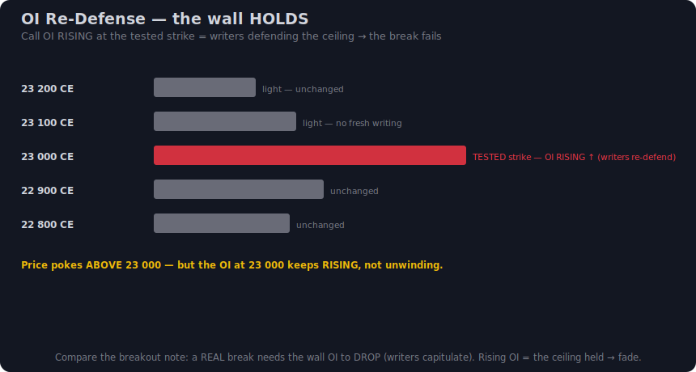
*OI re-defense: call OI RISING at the tested strike means writers are defending the ceiling — the break fails. (The breakout note needs the opposite: wall OI DROPPING.)*

> [!tip] The one-line A+ gate for OI re-defense
> **A+:** swept strike OI rises by any amount within 5–10 minutes of the sweep candle closing back inside. **Abort:** swept strike OI drops sharply — that is capitulation, the break may be real.

---

## 19. Failed OI migration — the range did not re-price

OI re-defense (§18) tells you the swept wall held. Failed OI migration tells you the *next* level never activated — the chain never repriced the range as if the break happened. Together, the two reads confirm that the implied range is exactly where it was before the sweep: the price poke was a grab, not a genuine range expansion.

### What real OI migration looks like (the breakout case — inverted here)

In a genuine upside breakout through the 23,000 call wall, the chain reprices in two simultaneous moves:
1. 23,000 CE OI drops (writers cover — the ceiling dissolves).
2. Fresh OI builds at 23,100 CE or 23,200 CE (the new ceiling forms one or two strikes higher).

The band between the call wall and the put wall expands upward. The implied range has shifted. Price now has structural permission to occupy the new higher range.

In a **fakeout**, neither move occurs. The wall holds (§18) and no fresh OI materialises at the next strike up. The 23,100 CE remains lightly written. The implied range is still 22,800–23,000. The price poke above 23,000 was orphaned — it moved outside the implied range for a few minutes and snapped back in because the chain never gave it permission to stay.

### Why this matters for the trade

The absence of OI migration means the **liquidity grab is complete** and the return to the prior range is the market's structural expectation. The reversal target (§26 of this note) is the interior of the OLD implied range — the old midpoint, VWAP, or put wall — because that is where the chain's pricing says value is. The chain did not reprice to include the new extreme. The extreme does not exist in the option market's model. Price will revert to where the chain says it belongs.

### Reading failed migration in real time

On Sensibull's strike-level OI chart or Opstra's OI builder: scan the one or two strikes *above* the swept call wall (or below the swept put floor). If those strikes show zero or negligible Change in OI in the 10–15 minutes following the sweep, migration has failed. The range is intact. The reversal thesis is live.

On the NSE chain itself: sort by Change in OI. If the top-5 rising strikes are all puts (or all the same pre-existing call concentration with no new call writing developing above the wall), the chain is not building a new ceiling — it is defending the old one.

### Concrete example (continuing the 23,000 setup from §18)

The 23,100 CE and 23,200 CE show **zero meaningful Change in OI** in the 10 minutes following the sweep. Writers did not set up a new ceiling at 23,100 or 23,200 because they never believed price was going there. The fakeout reversal is confirmed on both reads:
- 23,000 CE OI **rising** (re-defense — §18) ✓
- 23,100/23,200 CE OI **flat** (no migration) ✓

Target the interior: VWAP at 22,940, then the put wall at 22,800.

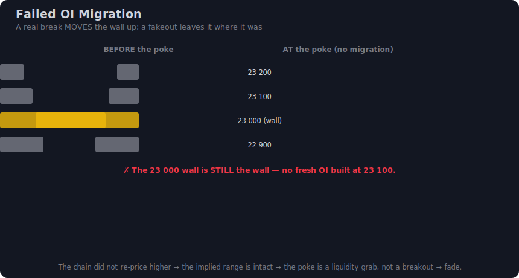
*Failed OI migration: the wall stays put — no fresh OI builds at the next strike, so the chain never re-priced higher. The poke was a grab, not a breakout.*

> [!tip] A+ confirmation: OI re-defense + failed migration together
> When both §18 and §19 are green, you have the chain's full fingerprint of a fakeout. Either alone is suggestive; both together is the India options edge at its sharpest. When combined with a price-action SFP close and CVD divergence (§10–§11 of this note), this is an A+ entry.

---

## 20. IV / premium NON-expansion — the market doesn't believe it

In the breakout playbook (see [[Breakout Trading/note|Breakout Trading]] §19), a real directional move delivers a **double gain to the option buyer**: delta (the underlying moved your way) plus IV expansion (the market repriced the expected range larger). The ATM option premium expands more than the delta-only estimate because the act of a genuine break causes IV to bid up.

The fakeout reversal trader reads this in reverse: on a **fake sweep**, the ATM option on the break side fails to expand, or IV actually bleeds, even as the underlying ticks to the new extreme. The options market — which is aggregating the view of every writer and buyer simultaneously — is declining to pay up for the move. It is the market's own vote: "we don't believe this will stick."

### What to watch (the ATM call, for an upside sweep)

At the moment price wicks above the call wall (say 23,000 is swept, spot at 23,012):

- **Real break:** the ATM 23,000 CE premium jumps, say from ₹68 to ₹82+. IV rises or holds. The chain is pricing in a new higher expected range.
- **Fakeout:** the ATM 23,000 CE premium moves from ₹68 to ₹70 — barely any response. Or it was ₹68 before the sweep and is ₹65 after the snap-back close. IV has not moved, or has ticked down. The market priced the poke as noise, not signal.

On Sensibull, watch the IV column on the 23,000 CE. On the NSE chain, watch the change in the LTP of the ATM option during the sweep window. A premium that moves less than half the delta-implied amount (delta ≈ 0.5 for ATM, so a 12-point Nifty move should cause roughly 5–6 points of premium change at minimum) is non-expansion. If it barely moves 2 points on a 12-point spike, the market is actively fading the spike via IV compression.

### India VIX context

India VIX reflects the 30-day implied volatility of the Nifty index. During a fakeout, you will often see India VIX staying flat or dipping while price makes the spurious new extreme. On a real break, India VIX typically holds or rises as uncertainty increases. A collapsing-VIX sweep is one of the most reliable environment reads that the "break" is being absorbed, not believed. Check India VIX on NSE's homepage or via the INDIAVIX ticker on any charting platform.

### The reversal trader's own option leg — buying the opposite side

When you **fade** an upside fakeout, you are buying the PE (or ATM CE on a downside fakeout reversal). The non-expansion of the CE is good for the fakeout thesis on price action, but it also implies that IV is currently compressed — which means buying the PE at that moment is buying into relatively *low* IV. That is actually favourable for the option buyer: you are buying premium when IV is depressed and the reversal move (if it occurs as expected) will push IV back up, giving you a delta gain *and* IV expansion on the reversal leg. This is the fakeout reversal's version of the double gain the breakout note describes.

> [!warning] Beware buying into an IV spike on the fakeout
> Occasionally a fakeout sweep happens during a genuine volatility event (a macro surprise, an unexpected news headline) where IV is spiking even though price is being absorbed. In this scenario, buying the reversal option *after* the IV spike means you are buying expensive premium that will crush when VIX normalises, even if price moves your way on delta. If India VIX has spiked more than 10–15% on the day, use the Nifty future for the reversal trade instead of options, or size the option position down significantly (repo: options-flow-and-dealer-greeks.md §3; research.md §6.3).

### Summary read — the three-state check at the sweep

| ATM option (break side) behaviour | Premium | IV | Verdict |
|---|---|---|---|
| **Real break** | Expanding significantly (>delta-implied minimum) | Rising or holding | Believe the break, stand aside or trade the breakout |
| **Fakeout** | Flat or barely moving | Flat or bleeding | Non-expansion confirmed — fakeout reversal trade live |
| **Vol event (news/event)** | Expanding on both CE and PE | Spiking | Stand aside; IV crush risk on all option positions |

---

## 21. Dealer gamma / GEX — positive GEX IS the reversal regime

The Gamma Exposure (GEX) regime filter is the **environment gate** for the fakeout reversal strategy. It answers the question: does this market *structurally punish* breakout attempts right now? In a positive-GEX environment, the answer is yes, consistently, by mechanical design.

For a full derivation of GEX mechanics, see [[Breakout Trading/note|Breakout Trading]] §20 — this note reads those mechanics with the verdict inverted.

### The inverted verdict table

| GEX regime | Dealer behaviour | Market character | Fakeout reversal verdict |
|---|---|---|---|
| **Positive GEX** (dealers long gamma) | Dealers hedge *against* the move — buy dips, sell rips | Suppressed vol, pinning, mean-reversion | **REVERSAL REGIME — sweeps fail, fades work. This is your environment.** |
| **Negative GEX** (dealers short gamma) | Dealers hedge *with* the move — buy strength, sell weakness | Amplified vol, trends, overshoot | **TREND REGIME — sweeps become real breaks. Do NOT fade here. Cardinal error.** |

In positive-GEX conditions, every time price pokes above the call wall, dealers who are long call gamma see their delta turn short (they sold calls, price went up, they must sell futures to hedge). That mechanical selling amplifies the reversal and suppresses the break. The sweep runs into an invisible dealer short. This is why sweeps in positive-GEX consistently fail: the hedging flows are against the break direction by design.

In negative-GEX conditions, the hedging flows *amplify* any directional move. A poke above the call wall causes dealers (who are short calls) to buy futures to hedge, which pushes price further up, which requires more hedging, creating a self-reinforcing cascade. Fading this is catching a falling knife (research.md §8, "the cardinal error").

### The gamma flip as the boundary line

The gamma flip is the Nifty price level where aggregate GEX crosses from positive to negative (or vice versa). Above the flip: pinning, mean-reversion, fakeouts dominate. Below the flip: trending, amplification, real breaks dominate. The flip is a dynamic boundary — check it daily on justticks.in or stockmojo.in alongside the OI walls.

A sweep that occurs **above the gamma flip** (in positive-GEX territory) has the reversal regime fully behind it. A sweep that occurs **below the gamma flip** (in negative-GEX territory, already trending) is more likely real — do not fade.

### On expiry days: GEX is amplified

Into weekly expiry, dealers carry the largest absolute gamma positions of the week. The positive-GEX pinning force is at its strongest in the final 2–3 hours of trading (approximately 13:30–15:30 IST on expiry day, verify the weekday with NSE as SEBI has changed the Nifty weekly expiry cycle). False breaks away from the dominant gamma strike on expiry afternoon are among the highest-probability fakeout reversals of the week — the gravitational pull back to the pin is enormous and mechanical.

### The India caveat — GEX is the environment filter, NOT the trade signal

The clean US dealer-gamma logic is **partially diluted in India** because a significant portion of Nifty OI is retail and prop, not systematically delta-hedged institutional dealers. The mechanical forced-hedging feedback loop that creates the US "gamma squeeze" or "positive-GEX pin" is present in India but is weaker than in S&P or Nasdaq (repo: options-flow-india.md §4; options-flow-and-dealer-greeks.md §4).

This means:

1. **Lead with OI re-defense (§18) and failed migration (§19).** Those are direct reads on actual positions at the specific swept strike. They do not depend on a model of dealer behaviour.
2. **Use positive GEX as the regime confirmation** — the environment that makes §18 and §19 more likely to hold. A positive-GEX day makes OI re-defense *more reliable* because the overall environment suppresses follow-through on sweeps.
3. **Never trade GEX in isolation.** A positive-GEX reading alone, without OI re-defense at the swept strike, is not a fakeout signal. GEX tells you the weather; OI tells you the specific storm.
4. **GEX shines most on expiry day** when Nifty's own large open interest means dealer hedging flows are genuinely material.

### How to check GEX on Nifty (India sources)

- **justticks.in** — publishes daily Nifty GEX levels, gamma flip zone, call/put wall
- **stockmojo.in** — GEX chart, max-pain, OI wall visualisations
- **TradingView** — community indicators tagged "Nifty GEX" or "India Gamma Exposure" (verify the script's methodology before relying on it)
- **Opstra** — dealer-gamma style analytics under their "Options Chain Analysis" tab

Cross-check two sources before calling the regime on any given day.

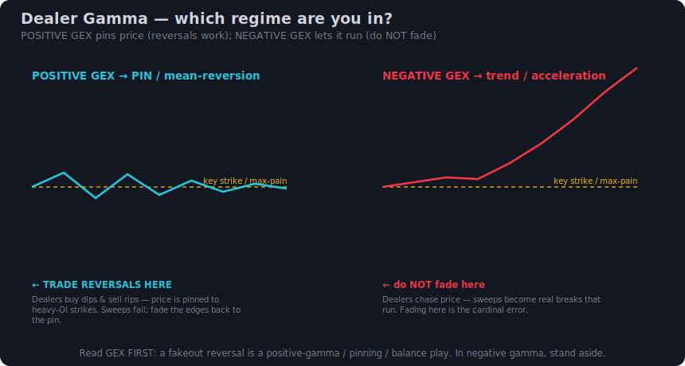
*Read GEX first: positive-GEX pinning is where reversals work (fade the swept edges); in negative-GEX trend, stand aside — fading there is the cardinal error.*

> [!tip] The two-line GEX rule for this strategy
> **Positive GEX → fade sweeps (this strategy's home environment).** **Negative GEX → stand aside or trade the breakout.** When in doubt, defer to OI re-defense at the swept strike (§18) — that is the higher-trust signal in India.

---

## 22. Max-pain as the reversal TARGET; PCR extremes

### Max-pain: the expiry magnet

Max-pain is the strike where the aggregate value of all open options (both calls and puts) is minimised — the price at which the greatest number of outstanding options expire worthless, minimising payouts to option buyers and thus maximising the collective gain of option writers. Into weekly expiry, market forces (and incidentally, writers' hedging behaviour) tend to pull Nifty spot toward this strike. The pull is well-documented on Indian markets and is strongest in the final 2–3 hours of expiry day (web: stockmojo, NiftyTrader, Bajaj Finserv; research.md §6.5).

For the fakeout reversal trader, max-pain performs a specific and powerful function: **it is the reversal TARGET when the fakeout occurs on expiry day, and it determines the direction of the reversal when price is displaced from it.**

### The directional logic

If Nifty is trading **above** max-pain and price makes a false break *further above* max-pain (a fakeout upside sweep), the reversal move has both the OI walls (§18–§19) and the max-pain magnet pulling price *back toward and below* the sweep level, toward the pin. The target is not just the interior of the range — it is max-pain itself.

If Nifty is trading **below** max-pain and price makes a false break *further below* max-pain (a fakeout downside sweep), the reversal is again toward the pin from below.

In both cases: the fakeout move takes price further from max-pain, fails to attract acceptance (OI re-defense + IV non-expansion confirm the failure), and then the gravitational pull toward max-pain drives the reversal.

### Worked expiry-day scenario

**Setup:** Nifty weekly expiry at 13:45 IST. Max-pain = 23,000. Nifty spot = 23,090 (above max-pain). Highest call OI = 23,100 (the call wall).

At 13:50, a 5m candle wicks to 23,148 and closes at 23,092 — a shooting star back inside the range. Call OI at 23,100 is *rising* (re-defense, §18). No fresh OI at 23,200 (failed migration, §19). 23,100 CE premium barely moved during the spike (non-expansion, §20). GEX is strongly positive this late in the expiry session (§21).

**Reversal target:** max-pain at 23,000 — a 90-point reversal move from the entry near 23,092. T1 = 23,050 (midpoint); T2 = 23,000 (max-pain pin). The pull is structural and quantifiable.

> [!warning] Max-pain's time window
> Max-pain gravity is **strongest only in the final 2–3 hours of the weekly expiry session**. Outside that window — in the morning, or on non-expiry days — the OI walls (§18–§19) dominate and max-pain is a secondary reference. Do not use max-pain as a target on a non-expiry-day fakeout; use the prior range interior, VWAP, or the naked POC (research.md §7.3).

### Tracking max-pain

- **Sensibull** displays max-pain prominently on its chain view.
- **Opstra** — "Max Pain Calculator" tool.
- **NiftyTrader.in** — published daily before open.
- **NSE chain** — calculate manually: for each strike, compute the total payout of calls and puts at that strike given current OI; the strike with the lowest total payout is max-pain. Sensibull/Opstra automate this.

### PCR extremes as contrarian reversal warnings

The Put-Call Ratio (PCR = put OI ÷ call OI) reflects which side of the chain is more heavily written. For the fakeout reversal, extreme PCR readings are a **contrarian pre-filter**: they flag when one-sided positioning has become so crowded that the fakeout reversal in *the other direction* is crowding out the obvious trade.

| PCR reading | Positioning state | Contrarian fakeout implication |
|---|---|---|
| **> 1.5** (very heavy put writing) | Market is very bullish via put-writing; crowded bull camp | A **failed upside sweep** (sweep of call wall) has extra fuel from a **crowded-long unwind**. The reversal down finds sellers who are wrong |
| **< 0.6** (very heavy call writing) | Market is very bearish via call-writing; crowded bear camp | A **failed downside sweep** (sweep of put floor) has extra fuel from a **crowded-short cover**. The reversal up finds buyers who are wrong |
| **0.7–1.3** (balanced) | No crowd extreme | Fakeout reversal is driven purely by OI re-defense at the swept strike; no PCR tailwind |

PCR extremes do not generate the fakeout signal — that comes from OI re-defense (§18). But an extreme PCR amplifies the reversal move once it starts, because the crowded one-sided position becomes the inventory that drives the move back. On Sensibull or Opstra, track the overall chain PCR (not strike-specific PCR) as a daily context read.

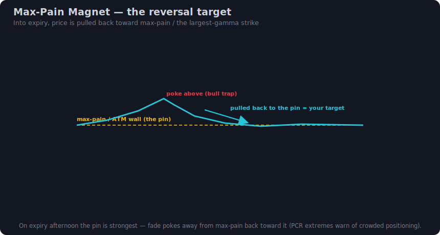
*Max-pain magnet: a poke away from max-pain that fails is magnetised back to the pin — the reversal target (strongest on expiry afternoon).*

---

## 23. The end-to-end options-flow FAKEOUT checklist

Run this checklist on the option chain **at the moment the price-action trigger fires** (the SFP close-back-inside candle, or the Model B failed-retest candle — see §24 of this note). It is ordered OI-first because OI is the highest-trust India-specific signal. GEX and max-pain confirm the regime and set the target; they do not override a clear OI re-defense signal.

This checklist is the **mirror image** of [[Breakout Trading/note|Breakout Trading]] §22. Every item that was a "must see for a breakout" becomes a "must NOT see for a reversal" — and the new reversal-specific reads (re-defense, failed migration) replace the breakout-specific reads (OI unwind, migration).

---

### CE-reversal checklist — fading a false break DOWN, buying ATM/near-ATM CE

*(Price swept the put floor — the highest put-OI strike below spot — and reversed back up. You are buying a CE to ride the reversal upward.)*

1. **OI re-defense at the swept put-floor strike ✓**
   — Put OI at the swept strike is **RISING or flat** in the 5–10 minutes following the sweep candle. Put writers are adding or holding, defending the floor. The floor was not broken.
   — Read on: Sensibull OI chart (bar extending downward for the put strike), NSE chain Change in OI column (positive = fresh writing), or Opstra OI timeline (upward slope at the strike).

2. **No OI migration to the next put strike ✓**
   — The strike one below the swept floor shows **zero or negligible fresh put writing**. The chain never repriced to include the new low. The implied range is intact.
   — If the next put strike shows a surge in fresh OI, the floor may genuinely be breaking lower — abort.

3. **ATM CE premium not expanding on the downside move ✓**
   — As price swept to the new low, the ATM **put** premium should have expanded if the move was real; it did not expand materially (flat or minimal). Equivalently, the ATM **CE** premium (your reversal trade) has not collapsed severely — it may be slightly depressed, but it has not been crushed, meaning you are not buying into a IV spike on the reversal leg.
   — If India VIX has spiked >15% on the day, evaluate carefully (see §20 caveat on IV crush).

4. **GEX positive or expiry pinning ✓**
   — Confirmed via justticks.in or stockmojo.in: GEX is positive (pinning regime), OR it is expiry afternoon (last 2–3 hours). The environment structurally favours the reversal.
   — If GEX is strongly negative: stand aside — the downside sweep may be the real trend. This is the cardinal error blocker.

5. **Price displaced below max-pain, reversal magnetised back up ✓**
   — (Expiry day only) Max-pain is above the current price. A poke to new lows below max-pain that fails is now pulled back up toward the pin. Confirm max-pain on Sensibull; the reversal target is max-pain.
   — On non-expiry days: substitute "price has swept into a major OI support zone with a naked POC between current price and the prior range interior" as the equivalent magnet.

> [!tip] A+ vs abort — CE reversal (false break down)
> **A+:** items 1–3 all green (put OI rising + no migration to next put strike + CE premium not collapsed) AND item 4 (GEX positive or expiry pin). Full size per the scorecard (§28 of this note). **Abort / no trade:** put OI *falling* at the swept floor (writers capitulating → real break down); fresh put OI *building* at the next strike down (real migration → range repricing lower); OR GEX strongly negative (trend day — breakouts work in either direction, do not fade).

---

### PE-reversal checklist — fading a false break UP, buying ATM/near-ATM PE

*(Price swept the call wall — the highest call-OI strike above spot — and reversed back down. You are buying a PE to ride the reversal downward.)*

1. **OI re-defense at the swept call-wall strike ✓**
   — Call OI at the swept strike is **RISING or flat** in the 5–10 minutes following the sweep candle. Call writers are defending the ceiling. The wall was not broken.
   — Read the same way as above: positive Change in OI at the call-wall strike on NSE chain/Sensibull/Opstra.

2. **No OI migration to the next call strike ✓**
   — The strike one above the call wall shows **zero or negligible fresh call writing**. No new ceiling formed. The implied range is unchanged.
   — If fresh call OI builds one strike up: the break may be real — abort the fade.

3. **ATM CE premium non-expansion during the sweep ✓**
   — The ATM CE premium should have surged on a real upside break; it did not. Flat or minimal expansion (less than the delta-implied minimum for the move) confirms the chain is not paying up for the spike. The PE (your reversal trade) is correspondingly cheap to buy at this moment.
   — Cross-check: India VIX flat or declining during the sweep = the move is seen as noise.

4. **GEX positive or expiry pinning ✓**
   — Same read as the CE-reversal. Positive GEX = dealers sell the rip mechanically = your reversal has dealer hedging flows behind it. Expiry afternoon = pinning force amplified.
   — Negative GEX = dealers buy the rip to hedge = sweeps accelerate upward = do NOT fade.

5. **Price displaced above max-pain, reversal magnetised back down ✓**
   — (Expiry day) Max-pain is below the current price. The false break above max-pain fails and is pulled back toward the pin. The target is max-pain.
   — (Non-expiry) Substitute: a naked POC inside the range below the sweep, or the prior VWAP/range-interior POC, acting as the reversal magnet.

> [!tip] A+ vs abort — PE reversal (false break up)
> **A+:** call OI rising at the swept wall + no migration to next call strike + ATM CE premium non-expansion + GEX positive or expiry pinning. Full size per §28. **Abort:** call OI *falling* at the swept wall (real break — writers covering); fresh call OI *building* at the next strike up (real OI migration → upside continuation); IV spiking across the chain (stand aside or use the future); GEX strongly negative (trend day — the sweep-and-go is more likely).

---

### Execution note — option choice for the reversal leg

When buying a CE on a CE-reversal (false break down), or a PE on a PE-reversal (false break up):

- **Strike:** ATM or one strike ITM. Do NOT buy OTM options for a reversal — the premium is almost entirely extrinsic and will be crushed by theta and IV normalisation even if the reversal move is correct. ATM gives you the highest delta per rupee of risk and the best response to the underlying move (see §27 of this note for the sizing math).
- **Expiry:** current weekly (the one expiring today or in the next 2–3 sessions). More distant expiries have lower delta and higher theta drag for a same-day or next-day reversal trade.
- **Entry timing:** the reversal checklist is read on the candle that closes back inside the range (the SFP/Turtle Soup close). The option is bought on the open of the next candle. Do not wait for the full 5-item checklist to complete in real time before entering — items 1–2 (OI re-defense and migration) are confirmed 5–10 minutes later. Enter on price action (item 5 of the structural trigger from §11–§12 of this note), then use OI reads 1–2 to confirm and hold. Exit the trade *immediately* if either read contradicts (OI drops at the swept strike, or fresh OI builds at the next strike) — those are not reasons to hope; they are hard aborts.

---

> [!summary] The India options edge in one line — the fakeout edition
> **Lead with OI re-defense at the swept strike (the chain's fingerprint that the wall held), confirm with failed migration (no new ceiling/floor built) and premium non-expansion (the market never believed it), gate with positive GEX (the regime that punishes sweeps), and target max-pain on expiry or the naked POC on other days — then stand aside entirely when GEX is negative, because fading a trend regime is the one unforgivable error.**

---

## 24. Two entry models — aggressive reclaim vs CHoCH + failed-retest

You have run the MTF funnel (1h bias, 15m level, regime gate), confirmed the sweep-and-reverse signature across the inverted three witnesses, and the option chain has printed the OI re-defense fingerprint. Now you have **exactly two ways to get into the trade** — and choosing the wrong model for the moment is how a correct reading turns into a bad fill.

The core asymmetry between the two is simple: **Model A gives you the best price; Model B gives you the most proof.** In index options, where bid-ask spread, STT, and theta eat into both entries equally, the tighter stop of Model B very often compensates for the slightly later entry — and sometimes produces a *better* net R:R than Model A.

| | **Model A — Aggressive (reclaim)** | **Model B — CHoCH + failed-retest (the A+ default)** |
|---|---|---|
| **Trigger** | First 5m candle that **closes back inside the prior range** after the sweep (the SFP confirmation close) — you enter on the close of that candle | Sweep-and-close-back-inside (Model A trigger) → **CHoCH** (first counter-structural close in the reversal direction) → **failed retest** (shallow, low-volume pullback toward the swept level that cannot reclaim it) → enter on the close of the failed-retest candle |
| **Stop distance** | Wider — just beyond the sweep extreme + ATR buffer, measured from entry on the reclaim candle | Tightest in trading — just beyond the **failed-retest high/low** (which itself is usually 5–15 points *inside* the sweep extreme); the CHoCH and the failed retest have already created a structural reason for the stop to be tighter |
| **Hit-rate** | Lower — you enter before structure has confirmed reversal; some closes-back-inside turn into the next push (especially in negative-GEX trending sessions) | Highest — three-layer confirmation (SFP close + CHoCH + failed retest) means you enter only when structure has given you two or more bearish/bullish signals beyond the initial sweep |
| **R-multiple per win** | Higher — you catch the full leg from the first close-back | Slightly lower per win (3–8 points worse entry), but the tighter stop frequently compensates; the **net R-multiple is often comparable** because the denominator (R in points) shrinks as much as the numerator |
| **When to use** | Only when: (a) the CVD divergence and VPA failure signal are unmistakable AND (b) GEX is clearly positive (pinning regime, reversals dominant) AND (c) the sweep is off a major HTF level where experience says the close-back-inside rarely re-fails AND (d) the option premium at the swept strike is non-expanding in real-time (you can see it live on the chain) | **The default for 80%+ of trades.** Whenever any witness is ambiguous, whenever GEX is only mildly positive, whenever this is your first or second reversal attempt of the session, whenever the sweep is off an intermediate (not HTF) level |

**Decision rule.** Default to Model B. Take Model A only when the combination of an unmistakable VPA absorption signal + CVD divergence + OI re-defense is so clear that the cost of waiting (the CHoCH and retest take 10–20 minutes and occasionally never come on a clean break) clearly exceeds the cost of being wrong. This happens perhaps 20% of the time. The remaining 80%, patience is equity.

**The failed-retest candle (Model B entry).** This is the Wyckoff "test" of the spring or upthrust: after the initial reversal move (CHoCH), price makes a shallow pullback toward the swept level — but cannot reclaim it. The test candle should print **narrow spread and below-average volume** (a no-demand or no-supply bar in VPA terms). If that bar holds, the reversal thesis is doubly confirmed: the swept level has now become resistance (for a bearish reversal) or support (for a bullish reversal), and the market has tested it and failed. Enter on the close of the next candle (the confirmation, not the touch).

**Abort conditions (Model B).** If the "failed retest" actually reclaims the swept level on a wide body close — stop. The SFP thesis is cancelled; the sweep was a real break delayed. Do not chase in the original direction either; stand aside and re-assess.

---

## 25. Stop-loss placement — beyond the SWEEP extreme

This is the cleanest stop location in all of trading, and it is the structural gift that makes the fakeout reversal a superior R:R strategy: the entire trade's invalidation is one precise, objectively defined price — the new extreme set by the sweep wick.

**The principle.** The fakeout thesis rests on one claim: the market swept the level, found no acceptance beyond it, and will now reverse. That thesis has exactly one falsification: price trades to a **new extreme beyond the sweep wick**. That means the original sweep was not a fakeout — it was the *beginning* of a real breakout, and you are wrong. The stop belongs just beyond the sweep extreme, and nowhere else.

**The buffer.** Add **0.5–1.0× the 5m ATR** beyond the sweep wick. The purpose of the buffer is narrow here — to sit outside the micro-stop-hunt zone where the market occasionally makes one final wick beyond the sweep before reversing (the "spring of a spring," or a secondary stop-hunt). If the buffer is breached with a candle *closing* beyond it, you are out. Do not be generous with the buffer; the larger it is, the more it costs you on the losers.

**Hard invalidation rule — the close, not the wick.** A wick beyond your stop level into the buffer is tolerable (price can explore and return). A **5m candle CLOSE beyond the sweep extreme** is the hard line: at that moment, the thesis is falsified, the sweep has become a real break, and you exit mechanically on the next available price. No negotiation, no "one more candle," no "let me see what the OI does." Out.

**For a LONG (bullish fakeout — sweep of a low, Wyckoff Spring / turtle-soup long):**
- Sweep extreme = the low-wick extreme below the swept support level
- Stop = **below the sweep wick low − 0.5–1.0× 5m ATR**
- Hard invalidation = a 5m candle closing *below* the sweep wick low
- Example: support level at 24,400, sweep wick tags 24,381 → stop at ~24,373 (8 points below the wick, approximately 0.7× a 12-point 5m ATR)

**For a SHORT (bearish fakeout — sweep of a high, Upthrust / SFP short):**
- Sweep extreme = the high-wick extreme above the swept resistance level
- Stop = **above the sweep wick high + 0.5–1.0× 5m ATR**
- Hard invalidation = a 5m candle closing *above* the sweep wick high
- Example: resistance level at 24,600, sweep wick tags 24,621 → stop at ~24,630 (9 points above the wick)

**Translating the underlying stop into option terms.** The stop is always defined in **Nifty points on the future/underlying** — never on the option's own chart (option premiums bleed theta and whip on IV even when the underlying barely moves, so an option-based stop triggers early and incorrectly). The workflow:

1. Mark the stop level on the **Nifty futures 5m chart** (e.g., stop = 24,630).
2. Set a **price alert** on the future at the stop level (most platforms; GoCharting, Sensibull, TradingView).
3. Keep the **option order ticket ready** for a manual market exit.
4. When the alert fires (Nifty futures touch the stop), **exit the PE/CE at whatever premium then trades** — the realized premium loss is your actual rupee risk, and §27 sizes the position so this loss equals your pre-planned risk budget.

**Why not use a stop-loss order on the option?** Option bid-ask spreads on Nifty ATM contracts can be 2–5 points wide in rapid movement. A market stop on the option during a fast move can fill 5–8 points worse than expected, effectively adding a point or two of "hidden" R to every loser. The future-alert + manual-option-exit workflow eliminates this slippage at the cost of requiring attention at the stop level.

---

## 26. Targets & trailing

The fakeout reversal has a structural advantage at target-setting that breakout trades do not: **the prior range that was being swept from is the exact measured move for the reversal.** The liquidity grab was designed to cover that range — the sweeping entity needed to go far enough to trigger the stops, then deliver price back across the range to fill their inventory at the opposite edge. This gives the reversal trader a natural, logic-driven T2 that is not a guess.

**T1 — range mid / POC / VWAP (the first partial exit).**
The range interior — the POC of the prior session or the 15m range, or the intraday VWAP — is where the first wave of absorption took place on the way to the level that got swept. It is also where neutral and slow participants may re-engage against you. Book **50–60% of the position at T1** and move the stop on the remainder to **breakeven** (the trade is now risk-free on the runner).

**T2 — opposite range edge / opposite liquidity pool / naked POC (the full measured move).**
The far edge of the range being swept from is the natural T2. For a bearish upthrust reversal, T2 is the put wall / prior range low / equal lows below. For a bullish spring reversal, T2 is the call wall / prior range high / equal highs above. The range width projects cleanly because it is the same range the sweep was designed to traverse.

**Why reversals give superior R:R vs breakouts.** The breakout trade pays a wide stop (beyond the sweep wick + buffer, measured from the retest entry, so the denominator in R is large) against a target of "the next level" (often just one range-width beyond the break, minus the retest distance). The fakeout reversal pays a narrow stop (just beyond the sweep extreme, measured from the reclaim or failed-retest entry — usually 15–30 Nifty points) against a target of the full prior-range width (often 60–150 Nifty points on Nifty 50 intraday). The asymmetry is real and structural: the stop is physically at the tightest logical location, while the target is at the maximum logical distance.

**The naked-POC magnet rule (non-negotiable).** If a naked or virgin POC sits between your entry and T2, do **not** set T2 short of it. Price is drawn to naked POCs to "complete the auction" (Trader Dale — see [[Breakout Trading/note|Breakout Trading]] §25 for the full magnet discussion). Set T2 just *beyond* the naked POC — price will overshoot by 5–15 points on Nifty. Conversely, if a naked POC sits *against* the direction of your reversal (e.g., a bullish naked POC above entry in a bearish reversal trade), that is a T2-limiting obstacle, not a target. Set T2 at the naked POC's lower edge, not beyond it.

**Expiry day special target: max-pain.** On expiry afternoon (typically Thursday for Nifty weekly, though this may have changed — verify the current expiry weekday on NSE), the gravitational pull toward the max-pain strike can override the range-target logic. If spot has swept the call wall and reversed bearish, and max-pain is 150 points below, target max-pain rather than the range mid. The gamma-pinning mechanism will often do the work faster than structure alone.

**In a positive-GEX pinning regime: bank fast.** When GEX is clearly positive (pinning, mean-reversion), the first leg of the reversal is typically the best and often the only leg. Dealers fade the move back toward gamma equilibrium and then fade the reversal too. In this regime, collapse the target plan: take the bulk at T1 or slightly beyond, and do not expect the runner to reach T2.

**Trailing — behind 5m structure.**
Trail the residual position (after T1 booking) behind the **5m swing structure in the reversal direction**:
- Bearish reversal: trail the stop to just above each successive **lower high** that forms on the 5m. When the 5m makes a higher high (first sign of the reversal stalling), tighten the trail immediately.
- Bullish reversal: trail just below each successive **higher low** on the 5m.
- In a positive-GEX session: do not trail at all — take it all at T1, the runner is structurally unlikely.

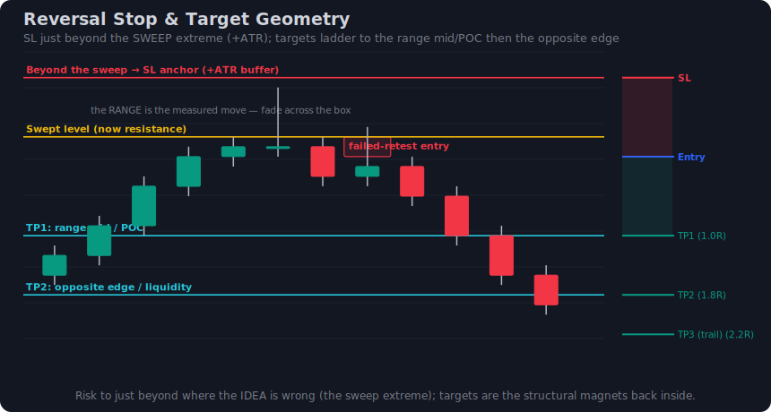
*Reversal stop & target geometry: SL just beyond the sweep extreme (+ATR); T1 the range mid/POC, T2 the opposite edge — the range itself is the measured move.*

---

## 27. R:R & position sizing for index options (the math)

Sizing in fakeout reversal trades follows the same arithmetic as [[Breakout Trading/note|Breakout Trading]] §26 — **define R in Nifty points first, then back into lots** — but the inputs are different and the structural advantages are worth understanding explicitly.

**Step 1 — Define R in underlying points.**
R = distance from entry to the hard stop, measured on the Nifty future.
- Model A entry (reclaim close): R = distance from the reclaim-close price to the stop (sweep extreme + ATR buffer). Typically **20–40 points** on Nifty intraday, depending on ATR and sweep depth.
- Model B entry (failed-retest close): R = distance from the failed-retest close to the stop (sweep extreme + ATR buffer). Because the failed-retest candle is itself 5–15 points *inside* the sweep extreme, R in Model B is often **10–25 points** — tighter than Model A.

**Step 2 — Convert points to per-lot premium-at-risk.**
When Nifty moves R points against you, the ATM option does not lose R × lot-size rupees. It loses approximately R × delta × lot-size, adjusted for IV and theta drag. The practical formula (conservative, ATM near-expiry):

> **per-lot premium-at-risk ≈ |entry premium − estimated stop premium| × lot size**

Estimate the stop premium either from the option chain payoff tool (Sensibull, Opstra) or by multiplying: a near-ATM option has delta ≈ 0.45–0.50; a 30-point adverse move costs roughly 0.45 × 30 ≈ 13–14 points of premium, then add 1–2 points for theta/IV drag if the move is slow. Use 0.45 delta as the conservative estimate.

**Step 3 — Size the lots.**

> **Lots = floor( (Capital × Risk%) ÷ per-lot premium-at-risk )**

> [!example] Worked sizing example — Nifty bearish fakeout (SFP short, buy PE)
> - Capital = **₹10,00,000**; risk per trade = **1%** → risk budget = **₹10,000**.
> - Nifty lot size = **75** *(illustrative — lot size is exchange-set; SEBI revised the minimum contract value in late 2024; **verify the current Nifty lot size on NSE before trading**)*.
> - Setup: 24,600 resistance swept to 24,621 (sweep extreme), then closed back inside at 24,592. Model B: CHoCH down, failed retest at 24,610 (cannot reclaim 24,612), enter short on failed-retest candle close at 24,602. Stop = 24,631 (sweep extreme 24,621 + 10-point ATR buffer). **R in underlying = 24,631 − 24,602 = 29 Nifty points.**
> - Buy 24,600 PE at premium **₹95** (ATM, delta ≈ 0.47).
> - At the stop (Nifty = 24,631), estimated PE premium ≈ 95 − (29 × 0.47) ≈ 95 − 14 = **₹81** (conservative; theta drag could push this to ₹79–83).
> - per-lot premium-at-risk ≈ (95 − 81) × 75 = **₹1,050**.
> - Lots = floor(10,000 ÷ 1,050) = floor(9.52) = **9 lots** (= 675 units). Check: 9 × 1,050 = **₹9,450 ≈ 0.945% of capital** ✓ (under 1% cap).
> - Capital deployed = 9 × 95 × 75 = **₹64,125** in premium (margin is the premium; check broker margin portal for intraday option-buying margin, which may be different).
> - T1 target = 24,480 (range mid / VWAP). T2 = 24,400 (put wall / range low). R:R to T1: (24,602 − 24,480) / 29 = 122/29 ≈ **4.2R** → well above the 2:1 minimum ✓.

**Why reversals often produce superior R:R.** Three compounding structural reasons:
1. The stop is anchored to the sweep extreme — the single tightest logical invalidation in all of trading. It is physically closer to entry than a breakout-trade stop (which must sit beyond the whole breakout candle + ATR buffer).
2. The target is the full prior-range width — the maximum logical distance for the measured move.
3. For a bearish fakeout where you buy a PE: IV tends to **expand** on the reversal move (fear spikes as the breakout fails, lifting vega), which means the PE's premium can outrun the linear delta estimate. The option buyer is doubly benefited: delta gain + IV expansion. (For a bullish fakeout buying CE: IV may not expand as much on a bullish reversal — size more conservatively on the upside.)

**Demand gross R:R ≥ 1:2 before costs.** After bid-ask spread + STT + brokerage (approximately 3–6 points round-trip premium on ATM Nifty weeklies — verify current STT rates as SEBI has revised the derivatives framework), gross 2:1 nets approximately 1.5:1. Anything thinner is not worth the non-linear theta/IV drag.

**The two hard limits — non-negotiable.**

> [!warning] Hard limits
> **Risk 1–2% of capital per trade, never more, regardless of how perfect the setup looks.** An A+ scorecard is not a licence to oversize — it is the condition required to reach the 1–2% threshold at all. A-grade setups (6–7 score) get half-to-three-quarter size.
> **Day-stop after 2–3 losses.** This is not optional. Two or three failed fakeout reversal attempts in a day almost always means: (a) you are misreading the regime (it is a trend day, not a pinning day) or (b) you are pattern-matching to reversals in a negative-GEX environment. Stop, close all positions, and reassess the regime from scratch. Revenge trading in this strategy — adding size on loss 4 to "make it back" — is the fastest route to a catastrophic day. (DT, Douglas: pre-defined risk is the only structure the market cannot take from you.)

---

## 28. Grading — the 10-point reversal scorecard

Every other section of this note feeds into this one. You do not enter on a feel or a hunch — you **count confluences across the inverted three witnesses**, and the count decides the size and whether there is a trade at all. The grade *is* the position size; never override it.

The scorecard is the exact inverse of the [[Breakout Trading/note|Breakout Trading]] §27 scorecard — where that note counts confirmations of the break, this note counts confirmations of the break's failure.

| # | Confluence | Score 1 if present |
|---|---|---|
| 1 | **HTF bias opposes the sweep direction** | 1h is bearish (lower-highs/lower-lows) AND an upside sweep just occurred — OR 1h is bullish AND a downside sweep just occurred. HTF and LTF are now in structural agreement for the reversal |
| 2 | **Sweep of a named major level (a genuine liquidity pool)** | The sweep reached IB high/low, PDH/PDL, prior call/put wall, equal highs/lows, or HTF OB — not just any intraday wiggle. A named, obvious level that had concentrated resting stop orders |
| 3 | **VPA failure signal present** | Low-volume wide breakout (effort < result) OR absorption (narrow spread on ultra-high volume) OR topping/stopping-volume sequence (3+ candles narrowing spread on rising volume at the extreme). Read on the Nifty future, never on the option |
| 4 | **CVD divergence on the 1m during the sweep** | Price made a new extreme beyond the level but the 1m cumulative delta did NOT make a new extreme. The single most reliable order-flow confirmation available on NSE-grade inferred feeds |
| 5 | **Price closes back inside the range** | The sweep candle (or the one immediately after) prints a close **inside** the prior range — the SFP/turtle-soup confirmation. The close, not the wick, is the gate |
| 6 | **OI re-defense at the swept strike** | Call OI at the swept strike rises or stays flat (writers defending, not covering) — for a bearish upside fakeout. OR put OI rises/stays flat for a bullish downside fakeout. No OI migration to the next strike. Monitor on NSE chain / Sensibull, allowing for 3–5 minute update lag |
| 7 | **IV / premium non-expansion** | The ATM option premium on the sweep side (CE for an upside sweep, PE for a downside sweep) stays flat or bleeds during the spike and close-back — the market is not pricing in acceptance of the break. If it were a real break, the premium would expand |
| 8 | **Positive-GEX regime OR expiry-afternoon pinning** | Confirmed positive net GEX (justticks.in, stockmojo.in — verify current data source) OR the session is expiry afternoon (the last 2 hours of the weekly expiry — verify current expiry weekday on NSE). Lead with OI structure; use positive GEX as secondary confirmation |
| 9 | **Wyckoff test / failed retest of the swept level (Model B)** | After the initial close-back and CHoCH, a shallow, low-volume pullback toward the swept level fails to reclaim it. The no-demand/no-supply test bar confirms the swept level has flipped polarity. This is the A+ conservative entry trigger (§24) |
| 10 | **Naked POC or T2 inside the range gives gross R:R ≥ 1:2** | From entry to T2 (opposite range edge / naked POC / max-pain on expiry), the gross R:R is at least 2:1 — with the stop at the sweep extreme + ATR buffer |

**The grade → size rule:**

| Grade | Score | Size | Notes |
|---|---|---|---|
| **A+** | **≥ 8** | **Full size** (1–2% risk) | Model A OR Model B entry permitted; all witnesses substantially agree |
| **A** | **6–7** | **Half to three-quarter size** | Tradeable — one or two witnesses are ambiguous; size down to reflect the uncertainty |
| **No trade** | **≤ 5** | **Zero** | Stand aside; the setup does not have enough structural backing to justify risking capital |

**Core disqualifiers — no trade regardless of count.**

> [!warning] Disqualifiers — zero size even at score 8+
> **1. Deeply negative-GEX (strong trend day).** If the regime is clearly negative-GEX (dealers short gamma, hedging with the move, amplifying the trend), every sweep is a sweep-and-go even when it looks like a fakeout. CVD may briefly diverge; a candle may close back inside; and then price blows through the level anyway because the regime does not support mean-reversion. Fading in a negative-GEX trend is catching a falling knife — correct pattern, wrong environment.
> **2. Price still accepting beyond the swept level.** If multiple 5m candles are closing beyond the level with expanding volume — not a single spike — price is accepting. The auction is not failing; it is building. There is no fakeout to trade; there may be a breakout to trade instead (see [[Breakout Trading/note|Breakout Trading]]).

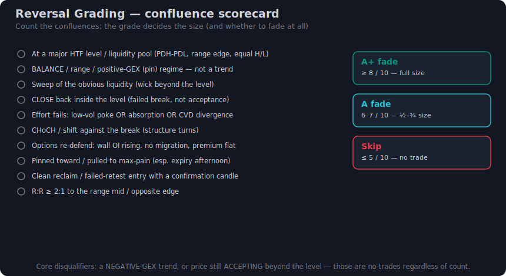
*The 10-point reversal scorecard — count the confluences; the grade decides the size. Core disqualifiers (negative-GEX trend / price still accepting beyond the level) are no-trades regardless of count.*

---

## 29. The before / during / after SOP (master checklist)

Copy-paste this into your journal or trade-plan template. Run it on every trade — so that fear, FOMO, and the urge to catch the spike can never improvise.

```
======= FAKEOUT REVERSAL TRADE SOP — NIFTY INTRADAY OPTIONS =======

--- BEFORE (context & setup — NO orders yet) ---
[ ] 1h BIAS confirmed: trending against the likely sweep direction?
    Bullish HTF + downside sweep candidate = long reversal setup
    Bearish HTF + upside sweep candidate = short reversal setup
[ ] LEVEL marked on 15m: IB high/low, PDH/PDL, prior call/put wall,
    equal highs/lows, HTF OB — must be a named major level with a
    genuine stop cluster above/below
[ ] LIQUIDITY POOL quantified: how many equal highs/lows, how "obvious"
    is the level? More obvious = more stops = better sweep fuel
[ ] OI WALLS mapped: highest call OI (ceiling) ___  highest put OI (floor) ___
    Note: which wall is the sweep candidate?
[ ] GEX REGIME: positive (reversal-friendly) / negative (trend — SKIP)
    Source: justticks.in / stockmojo.in (verify current sources)
[ ] MAX PAIN identified (expiry-day sessions only): ___
    Is the sweep moving AWAY from max pain? (reversal more likely)
[ ] PCR check: extreme reading? (PCR >1.5 or <0.6 adds contrarian weight)
[ ] PLAN written BEFORE entry: entry model (A or B), stop level, T1, T2,
    lots (sized per §27), expected R:R — no orders until sweep is confirmed

--- DURING (the sweep — watch, do NOT click) ---
[ ] Sweep of the named level confirmed (price touched the level)
[ ] EFFORT FAILURE on the sweep candle (on Nifty future volume bar):
    Low-volume wide spike OR narrow spread/ultra-high volume absorption
    OR 3+ narrowing candles at the extreme (stopping/topping volume)
[ ] CVD DIVERGENCE on the 1m: price new extreme, CVD does NOT confirm
[ ] CLOSE BACK INSIDE: the sweep candle (or next) closes inside the range
    (This is the gate — no close-back = no trade, no matter what else says)
[ ] OI RE-DEFENSE: call/put OI at swept strike rises or flat (allow 3-5 min lag)
[ ] PREMIUM NON-EXPANSION: ATM option on the sweep side is flat or bleeding
[ ] CHoCH forming (first counter-structural close in reversal direction)?
    (Model B: wait for this + the failed retest before entering)

--- AFTER (entry, management, exit) ---
[ ] ENTRY MODEL chosen: A (reclaim close) or B (failed-retest close)?
[ ] ENTRY TAKEN at: ___ Nifty futures price, ATM ___CE/PE at ₹___
[ ] STOP SET: beyond sweep extreme ___ + ATR buffer ___ = ___
    Hard inval = 5m candle CLOSE beyond sweep extreme (not just a wick)
[ ] R in underlying = ___ Nifty points
[ ] PER-LOT RISK: |entry prem − stop prem| × lot size = ₹___
[ ] LOTS SIZED: floor(risk budget ÷ per-lot risk) = ___
[ ] SCORE counted: ___ / 10 → Grade ___  → Size ___
[ ] T1 TARGET: range mid / POC / VWAP = ___
[ ] T2 TARGET: opposite range edge / naked POC / max-pain = ___
[ ] R:R to T1: ___ : 1   R:R to T2: ___ : 1   (demand gross ≥ 2:1 to T2)
[ ] T1 HIT: book 50-60%, move stop to breakeven on runner
[ ] TRAIL: behind 5m reversal structure (lower highs for shorts, higher lows
    for longs); in positive-GEX: bank most at T1, no runner expected
[ ] T2 HIT or trail stopped: full exit, log the trade
[ ] SCORE LOGGED in journal; day-stop respected (≤ 2-3 losses = done today)
====================================================================
```

---

## 30. Two full worked setups (both directions)

> [!warning] Illustrative values
> All prices, premiums, OI concentrations, the **lot size (shown as 75)**, and the expiry day referenced below are **illustrative for teaching the decision workflow** — they are not live recommendations. Nifty lot size, the weekly-expiry weekday, STT rates, and margin requirements are exchange/SEBI-set and have changed multiple times; **verify current values on NSE before placing any trade.**

---

> [!example] WORKED A+ LONG — Nifty CE intraday (Wyckoff Spring / turtle-soup reversal off a swept range LOW)
>
> **Context & 1h regime.** Nifty futures have been making higher-highs and higher-lows on the 1h chart for the prior two sessions. Price opened at 24,350 and the 1h bias is **bullish** ✓ (score 1). India VIX is calm. GEX check (stockmojo): **positive GEX** — pinning regime, reversals favoured ✓ (score 8). Max-pain this week = 24,400. Current spot (10:45 IST) is 24,385 — just above max-pain, no strong gravitational pull yet.
>
> **15m level — the sweep candidate.** The Initial Balance (9:15–10:15) printed 24,340–24,430. The IB low at **24,340** aligns with:
> - Equal lows from two prior sessions (24,338 and 24,341 — a dense sell-side liquidity cluster)
> - The highest put-OI strike is **24,300** (put wall / floor), with secondary put OI at 24,400
> - The prior day's VWAP settled at 24,342 (institutional average price from yesterday)
> Score 2 ✓ (major, named, multi-confluence level).
>
> **5m trigger — the sweep.** At 10:52 a 5m candle **sweeps 24,340**, with the wick tagging **24,321** (runs the equal-low stops and the stop-losses of intraday longs). The candle closes at **24,348** — body closes *back inside* the IB (above 24,340) ✓ (score 5). The sweep candle's volume on the Nifty future = **below average** (0.75× the 20-bar average) — a low-volume wide break, the VPA trap signal ✓ (score 3). On the 1m: price ticked to 24,321 but CVD flattened and ticked *up* as price made the new low — **CVD divergence confirmed** ✓ (score 4). This is a Wyckoff Spring: the false breakdown below support on low volume, closing back inside.
>
> **OI re-defense + premium non-expansion.** Within 5 minutes of the sweep: 24,300 put OI **rises** (put writers adding at the floor, defending — the sweep did not break the wall) ✓ (score 6). The **24,350 CE premium** (ATM) moved from ₹88 to only ₹83 during the spike — premium *fell* slightly as price made the new low, then stayed flat; no evidence of aggressive put-buying by bulls that would expand IV. The CE is not bleeding the way it would if a real breakdown were in progress ✓ (score 7).
>
> **CHoCH + failed retest (Model B).** At 11:02, a 5m candle prints a wide-bodied **bullish close at 24,367** — this is the CHoCH: the first close above a prior 5m swing high (24,358), breaking the local downswing structure and establishing a reversal. Then at 11:08, price dips back to **24,347** — a shallow, narrow-spread, below-average-volume 5m candle that *cannot close below 24,340* (the swept level). The test holds ✓ (score 9). Enter long on the next candle's open at **24,362** (or limit at the test low, whichever fills). Buy the **24,350 CE at ₹92** (near-ATM; slightly ITM-lean to reduce theta drag).
>
> **Stop.** Sweep extreme = 24,321. ATR buffer = 10 points (0.8× a 12-point 5m ATR). **Stop = 24,311** (below the sweep wick). Hard inval = 5m close below 24,321. R in underlying = **24,362 − 24,311 = 51 Nifty points**.
>
> **Sizing.** Capital ₹10,00,000 @ 1% → risk budget ₹10,000. Stop premium estimate: at Nifty 24,311 (−51 pts), 24,350 CE ≈ ₹92 − (51 × 0.47) ≈ ₹92 − ₹24 = **₹68** (conservative, includes theta/IV drag). per-lot risk = (92 − 68) × 75 = **₹1,800**. Lots = floor(10,000 ÷ 1,800) = **5 lots** (= 375 units). Check: 5 × 1,800 = ₹9,000 ≈ **0.90%** ✓.
>
> **R:R check.** T1 = 24,420 (IB mid + VWAP, 58-point gain from entry). R:R to T1 = 58/51 ≈ **1.14:1**. T2 = 24,430 (IB high / call wall lower edge, 68-point gain). But there is a naked POC from the prior session at **24,462** — stretch T2 to **24,468** (just beyond the naked POC). R:R to T2 = 106/51 ≈ **2.08:1 gross** ✓ (above the 2:1 minimum). Score 10 ✓.
>
> **Score = 10/10 → A+ → full size (5 lots).** All 10 confluences present.
>
> **Trade management.** T1 at 24,420: book 3 lots (CE ≈ ₹119, gain ≈ +₹27/unit). Move stop on the remaining 2 lots to breakeven (24,362 entry price on Nifty). T2 at 24,468: Nifty tags 24,471 at 13:10, CE at ₹143. Trail had been moved behind the last 5m higher-low at 24,445 → 5m closes below at 13:18 at 24,438 → exit remaining 2 lots at CE ≈ ₹131.
>
> **Result.** Lots 1–3: (₹119 − ₹92) × 3 × 75 = **+₹6,075**. Lots 4–5: (₹131 − ₹92) × 2 × 75 = **+₹5,850**. Gross P&L = **+₹11,925**. Risk was ₹9,000 → **realized +1.32R**. Net R:R approximately **2.3R** on the partial-exit blended. Regime (positive GEX, pinning) meant the runner stopped short of T2 — banked most at T1 was the right call in hindsight.

---

> [!example] WORKED A+ SHORT — Nifty PE intraday (Upthrust / SFP off a swept range HIGH)
>
> **Context & 1h regime.** Nifty has printed three consecutive lower-highs and lower-lows on the 1h, clearly **bearish HTF bias** ✓ (score 1). The session opened at 24,580 (prior session close: 24,610). GEX check: **positive GEX** with the dominant gamma strike at 24,500 — pinning, reversals favoured ✓ (score 8). Max-pain = 24,500. India VIX ticked up slightly at the open but is not in a spike. PCR = 1.55 (heavily put-side) — a crowded contrarian signal suggesting call-side exposure is thin, consistent with a failed upside move ✓ (adds to score 8's weight).
>
> **15m level — the sweep candidate.** The Initial Balance (9:15–10:15) printed 24,530–24,615. The IB high at **24,615** aligns with:
> - Three equal highs from the prior session's afternoon session (24,612, 24,618, 24,614 — a tight buy-side liquidity cluster)
> - The highest call-OI strike is **24,600** (the call wall / ceiling), and secondary call OI at 24,700
> - The prior-day VAH (Value Area High from the volume profile) = 24,608
> Score 2 ✓ (named major level, call wall + equal highs + prior VAH, dense BSL pool above).
>
> **5m trigger — the sweep.** At 11:35 a 5m candle **sweeps 24,615**, the wick tagging **24,638** (runs the equal-high stops and breakout-buy orders above the IB high). The candle closes at **24,609** — the body closes *back inside* the IB (below 24,615) ✓ (score 5). Sweep candle volume = **ultra-high** (3.2× the 20-bar average) on a **narrow spread** (range only 11 points despite the volume) — the classic VPA absorption signal ✓ (score 3). On the 1m: CVD was rising heading into the sweep, but at 24,638, CVD **rolled over and went negative** even as price held the wick high — textbook CVD divergence, buyers exhausted at the extreme ✓ (score 4). This is an Upthrust / UTAD: the false breakout above resistance on absorption volume, closing back inside — identical in structure to the Wyckoff Distribution Phase C pattern.
>
> **OI re-defense + premium non-expansion.** Within 5 minutes: **24,600 call OI rises** (call writers adding more short calls at the wall — the sweep was repelled, writers defending their position) ✓ (score 6). The **24,600 CE premium** went from ₹62 to only ₹67 on the spike (barely 5 points of expansion on a 23-point futures move above the strike — should have expanded 10+ points if genuine) ✓ (score 7). The 24,600 PE premium moved from ₹78 to ₹72 on the upside spike — reasonable delta drop — then recovered to ₹80 as price closed back, showing IV was actually compressing on the spike (the market never believed the break).
>
> **CHoCH + failed retest (Model B).** At 11:42 a 5m candle prints a **bearish close at 24,589** — breaking below the local swing low at 24,594 that formed after the sweep reversal. CHoCH confirmed. At 11:48, price rallies back to **24,612** — a narrow, below-average-volume 5m candle that *cannot close above 24,615* (the swept level). The test holds as resistance ✓ (score 9). Enter short on the next candle open at **24,600** (at the test bar's close). Buy the **24,600 PE at ₹84** (ATM at the swept resistance level — maximum delta, minimum time value relative to strikes further away).
>
> **Stop.** Sweep extreme = 24,638. ATR buffer = 12 points (1.0× the 12-point 5m ATR, slightly wider because the absorption volume spike suggests a potential second test). **Stop = 24,650** (above the sweep wick). Hard inval = 5m close above 24,638. R in underlying = **24,650 − 24,600 = 50 Nifty points**.
>
> **Sizing.** Capital ₹10,00,000 @ 1% → risk budget ₹10,000. Stop premium: at Nifty 24,650 (+50 pts above entry), 24,600 PE ≈ ₹84 − (50 × 0.47) ≈ ₹84 − ₹23.50 ≈ **₹60** (conservative). per-lot risk = (84 − 60) × 75 = **₹1,800**. Lots = floor(10,000 ÷ 1,800) = **5 lots** (= 375 units). Check: 5 × 1,800 = ₹9,000 ≈ **0.90%** ✓.
>
> **R:R check.** T1 = 24,530 (IB low / VWAP, 70-point gain from 24,600 entry). R:R to T1 = 70/50 = **1.4:1**. T2 = 24,500 (put wall = max-pain = gamma strike, 100-point gain). Note: a naked POC from 3 sessions ago sits at 24,498 — set T2 just below at **24,490**. R:R to T2 = 110/50 = **2.2:1 gross** ✓ (above the 2:1 minimum). Score 10 ✓.
>
> **Score = 10/10 → A+ → full size (5 lots).** All 10 confluences present; both core disqualifiers absent (GEX positive, not negative; price not accepting above 24,615 — it snapped back).
>
> **Trade management.** T1 at 24,530: book 3 lots (PE ≈ ₹117, gain +₹33/unit → 3 × 33 × 75 = **+₹7,425**). Move stop on remaining 2 lots to breakeven (24,600 Nifty, 24,600 PE entry ₹84). T2 at 24,490: price reaches 24,487 at 13:55 (expiry-afternoon gravity toward max-pain doing the work), PE ≈ ₹143. Trail had been moved behind the last 5m lower-high at 24,518 → exit remaining 2 lots on the trailing close (PE ≈ ₹138, at Nifty 24,505). Result on runner lots: (₹138 − ₹84) × 2 × 75 = **+₹8,100**.
>
> **Result.** Total gross P&L = ₹7,425 + ₹8,100 = **+₹15,525**. Risk was ₹9,000 → **realized approximately +1.7R gross (blended)**. IV expansion on the PE leg (fear spiked as the breakout failed) added approximately 5–8 points of premium above the linear delta estimate — exactly the "doubly benefited PE buyer" dynamic described in §27. Net of costs ≈ **+1.4R**.

---

## 31. Common mistakes & the psychology of fading

Fading a market that appears to be breaking out is one of the most psychologically exposed positions in trading. The crowd is going one way; you are going the other. Understanding the structural errors — and the mental patterns behind them — is what separates systematic fading from random contrarianism.

**The recurring, avoidable errors:**

| Mistake | Why it loses | The fix |
|---|---|---|
| **Catching a falling knife — entering on the wick, not the close** | The sweep wick is still forming in real-time; entering before the candle closes means you enter before you know whether the close is inside or outside the range. Many wicks turn into closed-beyond candles as the 5m completes. Your fill is at the worst price and your thesis is unconfirmed | **The close is the gate, never the wick.** Set a rule: your finger does not touch the buy/sell button until the 5m candle closes. One missed trade from not having entered early is vastly cheaper than the accumulated losses of entering on wicks |
| **Fading a negative-GEX trend (the cardinal error)** | In a strong negative-GEX session (dealers short gamma, hedging directionally), every reversal signal is a head-fake. CVD may briefly diverge. A candle may close back inside. And then the move continues and accelerates. Reversals simply do not work in this regime — the structural buyer/seller of last resort (the dealer) is *adding* to the move, not fading it | **Check GEX first, before every session.** If GEX is deeply negative, your playbook is the breakout note, not this one. Do not reverse-engineer a fading thesis onto a trend day |
| **No close-back-inside confirmation (entering after only the VPA signal or CVD divergence)** | VPA absorption at a level is a warning, not an entry. CVD divergence tells you buyers are exhausting — but they might exhaust for 10 minutes and then find new buyers. The close back inside is the structural confirmation that price rejected the level; without it, you have a probability, not a trade | Score 5 (close-back-inside) is a required score-point, not optional. Zero trades without a close-back-inside, no matter how compelling the other signals |
| **Refusing to flip from a breakout bias when the candle closes back inside** | A trader who was watching for a long breakout sees the sweep, momentarily thinks "this is it," and then watches it close back inside. The psychological default is to *hold the bullish bias* — "it's just a wick, it'll reclaim." This is the bias-flip gap: the failure to change the directional thesis the instant the structural condition changes | **The close-back-inside cancels the breakout thesis immediately and unconditionally.** It is not a continuation of the breakout; it is its negation. Reframe the moment: "I was watching for a long; the market just printed a fakeout signal; I am now looking for a short." The polarity flips with the candle close, not with your emotional comfort |
| **Oversizing on a B-grade setup (6/10)** | A 6-point setup that looks "almost A+" is the most dangerous trade — enough confluences to justify entering, not enough to justify full size. Oversizing a 6-point setup with a 2–3 loss day preceding it is how cascading losses happen | Grade → size, always. A 6/10 is half-to-three-quarter size. Never add size to compensate for the lower conviction |
| **Revenge fading after a stopped-out reversal** | The sweep ran through your stop, confirming a real break. The next correct action is to stand aside and reassess. The incorrect action — the one that turns a 1× loss into a 3× loss — is to immediately fade again at the next level with full size, fuelled by the belief that "it *has* to reverse eventually" | Accept that some sweeps are real breaks. The stop was the cost of being wrong about this one. The day-stop (2–3 losses → stop trading) is the circuit-breaker |
| **Ignoring the OI update lag** | Acting on OI re-defense (score 6) before the NSE chain has updated — 3–5 minutes after the sweep — means you are seeing stale data. The first OI snapshot after a sweep may not reflect what the writers are actually doing | Wait 3–5 minutes after the sweep before reading OI re-defense. Use it as a *confirmation*, not a *trigger* |

**The psychology of fading — Mark Douglas, *The Disciplined Trader*.**

The fakeout reversal strategy makes four specific demands on psychology that no other intraday strategy makes with the same intensity:

**1. Patience to wait for the reclaim.** FOMO is most acute the moment a sweep begins — the market is moving, the P&L of not being in is visible in real-time, and the reversal window may close. The trader who entered early (on the wick) is in profit; you are flat and watching. Douglas describes this as "fear of missing the move" — one of the market's most effective mechanisms for making traders enter too early and too large. The cure: "the market will always provide another opportunity." If this sweep gives you no clean close-back-inside, you wait. If it does and you miss the first entry, the failed-retest (Model B) gives a second. Every A+ setup has at least two entry points.

**2. The breakout thesis is CANCELLED — not "still live" — the instant price closes back inside.** This is the hardest mental transition in this strategy. You have spent 20 minutes watching a level, forming a breakout bias, and then the market invalidates it in a single candle. The human tendency is cognitive anchoring: the breakout bias feels like a sunk cost, and changing it feels like admitting error. Douglas: "getting locked into a specific opinion or belief about market direction is equivalent to trying to control the market with your expectation" (DT, Douglas, p.317). **The close-back-inside is not a complication — it is new information that obsoletes the prior thesis.** The correct response is not "wait and see"; it is "the long thesis no longer exists; I am now looking for a short." Trader Dale names the same failure: "people tend to hope, pray and still trust their trade. They are unable to admit that they were wrong." The bias-flip discipline gap is the difference between a reversal trader and a person who adds to a losing breakout position.

**3. Think in probabilities — accept that some sweeps are real breaks.** Not every spike-and-reverse is a fakeout. The 10-point scorecard is designed to separate the high-probability reversals from the ambiguous ones, but even A+ setups lose some percentage of the time. When they do, it means: the sweep was real, the market had information you did not have access to in real-time, and the stop-loss was the correct price of that uncertainty. Douglas: "you cannot know which specific trade works; you can only know that the set of A+ setups is positive-expectancy." The trader who is angry after a stopped-out A+ setup is grading themselves by the wrong metric — by the individual trade outcome rather than by whether the process was followed correctly. One stopped-out reversal proves nothing except that this was the instance where the sweep was real.

**4. Accept the stop as the cost of the edge.** Reversals have tighter stops than breakouts, but they are not zero-risk. The cost of the fakeout reversal edge is that occasionally the sweep continues. When it does, you take the stop immediately, mechanically, without second-guessing, and you move on. Holding a trade through a hard invalidation (a 5m close beyond the sweep extreme) because "IV is still high" or "the OI hasn't updated yet" is not sophisticated analysis — it is loss-aversion masquerading as analysis. Douglas: "pre-defined risk is the only structure the market cannot take from you." The stop is that structure. Honour it.

---

## 32. The final one-page summary

> [!summary] The entire fakeout reversal strategy, compressed
>
> **THE THESIS.** A failed breakout is not a breakout that "didn't work" — it is the delivery mechanism of the opposite move. The liquidity-sweep funds the reversal: every stop triggered and every breakout-buy entry above equal highs becomes the inventory that drives price back down. The edge: a tight, sweep-anchored stop + a full-range measured-move target = structurally superior R:R to the breakout trade it fades. Trade this only when the **inverted three witnesses agree**: EFFORT fails (low-volume trap or absorption), STRUCTURE rejects (close back inside, CHoCH forming), OPTIONS re-defend (OI at swept strike rises; premium non-expansion; positive-GEX pinning regime).
>
> **THE FUNNEL.** **1h** confirms bias opposes the sweep direction → **15m** identifies the named level with resting stops (IB high/low, PDH/PDL, call/put wall, equal highs/lows) and maps the prior range width (the measured-move target) → **5m** delivers the trigger (sweep candle, CVD divergence, close-back-inside) → **option chain** provides the re-defense and non-expansion confirmation.
>
> **THE 3 INVERTED WITNESSES.**
> (1) **EFFORT:** low-volume spike (effort < result) OR absorption (narrow spread, ultra-high volume) OR stopping/topping-volume sequence. CVD diverges at the sweep extreme. All read on the Nifty future, never on the option.
> (2) **STRUCTURE:** sweep candle closes back inside the prior range (the gate). CHoCH (first counter-structural close in reversal direction). Failed retest of the swept level on low volume (the A+ entry trigger — Wyckoff test).
> (3) **OPTIONS (India edge):** OI re-defense (wall OI rises or stays flat — writers defending); failed OI migration (no fresh OI at the next strike); IV/premium non-expansion during the spike; positive-GEX regime or expiry-afternoon pinning; max-pain acts as the T2 magnet on expiry day.
>
> **GRADE → SIZE.**
> Count the 10 confluences (§28): A+ (≥ 8) = full 1–2% risk; A (6–7) = half to three-quarter size; ≤ 5 = no trade.
> Core disqualifiers (override any count): negative-GEX trend day; price still accepting beyond the swept level.
> R in underlying (Nifty points) → back into lots so premium-at-risk at the stop = risk budget. Demand gross R:R ≥ 1:2.
>
> **THE SOP IN 6 LINES.**
> 1. **BEFORE:** bias / level / liquidity pool / OI walls / GEX / max-pain — write the plan, no orders.
> 2. **SWEEP:** watch for effort failure (VPA) + CVD divergence + close-back-inside — wait for the close.
> 3. **CONFIRM:** OI re-defense + premium non-expansion + CHoCH → enter Model A (reclaim) or Model B (failed-retest).
> 4. **STOP:** beyond sweep extreme + ATR buffer; hard inval = 5m close beyond the sweep wick.
> 5. **MANAGE:** book 50–60% at T1 (range mid / POC) → stop to breakeven → trail by 5m structure toward T2 (opposite range edge / naked POC / max-pain). Bank fast in positive-GEX; no runner expected.
> 6. **DISCIPLINE:** grade sets size; bias flips the instant price closes back inside; accept the stop; day-stop after 2–3 losses; think in probabilities.

---

*(See the one-line strategy motto at the footer below.)*

---

## Related notes & sources

- **The twin playbook:** [[Breakout Trading/note|Breakout Trading — The Complete End-to-End Playbook]] (read the regime first to decide which game you are playing)
- **Full cited research:** [[research]]
- **Real-chart capture plan (live TradingView pass):** [[capture_plan]]
- **Repo reference notes:** options-flow-india · options-flow-and-dealer-greeks · order-flow-options-backtesting-india-reference · volume-footprint-and-data-feeds-india
- **Books:** *Street Smarts* (Raschke & Connors) · *Advanced ICT / Institutional SMC 2024* · Wyckoff Spring/Upthrust (Pruden) · *Mind Over Markets* (Dalton) · *A Complete Guide to Volume Price Analysis* (Coulling) · *Order Flow / Volume Profile* (Trader Dale) · *The Disciplined Trader* (Douglas)

> [!quote] The whole strategy in one line
> Fade the break only when **effort fails, structure sweeps-and-reverses, and the options tape re-defends** — in a **positive-GEX / balance** regime, entering on the **reclaim / failed-retest**, with the stop just **beyond the sweep** and the target **back across the range** — and treat every sweep-and-go that stops you out as the cost of admission, not a mistake.
