# Intraday Options Decision Engine

**The whole system is one decision, repeated.** You do not run a dozen strategies — you run a single loop:
map the levels before the open → read the open and the regime → when price reaches a level decide whether it
**HOLDS, BREAKS, or you WAIT** → that read tells you which of the **five plays** (breakout · fakeout · reversal ·
pullback · continuation) is live → enter on the lower-timeframe trigger (not early, not late) → and put the trade
on an option **strike where the stop fits your point-budget**. If the stop is too wide, you wait for the retest
that shrinks it, or you stand aside. That is the entire engine.

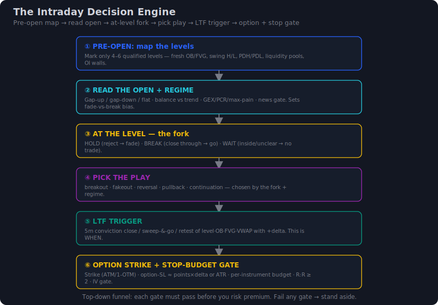
*The decision engine end-to-end: every gate must pass before you risk premium — fail any gate and you stand aside.*

> [!summary] TL;DR — the spine in one breath
> **Pre-open:** mark only 4–6 *qualified* levels (fresh OB/FVG, swing H/L, PDH/PDL, liquidity pools, OI walls) —
> never congest the chart. **Open + regime:** gap type, balance-vs-trend, and the options regime (GEX / IV / PCR /
> max-pain) decide *fade-vs-break* **before** the level is touched — this alone eliminates 3 of the 5 plays.
> **At the level:** read the reaction — sweep+reject / hammer / absorption / CVD-divergence = **HOLD (fade)**;
> conviction-close / BOS / delta-expansion = **BREAK (go)**; unclear = **WAIT**. Grade it on *weighted*
> confluence (structure + VP/order-flow + options-flow), where a single veto (CVD divergence, absorption, OI
> re-defense) overrides the vote. **Enter** on the 5m trigger. **Translate to options:** strike (ATM / 1-OTM),
> stop on the option via **delta** (premium-stop ≈ delta × index-point-stop) or **ATR**, sized to a *per-instrument*
> budget (~30–40 pts preferred, ≤50–60 max on Nifty; 2–3× on BankNifty/Sensex). **Protect:** mid-trade exit when
> the thesis breaks, an IV/theta timing gate, and a hard daily-loss governor.

> [!tip] How this guide is organised (7 parts, ~39 sections)
> 1. **Engine overview** — the one-decision spine, the five plays, weighted confluence (and how the weights shift by regime).
> 2. **Levels & the open** — how to mark and *grade* levels (the four-gate declutter filter), the pre-market checklist, the news/event/expiry gate, and the gap-up/down/flat open read.
> 3. **Regime** — will the day be sideways, volatile, or trending? Balance-vs-trend + GEX/IV/PCR/max-pain → fade-vs-break decided *first*.
> 4. **The decision tree (the core)** — HOLD / BREAK / WAIT, the hammer+sweep continue-vs-reverse fork, when to wait vs not, and the full worked "high → demand → sweep → grind → about to break" case.
> 5. **LTF entries** — the not-early-not-late trigger, which lens to read (price action / SMC / VP), the footprint deep-dive, and FVG-on-LTF mastery + failure modes.
> 6. **The options layer (your capital-constrained core)** — strike, delta/ATR stops, the per-instrument stop-budget gate, targets & R:R, theta/IV timing, and mid-trade exits.
> 7. **Playbook & path** — the five per-play cards, the daily-loss governor, the staged learning path, and the GoCharting + Dhan backtesting spec.

> [!note] Colour legend (used in every schematic)
> 🟢 green = bullish / demand · 🔴 red = bearish / supply · 🟡 gold = the level / liquidity · 🔵 blue = entry / order block · 🟦 teal = targets.

> [!warning] This is the umbrella, not a replacement for the deep-dives
> Two of the five plays have their own full guides — **[[Breakout Trading/note|Breakout Trading]]** and
> **[[Fakeout Reversal Trading/note|Fakeout Reversal Trading]]**. This engine decides *which* play to run and
> *when*; it fully specifies reversal, pullback, and continuation here, and routes you to the deep-dives for the
> other two. Every exchange-set value (lot sizes, weekly-expiry weekdays, charges) changes — **verify the current
> value on NSE/BSE before trading.**
## 1. The one decision, repeated — the spine

Most beginners collect strategies. They learn a breakout setup, then a reversal setup, then a "VWAP bounce," then an OI-wall fade — and end up with a drawer full of disconnected tactics and no idea which one to pull out when price is actually moving. The Intraday Options Decision Engine throws that mental model away. **There is only ONE decision, and you make it over and over, all day, in the same fixed order.** Everything else — the five "plays," the confluence weights, the deep-dive guides — is just detail hanging off that single spine.

Here is the whole engine in one breath:

> [!summary] The spine, in one breath
> **Pre-open, map the levels → read the open + the regime → at the qualifying level decide HOLD / BREAK / WAIT → that verdict *is* the play (one of five) → drop to the LTF for the trigger → put it on a strike where the stop fits your point budget.**

Read that again and notice what it is *not*. It is not "scan for setups." It is not "wait for my favourite pattern." It is a **funnel**: each step narrows the field, and by the time you are choosing a play, the regime has already eliminated most of your options for you. Every channel and book the research draws on converges on the same instinct — *read the state of the market first, then match the tactic to the state* (Trader Dale: "the #1 structural mistake is using a trend strategy in a rotation, or vice-versa"; Vorwald: "context beats setups — setups come at step 8, not step 1") (repo: research.md).

Let's walk the six links of the spine slowly, because the rest of this seven-part guide is nothing more than each link expanded.

**1. Pre-open: map the levels.** Before the bell (9:15 IST), you mark a *small* set of levels that price could react at today — OI walls, prior-day VAH/VAL and naked POC, the previous day's high/low (PDH/PDL), VWAP, and at most one or two fresh, higher-timeframe order blocks or fair-value gaps. The skill here is *deletion*, not collection: keep four to six levels in view, never more. (Full mechanics in Part 2, §5–8.)

**2. Read the open + the regime.** The first ~15–60 minutes tell you *what kind of day this is*. Did price gap up into resistance, gap down into support, or open flat inside value? Is the dealer-gamma sign positive (vol suppressed, mean-reverting) or negative (vol amplified, trending)? Is implied volatility cheap or rich? This read produces a single sentence — a **regime label** — and that one sentence decides whether you are hunting *fades* or *breaks* today. (Parts 2 and 3, §9–16.)

**3. At the level: HOLD / BREAK / WAIT.** When price finally arrives at one of your mapped levels, you do not act on the level — you act on the **reaction** to it. The level either *holds* (defends, repels price → fade / reversal / pullback-bounce), *breaks* (gives way with acceptance → breakout / continuation), or stays *ambiguous* (→ WAIT, no trade yet). "The reaction to the level is more important than the level itself" (FFP §1). This is the heartbeat of the engine. (Part 4, §17–24.)

**4. The verdict IS the play.** Crucially, you do not separately "pick a strategy" after reading the reaction. The HOLD/BREAK/WAIT verdict, combined with the regime you already labelled, *names the play for you*. A HOLD on a balance day at a swept low is a fakeout reversal. A BREAK on a trend day is a breakout or continuation. The five plays (§2 below) are simply the **five legal verdicts** the engine can return — not five things to choose between.

**5. LTF trigger.** Once the play is set, you drop to the lower timeframe (5m) only for *timing* — the conviction close, the sweep-and-reclaim, the reaction candle. The 5m never invents the level; it only times the entry into a play the higher timeframes already authorised. (Part 5, §25–30.)

**6. Put it on a strike where the stop fits the budget.** The whole futures-side analysis above produces a thesis *in index points*. The final link converts that into an actual options trade: pick an ATM or 1-OTM strike, translate your point-stop into a premium-stop via delta, and check it fits your per-instrument risk budget. If the stop is too wide for the budget, you do not size down recklessly — you **WAIT for the retest that shrinks the stop, or you skip**. (Part 6, §31–36.)

> [!tip] Why "one decision repeated" is the whole point
> When you internalise that every trade is the *same* sequence, three things happen: (1) you stop hunting and start *waiting* for price to enter your funnel; (2) your journal becomes legible — you can ask "where in the spine did I go wrong?" instead of "was that a good trade?"; (3) discretion shrinks to a few well-defined forks instead of a thousand judgement calls. The engine is a discipline machine disguised as a strategy.

**The MTF framing that runs through every link.** The spine operates across three timeframes, each with one job — never blend them:

| Timeframe | Job in the spine | What it decides |
|---|---|---|
| **1h / 30m** | Bias + regime | *Which menu of plays is legal today* (fade vs break) |
| **15m** | The level | *Where* the decision happens (the qualifying level) |
| **5m** | The trigger | *When* to fire (the LTF entry candle) |

> [!note] One worked beat (both directions)
> *Long:* 1h is in an uptrend, regime is negative-GEX/trend → menu = {breakout, pullback, continuation}. The 15m marks a fresh demand zone in discount. Price pulls back into it; the 5m prints a bullish reaction candle with rising CVD → **pullback play, long**. Convert a 30-pt Nifty stop to a ~15-pt ATM premium-stop; if that fits the budget, fire a CE.
> *Short:* 1h is rolling over from a prior-day VAH, regime is positive-GEX/balance, spot is extended above max-pain → menu = {fakeout reversal, reversal, range fade}. The 15m level is the call wall. Price sweeps just above it, CVD diverges, the 5m closes back inside → **fakeout reversal, short**. Convert the (tight, above-the-wick) point-stop to a premium-stop on a PE and check the budget.
>
> Same spine, opposite directions, opposite plays — *because the regime selected a different menu first.*

---

## 2. The five plays — breakout · fakeout · reversal · pullback · continuation

The engine can return exactly five verdicts at a level. Think of them as the **five legal answers to one question**: *given the regime, which play does THIS level support?* They are not five strategies to memorise; they are the complete, mutually-exclusive set of things the market can be doing at a level you care about.

Two of the five are big enough to have their own full deep-dive guides — **breakout** and **fakeout reversal** — because they are the two halves of the same coin (the successful transition vs the failed one). The remaining three — **reversal, pullback, continuation** — are fully specified later in *this* guide (the §17–24 decision tree and the §37 play cards). This umbrella's job is to decide *which* of the five applies; the deep-dives and the later sections supply the mechanics.

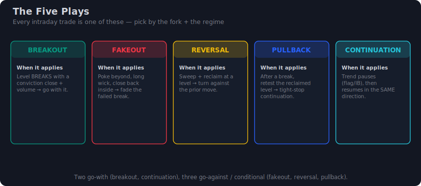
*The five plays at a glance — each is a verdict the engine returns at a level, not a strategy you go shopping for. Breakout and fakeout reversal route out to their own deep-dives; reversal, pullback, and continuation live in this guide's later sections.*

Here is each play defined crisply, with the regime that legalises it and where to go for the full mechanics:

| Play | What it is | When it applies (the gate) | Deep-dive |
|---|---|---|---|
| **Breakout** | Balance → imbalance: price *accepts* beyond the level (wide-body close, new value building outside). | Regime permits trend (negative/neutral GEX, away from max-pain); a value edge / IB / OI wall; effort + structure + options all confirm displacement. | `[[Breakout Trading/note\|Breakout Trading]]` |
| **Fakeout reversal** | The *failed* transition: a sweep beyond the level that snaps back inside (sweep-and-reverse). | Regime favours mean-reversion (positive GEX, near max-pain, balance day); the level is swept but witnesses **refuse** to confirm (low-vol poke / absorption / CVD divergence / OI re-defense). | `[[Fakeout Reversal Trading/note\|Fakeout Reversal Trading]]` |
| **Reversal at exhaustion** | A climax / V-reversal at an HTF *extreme* with no prior breakout to fade — the move is *ending*, not pausing. | A VPA climax (selling/buying climax) or footprint absorption prints at a *naked* HTF level (prior-day VAH/VAL, naked POC, call/put wall) **with CVD divergence**. | This guide (§17–24, §37) |
| **Pullback / mitigation** | Buy the retracement *into* an established trend at a fresh demand/supply zone — "be a pullback trader, never a breakout trader" (FFP). | HTF is clearly trending; price pulls back to a *fresh*, HTF-aligned zone in **discount** (longs) / **premium** (shorts). | This guide (§17–24, §37) |
| **Continuation** | The trend-leg *resumption* after a flag / BOS-pullback completes (a pullback that has already confirmed). | A BOS has occurred, price has mitigated the OB/FVG, and a continuation candle fires in the trend direction. | This guide (§17–24, §37) |

> [!example] Spotting the difference between reversal, pullback, and continuation (the three that confuse beginners)
> All three involve price coming *back* to a level, so newcomers blur them. The distinction is **what comes next and at what location**:
> - **Reversal** happens at an *extreme* and intends to turn the whole move around (the trend is over). Long *or* short: a buying climax at the call wall on a balance day → short reversal; a selling climax at the put wall → long reversal.
> - **Pullback** happens *inside an ongoing trend* and bets the trend *resumes* (the trend is alive, just breathing). Long: uptrend dips to fresh demand in discount → buy. Short: downtrend rallies to fresh supply in premium → sell.
> - **Continuation** is a pullback that has *already confirmed* — the BOS + mitigation are done and you are entering on the resumption candle. It is the lower-risk, "second-test" version of the pullback.

> [!warning] The five collapse to two — the regime does the work
> You should rarely be choosing among all five at once. The regime read (§16, and Part 3 in full) **collapses the menu to at most two before price even reaches the level**: a positive-GEX / near-max-pain / balance session legalises only {fakeout reversal, reversal, range fade}; a negative-GEX / trend session legalises only {breakout, pullback, continuation}. If you find yourself debating a fade *and* a break at the same level on the same day, you skipped the regime step. (repo: research.md, lens 5.)

---

## 3. Weighted confluence (not a checklist) — and how the weights shift by regime

The single most important upgrade this engine makes over the sibling guides is how it scores a setup. The deep-dives use a **count** — a "6-of-10 scorecard," tick the boxes, fire if enough tick. The decision engine replaces counting with **weighting**, for two reasons that the research makes explicit: not all witnesses are equally trustworthy in the Indian market, and **their trustworthiness changes with the regime** (repo: research.md, lens 2).

> [!warning] KEY FINDING — confluence is WEIGHTED, not COUNTED
> Three weak, agreeing witnesses do not beat one strong, disagreeing one. A setup with five low-trust confluences can be *worse* than a setup with two high-trust ones. Stop counting ticks; start weighing votes. And one class of signal — the **veto** — does not add to the vote at all; it *cancels* it.

**The three witness buckets.** Every signal the engine reads falls into one of three buckets (generalised from the breakout note's 3-witness model):

- **STRUCTURE** (price action / SMC): the level itself, the close, BOS vs CHoCH, sweep-and-go vs sweep-and-reverse.
- **EFFORT** (volume profile + order flow): where institutions traded (VP: POC / HVN / LVN / value) and who is the aggressor *now* (footprint delta / CVD, absorption, stacked imbalance).
- **OPTIONS** (the India edge): OI structure & change-in-OI, premium / IV expansion, GEX / max-pain / PCR.

**Base weights (India default).** Because India is "an OI-driven market, not a GEX-driven one" (repo: options-flow-india.md §0), the options bucket carries *more* weight than a US framework would assign — but inside it, **OI structure is the high-trust sub-witness and GEX is only a confirming overlay**. A workable base split:

| Bucket | Base weight | Sub-split |
|---|---|---|
| **Structure** | ~35% | — |
| **Effort** (VP + order-flow) | ~30% | — |
| **Options** | ~35% | OI / change-in-OI ~25% · GEX / max-pain / PCR ~10% |

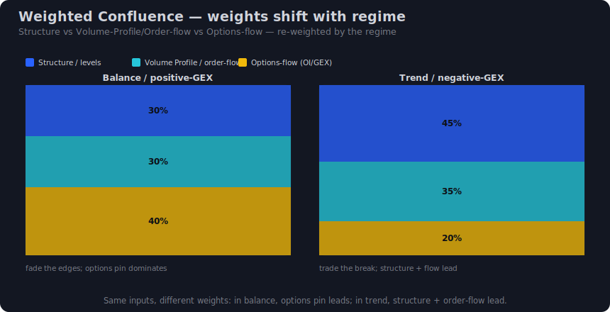
*Base confluence weights (Structure 35 / Effort 30 / Options 35) and how they re-balance by regime. The weights are not fixed dials — the regime turns them.*

**How the weights shift by regime.** This is the part beginners miss. The same signal is worth more or less depending on the day:

| Regime | Up-weight | Down-weight | Why |
|---|---|---|---|
| **Expiry afternoon (weekly)** | **Options → ~50%** (OI walls, max-pain, GEX) | Structure breaks | Gamma is enormous; pinning / max-pain pull dominates; a 5m close-beyond means little against an OI wall (repo: options-flow-india.md §5). |
| **Event day** (Budget / RBI / results) | Effort (VPA climax, footprint) + IV context | OI change (laggy, hedge-distorted) | India VIX spikes; IV-crush risk; read the *reaction after* the spike, not the OI. |
| **Trend day** (negative GEX, thin profile) | Structure (BOS) + Effort (CVD, stacked imbalance) | Mean-reversion / PCR | "Do not fade"; momentum is the edge; OI-wall *resistance* is unreliable when dealers hedge with the move. |
| **Balance day** (positive GEX, D-profile) | Options (walls = the range) + VP value edges | Breakout structure | Edges hold; the walls ARE the range; breakouts fail. |
| **First 15 min / lunch chop** | Nothing — *raise the bar on everything* | All | Low-vol feel-out trap candles; breaks are "disproportionately fake." |

> [!warning] The VETO rule — more important than the vote
> Some witnesses are not additive; they are **vetoing**. A **CVD divergence**, **footprint absorption**, or an **OI re-defense** sitting *against* your trade overrides a high confluence count no matter how many boxes ticked. The engine fires only when **the weighted vote clears threshold AND no veto is active.** Absorption against you is "my favourite reversal signal" (Trader Dale) — when it appears on the wrong side, you do not trade, even at 8-of-10.

**Worked scoring example — LONG breakout (trend day).** Regime: negative-GEX trend day, so weights shift to **Structure ~40 / Effort ~35 / Options ~25**.

| Witness | Bucket | Read | Contribution |
|---|---|---|---|
| Wide-body close above IB high | Structure | Confirms (acceptance) | +0.40 |
| Rising CVD + 3 stacked ask imbalances | Effort | Confirms (initiative) | +0.35 |
| Call-wall OI *dropping*, fresh OI next strike | Options (OI) | Confirms (migration) | +0.18 |
| GEX negative, no pin overhead | Options (GEX) | Confirms | +0.07 |
| **Active veto?** | — | None | — |
| **Weighted score** | | | **1.00 → FIRE** (clears ~0.55 threshold, no veto) |

**Worked scoring example — SHORT fakeout reversal (balance day).** Regime: positive-GEX balance day near max-pain, spot poked *above* the call wall. Weights shift to **Options ~45 / Effort ~30 / Structure ~25**.

| Witness | Bucket | Read | Contribution |
|---|---|---|---|
| Sweep above call wall, close back inside | Structure | Confirms (sweep-and-reverse) | +0.25 |
| **CVD divergence** (new high, delta lower) | Effort | Confirms — *and is a veto-grade tell* | +0.30 |
| Call-wall OI *holding / rising* (re-defense) | Options (OI) | Confirms (writers defend) | +0.30 |
| Positive GEX, spot above max-pain | Options (GEX/pin) | Confirms (pull back to pain) | +0.15 |
| **Active veto against the short?** | — | None (CVD divergence is *for* the short) | — |
| **Weighted score** | | | **1.00 → FIRE** (short PE; target max-pain) |

> [!tip] How to use the weights without a spreadsheet
> You will not compute decimals live. Internalise the *shape*: on a trend day, trust your structure and your order flow and discount the PCR; on expiry afternoon, the OI walls and max-pain outvote your pretty 5m close; on any day, if CVD diverges or absorption prints *against* you, the trade is off regardless of how good it looks. The numbers are a teaching scaffold; the instinct they build is the deliverable.

---

## 4. How this engine routes into the deep-dive guides

This guide is the **umbrella**. Its job is to decide *which play applies* — and then route you to the correct mechanics. It does not re-teach breakouts or fakeouts in full; those have dedicated deep-dives. It *does* fully specify reversal, pullback, and continuation, because nothing else does.

> [!note] The umbrella ↔ deep-dive relationship
> - The engine **selects the play** (via regime → level → HOLD/BREAK/WAIT).
> - For **breakout** and **fakeout reversal**, the full mechanics — entries, invalidations, retest rules, worked setups — live in `[[Breakout Trading/note|Breakout Trading]]` and `[[Fakeout Reversal Trading/note|Fakeout Reversal Trading]]`.
> - For **reversal, pullback, and continuation**, the full mechanics live in *this* guide: the §17–24 decision tree (how each is triggered) and the §37 play cards (context gate · entry · SL · target · options note).
> - The **options layer** (§31–36) and the **governance rules** (§38) apply to *all five* plays equally — they sit below the play selection, not inside any one play.

Think of it as a switchboard. You arrive at a level, the engine reads the reaction, and it routes you down one of five wires. Two wires lead out to sibling notes; three stay home. Either way, once the play is named, the *bottom* of the engine — strike, delta-based stop, budget gate, targets, sizing, timing, mid-trade exit — is identical.

**How to read this seven-part guide.** The parts mirror the spine top to bottom:

| Part | Sections | What it gives you |
|---|---|---|
| **0 — Header** | TL;DR, how-to-read | The spine in one breath + the master flowchart. |
| **1 — Engine overview** *(this part)* | §1–4 | The one-decision spine · the five plays · weighted confluence · routing to the deep-dives. |
| **2 — Level & open** | §5–12 | HTF level mapping · the declutter filter · pre-market checklist · news/event + expiry filter · the open read (gap up/down/flat) + IB. |
| **3 — Regime** | §13–16 | Balance vs trend · GEX · IV / PCR / max-pain — deciding **fade vs break before the level**. |
| **4 — Decision tree** | §17–24 | **The core.** Reaction read → HOLD/BREAK/WAIT → the five plays · the hammer-sweep continue-vs-reverse fork · when to WAIT. |
| **5 — LTF entries** | §25–30 | Not-early-not-late entry · which LTF lens when · footprint deep-dive · FVG mastery + failure modes. |
| **6 — Options layer** | §31–36 | Strike · SL via delta + via ATR · per-instrument stop-budget gate · targets + RR · sizing · theta/IV timing · mid-trade exit. |
| **7 — Playbook & path** | §37–39 | Per-play cards · daily-loss governor · learning path · backtest spec. |

> [!tip] Reading order for a first pass vs daily use
> *First pass (learn the engine):* read straight through, Part 1 → 7. The spine only makes sense top-down. *Daily use (already fluent):* you live in Part 3 (regime, pre-open), Part 4 (the at-level decision), and Part 6 (the options conversion). Parts 2 and 5 are reference; Part 7 is your weekend review. The deep-dives are opened only when the engine routes you to a breakout or a fakeout.

> [!note] A note on instruments and scale
> **Nifty is the worked example throughout** because its scale is the easiest to reason about. BankNifty, FinNifty, and Sensex run the *identical* spine — only the *numbers* differ. BankNifty moves roughly 2–3× Nifty in points, so its stop budgets and ATR are correspondingly larger; Sensex is BankNifty-scale; FinNifty is Nifty-ish. Every per-instrument figure (lot size, weekly-expiry weekday, point-stop budget) is exchange-set and **must be re-verified on NSE/BSE before trading** — SEBI has revised these repeatedly. Part 6 carries the full per-instrument table.

> [!summary] Part 1 in one line: the engine is ONE decision repeated — regime picks the menu, the level's reaction picks the play (one of five), and the same delta-sized options conversion finishes every trade.

---

## 5. Mapping levels the right way — OB, FVG, swings, PDH/PDL/PDC, liquidity, VP

A level is a price where the market has *already shown its hand* — where institutions transacted, defended, or got trapped. The engine does not trade prices; it trades **reactions at qualified levels**. But before you can grade a level (§6), you have to mark it correctly. This section is the vocabulary: every level type, where it lives on the multi-timeframe (MTF) funnel, and exactly how to draw it.

> [!note] Where each level is born (the MTF rule)
> Levels are **drawn on the 1h and 30m**, refined on the **15m**, and *only triggered* on the **5m**. The 5m never invents a level — "the 5m never invents a level" (repo: research.md §3 / breakout note). If you find yourself drawing support on a 5m chart, you are manufacturing noise. Mark the structure on the higher timeframe, then drop down to time the entry.

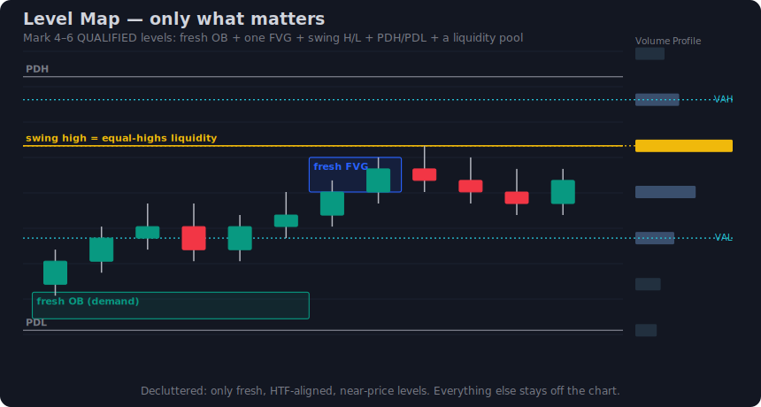
*The seven level families on one Nifty chart — HTF order block and FVG, swing highs/lows, PDH/PDL/PDC, equal-high liquidity pools, and the volume-profile POC/HVN/LVN — each drawn from its native timeframe.*

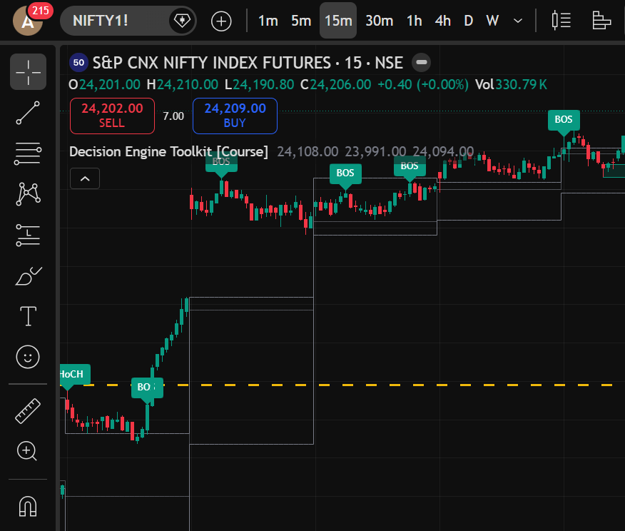
*Live NIFTY1! 15m with the custom **Decision Engine Toolkit** indicator — the same idea on a real chart: only the freshest order block (demand), fair-value gap, and PDH/PDL/PDC are drawn, with BOS/CHoCH structure labels. Decluttered by design — the indicator keeps just the most-recent qualified zone per type, not every swing.*

### 5.1 Order block (OB)

An order block is the **last opposing candle before a strong displacement move** — the last down-candle before a powerful rally (a bullish OB / demand), or the last up-candle before a sharp sell-off (a bearish OB / supply). The logic: that final candle is where the institution loaded its position before pushing price away, so when price returns, *unfilled orders sit there* and price often reacts.

**How to mark it (1h/30m):**
1. Find a strong, one-directional move (a leg that broke structure — a BOS).
2. Identify the *last candle of the opposite colour* at the origin of that leg.
3. Draw a zone from that candle's **open-to-close body** (conservative) or **wick-to-wick** (aggressive); the body version is cleaner for Nifty.
4. The OB is **demand** if below the move (long bias) and **supply** if above (short bias).

> [!tip] OB best-practice
> The strongest OBs are the ones that (a) caused a Break of Structure, (b) left a Fair Value Gap behind them (displacement was violent), and (c) are *unmitigated* (untouched since creation). Those three together are an A-grade demand/supply zone. A mitigated OB — one price has already returned to — drops a grade instantly (§6, Gate 1).

### 5.2 Fair Value Gap (FVG)

A Fair Value Gap is a **3-candle inefficiency**: candle 1's high and candle 3's low (for a bullish FVG) do not overlap, leaving a price window that traded "too fast" to be filled in both directions. It is the footprint of displacement. Markets dislike inefficiency and frequently retrace to *fill* the gap before continuing.

**How to mark it (1h/30m, refine on 15m):**
- **Bullish FVG:** the gap between candle 1's HIGH and candle 3's LOW, when candle 2 is a strong up-candle. Draw the rectangle across those two prices.
- **Bearish FVG:** the gap between candle 1's LOW and candle 3's HIGH, with candle 2 a strong down-candle.

> [!warning] FVGs are regime-dependent — do not over-trust them
> An FVG acts as support/resistance only about **30% of the time** — "in a stable trend with a small opening range"; in balance (~70% of sessions) price trades straight through it (repo: research.md §7 / Vorwald). An FVG "is a misleading name" — it works because it hides a **Low Volume Node** (FFP). So: trust an FVG in a trend, distrust it in balance, and **only trade fresh/untested gaps**. A full-fill FVG that price closes straight back through means the displacement is being reclaimed — the move is failing, not pausing.

### 5.3 Swing highs and lows

A **swing high** is a candle whose high is higher than the candles on either side; a **swing low** is the mirror. They are the skeleton of market structure — the points that define HH/HL (uptrend) or LH/LL (downtrend), and whose breach is a Break of Structure (BOS) or Change of Character (CHoCH).

**How to mark them (1h/15m):** mark the *major* swings only — the pivots that price clearly respected and reversed from. A swing that produced a 100-point Nifty leg matters; a 10-point wiggle does not. Major swings double as **liquidity** (see §5.5): stops cluster just beyond them.

> [!note] Strong vs weak swings (this distinction is the whole game)
> A **strong high/low** is one that *caused a reversal of structure* — it broke the prior swing. A **weak high/low** is one that was simply taken out without consequence. Strong swings are **levels to trade from**; weak swings are **liquidity to be run** — they exist to be swept, not defended (§6, Gate 4). "A low's job is to make a high" (Photon). Mark them differently in your head from the start.

### 5.4 Prior-day high / low / close (PDH / PDL / PDC)

These are the three most-watched horizontal references on any index chart:
- **PDH (prior-day high)** and **PDL (prior-day low)** — major reference levels and **liquidity pools** (yesterday's stops sit just beyond them).
- **PDC (prior-day close)** — the day's settlement reference; gaps are measured from it, and it often acts as a magnet/pivot for the first hour.

**How to mark them:** draw three horizontal lines from yesterday's session H/L/C and carry them into today. They are objective, free, and never need re-drawing intraday. On a gap open, the *relationship of the open to PDH/PDL/PDC* sets the day's character (§9).

### 5.5 Liquidity pools (equal highs / equal lows)

When two or more swing highs print at (almost) the same price, that **equal-high** is a liquidity pool — a shelf where buy-stops from shorts and breakout-buyers cluster. **Equal lows** are the mirror (sell-stops). Smart money engineers price *toward* these pools to fill size, then reverses — the classic **stop-hunt / sweep**.

**How to mark them (15m/1h):** draw a single line connecting the equal highs (or lows). Annotate it as **LIQUIDITY**, not as support/resistance — because its job is to be *taken*, not to hold. This re-labelling is the core of the declutter discipline in §6.

> [!example] Liquidity vs level — the mindset flip
> Beginner sees double-top at 24,550 and thinks "resistance — short it." The engine sees double-top at 24,550 and thinks "buy-side liquidity — price will likely sweep *above* 24,550 to grab stops, *then* I look for a fakeout-reversal short on the close back below." Same two candles, opposite trade. The difference is treating equal highs as **liquidity to be run**, not a wall to lean on.

### 5.6 Volume Profile — POC, HVN, LVN, naked POC

Volume Profile (VP) rotates volume onto the price axis to show *where the most business was done*, regardless of time:
- **POC (Point of Control)** — the single price with the highest traded volume; the session's fairest price and a strong magnet.
- **HVN (High Volume Node)** — a fat shelf of volume; price moves *slowly* through it and tends to rotate/accept there (a level that holds).
- **LVN (Low Volume Node)** — a thin gap of little volume; price moves *fast* through it and rarely stalls (a level price slices, often the body of an FVG).
- **Naked / virgin POC** — a prior session's POC that price has **not yet revisited**; a high-trust magnet — institutional value left untested.
- **VAH / VAL** — the high and low of the value area (≈70% of volume); the edges of "fair value."

**How to mark them:** run a VP on the prior day (and prior week for context). Carry **prior-day VAH, VAL, POC and any naked POCs** forward as horizontal lines. These are the institutional value edges — Trader Dale's "daily business zones."

| Level type | Native TF | What it represents | Default behaviour |
|---|---|---|---|
| Order block | 1h/30m | Last opposing candle before displacement | Reaction zone (demand/supply) |
| FVG | 1h/30m → 15m | 3-candle inefficiency / hidden LVN | Fill-then-continue (trend only) |
| Swing H/L | 1h/15m | Structure pivot | Strong = level, weak = liquidity |
| PDH/PDL | Daily | Yesterday's extremes | Reference + liquidity pool |
| PDC | Daily | Yesterday's settlement | First-hour magnet/pivot |
| Equal highs/lows | 15m/1h | Stop cluster | Liquidity to be SWEPT |
| POC / HVN | Daily VP | Most-traded price / fat shelf | Magnet / acceptance (holds) |
| LVN | Daily VP | Thin shelf | Fast slice (rarely holds) |
| Naked POC | Daily/weekly VP | Untested prior value | High-trust magnet |

---

## 6. Grading a level — the four-gate qualify/drop filter (the declutter rule)

You now know how to draw a dozen kinds of level. **That is the problem, not the solution.** Every framework generates dozens of OBs, FVGs, swings, HVNs, walls, VWAP touches and PDH/PDL lines. A chart with twenty lines on it is a chart you cannot trade — you will always find a "level" to justify any impulse. The engine's real value is the **declutter filter**: a hard test that keeps only the few levels worth trading and *deletes the rest from the chart entirely*.

> [!warning] This is the user's hard rule: do not congest the chart
> **Keep ≤ 4–5 qualifying levels marked at any time. Delete everything else.** "The single biggest source of intraday losses is trading an unqualified level — a stale FVG, a weak high, a 5m-invented support" (repo: research.md §3). If a level fails any one of the four gates below, it is **noise** — remove the drawing so it cannot tempt you.

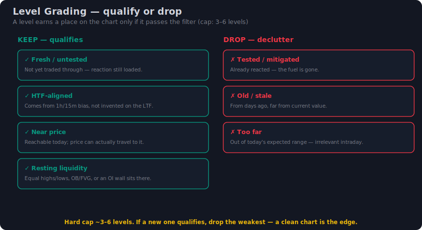
*The four-gate filter as a funnel: dozens of candidate levels enter; only the handful that pass FRESH → HTF-ALIGNED → NEAR/RIGHT-SIDE → CAUSAL survive onto the chart.*

### The four gates (a level must pass ALL four to stay)

**Gate 1 — FRESH / unmitigated.** First-touch only. An unmitigated extreme gives the strongest reaction — "you're only wrong once" (Photon); "first touch only, second tests have much worse win rates" (Trader Dale); "freshness — untested first-touch best" (FFP). **Delete** any OB, FVG or zone that price has already tagged. A second test of an FVG usually breaks (Vorwald).

**Gate 2 — HTF-ALIGNED.** The level must originate on the **1h/15m**, and ideally *stack* with a higher-timeframe zone — "HTF FVG > LTF FVG" (ICT). A 5m-invented level fails this gate by definition. **Delete** anything you drew on the 5m, and **upgrade** any 15m level that sits inside a 1h zone (stacked confluence = strongest).

**Gate 3 — NEAR PRICE & ON THE RIGHT SIDE.** The level must be **within ~1 ATR of current price** (actionable *today*, not a theoretical line 400 points away) AND on the correct side of equilibrium: **demand in discount** (lower half of the range, for longs), **supply in premium** (upper half, for shorts). **Delete** levels deep on the wrong side of the day's range — a demand zone sitting in premium is not a buy, it is a trap.

**Gate 4 — CAUSAL / DEFENDED.** The level must have *done something*. It must have **caused a BOS** (Photon's #1 criterion), shown a **strong single rejection** (Trader Dale's "strong high/low"), carry **real volume** (an HVN, not a thin print), or be an **OI wall** (§7, §8). A line that price merely floated past defends nothing. **Delete "weak highs/lows" as levels** — they are *liquidity to be run*, not levels to trade from. This gate is the one beginners skip, and it is the most important.

> [!example] Grading five candidates on a Nifty open (worked)
> Pre-open you have marked, from the 1h/15m: (a) a 1h bullish OB at 24,180; (b) a 15m FVG at 24,320 already tagged yesterday; (c) PDH at 24,560; (d) a 5m "support" you noticed at 24,410; (e) an HVN + naked POC at 24,250.
>
> | Candidate | G1 Fresh | G2 HTF | G3 Near/Side | G4 Causal | Verdict |
> |---|---|---|---|---|---|
> | (a) 1h OB 24,180 | ✅ | ✅ 1h | ✅ discount | ✅ caused BOS | **KEEP** |
> | (b) 15m FVG 24,320 | ❌ tagged | ✅ | — | — | **DELETE** (mitigated) |
> | (c) PDH 24,560 | ✅ | ✅ daily | ✅ | ✅ liquidity pool | **KEEP** (as liquidity) |
> | (d) 5m support 24,410 | ? | ❌ 5m-invented | ? | ❌ | **DELETE** (noise) |
> | (e) HVN + naked POC 24,250 | ✅ | ✅ | ✅ | ✅ real volume | **KEEP** |
>
> Result: three clean levels (24,180 demand, 24,250 magnet, 24,560 liquidity). The chart is readable; every survivor has a *reason*.

> [!tip] The weak-high/weak-low test (memorise this)
> Before you draw any high or low as a level, ask: **"Did this break structure when it formed?"** If yes → it is a strong level; trade *from* it. If no → it is a weak swing = **liquidity to be run**; do not lean on it, *expect it to be swept*, and look to trade the reaction to the sweep instead. Mislabelling a weak low as "support" and longing it is the single most common beginner loss.

> [!note] Scale note (BankNifty / FinNifty / Sensex)
> The four gates are scale-free, but **Gate 3's "~1 ATR" window scales with the instrument**. BankNifty moves ~2–3× Nifty in points, so its "near price" band is correspondingly wider (e.g., ~150–300 pts vs Nifty's ~40–80 pts); Sensex ≈ BankNifty scale; FinNifty ≈ Nifty-ish. Calibrate the window to *live ATR*, not a fixed number (verify current ATR on chart).

---

## 7. The pre-market checklist

Everything in §5–6 happens **before the bell**, as a repeatable routine. Run this table every morning (Vorwald's 13-step prep, compressed). The output is a one-page picture that feeds the regime read and the decision tree.

| # | Checklist item | What to capture | Where it feeds |
|---|---|---|---|
| 1 | **HTF bias** (1h/30m) | Trend up / down / balance; current structure (HH-HL vs LH-LL vs rotation) | Regime menu (§13) |
| 2 | **Qualified levels** (the ≤5) | Surviving OB/FVG/HVN/PDH/PDL/naked-POC after the four gates (§6) | Where to act |
| 3 | **Regime inputs** | GEX sign (pos/neg), distance to max-pain, PCR, IV rank / India VIX | Fade-vs-break decision |
| 4 | **Key OI walls** | Highest call-OI strike (ceiling) + highest put-OI strike (floor) → the implied range | Top-trust levels + targets |
| 5 | **VWAP plan** | Note that VWAP + 1st deviation band will be a live magnet/level intraday | LTF entry context |
| 6 | **Events today** | RBI/Fed/CPI/Budget/major results + time; India VIX level | Go/no-go filter (§8) |
| 7 | **Expiry?** | Is today weekly expiry for this index? (Nifty **Tue**, Sensex **Thu** — verify on NSE/BSE) | Weights + pinning bias |
| 8 | **Gap read** | Open vs PDC/PDH/PDL/VAH/VAL → gap-up / gap-down / flat (§9) | Day character |
| 9 | **Per-trade plan** | Risk %, daily loss limit, max trades, instrument(s) | Governance caps |

> [!tip] One-sentence pre-open summary
> Compress the whole table into a single sentence you can say out loud — e.g. *"1h balance, three clean levels (24,180 demand / 24,250 naked-POC magnet / 24,560 liquidity), positive-GEX, spot 50 pts above max-pain into Tuesday expiry, no events, flat open — so I'm hunting fades toward max-pain, green-light buying since IV rank is low."* If you cannot say it in one breath, you are not ready to trade.

---

## 8. The news / event / expiry filter — the pre-open go/no-go gate

Some conditions do not just *downgrade* a trade — they **forbid** it. This filter runs once, pre-open, and again whenever an event clock approaches. It answers a binary question: **trade / wait / stand aside.**

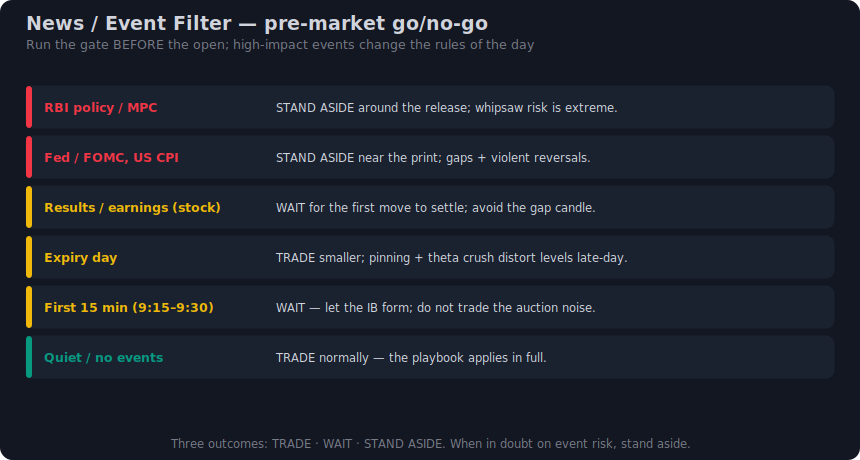
*The go/no-go gate: high-impact print, overnight shock, expiry afternoon, and the first ~15-minute window each route to WAIT or STAND-ASIDE before any setup is considered.*

### 8.1 The hard filters (these forbid, not downgrade)

> [!warning] Do not initiate into a high-impact print
> Mark the day's high-impact prints — **RBI policy, CPI/GDP, Union Budget, US Fed/FOMC, major index-heavyweight results.** Do **not** initiate a day-trade into one. Let the spike happen, *then* read the reaction (Vorwald step 1; Trader Dale: "pull limit orders before FOMC"). India VIX rising into an event means **rich premium + IV-crush risk afterward** — a correct-direction option buyer can still lose as IV collapses post-event. Stand aside; trade the reaction, not the anticipation.

- **Overnight shock / large gap:** "any big overnight gap → often best to do nothing" (Vorwald step 2). An outsized gap means the overnight session already moved the range; your levels may be stale and the open is a coin-flip. Default to **wait** until the IB defines a fresh range.

### 8.2 The expiry filter (the most important India filter)

> [!warning] Verify the current weekly-expiry weekday on NSE/BSE
> After the **September-2025 SEBI reshuffle**, weekly-expiry weekdays moved: **NSE Nifty weekly now expires Tuesday**; **BSE Sensex weekly now expires Thursday** (previously both Thursday). **BankNifty and FinNifty WEEKLY options were discontinued — they are monthly-only now** (under SEBI's one-weekly-per-exchange rule). Indicative lot sizes: **Nifty 65, BankNifty 30, Sensex 20.** *Every one of these is exchange-set and keeps changing — re-verify on NSE/BSE before sizing any trade.*

On **weekly-expiry afternoon**, the options bucket dominates the witness vote (its weight rises toward ~50%) and the base case is **pinning toward max-pain**, not directional expansion. Gamma is enormous; a 5m close beyond a level means little against an OI wall. Practical consequence: **directional option *buying* after ~2:30 pm IST on expiry is low-EV** — theta + pinning fight you. On expiry afternoon, prefer the **fakeout-reversal-toward-max-pain** play (sell into a failed move away from max-pain), or stand aside.

### 8.3 The wild first ~15-minute window

> [!warning] Raise the bar in the first 15 minutes
> The opening auction (≈9:15–9:30 IST) is full of **low-volume "feel-out" trap candles** — breaks here are "disproportionately fake" (repo: research.md §2 / Coulling, breakout note). In this window, **down-weight everything and raise your fire threshold**. Either wait for the first 15m candle to close, or wait for the Initial Balance to begin defining a range (§10). The exception is a genuine **open-drive** (a one-way gap-and-go on real volume) — that *is* tradeable as a trend signal, but it is rare; the default first-15 stance is **wait**.

| Condition | Verdict | Why |
|---|---|---|
| RBI/Fed/CPI/Budget/results today, before the print | **Stand aside** | IV-crush + spike risk; trade the reaction after |
| Large overnight gap / shock | **Wait** | Stale levels; coin-flip open |
| Weekly expiry afternoon (post ~2:30 IST) | **Wait / fade-only** | Pinning to max-pain; theta guts long premium |
| First ~15 min (no open-drive) | **Wait** | Trap candles; fake breaks |
| Genuine open-drive on volume | **Trade (trend)** | Real one-way conviction |
| Clean session, no event, IB forming | **Trade** | Normal engine applies |

---

## 9. The open read — gap-up, gap-down, flat

The open *type* sets the day's character and tells you how price is likely to travel toward your qualified levels. Read it against the references you carried forward (PDC/PDH/PDL/VAH/VAL).

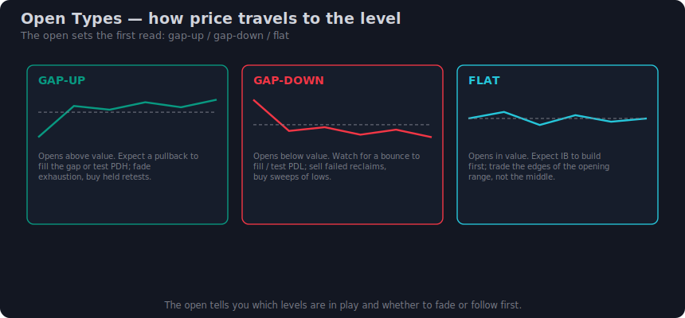
*Three open archetypes against prior value — gap-up into premium (fade-risk), gap-down into discount (spring candidate), and flat inside value (rotation/IB day) — with the typical travel path to the nearest qualified level in each.*

### 9.1 Gap UP (open above PDH / VAH / call wall — a premium open)

Fade-risk is **high**: price has opened into supply / premium. Two paths fork immediately:
- **Open-drive that *accepts*** (wide bodies, builds new value above the gap, holds the open) → real bullish day → look for **pullback/continuation longs**, never fade.
- **Gap-fill rejection** (price stalls at the premium level, rolls back toward prior value) → a gap that fills back into prior value is **bearish acceptance** → a **fakeout-reversal short** candidate. The classic short: gap-up taps PDH/call-wall, sweeps the stops above, closes back below on the 5m → short toward VWAP/POC/PDC.

### 9.2 Gap DOWN (open below PDL / VAL / put wall — a discount open)

The mirror. Price opens into demand / discount:
- **Open-drive that accepts lower** → real bearish day → **pullback/continuation shorts**, never fade.
- **Spring / gap-fill bounce** → price taps PDL/put-wall, sweeps sell-side liquidity, closes back above on the 5m → **fakeout-reversal long** toward VWAP/POC/PDC. (Watch the regime: a spring works in positive-GEX/balance; in a negative-GEX trend day the same hammer may just be a pullback that *continues* down — regime is the tiebreaker.)

### 9.3 FLAT open (open inside prior value, near PDC)

Balance bias by default: expect **rotation** and an **IB-range day**. Favour **edge-fades** — sell the top of the developing range back to POC/VWAP, buy the bottom — *until the IB breaks on real effort*. Do not pre-commit to a direction; let the auction reveal itself.

| Open type | Where vs prior value | Default bias | Primary play if it accepts | Primary play if it rejects |
|---|---|---|---|---|
| Gap UP | Above PDH/VAH (premium) | Bullish, fade-risk | Pullback/continuation long | Fakeout-reversal short (gap-fill) |
| Gap DOWN | Below PDL/VAL (discount) | Bearish, fade-risk | Pullback/continuation short | Spring / fakeout-reversal long |
| Flat | Inside value, ≈PDC | Balance / rotation | (IB break) breakout | Edge-fade to POC/VWAP |

---

## 10. Initial Balance and how price travels to the level

The **Initial Balance (IB)** is the high and low of the **first hour** (9:15–10:15 IST). Its width relative to the **Average Daily Range (ADR)** is the single best *early* day-type tell.

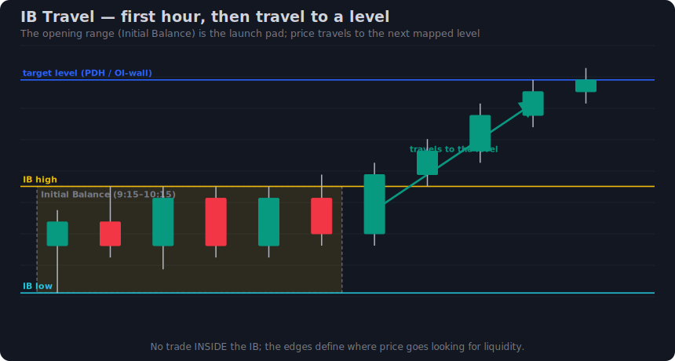
*Initial Balance high/low (first hour) and the two travel paths to a qualified level — acceptance (value migrating with the move) versus rejection (sweep-and-reverse back inside the IB).*


*Animation: the first hour carves the IB; price then probes the level, and the day resolves into either an IB-extension trend leg or a rotation back to the opposite IB edge.*

- **Narrow IB (< ~30–40% of ADR)** → coiled, energy stored → **breakout-prone day**. The eventual IB break tends to extend. Favour breakout/continuation once it breaks on effort.
- **Wide IB (large fraction of ADR)** → the day's range may already be largely spent → **rotation/fade day**. Favour edge-fades; distrust late breakouts.

The IB high/low are simultaneously the day's **primary breakout levels** AND the **engineered liquidity pool** (equal-high/low where stops sit) — which is why the first break of the IB is so often a *sweep* first.

### Acceptance vs rejection on the way to the level

As price travels toward one of your qualified levels, watch *how* it arrives:
- **Acceptance** = wide-bodied conviction candles, **new value building** beyond prior value, the move *sustains*. Acceptance into/through a level argues **BREAK** (breakout/continuation).
- **Rejection** = a wick beyond the level, **close back inside**, value *fails to build*, volume dries up. Rejection at a level argues **HOLD** (fade/reversal).

> [!note] IB and the level work together
> A narrow IB + acceptance through the IB high into a qualified supply zone is a coherent breakout-then-test story. A wide IB + rejection at the same supply is a coherent fade story. The IB tells you the day's *energy*; the level tells you *where*; acceptance-vs-rejection tells you *which verdict*.

---

## 11. First-hour behaviour and what it tells you

Beyond IB width, the *shape* of the first hour classifies the day (Dalton's open types):

- **Open-drive** — price opens and runs one direction with no rotation, gapping and going on real volume. The strongest signal: a **trend-day signature**, thin profile forming. Implication: **do not fade**; trade pullback/continuation with the drive. The conviction is set in the first minutes and rarely reverses.
- **Open-auction (two-sided)** — price rotates around the open, probing both sides, no commitment. The **balance-day signature**: a D-shaped profile builds, edges hold. Implication: **fade the edges** back to POC/VWAP; distrust breaks until the IB clearly resolves on effort.
- **Open-test-drive** — price first tests one side (a sweep/probe), *rejects*, then drives the *other* way. A common reversal-day opener: the initial probe is a liquidity grab. Implication: trade *with* the drive after the failed test (a fakeout-reversal at the open).

| First-hour shape | Day type implied | Default stance |
|---|---|---|
| Open-drive | Trend day | With the move (pullback/continuation), never fade |
| Open-auction (two-sided) | Balance day | Fade edges to POC/VWAP |
| Open-test-drive | Reversal day | With the drive after the failed test |

> [!tip] First hour = regime evidence, not a trade
> The first hour rarely gives an A+ entry by itself — its job is to **confirm or revise the pre-open regime label**. If you pencilled "balance day" pre-open and you get a clean open-drive, *update the menu* to trend plays before you trade. Reading acceptance over your bias is the discipline (Vorwald: "read acceptance, not your bias").

---

## 12. Putting the pre-open picture together

Everything in §5–11 collapses into **one pre-open output** — the line that feeds the regime read (covered in §13) and ultimately the decision tree (§17).

The assembly order:
1. **Bias** (1h/30m structure) — up / down / balance.
2. **Levels** — the ≤5 survivors of the four-gate filter (§6), each tagged demand / supply / magnet / liquidity.
3. **Regime inputs** — GEX sign, max-pain distance, PCR, IV rank (these resolve fade-vs-break).
4. **Event/expiry gate** (§8) — trade / wait / stand-aside, plus expiry-day pinning bias.
5. **Open + IB read** (§9–11) — gap type, IB width, first-hour shape → day character, confirmed or revised.

> [!summary] The single pre-open sentence (the deliverable)
> Fuse the five into one statement, e.g.: *"1h balance, positive-GEX, low IV-rank, spot 50 pts above max-pain into Tuesday Nifty expiry, no events; flat open with a narrow IB and a two-sided auction → balance day → I hunt **fades** at my three clean levels (24,180 demand / 24,250 naked-POC magnet / 24,560 liquidity), targeting max-pain, green-lit to **buy** options on cheap IV — but I stand aside on directional buying after 2:30 pm."* That one sentence has already eliminated three of the five plays before price reaches a level — which is exactly what feeds §13's regime read and §17's decision tree.

> [!summary] Part 2 in one line: mark every level type from its native timeframe, keep only the ≤5 that pass the four-gate declutter filter, run the news/event/expiry go/no-go gate, then read the gap + IB + first hour into a single pre-open sentence that pre-selects the playable plays.

---

## 13. Will it be sideways, volatile, or trend? — reading the day's character

This is the question that decides everything that follows: *"How do I know — before I commit a single trade — whether today will chop sideways, whip around violently, or pick a direction and run?"* You can never know with certainty. But you do not need certainty; you need a **lean**, read from a handful of **observable tells** that are visible by ~10:15 IST (the close of the first hour) and refined all day. The whole point of this section is that the day broadcasts its character early, and that character (the *regime*) tells you which kind of trade is even allowed today — long before price reaches any of your levels (repo: research.md §5 / Dalton / Vorwald).

Three day-characters, and the trade each one rewards:

| Character | What it looks like | What it rewards | What it punishes |
|---|---|---|---|
| **Sideways / balance** (~65–70% of days) | Rotation inside a range; price returns to the middle (POC/VWAP); D-shaped profile | **Fading the edges** back toward value | Chasing breakouts of the range |
| **Trend / expansion** (~30% of days) | One-way drive, shallow pullbacks, price *leaves* and does not return; thin / P- or b-shaped profile | **Pullbacks & continuation** with the trend | Fading; "picking the top/bottom" |
| **Volatile / two-way** (event-driven) | Large bars *both* directions, gaps, fast reversals; high India VIX | **Patience** — let the spike resolve, then read the reaction | Pre-positioning into the print |

> [!tip] The order in which the day reveals itself
> A surprising number of trend days *open* looking like balance (a tight first 30 minutes), then **expand** out of a narrow Initial Balance once one side commits. So "sideways and then trend" is not a contradiction — it is the single most common Nifty intraday sequence: **coil → resolve**. The tells below tell you *which way the coil is loaded* and *when it is releasing*.

**The five observable tells (read in this order):**

1. **Open type.** *How* the day opens is the first and strongest tell (covered in §11–12; recapped here as a regime input). An **open-drive** (gap-and-go, no rotation, price never trades back through the open) is a **trend-day signature** — favour pullback/continuation, never fade. A **flat open inside prior value** with immediate two-sided rotation is a **balance signature** — favour edge-fades until proven otherwise. A **gap into a known barrier** (prior-day VAH / call wall / PDH) that *fills back* is an early **fade/reversal** tell (Dalton; repo: research.md §4).

2. **Initial Balance (IB) width.** The first hour's high-to-low range (9:15–10:15 IST), measured **as a fraction of the average daily range (ADR)**, is the best early day-type meter. A **narrow IB** (roughly **<30–40% of ADR** — *verify your own instrument's typical band*) = coiled energy, **breakout-prone**, expect expansion. A **wide IB** = the day may have *already spent* much of its range in the first hour → favours rotation/fade for the rest of the session (repo: research.md §4 / breakout note §14–15 / Dalton).

3. **Value migration.** Watch whether *value* (the bulk of the volume / the developing POC) **stays put** or **migrates** as the day unfolds. Value building higher hour-on-hour = a real trend forming; value rotating around a fixed centre = balance. A **failed auction, poor high or poor low** (an extreme made on no follow-through and quickly rejected) is balance *trying and failing to extend* — a high-quality fade tell (Dalton).

4. **VIX / IV level.** A **rising India VIX into the open** (especially before an event) signals a **volatile / two-way** regime and rich, IV-crush-prone premium — the day to wait for the spike, not anticipate it. A **low, flat VIX** supports a quiet balance grind. (Mechanics in §15.3.)

5. **GEX sign.** The dealer-gamma sign (§15.1) is the single most useful *structural* tell of whether moves will be **suppressed** (positive GEX → pinning, mean-reversion, breakouts fail) or **amplified** (negative GEX → trends, breakouts work). Read it pre-open from a published Nifty/BankNifty GEX source and re-check at the gamma-flip level.

> [!example] Nifty — a "sideways-then-trend" morning, read live
> Nifty opens **flat inside yesterday's value**, rotates twice between 24,480 and 24,540 → *balance lean, narrow IB forming*. By 10:15 the IB is only ~35% of ADR (narrow → **coiled, breakout-prone**). GEX is **mildly negative** above 24,560. PCR is neutral. The read is: *"Balance now, but loaded to expand; if 24,540 breaks on effort, this flips to a trend day — do not fade that break."* At 10:40 a wide-bodied 5m close prints above 24,540 with rising delta → the coil resolves up; the correct play switches from *fade-the-edge* to *pullback/continuation*. **The regime read did not predict the direction — it told you which trade to be ready for in each case.**
>
> *(BankNifty / FinNifty / Sensex: identical logic, larger point scales — a "narrow" BankNifty IB is still hundreds of points; calibrate the IB-vs-ADR fraction per instrument, not the absolute width.)*

---

## 14. Balance vs trend — the phase filter

Strip away every indicator and one binary remains: **the market is either in balance or in trend.** This is Auction Market Theory's core (Dalton, *Mind Over Markets*), echoed by Vorwald ("context beats setups") and Trader Dale ("the #1 structural mistake is using a trend strategy in a rotation, or vice-versa"). It is the **phase filter** — the first gate every other read passes through (repo: research.md §5.1).

The empirical split most channels converge on: markets are in **balance roughly 65–70%** of the time and in **trend roughly 30%**. That asymmetry has a blunt practical consequence — **your default lean should be fade/mean-reversion**, and you should demand *more* evidence before betting on a trend, because trend days are the minority. (This also explains why naive breakout trading bleeds: it bets on the 30% case every day.)

| | **BALANCE (~70%)** | **TREND (~30%)** |
|---|---|---|
| **Definition** | Two-sided auction around fair value; price keeps returning | One-sided auction; price *leaves* value and accepts away from it |
| **Profile shape** | **D-shape** (fat middle, balanced tails) | **P / b-shape** (directional) or **thin** (trend day) |
| **What price does** | Rotates between edges; mean-reverts to POC / VWAP | Trends; shallow pullbacks that hold; new value builds in the direction |
| **Live tells** | Edges hold; failed auctions / poor highs-lows; overlapping value day-on-day; VWAP flat & price oscillating across it | BOS / displacement; value migrating; price stays one side of VWAP; pullbacks to VWAP *hold* and resume |
| **What it PERMITS** | **Fade edges**, reversals, **range-pullbacks** back to the middle | **Pullback / mitigation** and **continuation** *with* the trend |
| **What it FORBIDS** | Chasing breakouts of the range | **Fading** — "do not pick the top/bottom of a trend" |

**How to detect each, live:**

- **Detecting balance:** value areas *overlap* day-to-day; the developing profile is **D-shaped**; price crosses VWAP repeatedly and snaps back; the edges (range high/low, OI walls, prior-day VAH/VAL) **reject** price on each test. A **failed auction / poor high / poor low** — an extreme made and instantly rejected with no follow-through — is the textbook "balance is holding" stamp (Dalton).
- **Detecting trend:** an early **BOS / displacement** (a wide-bodied close beyond a prior swing leaving a gap/FVG); **value migrating** in one direction hour-on-hour; price holding **one side of VWAP**; the *first pullback to VWAP or a fresh zone holds and resumes* rather than rolling over. Vorwald's high-probability trend entry is the **second test / first pullback** in an established trend, not the breakout itself.

> [!warning] The cardinal phase error
> Using a **trend tactic in a balance day** (chasing a breakout that fails back to POC) or a **fade tactic in a trend day** (shorting a "high" that keeps making higher highs) is, per every source in the research, the **single biggest structural loss-maker** (repo: research.md §1, §5.1). The phase filter exists precisely to stop you. Decide balance-vs-trend *first*; only then ask which level and which play.

> [!note] Phase is not permanent — it flips intraday
> A balance morning can **break into trend** (the coil resolves, §13) and a trend can **exhaust into balance** (a climax, then rotation). The two events that flip the phase are: (a) a genuine **breakout with acceptance** out of balance → trend, and (b) a **climax / failed auction** at a trend extreme → balance. Re-run the filter whenever either appears; do not assume the morning's phase lasts all day.

---

## 15. The options regime — GEX, IV, PCR, max-pain

The phase filter (§14) reads *price*. The **options regime** reads the *positioning that conditions* price — and it is the India edge that the chart-only frameworks lack. Four sub-reads, in India priority order. The discipline is: **lead with OI, confirm with GEX** — India is an OI-driven market, so OI structure is the high-trust witness and GEX/PCR/max-pain are the confirming overlay (repo: research.md §2, §5.2).

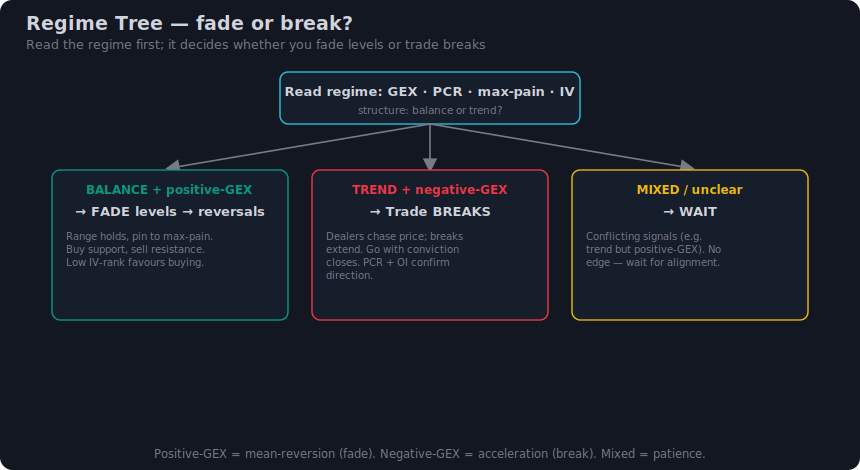
*The regime decision tree: balance/trend phase combined with positive/negative GEX, max-pain distance and IV rank collapses to a single output — hunt fades or hunt breaks today.*

**15.1 GEX / dealer gamma — the regime overlay.** Gamma exposure (GEX) tells you which way dealers must hedge, and that *conditions whether moves get suppressed or amplified* (repo: research.md §5.2 / breakout note / FFP §7):

- **Positive GEX (dealers long gamma):** dealers hedge **against** price moves → they sell rallies, buy dips → **suppressed volatility, pinning, mean-reversion; breakouts FAIL.** This **legalises fades and reversals.** The **Call Wall acts as the upside ceiling, the Put Wall as the downside floor**, and spot oscillates between them. The **Peak-GEX strike is a magnet.**
- **Negative GEX (dealers short gamma):** dealers hedge **with** price moves → they sell into falls, buy into rallies → **amplified volatility, trends; breakouts WORK; do NOT fade.** This **legalises breakouts, pullbacks and continuation.**
- **The gamma-flip / zero-gamma level is the regime switch** — above it you are typically in the positive-GEX (pinning) world, below it the negative-GEX (acceleration) world (levels differ per instrument and per session; read them from a published source and *verify live*).

> [!warning] India GEX caveat — weaker causality than the US
> The "short gamma → trend" mechanism is **weaker in India** than in the US, because much of the open interest is **retail/prop, not dealer-hedged** (repo: research.md §5.2). So read India GEX as *"where are the pinning vs acceleration magnets?"* and **never** as a standalone trigger. Lead with the OI walls (which you trust); use the GEX sign as a confirming overlay. *Verify any published gamma-flip level against live price action before relying on it.*

**15.2 PCR — the sentiment lean (OI-based Put/Call Ratio).** A coarse but useful lean, *contrarian at extremes*:

| PCR (OI) | Reading | Lean |
|---|---|---|
| **> 1.3–1.5** | Heavy **put writing** → writers expect support to hold | **Bullish** (support beneath) |
| **0.7–1.3** | Mid-range | **Noise** — ignore |
| **< 0.7** | Heavy **call writing** → writers expect a ceiling | **Bearish** (capped above) |

Extremes are **contrarian** — an unusually high PCR can mark crowded complacency. Treat PCR as a tie-breaker, never a primary signal (repo: research.md §5.4).

**15.3 IV / India VIX — the go/no-go for *buying* options.** This is the most important **vehicle** filter (it gates whether you should buy a CE/PE at all). The rule is **relative, not absolute**: compare current IV to *its own recent distribution* via **IV Rank / IV Percentile** (Sinclair's volatility cone), not to a fixed number (repo: research.md §5.3):

- **Low IV rank (cheap premium):** **green light to BUY** options — you win from delta *and* from a likely IV rise on the move.
- **High IV rank (rich premium):** **amber/red for buying** — IV-crush will fight you; the move must be large and fast to overcome it. Favour spreads or trade the future instead. A rising **India VIX into an event** is this regime.
- Volatility **mean-reverts and clusters** — a high IV-rank reading is itself a *warning that IV will likely fall*, hurting a long-option holder even on a correct directional call (Sinclair).

**15.4 Max-pain — the expiry magnet.** Into **weekly expiry**, price tends to **gravitate toward the max-pain strike** (where option writers profit most / buyers lose most), *strongest when max-pain aligns with the OI walls* (repo: research.md §5.5). On **expiry afternoon** this makes the session a **range/reversion day by default**: moves *away* from max-pain that fail to migrate OI are **fade candidates**, and **max-pain becomes the reversal TARGET**. *Verify the current weekly-expiry weekday and the live max-pain strike on NSE/BSE before relying on it — SEBI reshuffled expiry weekdays (Nifty Tue / Sensex Thu as of mid-2026) and they keep changing.*

> [!summary] The one-sentence regime label
> Compress all four sub-reads into **one sentence** you write before the first trade — e.g.: *"Positive-GEX balance day, mid PCR, low IV-rank, spot 60 pts above max-pain into Tuesday expiry."* That single label pre-selects the play menu, names the target (max-pain), and green-lights (or vetoes) option buying. Writing it forces the read; skipping it is how traders end up fading a trend.

---

## 16. Fade vs break — deciding before the level is touched

Here is the engine's biggest payoff, and the **key finding of this whole guide**:

> [!warning] The punchline — the regime read eliminates 3 of the 5 plays BEFORE the level is touched
> You almost never choose among all five plays at a level. The regime (§13–15) has *already* deleted three of them before price arrives:
> - A **positive-GEX / near-max-pain / balance** session legalises **only** `{fakeout-reversal, reversal, range-pullback}` — the fade family.
> - A **negative-GEX / trend** session legalises **only** `{breakout, pullback, continuation}` — the break family.
>
> So the at-level read (§17+) is not "which of five?" — it is "which of the **two or three** the regime already permits, and does the reaction confirm it?" **Read the regime first, and most of the decision is already made.**

This is *why* the regime is read **before** price reaches any level. The level only tells you *where* the decision happens; the regime tells you *which way you are even allowed to bet there*. The same hammer-after-a-sweep means **reverse up** in a positive-GEX balance day and **continue down** (a pullback to resume the trend) in a negative-GEX trend day — the regime is the tiebreaker (covered fully in §18; flagged here because it is the cleanest proof that regime, not the candle, decides the play).

**The fade-vs-break decision table — applied *before* the touch:**

| Regime ingredient | Reading | Legal play menu (the only plays allowed) | Forbidden |
|---|---|---|---|
| **Positive GEX + balance + near max-pain** | Pinning / mean-reversion; edges hold | **Fade** family → `fakeout-reversal · reversal · range-pullback`; target = POC / VWAP / **max-pain** | Breakout, continuation |
| **Negative GEX + trend** | Acceleration; breakouts work | **Break** family → `breakout · pullback · continuation`; target = next wall / measured-move / trail | Fading the trend |
| **Mixed / gamma-flip straddled** | Ambiguous; phase about to flip | **Raise the bar** — wait for the coil to resolve (§13); fade *or* break only on acceptance | Pre-committing either way |
| **Event day / high IV rank** | Two-way, IV-crush risk | **Wait for the spike**, then read the reaction; option-*buying* throttled | Anticipating the print; far-OTM lottery buys |
| **Expiry afternoon (post-~2:30pm IST)** | Theta + pinning dominate | **Fade toward max-pain**; directional *buying* suspect | Directional long-premium breakout buys |

> [!example] Both directions, decided before the level
> **Bullish (fade family).** Regime label: *"Positive-GEX balance, low IV-rank, spot 50 pts below max-pain, mid PCR."* Nifty drifts down into a fresh demand zone at the put wall = prior-day VAL confluence. Because the regime legalises **only fades/reversals**, you arrive *pre-committed to a long-the-bounce* read — you are watching for a sweep+reject / hammer / CVD divergence to fire a **reversal up toward max-pain**, and you will *not* short a break of that floor even if it pokes through. The break play was deleted before the touch.
>
> **Bearish (break family).** Regime label: *"Negative-GEX trend day, value migrating down, price one side of VWAP."* Nifty pulls back *up* to a fresh supply zone / VWAP. The regime legalises **only break/pullback/continuation**, so you arrive pre-committed to *short the continuation* — watching for the pullback to stall and resume down. You will **not** try to fade this as a "reversal long," because the regime forbade the fade family before price ever reached the zone.
>
> *(BankNifty / FinNifty / Sensex: same menu logic; only the point scales and the live GEX/max-pain levels differ — read each instrument's own regime, never borrow Nifty's.)*

> [!summary] Fade or break is a *regime* decision, not a *level* decision — by the time price touches your level, the regime has already cut your five plays down to two or three, and the at-level reaction only picks the winner from that short list.

With the menu pre-narrowed, the engine is ready for its core: the at-level reaction read that turns the regime's two-or-three legal plays into one fired trade — **HOLD vs BREAK vs WAIT**, the decision tree of §17.

---

## 17. The at-level decision — HOLD vs BREAK vs WAIT

This is the spine of the whole engine. Everything before now — the level map (§5–12) and the regime read (§13–16) — exists only to set the table for *this* moment: **price has arrived at a qualified level, and you must return one of exactly three verdicts.** Get this fork right and the rest of the trade is bookkeeping; get it wrong and no amount of clever option sizing saves you.

The reason the engine collapses to three verdicts (not five plays, not ten setups) is that **the level only ever does one of three things**: it repels price, it gives way, or it does neither cleanly. Fractal Flow Pro states the governing principle plainly — *"the reaction to the level is more important than the level itself"* (Author: FFP §1, repo: research.md §6). You are not trading the line on the chart. You are trading what price *does* at the line.

> [!note] The three verdicts
> - **HOLD** — the level *defends*. Price probes it and gets thrown back inside. → fade / reversal / pullback-bounce. You trade **away** from the level.
> - **BREAK** — the level *gives way*. Price closes through it with conviction and accepts on the other side. → breakout / continuation. You trade **through** the level.
> - **WAIT** — the level is *unresolved*. The make-or-break candle is still forming, the witnesses disagree, the data has not updated. → **no trade.** Inside / unclear = stand aside.

The single most expensive mistake beginners make here is treating WAIT as a fourth signal to *act* on. It is not. WAIT is the absence of a signal. It is the engine telling you the information needed to fire does not yet exist. We return to this in §24, but burn it in now: **WAIT means do nothing, not "find a smaller reason to enter."**

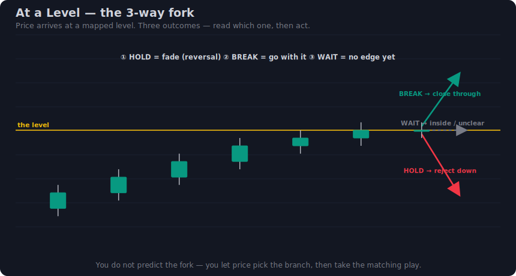
*The central fork: a qualified level produces exactly one of three verdicts — HOLD (reject, fade away), BREAK (accept, go through), or WAIT (inside/unclear, stand aside). The reaction decides, not the level.*


*Animated: price approaches the gold level; the same approach resolves into a reject-wick (HOLD), a conviction body-close-through (BREAK), or a stall-inside (WAIT).*

### Why the regime read comes first

Notice that the fork is asked *after* the regime label is already written (§16). That ordering is deliberate and load-bearing. The regime has already **collapsed five plays to at most two** (repo: research.md §1): a positive-GEX / near-max-pain / balance session has pre-legalised {fakeout reversal, reversal, range-pullback} — so a HOLD points to a fade and a BREAK is treated with suspicion. A negative-GEX / trend session has pre-legalised {breakout, pullback, continuation} — so a BREAK is the base case and a HOLD is more likely a *pullback entry into the trend* than a true reversal.

This is the difference between the decision engine and a naïve "read the candle" approach. The candle does not carry its own meaning. The regime supplies the meaning; the candle confirms it. We make this concrete in §19 with the hammer-after-sweep — the canonical case where the *same candle* means opposite things in opposite regimes.

---

## 18. Reading the reaction — the tells that decide the fork

You decide HOLD vs BREAK by reading **the reaction**, and the reaction speaks through three witness buckets you already met in the weighted-confluence model (§3): **structure** (price action / SMC), **effort** (volume profile + order flow), and **options** (OI / premium / GEX). At the level, each bucket emits HOLD-tells or BREAK-tells. The engine fires when the weighted vote clears threshold **and no veto is live** (repo: research.md §2).

### HOLD signs — the level is defending

> [!summary] The level repels price (→ fade / reversal / pullback-bounce)
> - **Sweep + reject:** a wick pierces beyond the level then the candle **closes back inside** — a swing-failure / turtle-soup close. A shooting-star at resistance, a hammer at support. This is the headline structural HOLD tell (repo: research.md §6; [[Fakeout Reversal Trading/note|Fakeout Reversal Trading]] §3–4).
> - **Absorption:** heavy volume hits **both bid and ask** at the level yet price refuses to progress — one side is being absorbed. Trader Dale calls absorption *"my favourite reversal signal"*; the VPA twin is a narrow-spread, high-volume bar (Author: Trader Dale OF; Coulling/VPA).
> - **CVD divergence:** price prints a new extreme but cumulative delta does **not** confirm — the aggressors driving the probe are exhausting. This is **the single most trustworthy order-flow read in India** because it survives the inferred-aggressor misclassification on NSE feeds (repo: research.md §6, volume-footprint-and-data-feeds-india.md §10).
> - **OI re-defense:** the swept strike's open interest **holds or rises** (writers adding/defending), there is no migration to the next strike, and premium **fails to expand** despite the spot poke (repo: options-flow-india.md §2.2).

### BREAK signs — the level is giving way

> [!summary] The level fails (→ breakout / continuation)
> - **Acceptance close:** a wide-bodied conviction candle **closes beyond** the level (body ≥60–70% of range), and price begins to *build value* on the new side — the Trader Dale acceptance-vs-rejection test ([[Breakout Trading/note|Breakout Trading]] §8).
> - **BOS / displacement:** a close beyond a prior swing in the trend direction, often leaving a fresh FVG behind it (Author: ICT).
> - **Delta expansion + stacked imbalance:** cumulative delta rises with the move; 3+ diagonal footprint cells ≥300% on one side signal initiative, not noise (repo: research.md §7).
> - **OI migration:** the wall's OI **drops** at the broken strike (writers capitulating), fresh OI builds at the *next* strike out, and premium **expands** (repo: options-flow-india.md §2.2).

### The bullish-vs-bearish read table

The tells mirror perfectly by direction. Read the table down the column that matches where price is — at support (you're hunting a long) or at resistance (you're hunting a short).

| Witness | HOLD at SUPPORT (→ long the bounce) | HOLD at RESISTANCE (→ short the fade) | BREAK DOWN through support (→ short) | BREAK UP through resistance (→ long) |
|---|---|---|---|---|
| **Structure** | Wick *below*, **hammer**, close back inside; sweep of sell-side liquidity | Wick *above*, **shooting star**, close back inside; sweep of buy-side | Wide-body close **below**, BOS down, fresh FVG below | Wide-body close **above**, BOS up, fresh FVG above |
| **Effort (CVD)** | New low in price, **CVD higher low** (sellers exhausting) | New high in price, **CVD lower high** (buyers exhausting) | CVD makes new low *with* price (sellers initiative) | CVD makes new high *with* price (buyers initiative) |
| **Effort (footprint)** | **Absorption** on the bid; selling soaked up | **Absorption** on the ask; buying soaked up | Stacked sell imbalances, delta expansion down | Stacked buy imbalances, delta expansion up |
| **Options (OI)** | Put-wall OI **holds/rises** at the strike; premium of puts fails to expand | Call-wall OI **holds/rises**; call premium fails to expand | Put-wall OI **drops**, migrates lower; put premium expands | Call-wall OI **drops**, migrates higher; call premium expands |
| **Verdict if 2+ buckets agree** | **HOLD → long** | **HOLD → short** | **BREAK → short** | **BREAK → long** |

> [!warning] The veto outranks the count
> Some witnesses are not additive — they are **vetoing**. A CVD divergence, footprint absorption, or a naked POC sitting *against* your intended trade overrides a high confluence count (repo: research.md §2; [[Breakout Trading/note|Breakout Trading]] §12). If you have four BREAK tells but CVD is diverging at the break, **you do not have a break** — you have a likely fakeout. The veto is why two clean witnesses beat four noisy ones.

---

## 19. The hammer + strong sweep fork — continue or reverse? (both directions)

Here is the question the engine exists to answer, and the one most retail frameworks get catastrophically wrong. You see a **hammer print right after a strong liquidity sweep**. Sell-side liquidity was just taken below a low; a long lower wick snapped price back up. Is this a **spring** (reverse — go long the bounce) or a **pullback** (continue — the down-move resumes after a breather)?

> [!example] KEY FINDING
> **The same hammer-after-sweep is a spring (REVERSE) in a positive-GEX / balance regime, but a pullback to CONTINUE in a negative-GEX / trend regime.** The candle alone does not decide. **The regime decides.** This is the entire reason the engine reads regime *before* the level (repo: research.md §6).

Why is this true? A hammer is just a *shape* — a rejection of lower prices within one candle. Whether that rejection *sticks* depends on who is on the other side of the level and what they do next, and **that is a regime property, not a candle property.** In a balance regime the dealers and writers are leaning *against* extension; a poke below support is exactly the liquidity grab that precedes the bounce back to value. In a trend regime the dealers hedge *with* the move; the same poke is a brief absorption that gets steamrolled, and the "hammer" is just the pause before the next leg down.

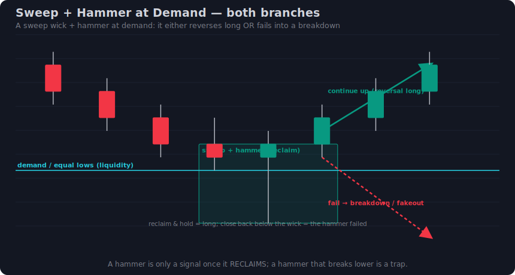
*The same hammer-after-sweep, two regimes, two verdicts: in positive-GEX/balance it is a spring (reverse long); in negative-GEX/trend it is a pullback (continue short). Regime is the tiebreaker.*

*Animated: an identical sweep-and-hammer plays out twice — left branch bounces and holds (spring), right branch bounces, fails to reclaim, and continues lower (pullback-to-continue).*

### The UP case — hammer at support, "is this a spring?"

**Scenario.** Nifty has been rotating; spot sits ~60 pts above max-pain into a Tuesday weekly expiry (verify the current weekly-expiry weekday on NSE before trading — SEBI reshuffled these in late 2025). Regime label: *positive-GEX, balance day, mid PCR, low IV-rank.* Price slides into a fresh, HTF-aligned demand zone that coincides with the day's put wall at 24,500.

**The two branches:**

| | REVERSE (spring → long) | CONTINUE (pullback → it was a real breakdown, short) |
|---|---|---|
| **What the sweep took** | Sell-side below a **strong** low / put wall | Sell-side below a **weak** low (engineered liquidity in a trend) |
| **CVD** | **Diverges** — new price low, higher CVD low (sellers exhausting) | **Confirms** — CVD makes a new low with price |
| **OI** | Put writers **re-defend** the strike; OI holds | Put-wall OI **drops** and migrates lower |
| **Regime** | **Positive-GEX / balance** — dealers fade extension | **Negative-GEX / trend** — dealers hedge with the move |
| **Verdict** | **HOLD → reversal long.** The hammer is a **Wyckoff spring** | **BREAK → continuation short.** The hammer is a dead-cat bounce |

In the balance regime above, the witnesses align for the spring: the sweep took *strong* liquidity, CVD diverges, put writers re-defend, and the regime fades extension. **Verdict: HOLD → long.** Trigger on the 5m reclaim of the swept low (the close back inside), stop a fraction below the wick, target the range mid / VWAP / opposite wall. This is the canonical [[Fakeout Reversal Trading/note|Fakeout Reversal Trading]] spring.

### The DOWN case — hammer in a downtrend, the downside fakeout that isn't

**Scenario.** Now flip the regime. Nifty gapped down and is on an open-drive; the profile is thin; regime label: *negative-GEX, trend day, falling PCR, rising IV.* Price has been making lower highs and lower lows. It sweeps a minor weak low and prints the *exact same hammer.*

A retail trader sees "hammer after sweep at support" and longs it — and gets run over. The cardinal error from the fakeout research applies in reverse: *"every sweep is a sweep-and-go even when it looks like a fakeout"* in a trend ([[Fakeout Reversal Trading/note|Fakeout Reversal Trading]] §8; repo: research.md §6). In the trend regime the hammer is **not** a spring. It is a **pullback candle** — the brief absorption before continuation. The witnesses confirm the down-move: CVD makes a new low with price, the put wall is dropping and migrating lower, and the regime is hedging downward.

> [!tip] How to tell them apart in real time (the 4-question gate)
> 1. **What did the sweep take — strong or weak liquidity?** Strong (defended, causal low) favours reverse; weak (a stop pool below an obvious equal-low) favours continue.
> 2. **Does CVD diverge or confirm?** Divergence → reverse. Confirmation → continue.
> 3. **Is OI re-defending or migrating?** Re-defense → reverse. Migration → continue.
> 4. **What is the regime?** Positive-GEX/balance → reverse. Negative-GEX/trend → continue. **This is the tiebreaker when 1–3 disagree.**

The down case has its mirror too: a **shooting star after a sweep above resistance** in a positive-GEX/balance day is an **upthrust (reverse short)**; the same shooting star in a negative-GEX/trend day up is a **pullback to continue long**. The logic is identical, flipped.

---

## 20. Mapping the read to a play

The fork verdict, *gated by the regime label from §16*, maps deterministically to one of the five legal plays. There is no free choice here — once you know the verdict and the regime, the play is selected for you.

| At-level verdict | Regime says FADE (positive-GEX / balance / near max-pain) | Regime says TREND (negative-GEX / thin profile) |
|---|---|---|
| **HOLD** (level defends) | **Reversal / Fakeout-reversal** — fade away from the level back toward value / max-pain | **Pullback / mitigation** — the "hold" is a pullback bounce *into* the trend; enter with the trend, not against it |
| **BREAK** (level gives way) | **Suspicious** — breakouts FAIL in balance; treat as a likely fakeout-in-the-making unless acceptance is overwhelming. Usually **WAIT or fade the failed break** | **Breakout / Continuation** — trade through the level; this is the base case |
| **WAIT** (unresolved) | **Stand aside** | **Stand aside** |

> [!note] Read this table as the engine's final routing step
> - **HOLD + fade regime → reversal/fakeout play.** Sweep-and-reject at a value edge in a balance day = the classic fade ([[Fakeout Reversal Trading/note|Fakeout Reversal Trading]]).
> - **HOLD + trend regime → pullback/range-pullback.** The level "holding" inside a trend is your discount/premium re-entry, not a counter-trend reversal.
> - **BREAK + trend regime → breakout/continuation.** Acceptance + BOS + delta-expansion at a value edge in a negative-GEX day = the [[Breakout Trading/note|Breakout Trading]] play.
> - **BREAK + fade regime → caution.** This is where the most expensive losses live: chasing a "breakout" on an expiry-afternoon balance day. The break usually fails back inside — which is itself a *fakeout-reversal* entry once it reclaims.
> - **WAIT → no play, in any regime.**

The discipline this table enforces: **you never pick a play because you like it.** You arrive at the level, you read HOLD/BREAK/WAIT, you cross-reference the pre-written regime label, and the play falls out. If the verdict and the regime point at "suspicious" or "WAIT," you have no trade — and that is a correct, complete decision.

---

## 21. When to wait and when not to — the confirmation / retest rule

Two traders see the identical sweep-and-reject. One fires on the **first touch**; the other waits for the **retest / reclaim confirmation**. Both can be right — in *different* conditions. The engine's job is to tell you which condition you are in, because each choice has a real, asymmetric cost.

> [!tip] Take the FIRST touch when (the case for acting now)
> - The level is **fresh / unmitigated** (first-touch is the strongest reaction — Photon; repo: research.md §3).
> - The level is **HTF-aligned and causal** (it caused a prior BOS, sits at a defended swing or OI wall) — high-trust.
> - **Two+ witness buckets already agree on the candle that just closed** (e.g., a hammer that closed back inside *and* CVD diverged *and* OI re-defends) and **no veto is live.**
> - You are in the **right regime** for the play (HOLD in a fade regime; BREAK in a trend regime).
> - The structure offers a **tight invalidation** right there (the swept wick is close), so first-touch risk is already small.

> [!warning] WAIT for the retest / confirmation when (the case for patience)
> - Only **one** bucket has spoken — the candle is suggestive but unconfirmed (repo: research.md §6: *"wait when only one bucket has spoken; act when two buckets agree"*).
> - The **sweep candle is still forming** — never read an unclosed candle. Wait for the close.
> - **OI / change-in-OI has not updated** — NSE change-in-OI lags ~3–5 min; you cannot yet see whether the wall held or migrated.
> - It is the **first 15 minutes or lunch chop**, where breaks are *"disproportionately fake"* — raise the bar ([[Breakout Trading/note|Breakout Trading]] §14; repo: research.md §2).
> - It is **expiry afternoon** and gamma/pinning dominate — demand acceptance, not a single poke.
> - The first-touch invalidation is **too wide for your option stop budget** — wait for the retest specifically *to shrink the stop* (this is §22).

### The cost of each choice

| Choice | What it costs you | When the cost is worth paying |
|---|---|---|
| **Act on first touch** | Higher fakeout rate; you sometimes pay for the worst-case stop because there is no confirmation yet | When the level is A+ (fresh, HTF, causal) and witnesses already agree — the *extra* R from the better entry outweighs the slightly higher loss rate |
| **Wait for retest** | You **miss the runners** — the strongest moves often never retest (the move that "leaves you behind" was the real one) | When confluence is thin, data is lagging, or the regime is chop/expiry — and crucially when the retest *shrinks an otherwise-unaffordable stop* |

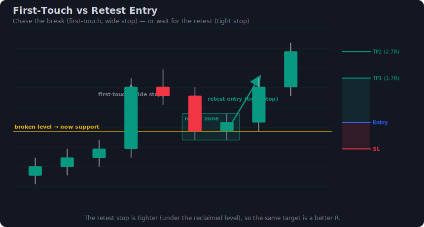
*First-touch entry vs wait-for-retest: the first-touch captures the runner but risks the wider stop; the retest confirms the reclaim and tightens invalidation — at the cost of missing the moves that never come back.*


*Animated: the break-and-retest path — price breaks, pulls back to the reclaimed level, holds, then continues; the retest entry sits at a fraction of the first-touch risk.*

> [!note] The default
> In *balance / chop / expiry / lagging-data* conditions, **the retest is the default** — patience is cheap and fakeouts are expensive. In *clean-trend / fresh-A+-level* conditions, **first-touch is justified** — the runners are the prize and they don't wait. The engine's bias under uncertainty is always toward the retest, because the cost of a missed trade is zero and the cost of a chased fakeout is a full stop.

---

## 22. How the retest shrinks your stop

This is the section that converts the patience of §21 into hard money, and it is the bridge into the options layer (§32–33). **Waiting for the retest is not just a probability filter — it physically reduces the number of points between your entry and your invalidation.** For an option buyer, where every point of futures-stop becomes ~0.5 points of premium-stop (delta ≈ 0.50 at ATM — see §32), shrinking the point-stop *is the whole game.*

### Worked numbers — Nifty long off a swept demand zone

Take a concrete reclaim long. Demand zone / swept low at **24,500**; the sweep wick poked to **24,470**.

> [!example] First-touch entry vs retest entry
> **Plan A — first touch (enter as the reclaim candle closes):**
> - Entry: **24,540** (you buy the close back inside).
> - Stop: below the swept wick with a small buffer → **24,460**.
> - **Index-point stop = 24,540 − 24,460 = 80 points.**
> - Premium-stop on an ATM CE (delta ≈ 0.50): **≈ 40 points** of premium at risk.
>
> **Plan B — wait for the retest (let price pull back to the reclaimed level and hold):**
> - Entry: on the retest hold at **24,505** (you get a *better* price *and* confirmation).
> - Stop: still below the same swept wick → **24,460** (invalidation point is unchanged — what invalidates the thesis hasn't moved).
> - **Index-point stop = 24,505 − 24,460 = 45 points.**
> - Premium-stop on the same ATM CE: **≈ 22–23 points** of premium at risk.

The retest did two things at once: it **confirmed** the reclaim (the level held on a second test) *and* it **cut the point-stop from 80 to 45 — a ~44% reduction in invalidation distance, and therefore ~44% less premium at risk per lot.**

> [!tip] Why this is the entire edge for tight option stops
> Your per-trade risk budget is fixed (1–2% of capital, §38 governance). Risk-per-lot = premium-stop × lot size. **Halve the premium-stop and you can either double the lots at the same rupee risk, or hold the same lots at half the rupee risk.** Either way your **R-multiple on the winner roughly doubles**, because the target distance is unchanged while the stop distance collapsed. A 90-point move to T1 is 90/80 ≈ 1.1R on Plan A but 90/45 = 2.0R on Plan B — *the same trade, nearly twice the reward-to-risk, purely from waiting one candle.*

Per-instrument scale note (verify current lot sizes on NSE/BSE — they were revised Jan 2026 and keep changing): the same logic holds for BankNifty/Sensex but the *point* numbers are ~2–3× larger because those indices move ~2–3× Nifty. An 80→45 pt shrink on Nifty is roughly a 200→110 pt shrink on BankNifty — proportionally identical, absolutely larger. This is exactly why the retest matters *more* on the big-scale instruments, where a first-touch stop can blow your entire point budget in one candle. We carry these premium-stop numbers forward into the strike/sizing math in §32–33.

---

## 23. The worked case — high → demand → sweep → grind → about to break

Now we resolve the full scenario the engine was built for. **Nifty makes a session high, falls to a demand zone, prints a sweep + bullish reaction, grinds back up to resistance, and is now about to break.** You are standing at the moment of decision with two legitimate plans on the table. Here is how to lay both out and choose.

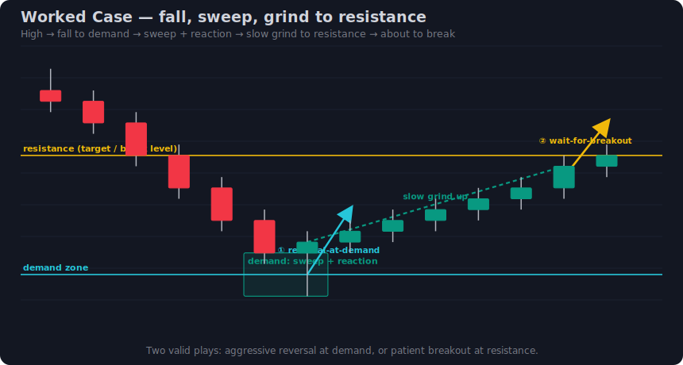
*The full path: session high (buy-side liquidity) → fall to demand → sweep + bullish reaction (the spring) → grind up → arrival at resistance, about to break. Plan A entered at the demand; Plan B waits at resistance.*

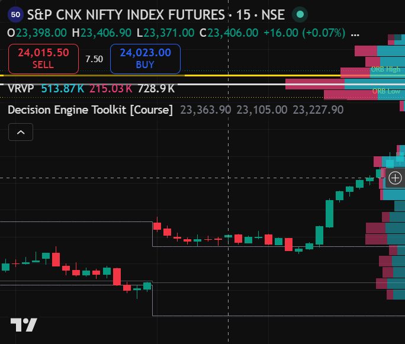
*Live NIFTY1! 15m: the same shape on a real chart — decline into a demand zone (the indicator's order block), a base/reclaim, then the grind back up into the volume-profile nodes on the right. The Decision Engine Toolkit + Visible Range Volume Profile, decluttered.*


*Animated: the complete sequence plays through — the sweep at demand, the grind, and the two possible resolutions at resistance (clean break-and-go vs reject-back-into-range).*

**The setup, level by level:**
- **The high** at ~24,620 is buy-side liquidity (the level the grind is now walking back toward).
- **The demand zone** at ~24,500 is fresh, HTF-aligned, and it just produced a **sweep below + bullish reclaim** — the spring already happened.
- **Resistance** is the prior high / call wall at ~24,620, where the grind is now arriving.

### Plan A — reversal-long at the demand (the spring, already triggered)

This is the trade you take **at 24,500**, when the sweep-and-reclaim prints — *before* the grind, while price is still at the demand zone.

> [!example] Plan A — long the spring at demand
> - **Trigger:** 5m close back inside above the swept low (the reclaim candle), CVD diverging, put-wall OI re-defending.
> - **Entry:** ~24,505 (retest hold) or ~24,540 (first touch) — see §22.
> - **Stop:** below the swept wick, ~24,460.
> - **Target T1:** the grind's destination — **resistance / the high at 24,620** (~115 pts of runway).
> - **Regime that favours it:** **positive-GEX / balance** — the level holds, price rotates back up to the opposite edge. Max-pain above is a magnet pulling price into the target.

### Plan B — wait for the breakout at resistance

This is the trade you take **at 24,620**, only *if and when* the grind closes through resistance with acceptance.

> [!example] Plan B — long the breakout through resistance
> - **Trigger:** wide-body **acceptance close above 24,620** (body ≥60–70%), BOS, delta expansion, call-wall OI **dropping/migrating** higher, call premium expanding.
> - **Entry:** on the acceptance close, or better, on the **retest of 24,620 as new support** (§22 — shrinks the stop).
> - **Stop:** back below the broken level, ~24,590 (retest) — tight because the broken resistance is the invalidation.
> - **Target T1:** the next OI wall / HVN / measured move above.
> - **Regime that favours it:** **negative-GEX / trend** — the grind is acceptance, not a rotation; the break holds and extends.

### How to choose between them

> [!tip] The regime is the chooser — and the two plans are sequential, not exclusive
> - **In a positive-GEX / balance / near-max-pain regime:** take **Plan A** at the demand. The grind up is a *rotation back to the range edge*, and resistance at 24,620 is most likely to **HOLD** (reject). In this regime, treating the arrival at resistance as a *fade-short* opportunity is the higher-EV second trade — and chasing a Plan-B breakout here is the classic expiry-day mistake (§20, §24).
> - **In a negative-GEX / trend regime:** Plan A is still valid (the spring is a pullback-to-continue), but the **better R lives in Plan B** — let the grind prove itself by *accepting* through 24,620, then ride the continuation. The break holds because dealers hedge with it.
> - **If you missed Plan A** (you weren't watching at the demand), do **not** chase the grind mid-range. **Wait at resistance** and let the level declare HOLD or BREAK. The grind itself is WAIT territory — there is no qualified level *inside* the grind, only the two edges.

The deepest lesson of this case: **the same grind-up sets up two opposite trades, and the regime decided which one was live before price ever reached resistance.** Plan A and Plan B are not a coin-flip you resolve at the level — they are pre-sorted by the regime label you wrote at the open. The level merely confirms the verdict the engine already leaned toward.

---

## 24. Common decision-tree mistakes

> [!warning] The six errors that wreck the fork
> 1. **Trading WAIT as a signal.** WAIT means *no information yet* — not "find a smaller reason to enter." Inside/unclear is a complete, correct decision to do nothing. Forcing a trade out of a WAIT is the number-one source of avoidable losses (§17).
> 2. **Fading in a trend (and chasing in a balance).** Using a reversal play in a negative-GEX trend day, or a breakout play in a positive-GEX balance day, is the structural error every channel warns about — *"the #1 structural mistake is using a trend strategy in a rotation, or vice-versa"* (Author: Trader Dale). The regime read (§16) exists to prevent exactly this; if you skip it, you will fade trends and chase chop.
> 3. **Chasing the break without the retest.** Entering a breakout on the acceptance candle with a first-touch stop, when conditions called for the retest, hands you the widest possible stop *and* the highest fakeout odds. In chop/expiry/lagging-data, **the retest is the default** (§21–22).
> 4. **Ignoring the veto.** A clean confluence count with a CVD divergence, absorption, or naked POC sitting *against* the trade is **not** a trade. Two clean witnesses beat four noisy ones; the veto outranks the vote (§18; repo: research.md §2).
> 5. **Over-marking levels.** A chart with twelve "support/resistance" lines guarantees a level near every price, so every candle "reacts to a level" and the fork becomes meaningless. Keep ≤4–5 *qualified* levels (fresh, HTF-aligned, near price, causal — §6). The declutter filter is what makes the fork legible.
> 6. **Reading the candle without the regime.** The hammer-after-sweep (§19) is the proof: the identical candle is a spring or a pullback depending solely on the regime. Reading shape in isolation will reverse your verdict half the time. **Always cross-reference the pre-written regime label before you act on any reaction.**

> [!summary] The at-level fork is the engine: read HOLD / BREAK / WAIT from the reaction (not the level), let the pre-written regime label resolve the hammer-after-sweep and pick the play, wait for the retest whenever it shrinks your option stop, and treat WAIT as a finished decision to do nothing.

---

## 25. The LTF trigger — not early, not late

By the time you reach this part, three decisions are already made: the **1h/30m** gave you bias + regime (§13–16), the **15m** gave you the qualifying level and the at-level verdict — HOLD, BREAK, or WAIT (§17–24). Nothing on the 5m is allowed to *invent* a level or a play. The 5m has exactly one job: **time the entry** into a decision that is already taken. "The 5m never invents a level" (repo: research.md §3); it only pulls the trigger on a thesis the higher timeframes have already authored.

So "entering not early, not late" is not a vague feel — it is a precise window between two failure modes:

- **Too early** = entering *before* the 5m confirms the 15m verdict. You buy the CE while price is still mid-sweep, before the close back inside; you buy the breakout while the candle is still forming and might close back under the level. You are trading your *expectation* of the trigger, not the trigger. Cost: you eat the full sweep against you, your option SL is hit on noise, and half your "wrong" trades were actually right setups entered one candle too soon.
- **Too late** = entering *after* the move has already travelled. The 5m has closed beyond the level, you waited for "just one more candle," and now you are chasing — paying an expanded premium, with your stop now a full leg away (so your risk-in-points has doubled), and the easy part of the move spent. On options this is brutal: you pay the inflated IV *and* a worse delta entry, then theta and the first pullback both work against you.

The **sweet spot** is the single 5m candle (occasionally the candle + its retest) that *confirms the 15m decision was correct and is now in force*. Three canonical 5m triggers, one per verdict family:

| 15m verdict | The 5m trigger | What "confirmed" looks like | Direction note |
|---|---|---|---|
| **BREAK** (breakout / continuation) | **Conviction close + retest hold** | A 5m **close beyond** the level with body ≥60–70% of range, then ideally a shallow retest that *holds* the level as new support/resistance (no close back inside) | Long: close above; Short: close below. The retest-hold is the A+ version (repo: research.md §6, §7) |
| **HOLD** (fakeout reversal / reversal) | **Sweep-and-reclaim / reclaim close** | A 5m wick **beyond** the level that **closes back inside** (SFP), or a CHoCH on the 5m after the sweep — the reclaim candle is the trigger | Long: sweep below + close back up; Short: sweep above + close back down |
| **HOLD** (pullback into trend) | **Reaction candle at the zone edge** | Price pulls into the fresh demand/supply zone and the **first 5m reaction candle** fires *away* from the zone (hammer/engulf in trend direction) | Long: hammer at demand in discount; Short: shooting-star at supply in premium |

> [!tip] The "close, then act" rule
> The single highest-value habit on the LTF is **acting on the candle CLOSE, not the candle in progress.** A 5m wick that pierces the level looks identical to a breakout and a fakeout *until it closes.* Waiting ~5 minutes for the close eliminates the most common too-early error at essentially no cost — the move you would have caught by jumping the wick is the move that most often reverses on you. "Do not chase the spike — wait for the close, and ideally the retest" (repo: research.md §6, WAIT verdict).

> [!example] Nifty long — the sweet spot in one sequence
> 1h: bullish bias, negative-GEX trend lean. 15m: price returns to a fresh demand OB at 24,480 sitting in discount; verdict = HOLD (pullback). **Too early:** buying a CE at 24,490 as price is still falling into the zone — you have no confirmation the zone holds. **Too late:** buying after a 5m has already closed at 24,560, +80 pts off the low, premium inflated, stop now back at 24,470 (90 pts). **Sweet spot:** the **first 5m hammer** that closes back above 24,500 off the 24,480 zone — enter the 24,500 CE on that close, stop a touch below the wick at 24,465 (≈35 pts). One candle, defined risk, move barely started.

**Instrument note.** The *logic* is identical for BankNifty / FinNifty / Sensex; only the **point scale** changes — a "shallow retest" on Nifty might be 15–20 pts, but 40–60 pts on BankNifty and Sensex (they move ~2–3× Nifty; repo: research.md §8.4). Read the trigger by *structure* (close, wick, body), never by a fixed point count, then size the stop to the instrument's budget in §31.

---

## 26. Which lens to use when — price action vs SMC vs VP

A recurring beginner trap is using **all three lenses at once on the 5m** — price action *and* SMC order blocks *and* volume-profile nodes — until the chart is a contradiction generator. The engine's discipline: **the play already chose the lens.** You do not pick a lens by preference; the play (set by the 15m verdict) tells you which lens reads the trigger most cleanly (repo: research.md §7, "you do not use all lenses for all plays").

| Situation at the level | Primary lens | Why it fits | Confirming witness |
|---|---|---|---|
| Clean swing structure, obvious HH/HL, conviction breakout | **Price action** (close/body/retest) | When structure is clean, the candle *is* the signal — no need for OB/FVG overlays | Order-flow: rising CVD / stacked imbalance on the future |
| Engineered liquidity, equal highs/lows, OB→FVG displacement, sweep | **SMC** (sweep → CHoCH → reclaim, OB/FVG) | SMC is built to read liquidity grabs and displacement — exactly the fakeout/reversal anatomy | Price-action rejection wick + **CVD divergence** (the top tell) |
| Rejection at a value edge / node / naked POC / VAH-VAL | **Volume Profile** (node, value edge, POC) | VP reads *where institutions transacted*; a node rejection is a VP read, not a candle read | Reaction candle at the edge + VWAP confluence |
| Pullback into an established trend | **VP zone edge + VWAP** | Trade *from* the edge of a fresh zone, first touch; VWAP-pullback in a trend | FFP fractal/reaction candle in trend direction |
| Continuation after a BOS + mitigation | **SMC** (BOS, OB/FVG retest) | The continuation anatomy is SMC's home turf | Price-action conviction candle + rising CVD |

The lens-per-play mapping condensed (repo: research.md §7):

- **Breakout / continuation → Price action (conviction close + retest) + SMC for the BOS/OB-retest**, confirmed by order-flow (stacked imbalance, rising CVD).
- **Fakeout reversal / reversal → SMC (sweep → CHoCH → reclaim) + CVD divergence + a price-action rejection wick/close-back-inside.**
- **Pullback / mitigation → VP / supply-demand zone edge + VWAP-pullback + a reaction candle** at first touch of the zone.

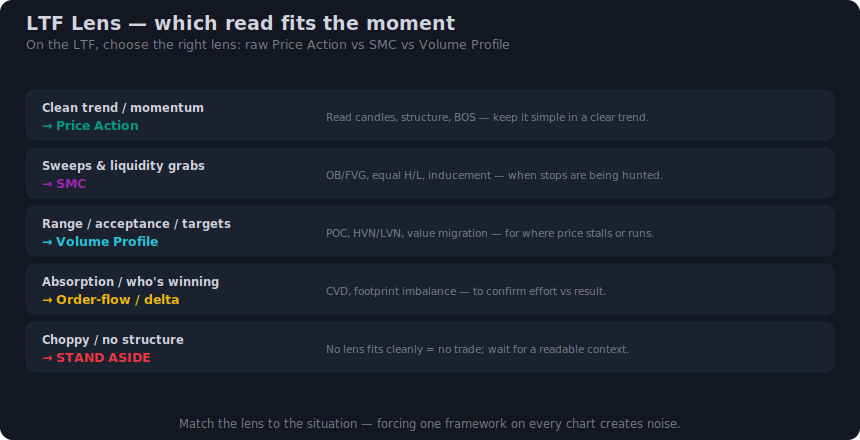
*Which LTF lens to use when — clean swing structure routes to price action, engineered liquidity / OB-FVG routes to SMC, node / value rejection routes to volume profile; the play (not preference) selects the lens.*

> [!tip] When to *combine* lenses — confluence, not clutter
> You combine lenses only when they **stack at the same price** and one is the *trigger* while the others are *confirmation*. Best-case A+ entry: a fresh **SMC OB** that sits exactly on a **VP HVN edge** at **VWAP**, where the 5m prints a **price-action reclaim candle** with **CVD diverging**. That is four witnesses at one price — but you still *enter on one* (the reclaim close); the rest only raise conviction and size. The error is using a second lens to *manufacture* a level the first lens didn't give you. If SMC says "no OB here," do not go find a VP node 30 pts away to justify the trade — that is lens-shopping, and it is how unqualified levels get traded (repo: research.md §3, declutter).

> [!warning] Lens mismatch is a silent killer
> Using price action on engineered liquidity makes every stop-hunt look like a real breakout (you buy the sweep). Using SMC on a clean trending pullback makes you wait for a CHoCH that never comes (you miss the continuation). The lens must match the play, and the play must match the regime — a chain that started two parts ago.

---

## 27. Footprint deep-dive — absorption, delta, CVD (and the paid-data reality + free fallback)

Footprint earns its own section because it is the most powerful *and* the most misunderstood execution tool for an Indian retail trader. Done right, it is a veto that overrides a high confluence count. Done wrong — or with the wrong data — it is expensive noise.

### 27.1 What a footprint actually shows

A footprint (a.k.a. bid/ask or cluster chart) explodes each candle into a per-price-level breakdown of **bid volume** (sell-initiated, hit the bid) versus **ask volume** (buy-initiated, lifted the ask) (repo: research.md §7). From that you derive:

- **Delta = Ask − Bid** for the bar (net aggressive buying minus aggressive selling).
- **CVD (Cumulative Volume Delta)** = the running sum of delta across bars — the "who is winning the aggression war over time" line.
- **Bid/ask imbalance** = a lopsided cell where one side massively outweighs the other.
- **Absorption** = huge volume on **both** sides at a price with **no price progress** — a passive wall eating all the aggression.

### 27.2 The four reads, ranked by India reliability

This ranking is the single most important takeaway, because most footprint education is written for US tick-by-tick data that India retail does not have.

| Rank | Read | What it means | India trust |
|---|---|---|---|
| **1** | **CVD divergence** | Price makes a new extreme but CVD does *not* → aggressors exhausting → reversal | **Highest** — least sensitive to per-trade aggressor misclassification (repo: research.md §7, §10) |
| **2** | **Absorption** | Huge volume both sides, no price progress → a passive limit wall reverses the move | High — Trader Dale's favourite reversal signal |
| **3** | **Stacked imbalance** | 3+ **diagonal** cells ≥300% one side → initiative/displacement | Medium — read *diagonally* (ask at a price vs bid one tick **below**), not horizontally |
| **4** | **Per-cell raw numbers** | Individual cell bid/ask counts | **Lowest** — treat as probabilistic only |

> [!warning] KEY FINDING — on Indian feeds, CVD divergence is the only fully trustworthy footprint read
> NSE gives **no aggressor flag** on retail feeds. Every footprint you see is *inferred* — software guesses buy vs sell from the quote/tick rule, and gets a meaningful fraction wrong. Per-cell imbalances inherit that error directly. **CVD divergence survives** because it is a *shape over many bars*, where misclassification noise averages out, not a single-cell call (repo: research.md §6, §10). Practically: **trust the CVD-divergence shape; treat stacked imbalance as a helper; never bet on a single raw cell.**

> [!warning] KEY FINDING — true footprint on the OPTION is impossible
> There is **no usable tick data on individual option strikes** — thin strikes and wide spreads make any option footprint unreliable garbage. **Always run footprint/CVD on the Nifty (or BankNifty/Sensex) FUTURE**, then translate the futures read onto the option via delta (§31). You read order flow on the *underlying's future*; you *execute* on the option. Never the other way around (repo: research.md §7, §8.1).

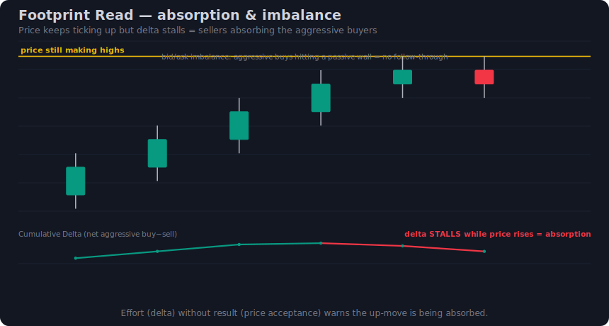
*Footprint anatomy on the FUTURE — bid×ask per price, delta and CVD; absorption (both sides heavy, no progress) and CVD divergence (price new high, CVD lower high) flagged as the reversal tells; the option strike has no usable tick data, so it is read via delta, never via footprint.*

### 27.3 The paid-data reality (what footprint actually costs in India)

| Grade | Source | Quality | Cost / access |
|---|---|---|---|
| **Grade 1** | True order-by-order TBT (tick-by-tick) | Real aggressor flag | Institutional / colo only — lakhs/yr (out of reach) |
| **Grade 2** | Vendor tick feed (GoCharting own feed, TrueData, GDFL, AccelPix) | The realistic retail ceiling | Paid — **GoCharting Premium ≈ ₹1,499/mo** is the recommended option |
| **Grade 3** | Broker snapshot (~1 packet/sec — Kite, Dhan) | Roughest; coarse delta | Cheap / included, but lossy |

(repo: research.md §7, §10; verify current pricing — vendor plans change.)

### 27.4 The FREE fallback — when you don't have footprint

You can run the *entire* engine without paying for footprint. The fallback is not "ignore order flow" — it is "read order flow with cheaper proxies":

1. **CVD / delta on the FUTURE from Grade-3 broker data.** Even the coarse broker snapshot produces a CVD line good enough for *divergence shape* (the #1 read). You lose per-cell precision, not the read that matters.
2. **Candle + volume proxies (VPA).** A high-volume bar with a narrow spread at a level = absorption's footprint twin (Coulling VPA). A volume-climax bar with a long rejection wick = the exhaustion footprint would have shown. Anna Coulling's volume-price analysis *is* the no-footprint version of order flow.
3. **GoCharting Bar Replay (free) for practice.** Drill reading absorption/CVD on replay before you ever pay for a live feed.

> [!tip] The honest hierarchy
> A+ : Grade-2 footprint CVD-divergence on the future. B+ : Grade-3 broker CVD-divergence shape. B : VPA candle+volume proxy. The *decision quality drop from A+ to B+ is small* — far smaller than the drop from "no order-flow read" to "any order-flow read." **Do not let lack of a paid feed stop you from trading; let it stop you from claiming per-cell precision you don't have.**

---

## 28. FVG on the LTF — should you, and how to master it

**Short answer: yes — but only as a *confluence-gated, regime-aware* entry, never as a standalone signal.** An FVG (Fair Value Gap) is a 3-candle inefficiency left by displacement: candle 1's high (in an up-move) does not overlap candle 3's low, leaving a price *gap* the market often returns to fill before continuing (ICT; repo: research.md §7). A real break *creates* one; that is what makes it a useful entry *into* a move you already validated on the 15m.

### 28.1 What qualifies as a tradable LTF FVG

An FVG must pass all of these or it is noise (see §29 for the kill-list):

1. **Born from displacement, not drift.** The 3-candle gap must come from a *wide, conviction* candle — real imbalance — not a slow grind. A gap inside chop is meaningless.
2. **Aligned with HTF bias + regime.** Long FVGs only in a bullish 1h with trend lean; short FVGs only in a bearish one. An FVG against HTF bias is a trap.
3. **Confluent with a qualified level.** The FVG should sit *on* (or just inside) a fresh OB, a VP node edge, VWAP, or an OI-wall band — it must be near a level the 15m already qualified (repo: research.md §3, §7). A standalone 5m FVG floating 40 pts from any level is not tradable.
4. **Fresh / untested.** First touch only. A gap already tagged once is spent (repo: research.md §7, "only trade fresh/untested gaps").

> [!note] Why an FVG works — it hides a Low Volume Node
> "FVG is a misleading name" — it works because the gap is a **Low Volume Node**: a price range that traded *fast* (little volume), so when price returns there is little resting supply/demand to stop a clean re-rejection (FFP; repo: research.md §7). Reading it this way tells you *why* to trust it (thin liquidity to push through) and *when not to* (if the gap has since filled with volume, the LVN is gone).

### 28.2 How to enter — into the gap, with confirmation

The entry is **not** "buy the instant price touches the gap." It is: price pulls **into** the FVG → a **confirmation candle** fires (a 5m reaction/reclaim in the trade direction) → enter → stop just past the OB / swept extreme behind the gap (repo: research.md §7).

**Tiered fill** — how deep into the gap to expect the turn (use to place limit/confirmation, not to skip confirmation):

| Fill tier | Where price reacts | Read | Action |
|---|---|---|---|
| **Partial fill** (gap "consignment" — reacts at first quarter/third) | Strongest displacement; aggressive demand/supply | Highest conviction continuation | Enter on the first reaction candle inside the gap |
| **50% fill** (reacts at the midpoint / consequent encroachment) | The classic, most common turn point | Standard A entry | Enter on the reaction candle at/after midpoint |
| **Full fill** (price fills the whole gap, then reacts at the far edge / origin OB) | Weaker — the inefficiency is nearly gone | Acceptable *only* if the origin OB still holds | Enter only on a clean reaction at the OB; tighter conviction needed |

> [!example] Nifty short — FVG continuation entry, both-direction logic
> 1h bearish, negative-GEX. 15m: BOS down through 24,400, leaving a **5m bearish FVG** at 24,430–24,455 sitting under a fresh supply OB. Price retraces up into the gap. At the **50% level (24,442)** a 5m shooting-star closes back below 24,435 → enter 24,400 PE on that close, stop just above the OB at 24,470 (≈35 pts). **Mirror for a long:** bullish 1h, BOS up, bullish FVG under a demand OB in discount, price dips into the gap, 5m hammer at the midpoint closes back up → enter the CE, stop below the OB. Same anatomy, opposite signs.

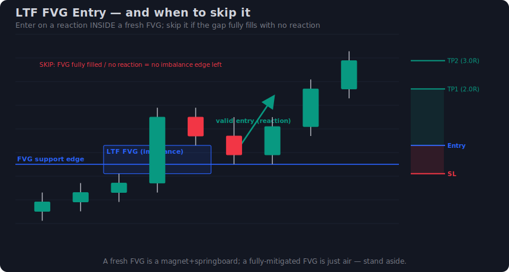
*A tradable LTF FVG — born from displacement, confluent with a fresh OB, in HTF bias; price retraces into the gap, a 5m confirmation candle fires near the 50% fill, entry taken with the stop just past the OB/swept extreme. The right panel previews the failure modes of §29.*


*Animated: displacement leaves the gap → pullback into the FVG → confirmation candle at the 50% fill → entry → continuation. Note the candle CLOSE inside the gap, not the wick touch, is the trigger.*

> [!tip] Mastery in one line
> A mastered FVG entry = **fresh + HTF-aligned + confluent with a qualified level + entered on a confirmation candle into the gap, never on the naked touch.** Strip any one of those and you are gambling on a gap.

---

## 29. FVG failure modes — when not to trust it

The skeptics here are FFP and Vorwald, and their finding is blunt: **FVGs act as support/resistance only ~30% of the time** — specifically "in a stable trend with a small opening range." In balance (the other ~70% of sessions) they get traded **straight through** (repo: research.md §7). So an FVG entry is *regime-dependent*: trust it in trend, distrust it in balance. The "skip" rules:

| Failure mode | The tell | Why it fails | Rule |
|---|---|---|---|
| **Against HTF bias** | A bullish FVG in a bearish 1h (or vice-versa) | You are buying a counter-trend inefficiency the trend will erase | **Skip.** FVG must align with bias + regime |
| **Fully filled, no reaction** | Price closes clean through the whole gap with no rejection candle | The displacement is being *reclaimed* — the move that made the gap is failing (ICT mitigation) | **Skip / flip bias.** A full-fill close-through is a *reversal* warning, not an entry |
| **In chop / balance** | D-profile session, positive-GEX, narrow rotation | The ~70% case — FVGs are noise here; gaps form and fill constantly | **Skip.** No FVG entries on balance days |
| **Too far from a qualified level** | A 5m FVG floating 30–50 pts from any OB/node/wall | It is a 5m-invented level; "the 5m never invents a level" | **Skip.** Must be confluent with a §6-qualified level |
| **Stale / second touch** | The gap has already been tested once | First test holds, **second test usually breaks** (Vorwald); the LVN is consumed | **Skip.** Fresh gaps only |
| **Tiny / drift-born gap** | A 1–3 pt gap from a slow grind, not displacement | No real inefficiency; no LVN underneath | **Skip.** Needs conviction displacement to qualify |

> [!warning] The two most expensive FVG mistakes
> 1. **Trading FVGs in balance.** This is the ~70% trap. If your regime read (§13–16) says positive-GEX / D-profile / near max-pain, **delete FVGs from your toolkit for the day** — they will get filled and you will get stopped repeatedly. FVGs are a *trend-day* tool.
> 2. **Treating a full-fill close-through as "deep entry."** When price closes straight through the entire gap, the inefficiency is gone and the displacement is being reclaimed — that is the *move failing*, and it is a signal to **exit or flip**, not to add. The naive trader "buys the dip into the gap" exactly as it is invalidating.

> [!tip] One filter that removes most FVG losses
> Before any FVG entry, ask: *"Is today a trend day, and does this gap sit on a level I already qualified?"* Two yeses → proceed with §28's rules. Any no → skip. That single question screens out the against-bias, in-chop, and floating-gap failures in one pass.

---

## 30. The trigger per play

This is the section to memorise — the exact 5m trigger candle/sequence for each of the five plays. Everything above (lens, footprint, FVG) feeds *into* these. Read it as: *the 15m gave the verdict and the play; here is the precise 5m sequence that fires it.*

| Play | Context gate (from regime + 15m) | The exact LTF (5m) trigger sequence | Stop sits | Direction mirror |
|---|---|---|---|---|
| **Breakout** | Negative-GEX / trend lean; price at a qualified level (IB high/low, OI wall, value edge); not expiry afternoon | **5m conviction close beyond the level** (body ≥60–70% of range) **+ rising CVD / stacked imbalance** → enter on close; A+ = enter on the **retest-hold** of the level | Just past the broken level / behind the retest wick (0.5–1.0× ATR buffer) | Long: close above + retest holds as support. Short: close below + retest holds as resistance |
| **Fakeout reversal** | Positive-GEX / balance / near max-pain; level swept but witnesses refuse to confirm | **5m sweep beyond the level → close back inside (SFP) → 5m CHoCH/reclaim**, with **CVD divergence** + OI re-defense → enter on the reclaim close | Just beyond the swept wick (tight, ~0.3–0.5× ATR — precise invalidation) | Long: sweep below a strong low + close back up. Short: sweep above a strong high + close back down |
| **Reversal at exhaustion** | At a *naked* HTF extreme (PDH/PDL, naked POC, call/put wall); VPA/footprint climax | **5m climax bar (volume spike + long rejection wick) → CVD divergence → first reaction candle away from the extreme** → enter on the reaction close | Just past the climax extreme | Long: selling-climax + hammer at the naked low. Short: buying-climax + shooting-star at the naked high |
| **Pullback / mitigation** | Clearly trending HTF; price pulls into a **fresh** HTF-aligned zone in discount (long) / premium (short) | **First 5m reaction candle at the zone edge** (hammer/engulf in trend direction) **+ VWAP-pullback confluence** → enter on the reaction close | Just past the far edge of the zone / below the wick | Long: hammer at demand in discount. Short: shooting-star at supply in premium |
| **Continuation** | A BOS has already occurred; price mitigated the OB/FVG | **Price into the OB/FVG → 5m confirmation candle in trend direction** (the §28 FVG entry) **+ rising CVD** → enter on the confirmation close | Just past the OB / swept extreme behind the gap | Long: confirmation candle up out of a bullish FVG/OB. Short: confirmation candle down out of a bearish FVG/OB |

> [!note] The two universal rules across all five triggers
> 1. **Act on the CLOSE.** Every trigger above resolves on a 5m candle *close*, never the candle in progress — this is what keeps you out of the too-early zone (§25).
> 2. **The future fires, the option executes.** Every CVD / footprint witness is read on the **future**; you then buy the ATM/1-OTM option whose delta-converted stop fits your instrument's point budget (§31). If the close-confirmed point-stop is wider than your budget, **wait for the retest that shrinks it, or skip** — never widen the budget to fit the trade.

> [!summary] LTF entry, in one line
> The 1h/15m already decided *what* and *where*; the 5m only decides *when* — enter on the close-confirmed trigger for your play (conviction-close+retest for breaks, sweep+reclaim+CVD-divergence for fades, reaction-candle at the zone for pullbacks), read every order-flow witness on the FUTURE, gate every FVG on trend + a qualified level, and trust CVD divergence above all other footprint reads on Indian inferred-aggressor data.

With the trigger in hand, the futures-side thesis is complete — a direction, a level, an entry, and a point-stop. The next part (§31, the options layer) converts that index-point thesis into the actual trade: the strike to buy, the premium-stop via delta, the per-instrument budget gate, sizing, timing, and the mid-trade exit. **A perfect 5m trigger on a strike whose stop blows your budget is not a trade — it is the next part's first lesson.**

---

## 31. Strike selection — ATM vs 1-OTM

> [!note] Part 6 of 7 — The Capital-Constrained Core (§31–§36)
> Everything before this part produced a **thesis in index points**: "Nifty holds 23,000, fade up to max-pain at 23,150" or "BankNifty breaks 51,200, run to 51,600." This part does the one job the Western books and the channel syntheses never finish — it **converts that point-thesis into a sized option trade you can actually afford.** This is the user's main pain: the setup looks A+, the probability is high, the R:R reads 1:2.5 — but the stop is 70 points wide, the lot is 65, and one stop-out is more than the day's whole risk budget. The answer is *not* "trade it anyway." It is a disciplined chain: pick the strike (§31) → set the option stop via delta and ATR (§32) → check it against the per-instrument point budget (§33) → map the target and R:R (§34) → gate it on theta and IV-rank (§35) → and when the budget says no, *change the trade, don't break the rule* (§36). Read this part as the cashier's window of the whole engine: the thesis is the order; this is whether you can pay for it.

The first decision after the futures thesis is **which strike to buy**. For intraday directional index plays the answer is almost always **ATM (at-the-money) or 1-OTM (one strike out-of-the-money)** — nothing further out. The choice between the two is a trade-off between *delta efficiency* and *leverage*, and it shifts with conviction, expected move size, and time-to-expiry (repo: research.md §8.1).

The single most important number on the chain is **delta** — it is the futures-point → option-premium conversion ratio, and the whole stop/target math in §32–§34 runs on it. ATM delta ≈ **0.50**; 1-OTM delta ≈ **0.35–0.45** (Passarelli; McMillan). A subtle but real point: an ATM *futures-option* call delta is slightly **above 0.50** (the futures price distribution has no carry drift), so do not assume exactly 0.50 — assume ~0.50–0.52 (McMillan, Options on Futures ch.).

### The trade-off table (Nifty weekly, spot ≈ 23,000)

| Property | ATM (23,000) | 1-OTM (23,100 CE / 22,900 PE) | Reading |
|---|---|---|---|
| **Delta** | ~0.50–0.52 | ~0.35–0.45 | ATM moves ~half a point per Nifty point; 1-OTM moves ~0.4 |
| **Premium (indicative)** | ~₹120–160 | ~₹70–100 | 1-OTM is cheaper → more leverage per rupee |
| **Theta (decay/day)** | Highest in absolute ₹ | Lower ₹ but higher *as % of premium* | 1-OTM is gutted faster proportionally |
| **Gamma** | Highest | High but lower than ATM | ATM delta accelerates fastest in your favour |
| **Breakeven move** | Smaller (more intrinsic-sensitive) | Larger (all extrinsic — needs a bigger move to pay) | 1-OTM needs the move to actually arrive |
| **Bid-ask spread** | Tightest (~1–3 pts) | Wider (~2–5 pts) | Spread is a fixed tax; matters more on the cheaper strike |
| **IV-crush drag** | Moderate | Higher (more extrinsic to lose) | High IV-rank punishes 1-OTM more |
| **Capital per lot** | Higher | Lower | The capital lever for tight accounts |

### When to pick which

- **Pick ATM when:** conviction is high, the move is expected to be *clean and immediate* (open-drive breakout, post-sweep reversal snap), you want the cleanest delta P&L and the tightest spread, and you can afford the larger premium. ATM's higher gamma means its delta *rises into a winning move* — premium accelerates.
- **Pick 1-OTM when:** capital is tight (the whole point of this part), the expected move is large enough to overcome the extra theta + extrinsic, and you accept slightly noisier delta P&L for the leverage. 1-OTM is the **capital-constraint default** — but only when the move is genuinely large; on a small expected move it loses to theta even when direction is right.
- **Slightly-ITM (one strike in)** is the exception: on a *high-conviction trend day with a big expected move*, one-strike-ITM (delta ~0.55–0.65) reduces theta and IV-crush drag and behaves more like the future. Use it when you expect to hold the leg longer than a single 5m impulse.
- **Never buy far-OTM weeklies for intraday direction.** The bid-ask spread alone can be **5–15% of the premium**, and theta guts them — you can be right on direction and still lose (repo: research.md §8.1; breakout note §16).

> [!tip] CE and PE are symmetric
> Everything here applies identically to **CE (call, for upside theses)** and **PE (put, for downside theses)**. ATM PE delta ≈ −0.50 in sign but you read its *magnitude* (0.50) for the conversion. Buy the CE to express a long futures thesis, the PE to express a short futures thesis. The strike-selection logic, stop math, and target math are mirror images.

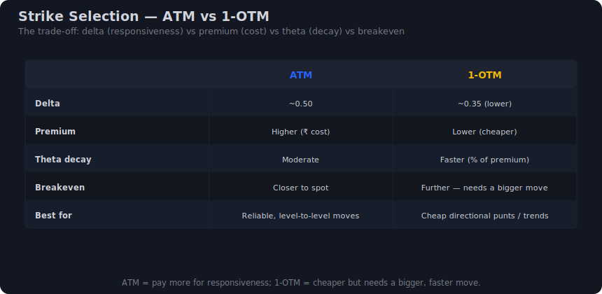
*Strike selection: ATM gives clean delta + tight spread; 1-OTM gives leverage for tight capital but pays more theta and needs a bigger move. Far-OTM is a spread-and-theta trap.*

---

## 32. The stop on the option — via delta and via ATR

You set your stop **in index points** (the futures thesis: "I'm wrong if Nifty trades back below 22,970"). You then need to know **what that stop is worth in premium**, because your order is on the option, not the index. There are two complementary methods: **delta conversion** (the core) and **ATR sizing** (how you choose the point-stop in the first place). They are not alternatives — ATR *sets* the point-stop; delta *converts* it to premium.

### Method 1 — the delta conversion (the core)

**Delta is the futures→option price-change ratio.** McMillan: "the delta of a futures option is the amount by which the option is expected to increase in price for a one-point move in the underlying." Passarelli: "if an option has a 50 delta, its price will change by 50 percent of the change of the underlying." The rule of thumb:

> [!example] The conversion rule
> **Premium-stop ≈ delta × index-point-stop.**

Worked Nifty numbers (spot 23,000, ATM delta ~0.50, 1-OTM delta ~0.40):

| Index-point stop | ATM premium-stop (×0.50) | 1-OTM premium-stop (×0.40) |
|---|---|---|
| **30 pts** | ~**15 pts** of premium | ~**12 pts** of premium |
| **40 pts** | ~20 pts | ~16 pts |
| **50 pts** | ~25 pts | ~20 pts |
| **60 pts** | ~30 pts | ~24 pts |

So a 30-point Nifty stop on an ATM call ≈ **~15 points (₹15) of premium**; the same stop on a 1-OTM call ≈ **~12 points** (repo: research.md §8.2; web: Sahi, Zerodha Varsity). This is the number you place the option SL at: if you bought the ATM CE at ₹140, a 30-pt index stop means an option stop around ₹125 (₹140 − ₹15).

### The delta-drift caveat (the trap the rule-of-thumb hides)

Delta is **not constant** — it changes via **gamma** as price moves. Passarelli: "when the stock price increases by $1, the delta increases by the amount of the gamma." This bends the conversion in a way you must anticipate:

- **On the adverse move (your loss):** the option goes OTM, gamma *shrinks* the delta, so the premium falls **slightly slower** than delta×points. Your realised premium-stop is therefore a touch **SMALLER** than the table says — a 30-pt adverse move on the ATM may only cost ~13 pts of premium, not the full 15. Mildly in your favour on the loss.
- **On the favourable move (your win):** the option goes ITM, gamma *grows* the delta, so premium rises **faster** than delta×points — your gains accelerate. The realised target premium is **LARGER** than delta×points. Strongly in your favour on the win.

> [!warning] How to use the drift, not fight it
> **Size the stop off the *entry* delta** (use the table). Then expect the realised adverse premium-move to be modestly smaller than computed (delta shrinks against you) and the favourable move larger (delta grows for you). Practically: do not place your hard option-SL *tighter* than delta×points thinking the option "should" be there — leave a small buffer, because near-the-money gamma makes the first few points noisy. The net effect of drift is asymmetric and in the buyer's favour, which is exactly why directional buying works when the move actually comes — but it is also why a *stalled* trade (no move) is pure theta bleed with no gamma help (§35).

A second consequence worth knowing: **Equivalent Futures Position (EFP) = options × delta** (McMillan). One ATM lot ≈ *half a futures lot* of directional exposure. That is why option buying feels under-leveraged relative to the future on small moves — and over-leveraged (via gamma) on big ones.

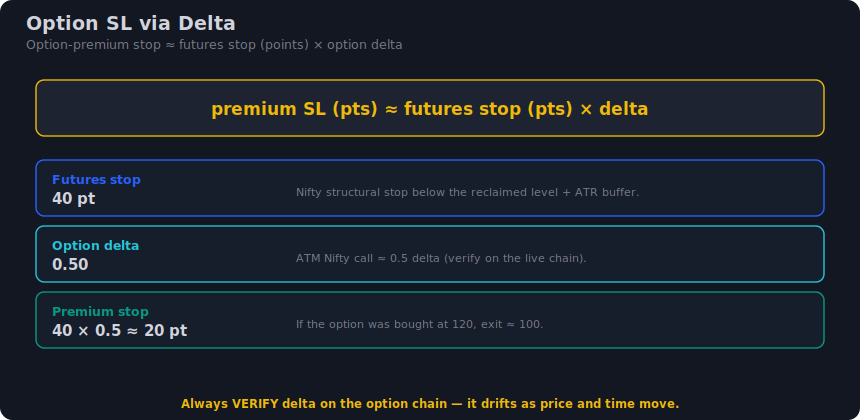
*Delta conversion: premium-stop ≈ delta × index-point-stop (30 Nifty pts → ~15 pts ATM, ~12 pts 1-OTM). Gamma bends it: loss slightly smaller, win larger.*

### Method 2 — ATR (how you choose the point-stop)

Before you can convert, you need the point-stop itself. Set it with **ATR** so it is sized to *current* volatility, not a fixed guess. Use **5m or 15m ATR × a multiplier**:

- **Classic intraday multiplier: ~2× ATR** (equivalently a Supertrend **7,2** on the 5m for faster, or **10,3** for slower, both standard intraday settings — web: MQL5, Mudrex, elearnmarkets).
- **Fakeout-reversal stops (precise invalidation):** tighter — **~0.3–0.5× ATR beyond the swept wick.** The whole thesis is "the sweep failed," so you are wrong the instant price re-takes the wick.
- **Breakout stops (avoid the stop-hunt):** wider — **~0.5–1.0× ATR beyond the level.** You need room for the retest to breathe.
- **Regime adjustment:** **widen the multiplier on negative-GEX / event days** (overshoots are normal); **tighten on positive-GEX / balance days** (moves are suppressed and revert).

> [!example] Worked Nifty ATR → premium stop (end to end)
> 5m ATR = 18 pts. Breakout play → 1.5× ATR = **27-pt index stop** → round to **30 pts**. ATM delta 0.50 → **15-pt premium stop**. Bought ATM CE at ₹140 → place option SL at **₹125**. If 5m ATR were instead 30 pts (a volatile session), 1.5× = 45 pts → 22-pt premium stop → SL at ₹118. Same % risk, *different point stop*, because ATR sized it to the live tape.

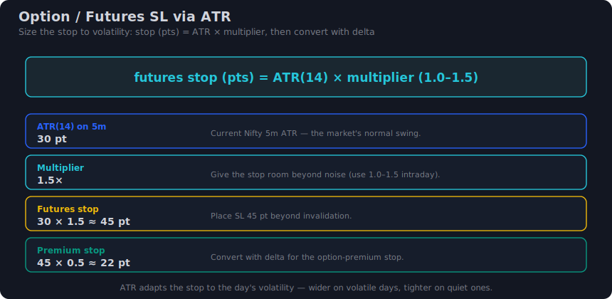
*ATR sets the point-stop (≈2× ATR, or Supertrend 7,2 / 10,3 on 5m; tighter for fakeout, wider for breakout), then delta converts it to a premium stop.*

---

## 33. The per-instrument stop budget — Nifty, BankNifty, FinNifty, Sensex

Here is the rule that protects the capital-constrained trader: **you carry a fixed per-trade stop budget *in index points*, and it is PER INSTRUMENT** — because the four indices move at completely different scales. The same 1–2% capital risk implies a very different point-stop on Nifty than on BankNifty (repo: research.md §8.4).

### The budget table (calibrate to live ATR — VERIFY all exchange values on NSE/BSE)

| Instrument | Indicative point-stop budget | Preferred / Max | Lot size (verify) | Weekly expiry (verify) | Scale vs Nifty |
|---|---|---|---|---|---|
| **Nifty** | ~25–50 pts | **30–40 preferred / 50–60 max** | ~65 | **Tuesday** (NSE) | 1× (baseline) |
| **BankNifty** | ~60–150 pts | ~80–120 preferred / 150 max | ~30 | **Monthly only** (weekly discontinued) | ~2–3× |
| **FinNifty** | ~30–60 pts | ~40–50 preferred / 60 max | verify on NSE | **Monthly only** (weekly discontinued) | ~1× (Nifty-ish) |
| **Sensex** | ~80–200 pts | ~100–150 preferred / 200 max | ~20 | **Thursday** (BSE) | ~2–3× (BankNifty scale) |

> [!warning] Verify before you size — these move
> SEBI revised the derivatives framework in late 2024 and again in 2025, and lot sizes changed again around Jan 2026. **Re-verify on NSE/BSE before sizing any trade:** indicative lot sizes **Nifty 65 / BankNifty 30 / Sensex 20**; **Nifty weekly now expires Tuesday**; **BankNifty and FinNifty weeklies were discontinued (monthly-only)** under SEBI's one-weekly-per-exchange rule; Sensex weekly is Thursday (BSE). FinNifty lot size is not confirmed in sources — check NSE (repo: research.md §8.4, Open gaps).

The **30–40 pt preferred / 50–60 max** anchors on **Nifty**. BankNifty and Sensex scale this **~2–3×** because they genuinely move 2–3× the points; FinNifty is roughly Nifty-scale. The budget is not arbitrary — it is **~2× the live 5m/15m ATR** of that instrument (§32). On a calm Nifty session (ATR 15) the budget compresses to ~30; on a wild one (ATR 30) it stretches toward 50–60. Always recalibrate to today's ATR.

### The gate rule (this is the whole point of the part)

> [!example] The budget gate
> Compute the trade's **invalidation distance** (where the futures thesis is actually wrong — the swing/wick/level the structure says you must respect). Then:
> - **Invalidation ≤ budget** → trade it. Convert to premium (§32), size (§34/§36).
> - **Invalidation > budget** → **DO NOT widen the budget.** Instead either (a) **wait for the retest** (§22 of the engine) to come back to the level so the *new* invalidation distance shrinks inside the budget, or (b) **SKIP the trade.** A correct-direction thesis with a stop wider than budget is not a "size-down" problem — it is a *wait or pass* decision.

The discipline is one-directional: the budget is a ceiling you never raise mid-decision. The two legal moves when the stop is too wide are **shrink the stop (retest)** or **stand aside**. This is the exact answer to "high PoP, good R:R, but the stop is too wide" — and §36 returns to it in full.

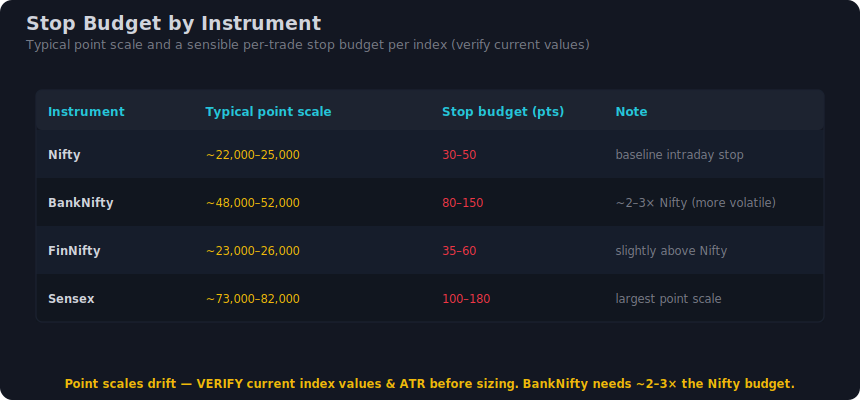
*Per-instrument point budgets scale ~2–3× (Nifty 30–40/50–60 → BankNifty/Sensex 2–3×). If invalidation > budget: wait for the retest to shrink it, or skip — never widen.*

---

## 34. Targets and R:R — HVN, OI-wall, naked-POC, measured move

A stop without a target is half a trade. The engine sets the target **at the next structural barrier in the path**, not at an arbitrary multiple of risk — then *checks* whether the resulting R:R clears the minimum. If it does not, the trade is skipped even if direction and stop are fine.

### Where to target (in priority of "what's actually in the path")

| Target type | What it is | When it's T1 vs T2 |
|---|---|---|
| **Next OI wall** | The nearest highest-call-OI (upside) / highest-put-OI (downside) strike | Usually **T1** — the first structural ceiling/floor the chain defends |
| **Next HVN** | High-Volume Node on the volume profile — where institutions previously traded heavily | T1 or T2 — price decelerates into HVNs |
| **VWAP / first-deviation extension** | The live institutional benchmark and its band | T1 on mean-reversion/fade plays |
| **Naked (virgin) POC** | An untouched prior-session POC — a magnet | **T2** — stretch the target to *just beyond* it, never short of it (Trader Dale) |
| **Prior-day VAH / VAL extreme** | The edges of yesterday's value | T2 — major liquidity pools |
| **Measured move** | The range height projected from the breakout point | T2 on breakouts |
| **Max-pain** | The expiry pin | **T2 on expiry day only** — the strongest expiry target (§35) |

> [!tip] The naked-POC / magnet rule
> Use naked POCs and failed auctions as **magnets** — set the target *just beyond* them, never just short, because price tends to tag and overshoot a magnet before reacting. Inside a balanced **D-profile**, the **POC is the natural target**; in a thin/trend profile, **trail** rather than fixing a target (Trader Dale; repo: research.md §8.5).

### The R:R and partial-booking rule

Define R **in index points** (entry-to-stop), then convert entry, stop, and target to premium via delta (§32) to read the *realised* R:R on the option — it is not the same as the index R:R because of theta and the spread tax.

> [!warning] Minimum R:R — demand 1:2 gross to net ~1:1.5
> Option P&L is **non-linear** (delta + theta + IV), and round-trip costs on an ATM weekly run **~3–6 points** (STT + brokerage + bid-ask spread). So demand **gross R:R ≥ 1:2 *before* costs** to net roughly **1:1.5 after**. A trade that reads 1:1.3 gross is, after costs, barely break-even on expectancy — skip it. The break-even win rate for 1:2 is 33%; for 1:1.5 it is 40% — keep that headroom.

> [!example] Worked Nifty R:R (ATM CE)
> Thesis: long from 23,000, T1 = next OI wall 23,060, T2 = naked POC 23,120, invalidation 22,970 → **30-pt stop**. ATM delta 0.50, premium ₹140.
> - **Risk (R):** 30 pts × 0.50 = **15 pts premium** (₹140 → ₹125).
> - **T1 reward:** 60 pts × ~0.52 (delta drifting up) ≈ **~31 pts** → R:R ≈ **1:2.0** at T1. ✓ clears minimum.
> - **T2 reward:** 120 pts, delta drifting to ~0.58 → **~70 pts** → R:R ≈ **1:4.6** at T2.
> - **Partial booking:** book **~50–60% at T1** (locks in ≥1R, pays the cost drag), trail the rest to T2 with the option-SL moved to break-even. This converts a "right but stopped on the pullback" loss into a winner and is the single biggest realised-expectancy improver for tight accounts.

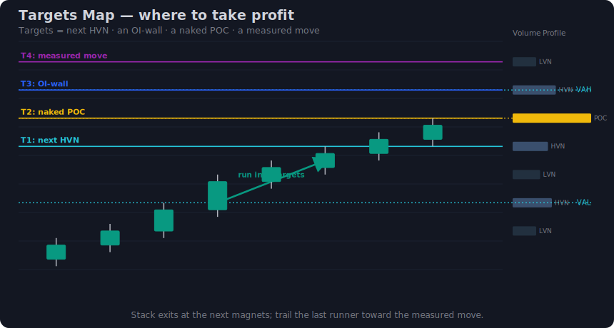
*Target the next barrier in the path — OI wall → HVN → VWAP-extension → naked POC → measured move → (expiry) max-pain. Stretch just beyond magnets, never short.*

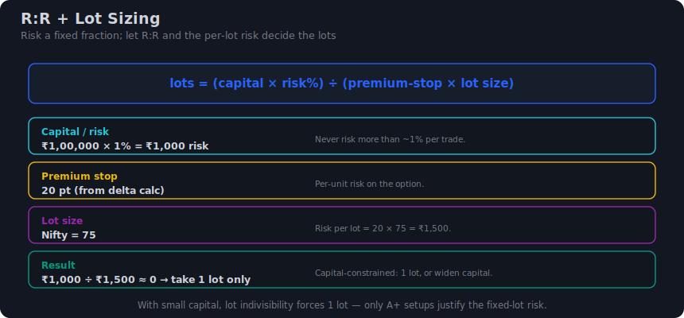
*Convert entry/stop/target to premium via delta, demand gross R:R ≥ 1:2 (nets ~1:1.5 after ~3–6 pt costs), and book ~50–60% at T1 with the rest trailed.*

---

## 35. Option-buying timing — theta decay and IV-rank

You can have the right strike, the right stop, and a great R:R, and **still lose because of the clock and the volatility regime.** Option *buying* has two timing gates that override everything else: **IV-rank** (is premium cheap or expensive?) and **theta** (how fast is it bleeding right now?).

### Gate 1 — IV-rank (the go/no-go for BUYING)

The go/no-go is **IV rank / IV percentile — not the absolute IV level.** Compare current IV to *its own recent distribution* (a volatility cone), exactly as Sinclair frames it: "selling one-month implied volatility at 35% because this is in the 90th percentile for one-month volatility over the past two years can form the basis of a sensible trading plan." For the option *buyer*, invert it:

| IV rank | Premium | Verdict for buying | Why |
|---|---|---|---|
| **Low (cheap)** | Underpriced vs its own history | **GREEN — buy** | You win on delta *and* a likely IV rise on the move (double gain) |
| **Moderate** | Fair | **Amber — buy selectively** | Acceptable if the move is fast/clean |
| **High (rich)** | Overpriced vs its own history | **RED — avoid buying** | IV-crush will fight you; the move must be large *and* fast to overcome it |

Volatility is **mean-reverting and clusters** ("large changes followed by large changes," Sinclair) — so a *high* IV-rank reading is itself a warning that **IV will likely fall**, directly hurting a long-option holder. India VIX elevated into an event = exactly this regime: rich premium, IV-crush risk afterward. When IV rank is high, **trade the future or a spread instead of buying the naked option** (repo: research.md §5.3, §8.7).

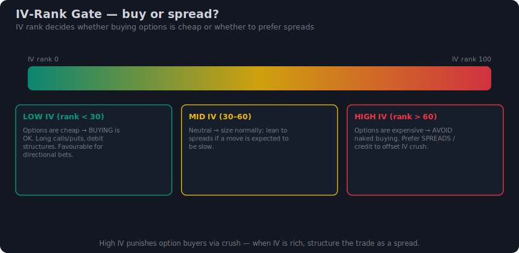
*IV-rank gate: buy options only at low–moderate IV rank (cheap premium, room to expand). High IV rank = IV-crush risk → trade the future/spread instead.*

### Gate 2 — theta and the time-of-day curve

**ATM theta is non-linear and accelerates into expiry** — Passarelli: "ATM options tend to decay at a nonlinear rate... they lose value faster as expiration approaches." On **weekly options the back half of the week, and especially expiry afternoon, is where theta bites hardest.** There is also an intraday **"taking the day out"** effect: once price stabilises mid-session, market-makers strip the day's theta from their models, so **premium cheapens through the session even with no price move** (Passarelli ch.2).

| Time of day (IST) | Theta condition | Buying verdict |
|---|---|---|
| **9:15–11:00 (open)** | Lowest intraday decay; move-rich | **Best window — buy here** (early in the move *and* early in the week) |
| **11:00–13:30 (mid)** | "Taking the day out" cheapening underway | Acceptable on a genuine fresh setup |
| **13:30–14:30** | Decay accelerating, esp. on expiry | Caution; demand a clean trigger |
| **After ~14:30 on weekly expiry (Nifty Tue / Sensex Thu)** | Theta + pinning maximal | **Near-negative-EV for directional buying** |

> [!warning] The expiry-afternoon rule
> **Post-~2:30pm IST on weekly expiry day, treat directional option *buying* with maximum suspicion** — theta + pinning toward max-pain make long-premium directional buying a low-to-negative-EV game unless the move is fast and large. The higher-EV expiry-afternoon play is usually the **fakeout-reversal *toward* max-pain**, not a directional breakout buy (repo: research.md §8.7). Combine both gates: the worst possible buy is a 1-OTM weekly at **high IV rank, after 2:30pm on expiry** — that is theta and IV-crush stacked against you.

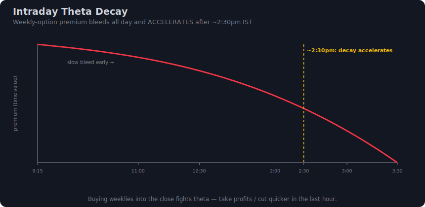
*Theta is non-linear and accelerates into expiry; intraday "taking the day out" cheapens premium through the session. Buy early in the move and early in the week; avoid expiry afternoon.*

---

## 36. Mid-trade early exit, sizing, and the capital-constraint gate

This is the section the user actually came for: **the trade is in, the budget is the constraint, and you need rules for getting out early, for sizing one lot, and for what to do when the math says "good trade, can't afford it."**

### Mid-trade early exit — leave when the THESIS breaks, before the hard SL

The most valuable discretionary rule the engine adds: **exit when the reason for the trade is gone, even if the point-stop has not been hit.** Waiting for the hard SL when the thesis has already broken is just donating the difference. Four "thesis-broke" tells, in order of trust:

1. **Premium NON-expansion on a correct-direction futures tick** — the cleanest options-side tell. You are long the CE, the future ticks *up* in your favour, but the premium **does not expand** (or barely moves). The chain is refusing to pay for the move — the move is not believed. Exit. *This is the single most reliable early-exit signal on the options side* (repo: research.md §8.8).
2. **Delta flip / CVD rollover** — the order flow that justified the entry reverses: CVD rolls over, absorption appears against you, stacked imbalance flips side.
3. **Level reclaim against you** — the level you traded *from* is retaken (a broken level closes back inside; a held level gives way). Structure has invalidated.
4. **OI stops migrating** (breakout) or **starts migrating against you** (reversal) — the chain's vote reverses.
5. **Time-stop** — if the expected move has not begun within a set number of bars (e.g., 3–4 × 5m bars), exit. On options this is critical: a *stalled* trade is **pure theta bleed with no gamma help** (§32, §35). Direction-right-but-slow still loses on a weekly.

> [!tip] The one-line early-exit rule
> **If the option premium fails to expand while the future moves your way, the trade is already wrong — exit now, do not wait for the point-stop.** Vorwald: "read acceptance, not your bias — don't bang your head against a wall."

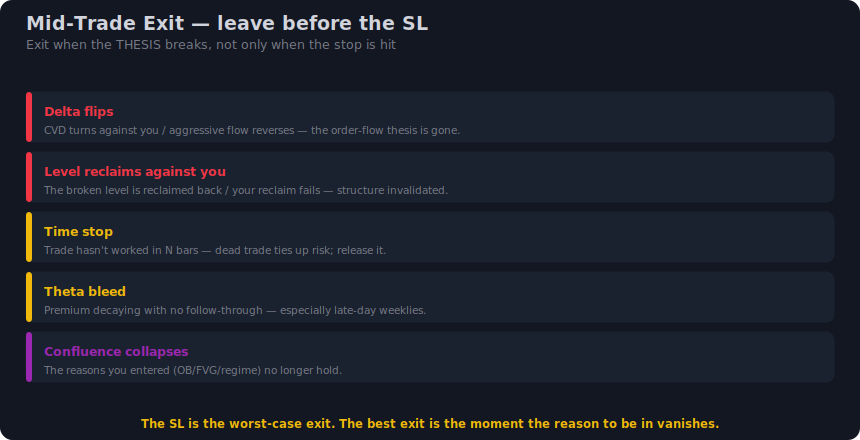
*Mid-trade early exit: premium non-expansion on a favourable tick (top tell), delta/CVD flip, level reclaim against you, or time-stop. Exit when the thesis breaks, before the hard SL.*

### Sizing — the 1-lot reality and the formula

For the capital-constrained trader the honest baseline is **one lot**, and the question becomes "can one lot fit inside my risk budget?" The formula:

> [!example] Position-size formula
> **Lots = floor[ (Capital × Risk%) ÷ (|entry premium − stop premium| × lot size) ]**
> Keep **premium-at-risk ≤ 1–2% of capital** (the §38 risk-governance cap).

Worked 1-lot Nifty check (capital ₹2,00,000, risk 1.5% = ₹3,000; ATM CE, 30-pt stop → 15-pt premium stop; lot 65):
- Premium-at-risk per lot = 15 × 65 = **₹975.**
- Lots = floor[3,000 ÷ 975] = floor[3.07] = **3 lots** fit the budget. One lot risks ₹975 = **0.49%** — comfortably inside.

Now the trap that creates the user's pain — a **wide stop**: same capital, but invalidation is **70 pts** (35-pt premium stop):
- Premium-at-risk per lot = 35 × 65 = **₹2,275** = **1.14%** for ONE lot.
- Lots = floor[3,000 ÷ 2,275] = floor[1.32] = **1 lot**, and it eats most of the day's budget. **This is the capital-constraint gate firing.**

### The capital-constraint gate — "high PoP + good R:R, but the stop is too wide / capital too tight → what do I do?"

This is the central question. The answer is **never "trade it anyway with a stop you can't afford,"** and never "move the stop closer than the structure allows." The three legal moves, in order:

> [!warning] The decision, in order
> 1. **WAIT FOR THE RETEST (§22) to shrink the stop.** A high-PoP setup with a 70-pt invalidation usually offers a *retest* — price returns to the level after the first push. Entering on the retest moves your entry closer to the invalidation point, so the **same structural stop is now 30 pts, not 70.** The premium-at-risk per lot drops from ₹2,275 to ₹975, and the trade fits the budget at full size. *This is the primary answer* — the setup was fine; your *entry timing* was the problem. (It also improves R:R, because reward-to-target grew while risk shrank.)
> 2. **DROP THE STRIKE / DROP THE SIZE.** If no retest comes but you must participate, switch ATM → **1-OTM** (lower delta → smaller premium-at-risk per lot for the same point-stop: 35 pts × 0.40 = 14 premium-pts vs 17.5 for ATM), and/or trade **one lot only**. This keeps you within the cap at the cost of leverage — acceptable, not ideal.
> 3. **STAND ASIDE.** If the stop can't be shrunk by a retest and even one 1-OTM lot breaches the cap, **skip the trade.** A great setup you cannot size safely is not your trade today. There is always another level. Standing aside is a *position*, not a failure — under capital stress, "fear narrows perception and creates the loss" (Douglas); the pre-defined gate is what protects you from the FOMO entry.

> [!note] Why "wait for the retest" beats "widen the budget" every time
> Widening the budget changes nothing structural — it just risks more on the same trade. Waiting for the retest **physically moves your entry**, which shrinks the *real* distance to invalidation, which shrinks premium-at-risk, which lets you size to full lots *and* improves R:R simultaneously. It is the only move that makes the trade *better* rather than just *bigger*. The cost is patience and the occasional missed runner — a price worth paying to keep your per-trade risk constant, which is the whole foundation of survival on tight capital.

> [!summary] The capital-constrained core in one line
> **Convert the point-thesis to premium with delta, size the stop to live ATR inside the per-instrument point budget, demand gross R:R ≥ 1:2 at a cheap IV rank early in the move, exit the instant the premium stops expanding — and when a high-PoP setup's stop is wider than your budget, wait for the retest to shrink it, drop to a 1-OTM lot, or stand aside, but never widen the budget.**

---

## 37. The per-play playbook cards

Everything in the preceding six parts collapses, at the desk, into five small cards you can read in the time it takes price to close a 5m candle. The engine has already done the hard thinking — the regime read (Part 3) eliminated most of the menu, the level filter (Part 2) gave you the *where*, and the at-level read (Part 4) is about to hand you a verdict. The card just tells you, for the play the engine returned, exactly what to look for, where the stop goes, and what to buy. Keep these five visible. They are deliberately terse: a card you have to read like a paragraph is a card you will not read in a live tape.

Each card carries seven fields in the same order, so your eye learns the shape: **regime it needs · context gate · LTF trigger · SL (index points → option) · target · options note · deep-dive**. The SL field always names the index-point stop *first* and then the premium-stop it maps to via delta (Part 6, §32–33) — because you size in points and risk in premium.

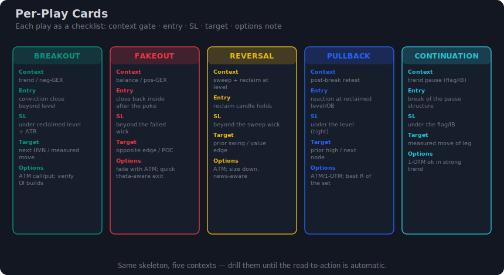
*The five playbook cards as a single scannable wall — regime on the left decides which card is even legal today.*

> [!example] Card 1 — BREAKOUT
> - **Regime it needs:** negative-or-neutral GEX, away from max-pain, trend or coiled-narrow-IB day. *Forbidden* on a positive-GEX balance day.
> - **Context gate:** price at a *fresh, HTF-aligned* value edge / IB high-low / OI wall (all four declutter gates passed, Part 2).
> - **LTF trigger (5m):** wide-bodied conviction close beyond (body ≥60–70% of range) **+ rising CVD / stacked imbalance**; A+ entry is the *retest hold*, not the first break.
> - **SL:** ~0.5–1.0× ATR *beyond* the level (wider, to clear the stop-hunt). Nifty ≈ 40–60 pts → ATM premium-stop ≈ 20–30 pts (0.50 × pts).
> - **Target:** next OI wall / next HVN / measured-move of the prior range; trail in a thin/trend profile.
> - **Options note:** ATM for clean delta; only buy if IV rank is low-to-moderate (Part 3, §15; §35). Premium *must expand* on the break — if it doesn't, the thesis is already broken.
> - **Deep-dive:** [[Breakout Trading/note|Breakout Trading]].

> [!example] Card 2 — FAKEOUT REVERSAL
> - **Regime it needs:** positive GEX, near max-pain, balance / D-profile day. The mirror of Card 1.
> - **Context gate:** a *strong* high/low or OI wall is **swept** but the witnesses refuse to confirm — low-vol poke, absorption, CVD divergence, OI re-defends the swept strike.
> - **LTF trigger (5m):** sweep beyond → **close back inside** (SFP / turtle-soup close) + CHoCH/reclaim; CVD divergence is the top tell.
> - **SL:** tight — ~0.3–0.5× ATR *beyond the swept wick* (precise invalidation). Nifty ≈ 25–35 pts → ATM premium-stop ≈ ~13–18 pts.
> - **Target:** back to POC / VWAP / opposite range edge; on expiry, **max-pain** is the strongest target.
> - **Options note:** the tight stop makes RR generous — but cheap stops tempt over-trading; obey the daily governor (§38). ATM or 1-OTM.
> - **Deep-dive:** [[Fakeout Reversal Trading/note|Fakeout Reversal Trading]].

> [!example] Card 3 — REVERSAL AT EXHAUSTION
> - **Regime it needs:** price at a *naked* HTF extreme (prior-day VAH/VAL, naked POC, call/put wall) with no prior breakout to fade — works in balance or at the *end* of a trend, not in its middle.
> - **Context gate:** VPA climax (selling/buying climax, Coulling) **or** footprint absorption at the naked level **+ CVD divergence**. The move is *ending*, not pausing.
> - **LTF trigger (5m):** climactic high-volume narrow-spread bar / V-reversal candle + reclaim; absorption on both bid and ask.
> - **SL:** beyond the climax extreme, ~0.3–0.5× ATR. Nifty ≈ 30–40 pts → ATM premium-stop ≈ ~15–20 pts.
> - **Target:** the magnet behind it — naked POC / opposite value edge; stretch *just beyond* the magnet, never short of it (Trader Dale).
> - **Options note:** exhaustion reversals are the riskiest to *time*; demand the CVD-divergence veto in your favour before firing. ATM.
> - **Deep-dive:** the reaction-read logic in Part 4; closest sibling is [[Fakeout Reversal Trading/note|Fakeout Reversal Trading]].

> [!example] Card 4 — PULLBACK / MITIGATION
> - **Regime it needs:** HTF clearly trending (negative-GEX trend day); you are buying the dip *with* the trend.
> - **Context gate:** price pulls back to a *fresh* HTF-aligned demand (longs) / supply (shorts) zone, in **discount** for longs / **premium** for shorts. First touch only.
> - **LTF trigger (5m):** reaction candle at the zone edge + VWAP-pullback confluence (Vorwald: in a trend, buy the pullback *to* VWAP).
> - **SL:** just past the zone / swept extreme, ~0.5× ATR. Nifty ≈ 30–45 pts → ATM premium-stop ≈ ~15–22 pts.
> - **Target:** prior swing / trend extension; trail to ride the leg.
> - **Options note:** the highest-RR play because you enter *with* momentum at a defined edge — "be a pullback trader, never a breakout trader" (FFP). ATM or slightly-ITM on a strong trend to cut theta drag.
> - **Deep-dive:** Part 5 LTF lenses; trend-context from [[Breakout Trading/note|Breakout Trading]].

> [!example] Card 5 — CONTINUATION
> - **Regime it needs:** an established trend where a BOS has *already* occurred and the pullback has *already* confirmed (a pullback one step matured).
> - **Context gate:** BOS done → price mitigated the OB/FVG → structure intact in the trend direction.
> - **LTF trigger (5m):** continuation candle firing out of the flag/OB-retest in the trend direction + rising CVD.
> - **SL:** beyond the mitigated OB/FVG, ~0.5–0.7× ATR. Nifty ≈ 35–50 pts → ATM premium-stop ≈ ~18–25 pts.
> - **Target:** next structural target / liquidity pool; trail.
> - **Options note:** beware the *full-fill* FVG — if price closes straight through the gap, the displacement is being reclaimed and the continuation is failing; stand down. ATM.
> - **Deep-dive:** [[Breakout Trading/note|Breakout Trading]].

> [!tip] How to use the cards at the desk
> Do not scan all five. The regime label you wrote at the open (§16, Part 3) has already crossed out three of them. On a positive-GEX balance day only Cards 2, 3, and 4-as-range-fade are legal; on a negative-GEX trend day only Cards 1, 4, and 5 are. Reach for the card the *engine* selected, confirm its context gate, wait for its named trigger, and place the stop the card specifies. The card is a checklist, not a menu (repo: research.md, lens 1).

---

## 38. Risk governance — the daily-loss governor

You told the engine the hardest truth up front: *even one lot feels unsafe*. That is not a weakness to trade through — it is information. Tight capital changes the math of survival, and the single largest determinant of whether a small account survives its first six months is **not** the quality of the setups; it is whether a hard governor sits between you and the keyboard on a bad day. The setups are the easy part. The governor is the part nobody installs until after they have blown up.

The governor is a small set of caps that **override every individual trade**. They are not suggestions; they are circuit-breakers that you decide on *before* the session, when you are calm, so that the version of you who is down two trades and angry never gets a vote.

> [!warning] The four hard caps (set these in writing before the bell)
> 1. **Per-trade risk: a fixed 1% of capital, every time.** Not 0.5% when scared and 3% when confident — the *same* percentage regardless of how good the setup feels. "Inconsistent sizing is the #1 cause of blowups" (Trader Dale). With tight capital, lean to the low end of the 1–2% band the channels converge on (FFP 0.5–1%, Photon 1%).
> 2. **Daily loss limit: stop after 2 losses OR ₹X drawdown, whichever comes first.** Pick the ₹X *as a number you can say out loud without flinching*. When it's hit, the trading day is over — flatten, close the platform, walk away. This is the universal anti-tilt rule (Photon "max 3 losses/day then stop"; Douglas: predefined limits prevent revenge trading).
> 3. **Max trades/day: cap at 3.** Few high-conviction A+ trades beat many B-grade ones — Trader Dale's prop study found the winners traded "few setups on 1–3 markets." A hard cap forces selectivity; if you've used your three, the desk is closed even if a perfect setup appears.
> 4. **No revenge trading — the one-minute rule.** After any loss, you may not place the next order for at least one full minute, and only after re-reading the regime label and the relevant card. The loss does not get to choose the next trade.

The reason these caps matter *more* on a small account is psychological, and it is worth understanding rather than just obeying. Mark Douglas's core observation in *The Disciplined Trader* is that **fear narrows perception, and the narrowed perception creates the loss.** Under capital stress you stop seeing the whole tape — you see only the thing you are afraid of. Afraid of missing out, you chase the spike before the close. Afraid of losing, you freeze at the retest that was your actual entry and then jump in late, at the worst price, when conviction finally feels safe. In both cases the fear *manufactured* the bad trade. The cure is not "be braver." The cure is a pre-defined process that runs whether you are afraid or not.

> [!note] Think in probabilities, not in this-trade outcomes
> Douglas's second pillar: each trade has **defined risk and an uncertain outcome**. No single A+ setup is supposed to work — only the *set* of A+ setups, taken consistently at a fixed size, is positive-expectancy. Once you internalise this, a loss stops being evidence that you were wrong and becomes a routine cost of extracting the edge. The corollary is Douglas's bluntest rule: **learn to take a loss.** Refusing to liquidate a position you have *already acknowledged* is broken — moving the stop, "giving it room," averaging down — is the single cardinal error that turns a 1% loss into an account-ending one (repo: research.md, lens 9).

There is one counter-intuitive governor that the small-account trader almost always misses, and it deserves its own callout because it fires exactly when you feel safest.

> [!warning] Tighten governance *after wins*, not just after losses
> FFP's "Spectral Point of No Return": **overconfidence after a winning streak is more dangerous than a losing run.** A losing run makes you cautious — which is protective. A winning run makes you feel the rules are for other people — which is fatal. So the governor must tighten on the upside too: after three wins in a row, do *not* raise size, do *not* add a fourth trade, do *not* loosen the stop. The streak is the most expensive moment to start improvising (repo: research.md, lens 9).

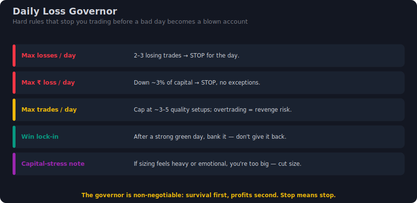
*The daily-loss governor as a circuit-breaker: each loss trips a counter; two trips (or the ₹ cap) flatten the book and close the desk for the day — and the post-win path tightens rather than loosens.*

Concretely, write the governor on a sticky note before each session: *"1% per trade. Stop at 2 losses or ₹\_\_\_. Max 3 trades. After a win, change nothing."* That single sentence is worth more to a small account than any setup in §37, because the setups only pay off if you are still in the game to take the next one.

---

## 39. The learning path and the backtesting spec

This final section answers two questions: *how do I learn to run this engine without losing money while I learn*, and *how will I one day prove the edge with data*. The first is a curriculum you start today; the second is a methodology you build later, once you have the data subscriptions and the skill to interpret them.

### (a) The learning / training path

Do not try to learn the whole engine at once — it has too many moving parts, and a beginner who tries to weigh confluences, classify the regime, *and* convert deltas in the same week will simply freeze. The path below is **staged**: each stage adds one skill, drills it in isolation, and has an **exit test** you must pass before moving on. The stages deliberately mirror the engine's own funnel (regime → level → reaction → LTF → options) so that by the time you finish, the order you learned things in *is* the order you execute them in.

The MTF nesting is the spine of the whole curriculum — every stage operates on the same three-timeframe funnel, and learning to keep the jobs separate (1h/30m bias+regime, 15m level, 5m trigger) is itself a drill that runs through all eight stages.

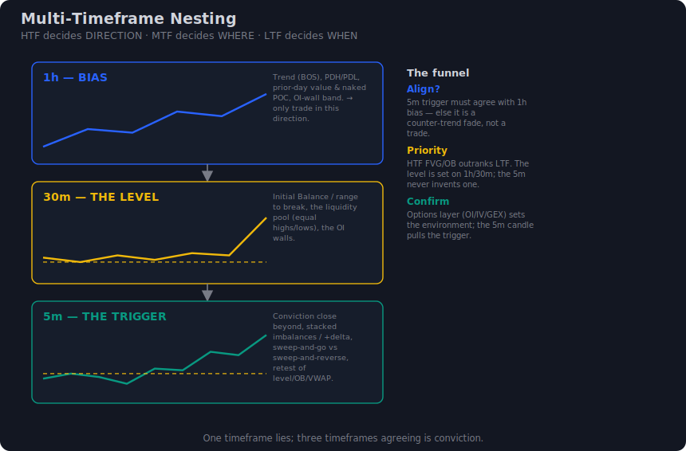
*The MTF funnel that every stage rehearses: 1h/30m decides the menu, 15m marks the level, 5m times the trigger — never blend the jobs.*

| Stage | Skill added | Key drill | Exit test | Maps to |
|---|---|---|---|---|
| **0 — Foundations** | Market structure (HH/HL, BOS/CHoCH), risk math, reading a *decluttered* chart | Mark swings; compute break-even WR = 1/(1+RR) | Define a 1:3 trade (entry/stop/target) without hesitation | `FREE_CURRICULUM.md` Stage 0–1; FFP §1–2; Photon §1 |
| **1 — Regime classification** | The engine's *first* skill: label the session before trading | Write the one-sentence regime label (gap/IB, GEX sign, IV rank, PCR, max-pain distance) | Label 20 historical opens, predict fade-vs-break, score vs reality | Part 3; Vorwald 13-step; `options-flow-india.md` |
| **2 — Level mapping + declutter** | The four-gate filter; keep ≤5 levels | Mark qualifying levels on blank charts; *delete* the rest | Justify each kept level against all four gates; name what you deleted | Part 2; Trader Dale VP; Photon 8-criteria |
| **3 — At-level reaction** | HOLD / BREAK / WAIT; the hammer-sweep fork | GoCharting free **Bar Replay**: classify 30 level-touches | ≥70% correct HOLD/BREAK/WAIT calls on replay | Part 4; both sibling guides |
| **4 — LTF entry + footprint/FVG** | The lens-per-play mapping; CVD divergence, absorption, stacked imbalance; FVG failure modes | Annotate sweep→CHoCH→reclaim and a breakout-retest with the right lens | Correctly tag the LTF lens + confirmation on fresh examples | Part 5; Trader Dale OF; ICT; Vorwald (FVG ~30%) |
| **5 — The options layer** | Delta-conversion, delta drift, ATR sizing, per-instrument budgets, IV-rank/theta timing, lot sizing, thesis-broke exit | Convert point-stops → premium-stops on live weeklies | Given a 40-pt thesis + ATM delta + IV rank: produce strike, premium-stop, lots @1.5%, T1/T2, no-trade condition | Part 6; Passarelli, McMillan, Sinclair; `FREE_CURRICULUM.md` Stage 5 |
| **6 — Governance & psychology** | Daily-loss limit, max-trades, journaling each play-type *separately*, probability mindset, post-win caution | One week of paper trades obeying the governor (§38) | Journal by play-type; compute expectancy per play | §38; Douglas; Photon §9; FFP §10 |
| **7 — Integration + backtest** | Run the full engine on replay, then the §39(b) backtest | Forward-test the assembled engine | Expectancy >0, profit factor >1.5 *net of costs* on ≥1 month Nifty, regime filter validated separately for expiry days | Part 1; §39(b) below |

> [!tip] Journal template — fill one row per trade, grouped by play-type
> The journal is where the engine actually compounds, because it tells you *which card is paying you and which is bleeding you*. Critically, **journal each play-type in its own group** (Vorwald) — your breakout expectancy and your fakeout expectancy are different edges and must never be averaged together.
>
> | Date | Play (card) | Regime label | Level type | Trigger seen | Index SL → premium SL | RR planned | Outcome (R) | Thesis-broke exit? | Governor obeyed? | Lesson |
> |---|---|---|---|---|---|---|---|---|---|---|
> | | breakout / fakeout / reversal / pullback / continuation | one sentence | OI wall / VAH / IB… | conviction close / SFP… | e.g. 40 → 20 | 1:2 | +2.0 / −1.0 | yes/no | yes/no | one line |
>
> Review weekly: sort by play-type, compute expectancy per group, and *retire the card whose expectancy stays negative for a month*. That is how the engine learns.

The path is free to walk. `FREE_CURRICULUM.md` bridges every paid FFP concept to a lawful primary source (BabyPips for structure, Bulkowski for candle stats, the ICT 2022 mentorship for SMC/liquidity), and your repo's `COMPARISON.md` "Rosetta Stone" translates the jargon across Dale / FFP / Photon so the same idea under four names doesn't read as four ideas. Stages 0–4 cost nothing but screen time on GoCharting's free Bar Replay; only Stage 5 onward needs a paid data feed (repo: `FREE_CURRICULUM.md`; repo: research.md, lens 11).

### (b) The backtesting spec (methodology now, build later)

Do not build this yet. You are at Stage 1 of the path; the backtest is Stage 7. But knowing *how* the test will work shapes how you trade in the meantime — specifically, it tells you to record the regime label and the play-type on every trade now, because those become the filters you sweep later. The architecture is dictated by an awkward India reality: **footprint data cannot be run on the option strike, and the options chain has no historical footprint at all.** So the test is split across two data sources joined on a timestamp.

> [!summary] The two-source join (the honest India architecture)
> **The futures order-flow / volume-profile signal is the trigger; the historical option candle is the leg.**
> - **Signal side — GoCharting on the Nifty FUTURE.** Compute the footprint / VP / CVD signal in **Lipi** (GoCharting's scripting, which exposes `delta`, `maxdelta`, buy/sell volume, aggressor direction, volume imbalance). Backtest the *futures* signal in-platform, then export the **signal** — timestamp + direction (+1/−1) — via **CSV** (webhooks are live-only; the footprint data itself cannot be exported, only the derived signal). Tool: GoCharting Premium ~₹1,499/mo (Grade-2 vendor tick).
> - **Option side — Dhan.** The Dhan Data API (~₹499/mo, or free with 25+ trades/mo) gives **expired options history up to 5 years, minute-level: OHLC + IV + OI + Volume + Strike + Spot, for ATM±10 strikes** — exactly the range an ATM/near-ATM engine needs. For each signal timestamp, pull the ATM CE/PE and simulate entry/exit/P&L in Python.

With the joined dataset, sweep a parameter grid in Python (the option-side params are fully automatable; signal-side params need a CSV re-export per setting):

| Parameter | Grid to sweep |
|---|---|
| **Stop budget** | {30, 40, 50, 60} index points (and/or 0.3 / 0.5 / 1.0 / 2.0× ATR) |
| **RR / target** | {1.5, 2, 3} fixed, vs structure-target (next wall/HVN/max-pain), vs trail |
| **Confirmation** | {first-touch, retest} — and weighted-vote threshold (≥0.55 vs ≥0.70), veto on/off |
| **Regime filter** | {on, off} — on = {positive-GEX → fades only, negative-GEX → breaks only} + IV-rank gate |
| **Strike** | {ATM, 1-OTM} (and slightly-ITM on strong trends) |

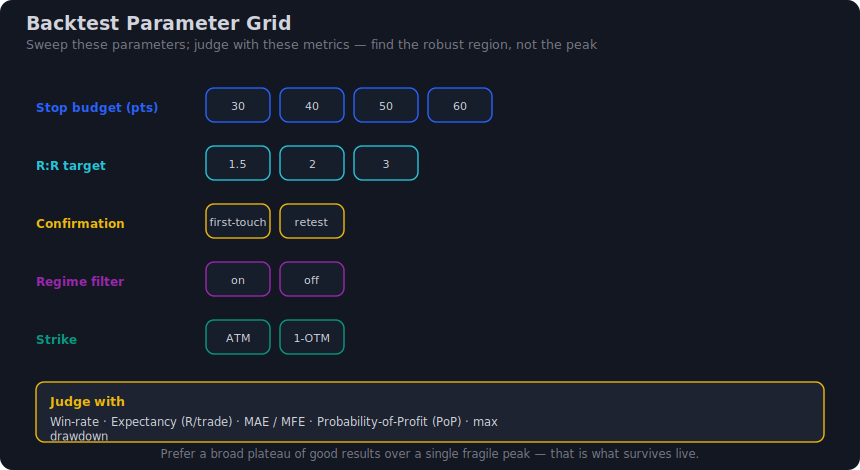
*The parameter grid: the signal (GoCharting/Lipi CSV) joins the option leg (Dhan ATM±10) on timestamp; each cell is one (stop × RR × confirmation × regime × strike) run scored on expectancy.*

> [!warning] Score on EXPECTANCY, and trust the right things
> - **The metric is expectancy / average R-multiple, not win rate.** A 40%-win 1:3 engine crushes a 70%-win 1:1 one. Report expectancy first; use profit factor (>2 = prop-grade, Trader Dale), max consecutive losses, and max drawdown as guardrails — all **net of costs** (model STT + brokerage + bid-ask spread, ~3–6 pts round-trip on ATM weeklies).
> - **Discount the backtested win rate by 5–10% for live use** (Photon) — slippage, latency, and the fact that you will not execute as cleanly as the simulator.
> - **Footprint on options is impossible** — the strikes are too thin and the spreads too wide, and there is no historical option footprint anyway. The trustworthy options-side read in a live trade is **CVD divergence on the future**, not anything computed on the strike. The backtest honours this by deriving every signal from the future and only *pricing* it on the option (repo: `order-flow-options-backtesting-india-reference.md`; repo: research.md, lens 10).

Walk-forward the regime filter separately for expiry vs non-expiry days — the Tuesday Nifty / Thursday Sensex expiry sessions behave so differently (pinning, theta, max-pain pull) that pooling them hides the edge. **Verify the current expiry weekdays and lot sizes on NSE/BSE before any sizing** — SEBI keeps revising both.

> [!summary] You learn the engine by walking the staged path with a governor on; you prove it later by joining a GoCharting futures signal to Dhan option candles and scoring the grid on expectancy, net of costs.

---

## Related notes & sources

- **Companion deep-dives:** [[Breakout Trading/note|Breakout Trading]] · [[Fakeout Reversal Trading/note|Fakeout Reversal Trading]] — the full mechanics for two of the five plays.
- **In this folder:** [[research|research.md]] (cited research backing this guide) · [[capture_plan|capture_plan.md]] (real-chart capture scenarios, deferred pass).
- **Repo references:** `options-flow-india.md`, `options-flow-and-dealer-greeks.md`, `order-flow-options-backtesting-india-reference.md`, `volume-footprint-and-data-feeds-india.md`, `COMPARISON.md`, `FREE_CURRICULUM.md`.
- **Method syntheses:** `Fractal Flow Pro/CONCEPTS.md`, `Tom Vorwald/CONCEPTS.md`, `Trader Dale/CONCEPTS.md`, `Photon Trading/CONCEPTS.md`.
- **Books:** McMillan *Options as a Strategic Investment* · Sinclair *Volatility Trading* · Passarelli *Trading Options Greeks* · Dalton *Mind Over Markets* · Coulling *Volume Price Analysis* · ICT/SMC · Tharp / Douglas (psychology).

> [!quote] The whole game in one line
> Map the levels, read the regime, and at the level decide HOLD / BREAK / WAIT — then put the play on a strike where the stop already fits your budget. If it doesn't fit, you wait or you pass; you never widen the stop to fit the trade.

> [!warning] Verify before you trade
> Every exchange-set value in this guide (lot sizes, weekly-expiry weekdays, charges/STT, max-pain levels) changes over time. **Confirm the current values on NSE/BSE before risking capital.** Schematics are illustrative; real-chart captures are a deferred enrichment pass (see `capture_plan.md`).
