# Opening Range Breakout

The **Opening Range Breakout (ORB)** is the most popular intraday template in India — and, traded naively, roughly a
**coin-flip with brutal drawdown.** This guide teaches it *honestly*: the OR break is a **trigger, not a system**, and
its edge is **selectivity.** On a trend / negative-GEX day the opening-range break *extends* — you trade the breakout.
On a balance / positive-GEX day the first break is a *stop-hunt that reverts* — you fade it. Mark the range on the
15m, time the entry on the 5m, confirm with VWAP + volume + OI, and put it on an ATM option whose stop fits your
budget. **The break is the easy part; knowing which break to trust is the whole game.**

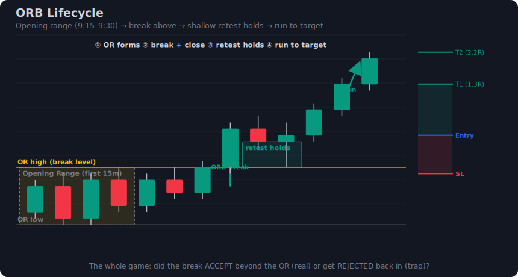
*The ORB lifecycle: the first 15 minutes (9:15–9:30 IST) carve the opening range; price breaks, ideally retests the broken edge, and runs to a measured-move target — or pokes through, fails, and reverses (the trap).*

> [!summary] TL;DR — the spine in one breath
> **The opening-range high/low IS the Initial-Balance boundary** — a qualified level *and* the day's engineered
> liquidity pool, which is why the first break is so often a sweep. **Read the regime first** (§20): trend / neg-GEX →
> the break is real (**breakout play**); balance / pos-GEX / near-max-pain → the break is a trap (**fakeout play**).
> **Window:** 15-min is the balanced default (5-min faster but noisier). **Entry:** 5m close beyond the OR, or the
> tighter **retest**. **Stop:** opposite OR end (or ATR/midpoint). **Target:** range-width measured move → next level,
> **1:1–2:1**, hard time-exit ~2:30 PM. **Option:** ATM / near-ATM (delta 0.4–0.6, ~₹0.5/pt), stop = 20% of premium
> or delta×point-stop, inside the per-instrument budget. **Honest edge:** naive ORB option-buying ≈ 48% win rate with
> ~45% drawdown — the money is in *selectivity*, not the break.

> [!tip] How this guide is organised (5 parts, ~30 sections)
> 1. **Foundations** — what ORB is, the OR/Initial-Balance, the lifecycle, the *honest edge*, chase-vs-fade, the window debate.
> 2. **Day types & timing** — gap up/down/flat, narrow vs wide IB, Dalton's open types, when to stand aside, Tuesday-expiry theta, BankNifty vs Nifty.
> 3. **Confluence** — VWAP, volume expansion, volume profile, order flow / CVD, OI / max-pain, PDH/PDL — the witnesses that say *trust the break or fade it*.
> 4. **The two plays** — ORB **breakout** vs ORB **fakeout**, regime as the decider, the break-and-close vs retest entries, sweep-and-go vs sweep-and-reverse, the day-type decision tree.
> 5. **Execution & options** — stop placement, targets & R:R, the options layer (strike/delta/premium-stop), sizing & expiry/theta, the scorecard, two worked setups, mistakes & SOP.

> [!note] Colour legend
> 🟢 demand / bullish · 🔴 supply / bearish · 🟡 the opening-range level / liquidity · 🔵 entry / order block · 🟦 targets.

> [!warning] Where this sits — and verify before you trade
> ORB is the **deep-dive for the opening-range sub-case** introduced in **[[Intraday Options Decision Engine/note|the Decision Engine]] §10.1**, and a sibling of **[[Breakout Trading/note|Breakout Trading]]** (the general break) and **[[Fakeout Reversal Trading/note|Fakeout Reversal Trading]]** (the failed break). Every exchange-set value (lot sizes, weekly-expiry weekday — Nifty is now **Tuesday**, BankNifty is **monthly-only**) changes — **verify current values on NSE/BSE.** Performance figures are single-source and illustrative, not validated edges.
## 1. What the Opening Range Breakout actually is

The **Opening Range Breakout (ORB)** is one of the oldest, most widely taught intraday templates in India — and one of the most widely *misunderstood*. At its simplest:

> [!note] Plain-English definition
> Mark the **high and the low** that price prints in the first part of the session (the "opening range"). Then wait. The moment price **breaks above that high** you buy direction-up (a **Call / CE** on Nifty), and the moment it **breaks below that low** you buy direction-down (a **Put / PE**). The opposite end of the range is your stop. That's it — that's the whole "system" as the brokers teach it.

But here is the thing this guide will hammer from page one: **that is not a system. It is a *trigger*.** The break of the opening-range high or low is an *event* — a moment that *might* be worth acting on. Whether you actually trade it, fade it, or stand aside is decided by everything *around* the break, not the break itself.

### Why the opening range is a "qualified level," not just a box

To understand ORB properly you have to stop thinking of the opening range as a random rectangle and start seeing it as **structure**. The high and the low of the opening range are the first two genuinely *agreed-upon* prices of the day:

- The OR **high** is the price at which, in the first minutes, sellers were willing to stop the advance. It is the day's first **resistance**.
- The OR **low** is the price at which buyers were willing to stop the decline. It is the day's first **support**.

In market-profile language, that first-hour high/low band is the **Initial Balance (IB)** — the auction's opening agreement on "fair value" for the day. The opening-range high/low *is* the Initial-Balance boundary. (We develop the OR-vs-IB relationship in §2.)

This matters because your custom indicator and your books already teach you to trade **qualified levels** — places where price has demonstrably reacted, where orders are likely resting. The OR high and OR low are exactly that: levels manufactured *by the market itself in real time*, every single day, for free. ORB is simply **the strategy of trading the break of those two levels** — and like any level, the interesting question is never "did price touch it?" but "what did price *do* when it got there?"

> [!tip] The one-sentence reframe
> ORB is not "buy when price leaves the box." ORB is "**a qualified intraday level just got tested — now run my level-playbook on it.**" The box only tells you *where* and *when* to pay attention. (repo: research-orb.md — "An ORB break is just price arriving at the IB boundary (a level).")

### ORB as a trigger inside a bigger engine

Throughout this guide we treat ORB the way the [[Intraday Options Decision Engine/note|Decision Engine]] treats every level: the break is the **trigger**, but the decision is filtered through **regime** (is the market trending or balancing?), **confluence** (does VWAP / volume / OI agree?), and **fakeout-awareness** (is this a real break or a stop-hunt?). A naive "buy every break" approach throws all of that away — which is precisely why naive ORB backtests are mediocre (§4).

Keep this hierarchy in your head for the rest of the guide:

| Layer | What it does | Where it lives |
|---|---|---|
| **HTF bias / regime** | Decides *if* and *which way* you should even be hunting | Daily / 1h chart (see Part 2) |
| **The OR level (15m)** | Defines the *where* — the high/low you watch | 15-minute opening range |
| **The break (the trigger)** | The *event* that wakes you up | Close beyond the OR boundary |
| **The entry timing (5m)** | The *when* — retest / confirmation | 5-minute chart |
| **The options translation** | The *vehicle* — strike, delta, stop on premium | ATM/ITM CE or PE |

> [!warning] The single biggest beginner mistake
> Treating the break itself as the trade. The break is the *least* informative part of an ORB. By the time price has visibly broken the high, every retail screen in India has the same arrow — which is exactly the condition under which smart money *manufactures the move and reverses it* (§3, §5).


*The full ORB lifecycle on Nifty 15-minute: the opening range forms (9:15–9:30), price coils, breaks the high, retests the broken level as support, then runs — with the "trap" variant (poke-and-fail) shown as the dashed reversal path.*

*Animated walk-through of the same lifecycle: watch the OR box freeze at 9:30, the break candle close above the high, the pullback to retest, and the run — versus the trap where price pokes out, closes back inside, and reverses.*

---

## 2. The opening range and the Initial Balance

### The OR window — when the range is "built"

The Indian cash and index-options market opens at **9:15 IST** (after the 9:00–9:08 pre-open auction). The **opening range** is the high and low printed in a defined window *starting at 9:15*. The default we use throughout this guide:

> [!example] Our house default
> **Opening range = 9:15–9:30 IST (the first 15-minute candle / the first three 5-minute candles).** We **mark the OR on the 15-minute chart** for the level read, then **time the entry on the 5-minute chart**. HTF (daily / 1h) sets the bias and regime. (We debate 5 / 15 / 30 / 60-minute windows in §6.)

The choice of *15 minutes* is deliberate: short enough that the range isn't enormous (a 60-minute range can be so wide the stop is unusable for an option buyer), long enough that the first burst of opening noise has settled. (repo: research-orb.md — "First 15 min… short enough to avoid a huge range, long enough to filter noise.")

### The Initial Balance — the first hour's auction

The **Initial Balance (IB)** is a market-profile term for the **range established in the first hour of trade** (in India, roughly 9:15–10:15). It represents the auction's opening attempt to find a "fair" band where two-sided business gets done. The opening *range* (our 15-min window) is the **leading edge** of the IB — the first slice of the same process.

This is why the two concepts are joined at the hip:

| Concept | Window (India) | Role |
|---|---|---|
| **Opening Range (OR)** | 9:15–9:30 (15-min default) | The actionable breakout levels you mark and trade |
| **Initial Balance (IB)** | 9:15–10:15 (first hour) | The fuller auction band; the OR high/low are its first boundaries |

A break of the **OR high/low** is, structurally, an early **range-extension of the Initial Balance** — price leaving the opening agreement to seek value elsewhere. On genuine trend days the IB extends and holds; on balance days price pokes out of the OR and rotates straight back into the IB. (Note: the local book library contains **no formal Dalton/IB or open-type taxonomy** — repo: research-orb-books.md §7; the IB framing here is from market-profile theory, the web stream, and is applied here to the OR.)

### The OR high/low as engineered liquidity — why the first break is often a sweep

Here is the part the brokers leave out and your books scream about. The OR high and OR low are not just *your* levels — **the entire market can see them**, which makes them magnets for resting orders:

- **Above the OR high** sit: breakout buyers' stop-entry orders *and* the protective stops of everyone who shorted inside the range.
- **Below the OR low** sit: breakout sellers' orders *and* the protective stops of everyone who went long inside the range.

That cluster of resting orders just outside the range is **engineered liquidity** — a pool of guaranteed fills. And large participants who need to fill size will often **push price through the obvious level *specifically to trigger that pool*** before reversing. Your books name this repeatedly:

> [!warning] What the books actually say about the first break
> - ICT/SMC: *"Beautiful fake breakout (TRAP) — acquire retail traders' stop losses."* The first break outside the opening/Asian range is modelled as a **stop-raid** — "Turtle soup is the initial fake-out outside the range before the real Judas swing." (repo: research-orb-books.md §3, §8 — SMC)
> - Trader Dale: *"There are a lot of false breakouts through these S/R zones and it just doesn't work so well."* He refuses to trade the raw break and waits for **acceptance** + a retest. (repo: research-orb-books.md §3 — Trader Dale, *Volume Profile*)

So the OR boundary wears **two hats at once**: it is the breakout level you'd trade *and* the liquidity pool that gets swept to fuel a reversal. Which hat it's wearing on any given day is the whole game — and the answer is decided by **acceptance** (does price *close and hold* beyond?) versus **rejection** (does it poke and snap back?). That fork is §3.

> [!note] Cross-link
> This is the same dual nature you study in [[Breakout Trading/note|Breakout Trading]] (the level as launchpad) and [[Fakeout Reversal Trading/note|Fakeout Reversal Trading]] (the level as trap). ORB is simply *both notes applied to the opening range.*

---

## 3. The ORB lifecycle — range, break, retest, run (or trap)

Every ORB plays out as a sequence. Learn the sequence and you stop reacting to single candles and start reading the *story*. There are two endings to the same opening: the **real break** and the **trap**. They look identical until the moment of truth — the **close** of the break candle and the behaviour on the **retest**.

### Stage 0 — The range forms (9:15–9:30)

Price trades inside the opening window and prints a high and a low. Ideally you want to see **coiling / contraction** here — tight, sideways, balanced action. Your books note that the strongest expansions come *out of* compression: *"Open-drive occurs most of the time after a sideways price action (tight price channel)… a low-volatility area where volumes are accumulated, then a strong one-sided movement."* (repo: research-orb-books.md §6 — Trader Dale). A messy, already-trending opening hour produces a wide, low-quality range.

### Stage 1 — The break (the trigger)

Price pushes through the OR high (bullish, CE) or OR low (bearish, PE). **This is the trigger, not the trade.** Critically — *wait for the candle to close beyond the range,* not just wick through it: *"wait for the candle to CLOSE beyond the range to cut the opening whipsaw."* (repo: research-orb.md §3 — Tradersmastermind, Groww)

### The fork: real break vs. trap

> [!example] The REAL break — break → retest → run (CE example)
> 1. **Break:** A 5-min candle *closes decisively* above the OR high, ideally on **expanding volume** and on the right side of **VWAP**.
> 2. **Acceptance:** 1–3 candles *hold* above the broken level — price does **not** fall straight back in. (repo: research-orb-books.md §3 — "1–3 candles of acceptance.")
> 3. **Retest:** Price pulls back to the broken OR high, which now acts as **support** (old resistance → new support). This is your **tighter, books-preferred entry** — the stop is smaller, so the option stop is smaller (§22 in later parts).
> 4. **Run:** Buyers defend the retest and price extends away. **Buy the CE here**, trail beyond 1R on a trend day, exit before the next resistance / your time-stop.

> [!warning] The TRAP — poke → close back in → reverse (the sweep)
> 1. **Poke:** Price spikes *above* the OR high — wicks, grabs the breakout buyers and the resting stops above (the engineered liquidity from §2).
> 2. **Close back in:** The break candle **closes back *inside* the range** — no acceptance. This is the tell. *"a breakout candle that closes back near its open on high volume is not a strong signal."* (repo: research-orb-books.md §8 — Coulling)
> 3. **Reverse:** Price now drives in the *opposite* direction — the failed upside break becomes a **PE** trade (the "turtle soup" / Judas swing). The sweep *was* the setup, just inverted.

The two endings share Stage 0 and the first instant of Stage 1. **The close of the break candle and the retest behaviour are what separate them.** A patient ORB trader does not buy the break; they buy the *confirmation* — either the held retest (real) or the snap-back-and-reverse (trap).

| Stage | Real break (run) | Trap (reverse) |
|---|---|---|
| Break candle close | Closes & holds beyond OR | Closes back **inside** OR |
| Next 1–3 candles | Acceptance above/below | Rejection, return to range |
| Volume on break | Expanding, conviction | Often a spike then fade / absorption |
| Your action | Trade the break **direction** (retest entry) | Fade it — trade the **opposite** direction |
| Maps to | [[Breakout Trading/note|Breakout Trading]] | [[Fakeout Reversal Trading/note|Fakeout Reversal Trading]] |

> [!tip] Reading the close, both directions
> - **Upside poke, closes back in → look for a PE** (failed bull break).
> - **Downside poke, closes back in → look for a CE** (failed bear break).
> The failed break is not a "no trade" — it is *the other trade*. This symmetry is the heart of §5.

---

## 4. The honest edge — why ORB is popular but fragile

ORB is everywhere in India. Every major broker and educator — Zerodha, Groww, Tradejini, Sahi, Angel One — has ORB content, and it is one of the most popular retail intraday templates taught (repo: research-orb.md §6). That popularity is exactly *why* you must be sceptical of it: a setup that every retail screen can draw is a setup whose obvious version is, by construction, crowded and easily exploited.

So what is the *real* edge? The most concrete numbers available come from a single proprietary Zerodha backtest, and they are sobering.

> [!warning] The honest numbers — label as illustrative, single source
> Zerodha's "In The Money" backtest of Nifty **weekly-options** ORB (≈ Jan 2022 – Feb 2026):
> - **Option BUYING:** **~48% win rate** with **~45% maximum drawdown.** A near coin-flip with brutal drawdown.
> - **Option SELLING:** marginally **better** win rate and only **~6% maximum drawdown** — a very different risk profile.
> - The widely-shared **"+91.6% return"** claim (a 30-min-window backtest) was **REFUTED (0 of 3 verification votes)** — do **not** trust that number.
>
> These are **single-source, period-specific, broker-published figures** — *illustrative, not validated.* (repo: research-orb.md §6, §2)

What does a ~48% win rate with ~45% drawdown actually *tell* you? That **naive ORB option-buying is roughly a coin-flip that occasionally tries to bankrupt you.** The break, on its own, carries almost no edge. The downside is amplified for *buyers* specifically because a wrong ORB option trade bleeds **premium + theta** while you wait to be proven wrong (more on theta and expiry in later parts).

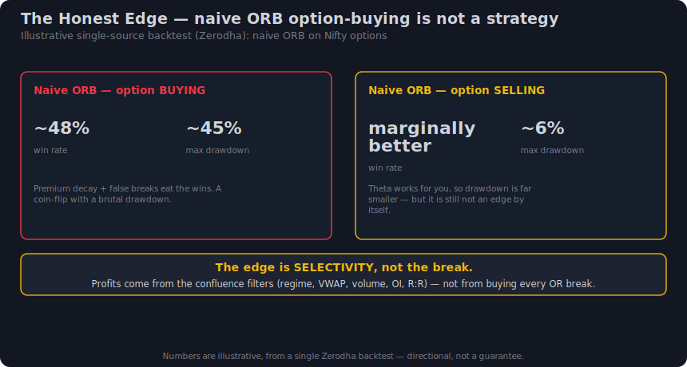
*The honest-edge picture: ORB option-buying clusters near a 48% win rate with a punishing ~45% max drawdown, while option-selling shows a similar/slightly-better hit rate at far lower (~6%) drawdown — illustrative Zerodha backtest, single source.*

### The punchline

> [!summary] Where the edge actually lives
> The edge is **not in the break.** The edge is in **selectivity** — only taking ORB breaks that are *regime-aligned, confluence-confirmed, and fakeout-screened*, with disciplined strike/stop choice. Strip those filters away and you are left with the coin-flip above. **The break is free; the discretion is the alpha.** (repo: research-orb.md §6 — "the edge comes from selectivity… not from the break itself.")

This single finding justifies the entire structure of this guide: we spend far more pages on *when not to trade an ORB* and *how to tell a real break from a sweep* than on the trivial mechanics of the break itself.

---

## 5. Chase the break or fade the trap? — the core tension

There is a genuine, unresolved war in the literature, and you must understand both camps to trade ORB at all.

> [!example] Camp A — "Chase the break" (web / brokers)
> Mark the opening range. Enter on a **break** of the high (CE) or low (PE). Stop at the opposite end. Target 1:1–2:1. This is the retail consensus across Tradejini, Groww, Tradersmastermind, Sahi, and Zerodha. It is simple, mechanical, and — per §4 — *barely* profitable in naive form. (repo: research-orb.md §1)

> [!warning] Camp B — "Fade the trap" (your books: Dale, ICT/SMC)
> The first break is a **stop-hunt** — a manufactured move to grab retail stops before the *real* move runs the other way. Trader Dale flatly rejects naive breakouts (*"a lot of false breakouts… doesn't work so well"*); ICT/SMC frame the first range break as the **Judas swing / turtle soup** trap. The genuine trade is the **reversal**, or — if the break *is* real — the **retest** after 1–3 candles of acceptance, which gives a tighter stop. (repo: research-orb-books.md §3, §8; research-orb.md §1)

These look like opposites. They are not. **They are the same fork, resolved by regime.**

### The resolution — regime decides

| Market regime (set by HTF) | What the OR break usually is | Correct action |
|---|---|---|
| **Trending / directional day** (HTF momentum, open-drive, IB extends) | A **real** range-extension breakout | **Chase the break** (Camp A) — but enter on the retest for a tighter stop |
| **Balancing / range day** (HTF rotational, prior-day inside, IB holds) | A **sweep** of OR liquidity, then mean-revert | **Fade the trap** (Camp B) — trade the snap-back reversal |

So the question is never "am I a breakout trader or a fade trader?" — it is **"what regime am I in *today*, and which behaviour does that regime favour?"** On a trend day, fading the break is fighting the tape; on a balance day, chasing the break is feeding the sweep.

> [!note] This is literally the Decision Engine's fork
> The [[Intraday Options Decision Engine/note|Decision Engine]] §17–24 already runs this exact decision tree at every qualified level:
> - **BREAK** → real breakout, trade the break direction (Camp A).
> - **HOLD** → failed break / level holds → fakeout-reversal, fade it (Camp B).
> - **WAIT** → no acceptance yet, no confluence → stand aside.
>
> ORB does not *override* this fork — it **feeds** it. The OR break is the trigger; the engine's regime-gated HOLD/BREAK/WAIT read is the decision. (repo: research-orb.md §1 — "Resolution = the engine's existing fork.")

> [!tip] How to hold both ideas at once
> Walk in with a *bias* (from HTF regime) but a *plan for both endings.* If the break holds → you're on the retest (CE/PE in the break direction). If it pokes-and-fails → you flip and take the reverse (PE/CE). The crowd commits to "the break"; you commit to "**whichever resolution the level confirms.**"

---

## 6. The opening-range window debate (5 / 15 / 30 / 60 minutes)

How long should the opening range be? This is **genuinely contested** — there is **no backtest-proven optimal window.** Different windows trade off *speed of entry* against *false-break rate* and *range width* (which becomes your stop, and therefore your option-stop budget).

> [!example] The trade-offs in one breath
> A **shorter** window = earlier entry, smaller range, *tighter stop* — but **more false breaks** (opening noise hasn't settled). A **longer** window = fewer, cleaner signals — but a *wider range*, a bigger stop, and you may miss the day's first move while you wait.

| Window (from 9:15) | Speed | False-break risk | Range / stop width | Verdict & source |
|---|---|---|---|---|
| **First 3 min** | Fastest | **Very high** — opening volatility | Tightest | Many false breaks; needs heavy validation (repo: research-orb.md — Medium/redsword) |
| **First 5 min** | Fast | **High** — earlier but whippy | Tight | Aggressive; good for scalps, more false signals (repo: research-orb.md — Tradersmastermind, Groww, MetroTrade) |
| **First 15 min** ⭐ | Balanced | Moderate | Moderate | **Practitioner default & our house default** — best balance (repo: research-orb.md — Tradejini, Sahi, Angel One) |
| **First 30 min** | Slower | Lower | Wider | Solid; note the famous "+91.6%" 30-min backtest was **REFUTED** (repo: research-orb.md) |
| **First 60 min (full IB)** | Slowest | Lowest | **Widest** — stop may be unusable for buyers | Fewest, cleanest signals; large stop (see §2 IB) |
| **9:15–11:15 (2 hr)** | Slowest of all | Lowest | Widest | **Zerodha's options backtest** found this *most reliable* for Nifty options — trades fewer, cleaner signals (repo: research-orb.md — single proprietary backtest) |

### How to choose

> [!tip] House guidance
> - **Default to 15 minutes** for the level read. It is the balanced choice the most independent practitioners converge on.
> - **Mark the OR on the 15m chart, time the entry on the 5m chart**, and let **HTF set the regime.** A 5m chart inside a 15m range gives you retest precision without the 5m window's false-break tax.
> - If you specifically trade **Nifty *options*** mechanically, Zerodha's evidence favours a **wider 9:15–11:15 window** for reliability — fewer, cleaner trades, at the cost of width. Treat as one data point, not gospel.
> - **There is no proven optimum.** Pick one window, *log it, and keep it constant* so your own results are comparable. Switching windows trade-to-trade is how traders fool themselves. (repo: research-orb.md §2 — "no single backtest-proven optimal window.")

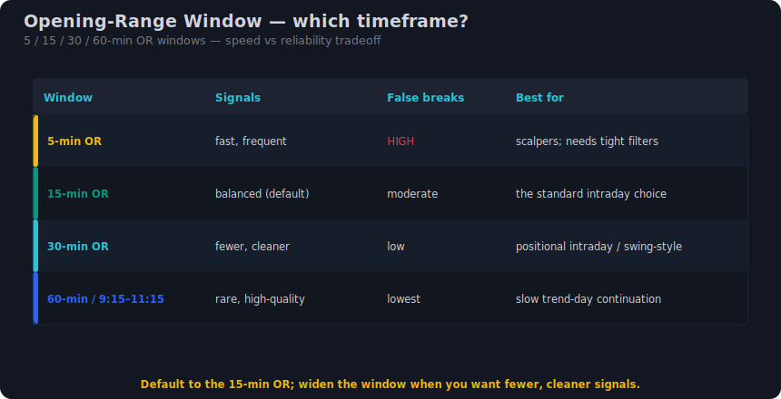
*The same Nifty open marked with 5, 15, 30 and 60-minute opening ranges side by side — note how the range (and therefore the stop) widens with the window, and how the 5-minute box generates the earliest but noisiest break signal.*

> [!summary] ORB is a *trigger* on a *qualified level* (the OR high/low = the Initial-Balance boundary and a liquidity pool); its naive edge is a coin-flip (~48% WR, ~45% DD — illustrative), so the alpha is selectivity — regime decides whether you chase the break or fade the sweep.

---

## 7. Reading the open — gap-up, gap-down, flat

Before you can trade an Opening Range Breakout you have to read *how the range itself is being built*. The opening range (OR) is not a neutral box — it is the first auction of the day, and the **type of open** tells you a great deal about whether the break that follows will extend or fail. The three coarse open types are **gap-up**, **gap-down**, and **flat** (open near previous close). Each forms the OR differently and each resolves the break differently.

> The single most useful habit a beginner can build is to *classify the open before 9:30* and only then look at the OR break. The classification is your first, cheapest filter.

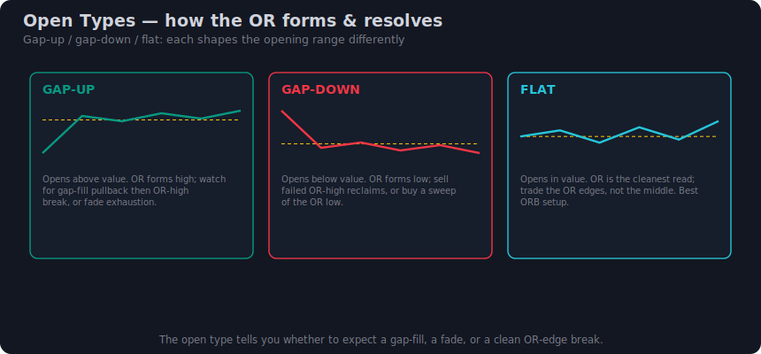
*Gap-up, gap-down and flat opens: how the 9:15–9:30 opening range forms in each, and the typical resolution of the break.*

**The three opens, side by side.**

| Open type | What it is (Nifty pts) | How the OR forms | Typical break behaviour | First instinct |
|---|---|---|---|---|
| **Gap-up** | Opens **above** prior close (small +20–40, large +80+) | Range builds *above* yesterday's value; PDH often inside or below the OR | Gap **goes** on trend/news days (CE break extends); gap **fades** on positive-GEX balance days (PE — fill toward prior close) | Watch whether the gap *holds* the first 15m |
| **Gap-down** | Opens **below** prior close | Range builds *below* value; PDL often inside or above the OR | Gap-down **continues** on risk-off days (PE break runs); **fills** on a relief day (CE — back into value) | Same — does the gap hold or get bought |
| **Flat** | Opens **near** prior close (±~15 pts) | Range builds *inside* prior value; OR sits on overnight balance | Most rotational — frequent first-candle whipsaw; cleaner break needs volume + a clear side of VWAP | The textbook OR, but also the most trap-prone |

**Why open type matters for the break.** A gap is information: it means overnight order flow has *already* repriced the index, and the OR forms on fresh, untested territory. That cuts both ways:

- **Gap-and-go.** A gap-up that *holds* its open (price never trades back into the gap during 9:15–9:30) and then breaks the OR high is the highest-quality ORB you will get — the gap confirms one-sided conviction and the break confirms continuation. This is Dale's **open-drive** in disguise (repo: research-orb.md §3; Trader Dale, *Volume Profile*, Strategy 2). Buy CE.
- **Gap-and-fade.** A gap that *immediately* gets sold back toward the prior close is a **failed auction** — the gap was a liquidity grab, not conviction. Here the OR-high break is the trap and the real trade is the OR-*low* break (PE) toward the gap fill. This is the books' "first break is a stop hunt" warning made concrete (repo: research-orb-books.md §8).

> [!tip] Gap-fill as a target, not a setup
> On a fading gap, the **prior close** is a magnet. If you take the OR-low break (PE) on a gap-up that's rolling over, the gap fill (yesterday's close) is a natural T1. The reverse applies to a recovering gap-down (CE toward the close). Hedge: actual gap-fill statistics vary by regime — treat it as a *bias*, not a guarantee.

**Anchored VWAP on the gap.** The cleanest objective gap read comes from anchoring VWAP to the first candle *after* the gap. If price holds above that anchored VWAP, the gap is being accepted (gap-and-go bias); if it loses it, the gap is being rejected (fade bias). (repo: research-orb-books.md §6; Trader Dale, *VWAP*, "Anchoring VWAP to gaps".)

**Scale notes.**
- **BankNifty/Sensex** gaps are 2–3× the Nifty point scale — a "small" BankNifty gap is +60–100 pts. The *logic* is identical; only the numbers and your stop budget change (see §12).
- A flat Nifty open is the most common day and the one where naive ORB does worst (most whipsaw). Demand more confluence (§13–18) before trading a flat-open break.

---

## 8. Narrow vs wide Initial Balance

If you remember one early day-type tell, make it this one. The **Initial Balance (IB)** is the range of the first hour (9:15–10:15 in NSE terms); the *opening range* (9:15–9:30) is its leading edge. The **width of the IB relative to the day's normal range** is the best early predictor of whether the day will *trend* (break and extend — trade the ORB) or *rotate* (range-bound — fade the edges).

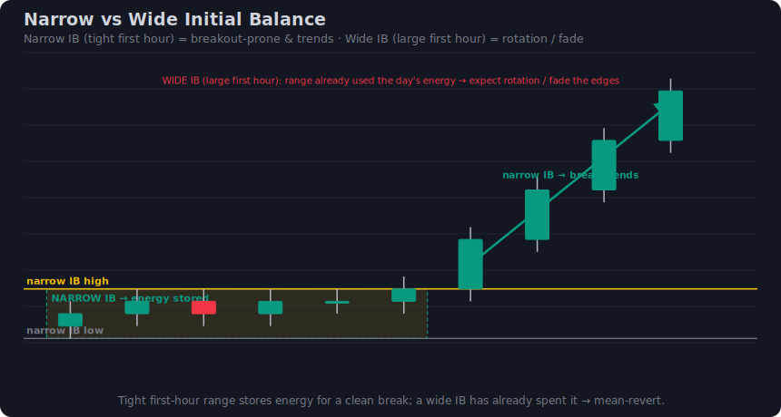
*Narrow IB (coiled, breakout-prone) vs wide IB (range likely spent, rotation/fade). Width is measured against average daily range (ADR).*

**The core relationship.**

| IB width vs ADR | What it implies | Day type | ORB stance |
|---|---|---|---|
| **Narrow** (< ~30–40% of ADR) | Market is *coiled* — little of the day's range spent | Trend / breakout-prone | **Trade the break** — high odds of range extension (CE on high break, PE on low break) |
| **Normal** (~40–60% of ADR) | Average opening energy | Mixed | Trade the break *only* with confluence (§13–18) |
| **Wide** (> ~60–70% of ADR) | Most of the expected range *already spent* in the first hour | Balance / exhaustion | **Fade the edges** — a break of a wide IB often reverts (rotation); avoid chasing |

**Why this works.** A day has a finite "budget" of range (roughly its ADR). If the first hour is *tight*, the budget is intact and a break has room to run — that is the trend day the ORB lives for. If the first hour is already *wide*, much of the budget is spent, so a break of that wide IB is statistically more likely to be a fakeout into a fading move — the books' "false breakout / range already rotated" case (repo: research-orb-books.md §8; Trader Dale, *Investing with VP* — "Why Not Trade This as a Breakout Strategy").

This is the *quantified* version of Dale's qualitative observation that the **open-drive occurs most often after a sideways, low-volatility, tight-channel build-up** — coiled energy releasing (repo: research-orb-books.md §6, Strategy 2). A narrow IB *is* that coil.

> [!tip] How to measure it without tools
> 1. Compute the index's **ADR** (e.g., 20-day average of daily high−low). For Nifty this is often ~150–250 pts; BankNifty ~400–700; verify current values on your platform.
> 2. At 10:15, take the **IB range** (first-hour high − low).
> 3. **IB ÷ ADR.** Under ~0.35 → narrow/coiled (lean trade-the-break). Over ~0.65 → wide/spent (lean fade/stand-aside).

> [!warning] Narrow ≠ automatic buy
> A narrow IB raises the *odds* a break extends; it does not remove the first-break-trap risk. You still need acceptance (close beyond) and a confluence (VWAP side + volume, §13–18). A narrow IB that breaks on *no volume* is still a coin-flip.

**Scale note.** The IB÷ADR ratio is *unit-free*, so it transfers cleanly from Nifty to BankNifty to Sensex without rescaling — which is exactly why it is the single best portable day-type tell.

---

## 9. Dalton's open types — drive, test-drive, rejection-reverse, auction

Jim Dalton's Market Profile work gives the most useful taxonomy of *opening behaviour* — four open types, ranked by how much **confidence** the market is expressing about direction. This is the framework the books only echo partially (repo: research-orb-books.md §7 notes Dalton/IB is "largely absent" from the local library and was filled by the web stream — repo: research-orb.md). Learning the four lets you instantly grade an ORB.

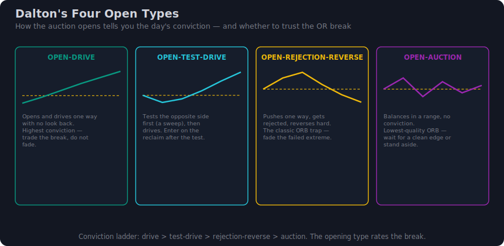
*Dalton's four open types ordered by directional confidence: open-drive (highest) → open-test-drive → open-rejection-reverse → open-auction (lowest).*

| Open type | What it looks like | Market confidence | ORB implication |
|---|---|---|---|
| **Open-drive** | Opens and **drives one way immediately**, never looking back; opening print is the day's extreme | **Highest** | **Best ORB.** The break is the open itself. Enter the first pullback / OR-edge break in the drive direction (CE up-drive, PE down-drive) |
| **Open-test-drive** | Briefly **tests** the other side (a quick poke/sweep), then *reverses and drives* the intended way | High | **Strong ORB after the test** — the test sweeps stops, then the real drive begins. Enter on the reclaim/break *back through* the OR |
| **Open-rejection-reverse** | Pushes one way, gets **firmly rejected**, and reverses hard through the open | Medium (directional, but the *other* way) | **Fade setup.** The first OR break (in the initial push direction) is the trap; trade the reversal break of the opposite OR edge |
| **Open-auction** | Chops **around the open**, both sides, no commitment | **Lowest** | **Stand aside.** This is the whipsaw machine — no edge in either OR break until structure resolves |

**How to read them in real time.**

- **Open-drive (best).** No meaningful pullback in the first few candles; volume expands on the drive; price is firmly on one side of VWAP. This maps directly onto Dale's **open-drive**: "a sudden and strong one-sided price movement… the place where the strong buying candle opened is strong support" (repo: research-orb-books.md §1). Trade *with* it.
- **Open-test-drive.** The opening minutes poke through one OR edge, fail to find continuation, snap back, *then* drive the other way. The initial poke is a stop raid — ICT's "Judas swing / turtle soup" (repo: research-orb-books.md §3, §8). Your entry is the **reclaim**, not the poke.
- **Open-rejection-reverse.** Price extends, gets aggressively rejected (a strong wick / absorption candle), and reverses through the open. This is the day where naive "buy the OR-high break" loses — you want the *opposite* edge break.
- **Open-auction.** Two-sided, overlapping candles around the open, no volume expansion, price flip-flopping across VWAP. **No trade.** Wait for the IB to resolve (see §10).

> [!note] How the four map to the two ORB plays
> **Open-drive** and the *resolved* **open-test-drive** are the **breakout** play (trade the break — covered in Part 4 §19). **Open-rejection-reverse** is the **fakeout** play (fade the break — Part 4 §20). **Open-auction** is the *stand-aside* (§10). The whole guide's "break vs fakeout, regime decides" spine is just these four open types, sorted.

---

## 10. When to trade and when to stand aside

ORB's edge is *selectivity*, and most of that selectivity is choosing **not** to trade. Naive ORB option-buying is a coin-flip (~48% win rate) with brutal drawdown precisely because people take every break (repo: research-orb.md §6). Here is the explicit go / no-go.

**The first-candle whipsaw.** The 9:15 candle is the noisiest of the day — opening volatility, order-imbalance unwinds, and overnight-position adjustment. A break *during* the first candle is the lowest-quality signal in the entire strategy.

> [!warning] Wait for the close beyond the range
> The corroborated convention is to **enter only after a candle CLOSES beyond the OR**, not on the first touch/poke. This single rule cuts most of the opening whipsaw (repo: research-orb.md §3; Tradersmastermind, Groww). Mark the OR on the **15m**, then time the entry on the **5m** close beyond it.

**The explicit go / no-go.**

| Condition | Signal | Action |
|---|---|---|
| Open-drive or resolved test-drive | One-sided, volume expands, on right side of VWAP | **GO** — trade the break (best odds) |
| Narrow IB + 5m close beyond OR + volume | Coiled → release with confirmation | **GO** — highest-confluence break |
| Wide IB break | Range largely spent | **NO-GO** (or fade only with a plan, §8) |
| Open-auction / choppy overlap | Both sides of VWAP, no volume | **STAND ASIDE** — no edge |
| First-candle poke (no close) | Touch beyond OR, no 5m close | **WAIT** for the close |
| News / event open (RBI, Fed, CPI, Budget) | Two-way spike risk; spreads blow out | **STAND ASIDE** until the OR settles |
| OR not yet complete (before 9:30) | Range still forming | **WAIT** — no signal exists yet |

**Choppy / auction days.** If by ~10:15 the IB is wide and overlapping and price has crossed VWAP repeatedly, the day is in **balance** — the ORB has no edge. On these days the *better* expression is to fade the IB extremes (rotation), or simply stand aside. The books are blunt about this: "such a strategy gives too many bad signals" when the market is rotating (repo: research-orb-books.md §8).

**News / event opens.** On RBI policy, US Fed/CPI nights, Union Budget, and large global gaps, the open is a two-way spike, spreads on options widen, and the OR is meaningless until the dust settles. The single best rule on these days: **let the open settle** — do not trade the OR until at least one clean 15m structure forms (repo: research-orb.md §3).

> [!tip] One trade per day discipline
> A widely-used governor: **one ORB trade per day**, with a **hard time-exit** (e.g., square off by ~2:30 PM IST) (repo: research-orb.md §3). This forces you to wait for the *best* break instead of revenge-trading every poke — the discipline that converts a coin-flip into an edge.

---

## 11. Expiry-day ORB — the Tuesday Nifty theta trap

This is the most important *India-specific, 2026-current* fact in the whole guide, and it changes how you trade the ORB on one day every week.

> [!warning] Nifty weekly expiry is now Tuesday
> Since **1 September 2025**, Nifty's weekly options expire on **Tuesday** (shifted from Thursday). Sensex took Thursday. So the **weekly-expiry-day ORB now lands on Tuesday for Nifty** (repo: research-orb.md §7). Always verify the current expiry day on NSE/BSE — exchange schedules change.

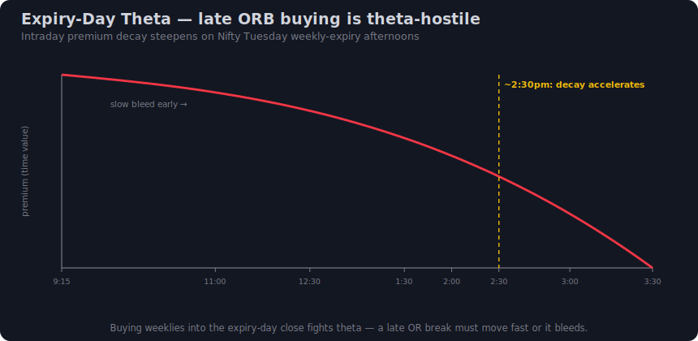
*Tuesday Nifty weekly expiry: accelerated theta decay late in the day makes ORB option-buying theta-hostile. Premium bleeds even when the spot break is mildly correct.*

**Why expiry day is hostile to ORB *buying*.** On expiry day, the weekly option you'd buy on an ORB break has almost no time value left. Two greeks dominate:

- **Theta (time decay) accelerates** as expiry approaches — by Tuesday afternoon, premium bleeds fast. An ORB CE/PE bought *late* on Tuesday can lose money even if the spot moves *slightly* your way, because decay outruns the small delta gain.
- **Gamma is highest** near expiry at ATM — premiums whip violently around the strike. This *helps* a fast, clean ORB drive (big move, big payoff) but *punishes* a slow, grinding break (you get whipsawed and decayed simultaneously).

**The practical rule.**

| Time on Tuesday | Theta/gamma state | ORB buying stance |
|---|---|---|
| **Morning (9:15–10:30)** | Decay present but a real drive can still pay (gamma works for you) | Tradeable *if* it's a clean open-drive / narrow-IB break — take quick profits |
| **Midday onward** | Theta accelerates, time value collapsing | **Theta-hostile** — ORB option-*buying* is a losing proposition on slow breaks |
| **Late afternoon** | Premium near-zero time value, pure gamma chaos | **Stand aside** for buying; only structured selling-side traders should be here |

**What to do instead on Tuesday afternoon.**

1. **Stand aside** for option-buying ORB — the cleanest choice for most retail traders.
2. **Consider the selling side.** The research notes option *selling* had a marginally better win rate and far smaller drawdown (~6% vs ~45% for buying) (repo: research-orb.md §6). On expiry afternoon, *selling* the OR fade (e.g., selling the side the OR break failed at) lets theta work *for* you — but this requires margin, defined risk, and is not a beginner move.
3. **Trade the spot/futures expression** of the ORB if you must take the directional view, removing the theta drag entirely.

> [!note] Cross-link
> The expiry-day theta/gamma mechanics are developed in full in [[Intraday Options Decision Engine/note|Decision Engine]] §35 — read it alongside this section. The ORB-specific takeaway: **the same break that's a buy on a Monday can be a stand-aside on a Tuesday afternoon.** The calendar is part of the setup.

**Scale note.** BankNifty no longer has this Tuesday trap because **BankNifty weekly expiry was discontinued** — it trades **monthly only** (see §12). Its expiry-day theta crunch happens once a month (last Tuesday/Wednesday of the series — verify on NSE), not weekly, which materially changes the ORB calendar between the two instruments.

---

## 12. BankNifty (monthly) vs Nifty (weekly) ORB

The post-SEBI (Nov 2024) framework split the two flagship indices into very different option environments, and that changes which one you should prefer for an intraday ORB.

> [!warning] Current structural facts (verify on NSE)
> - **Nifty 50** retains **weekly** options — expiry **Tuesday**.
> - **BankNifty / FinNifty / Midcap / Next-50** are **monthly/quarterly only** — *weekly discontinued*.
> - **BSE Sensex** keeps **weekly** options — expiry **Thursday**.
> (repo: research-orb.md §7.)

**The two ORB environments compared.**

| Dimension | **Nifty (weekly)** | **BankNifty (monthly)** |
|---|---|---|
| Expiry cadence | Weekly — **Tuesday** | Monthly only |
| Weekly gamma/theta | **Yes** — strong near-expiry dynamics (the §11 trap) | **No weekly gamma** — calmer premium decay most days |
| Point scale | Base (Nifty pts) | **~2–3× Nifty** point scale |
| OR width (typical) | Smaller absolute pts | Larger absolute pts (wider OR) |
| Stop budget (pts) | Smaller | **Scales up ~2–3×** with the wider OR |
| Premium behaviour intraday | Sharp gamma moves near Tuesday expiry | Steadier; trends in larger absolute swings |
| Best ORB use | Sharp directional break on a *non-expiry* day; fast scalps | Cleaner *trend-following* ORB without weekly theta drag |

**How OR width and stop budget scale.** BankNifty's larger point scale means everything *proportionally* enlarges — the OR is wider, the stop (opposite OR end, or ATR-based) is a bigger number of points, and the option you buy moves in bigger premium swings. The *method* doesn't change; the *budget* does.

- If your Nifty ORB stop is, say, ~30–40 pts (opposite OR end on a narrow-IB day), the equivalent BankNifty stop will commonly be ~80–120 pts — roughly 2.5–3× — because its OR is that much wider. Always re-derive the point budget per instrument; never copy Nifty point values onto BankNifty.
- Convert the index-point OR stop to a **premium stop** via delta (or use the 20%-of-premium rule), and keep it inside the per-instrument point budget (repo: research-orb.md §5).

**Which to prefer intraday.**

| Goal | Prefer | Why |
|---|---|---|
| Clean **trend-day ORB** without theta/gamma noise | **BankNifty (monthly)** | No weekly gamma whip; premium decays slowly; rides large swings |
| Fast **directional scalp** with big payoff on a real drive | **Nifty (weekly)**, non-expiry day | Weekly gamma amplifies a sharp break |
| Trading **on Tuesday** | **BankNifty** (or Nifty *spot/futures* / selling-side) | Avoids the Nifty Tuesday theta trap (§11) |
| Smaller account / tighter risk | **Nifty** | Smaller point scale → smaller absolute stop budget |

> [!tip] The practical default
> For most beginners learning the ORB, **BankNifty monthly options on a clear trend day** are more forgiving — the absence of weekly gamma means a correct-but-slow break still pays, instead of being eaten by decay. Graduate to **Nifty weekly** for the sharper, faster, gamma-amplified break once your timing and exits are reliable — and respect the **Tuesday expiry trap** (§11) every week.

> [!summary] Part 2 — day types decide whether you trade the ORB at all: classify the open, measure narrow-vs-wide IB (the best early tell), read Dalton's four open types, stand aside on auction/news/wide-IB days, respect the Nifty Tuesday theta trap, and scale OR width and stop budget when moving between Nifty (weekly) and BankNifty (monthly).

---

## 13. VWAP — the side-of-fair-value filter

The Opening Range gives you a **line in the sand** (the OR high and OR low). It says *nothing* about whether a break of that line is the start of a real move or a stop-hunt designed to fail. That verdict is delivered by a stack of **witnesses** — and the first, cheapest, most universally available witness is **VWAP**.

VWAP (Volume-Weighted Average Price) is the average price every rupee of volume has paid since the session opened. It is the day's centre of gravity — the line institutions benchmark fills against. The single most useful thing it tells an ORB trader: **which side of fair value the break is happening on.**

> [!tip] The one-line VWAP rule for ORB
> **Long the OR-high break only when price is ABOVE VWAP. Short the OR-low break only when price is BELOW VWAP.** A break *against* VWAP is a break swimming upstream — most of the day's volume is leaning the other way, and that is the textbook profile of a fakeout.

Why this works: a break of the OR high *while price is already above VWAP* means buyers have been in control of fair value all morning **and** are now expanding the range. The two forces point the same way. A break of the OR high *while price is below VWAP* means buyers are trying to expand the range while the average participant is still underwater on the long side — a thin, easily-reversed move. (repo: research-orb.md §4 — "break on the right side of VWAP"; Author: Trader Dale, *VWAP* — pullbacks to VWAP as the trade trigger.)

**VWAP reclaim / rejection at the OR edge.** The highest-quality ORB signals happen when the OR boundary and VWAP roughly *coincide*:

| What you see | Read | Action |
|---|---|---|
| Price reclaims VWAP **and** closes above OR high together | Twin confirmation — fair value flips bullish at the breakout level | 🟢 Highest-conviction CE break |
| Price pokes above OR high but **rejects** VWAP from below | The break is happening against fair value | 🔴 Fade candidate / stand aside |
| Price loses VWAP **and** closes below OR low together | Twin confirmation bearish | 🔴 Highest-conviction PE break |
| Price dips below OR low but **reclaims** VWAP from above | Failed breakdown — sellers can't hold fair value | 🟢 Fakeout-long (see §18) |

> [!example] Nifty worked example
> Nifty opens flat, OR (9:15–9:30) = **23,180 / 23,120**. VWAP develops at ~23,150 (inside the range). At 9:42 a 5-min candle closes at **23,205** — above the OR high **and** above VWAP, with VWAP now sloping up. Both witnesses agree → take the **CE**. Contrast: had that same candle printed while VWAP sat at 23,230 (price still below it), the break would be against fair value — skip it.

> [!note] BankNifty / Sensex
> BankNifty's wider ATR means VWAP and the OR edge are usually *farther apart* — you rarely get the clean "VWAP = OR edge" coincidence, so weight VWAP-slope direction over exact-touch. Sensex behaves like Nifty; anchor VWAP to the 9:15 open as usual. Use an **anchored VWAP from the opening candle after a gap** for gap days (Author: Trader Dale, *VWAP* — anchoring to the gap candle).

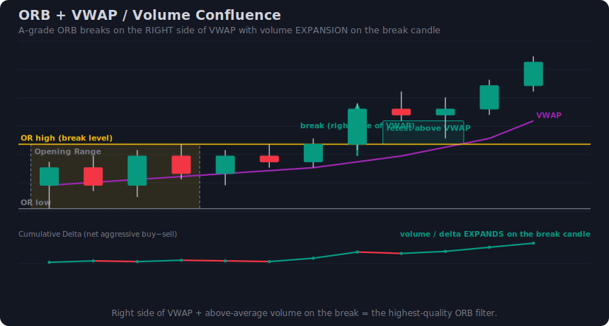
*VWAP as the side-of-fair-value filter, paired with volume expansion: the trustworthy break closes beyond the OR edge on the correct side of VWAP with a fat volume bar; the trap pokes through against VWAP on thin volume.*

## 14. Volume expansion — effort behind the break

A breakout is a claim that the balance of aggression has shifted. **Volume is the receipt.** If the candle that breaks the OR does so on volume meaningfully *above* the morning's average, real money is behind the move. If it slips through on **declining or below-average volume**, you are looking at the single most reliable fakeout tell there is — *a low-volume poke through the OR.*

This is the core of Volume Price Analysis: a wide-spread breakout candle is only trusted **where it is confirmed with volume**; a wide candle on shrinking volume is "effort without result" and is the classic anomaly that precedes a reversal. (Author: Anna Coulling, *Volume Price Analysis* — validate price with volume; repo: research-orb-books.md §6.)

> [!warning] The low-volume poke
> The most common ORB trap: price ticks one or two points past the OR high on a thin, narrow-range candle, triggers the breakout orders of everyone watching the same level, then immediately collapses back inside. **No volume = no conviction = no trade.** Wait for the *close* beyond the range, and demand that the closing candle's volume expands.

**What "expansion" means in practice.** You are not looking for a precise multiple — you are eyeballing relative effort:

| Volume on the break candle | Interpretation | Trust level |
|---|---|---|
| Clearly larger than the prior 3–5 bars (a visibly fat bar) | Genuine effort — aggressors stepped in | 🟢 Trust the break |
| Roughly average / in-line | Ambiguous — needs other witnesses (VWAP, OI) to carry it | 🟡 Conditional |
| Smaller than recent bars (a thin poke) | Effort is absent — likely a stop-raid | 🔴 Fade / skip |
| Huge bar that **closes back inside** the OR | Absorption — sellers met the buyers and won | 🔴 Strong fade signal |

That last row matters: a *big* volume bar is not automatically bullish. A high-volume candle that pokes out and **closes back near its open inside the range** is **absorption** — large size was used to *stop* the breakout, not start it. (Author: Coulling — high-volume candle closing back near its open = not a strong signal.)

> [!tip] India data caveat — index "volume"
> The Nifty/BankNifty **spot index has no traded volume of its own**; the volume you read is from the **futures (NIFTY1!)** or the option you are trading. Read effort on the **futures chart**, not the index. Option-leg volume is distorted by IV and is *not* a clean breakout-effort proxy — verify on your feed.

> [!note] BankNifty / Sensex
> BankNifty futures volume is thinner per tick than Nifty's and spikes harder around the open — calibrate "expansion" to BankNifty's own recent bars, not Nifty's. On Sensex, futures liquidity is lighter again; lean more on VWAP and OI when volume is too noisy to read cleanly.

## 15. Volume profile, Initial Balance and the VPOC

Step back from the candles and the Opening Range becomes something richer: the **first chapter of the day's volume profile.** In Market-Profile language the 9:15–10:15 first hour is the **Initial Balance (IB)**, and the OR you marked (15-min or 30-min) is the *developing* IB. Where the day's volume is stacking up — and where it is *thin* — tells you whether a break will **run** or **stall**.

> [!note] Vocabulary, fast
> - **VPOC** (Volume Point of Control) — the single price with the most traded volume so far; the day's magnet.
> - **Value Area** — the price band holding ~70% of volume; "accepted" prices.
> - **HVN** (High-Volume Node) — a thick shelf of volume; price *slows down* here (lots of willing traders to absorb a move).
> - **LVN** (Low-Volume Node) — a thin gap in the profile; price *accelerates* through (nobody to trade against).

**The rule that turns the profile into an ORB filter:**

> [!tip] Break INTO an LVN runs; break INTO an HVN stalls
> When the OR break is pointed at a **low-volume node** (thin air above the OR high / below the OR low), expect a fast, clean extension — there is no inventory to absorb it. When the break is pointed straight into a **high-volume node** (a thick prior-day shelf just beyond the OR), expect it to **stall and reverse** — there are too many willing counterparties. Same break, opposite expectation, decided entirely by what lies *beyond* the level.

This is why two visually identical OR-high breaks behave completely differently: one had clear air above it, the other ran into yesterday's value shelf 20 points up.

**Value position vs the OR.** Where the developing value area sits relative to the open also frames the day:

| Profile shape at the OR | Read | Bias |
|---|---|---|
| Narrow IB, VPOC dead-centre, balanced | Coiled — a clean break has room to extend | Breakout-prone (trade the break) |
| Wide IB, value already broad | Range is doing the day's work *inside* itself | Rotation/fade-prone (fade the edges) |
| Price accepting away from VPOC, building a new shelf | One-timeframe trend forming | Trade *with* the developing direction |
| Price breaks then is pulled back to VPOC | VPOC magnet wins — break was premature | Fade back to value |

(repo: research-orb.md §4 — VP/IB as engine witnesses; Author: Trader Dale, *Order Flow* — imbalances/HVN at the start of strong trends; *Volume Profile* — open-drive after a low-volatility shelf.)

> [!warning] India reality — building the profile
> A live, accurate intraday volume profile / footprint on Nifty needs a **tick or depth-of-market feed** most retail terminals don't provide cleanly. If you can't render a true profile, **approximate** it: yesterday's high-volume zones, the prior-day VPOC, and obvious congestion shelves act as your HVN/LVN map. For the full footprint-on-Indian-data discussion see the next section and the sibling note.

> [!note] BankNifty / Sensex
> BankNifty's IB is proportionally **wider** — a "narrow IB" on Nifty might be 60 points; on BankNifty it could be 150+. Judge narrowness relative to the instrument's own 20-day average IB, not in absolute points.

## 16. Order flow and CVD on the break (India data reality)

One layer deeper than volume is **order flow**: not just *how much* traded, but *who was aggressive* — buyers lifting the offer or sellers hitting the bid. The compact summary of that is **CVD** (Cumulative Volume Delta) — a running total of aggressive-buy minus aggressive-sell volume.

> [!tip] The CVD rule for ORB
> **CVD must confirm the break — no divergence.** On an OR-high break, CVD should be **making new highs alongside price** (aggressive buyers genuinely pushing). If price breaks the OR high but **CVD fails to make a new high** (a *bearish divergence*), the break is being absorbed — that is a fakeout signature. Mirror for OR-low breaks and bullish CVD divergence.

**The India data reality (read this carefully).** Indian exchange feeds do **not** publish a true, tick-by-tick aggressor flag the way some US futures do. Most retail footprint/CVD on Nifty/BankNifty is **inferred** — the platform *guesses* the aggressor from tick direction (uptick = buy, downtick = sell). That means absolute CVD levels are unreliable. **What survives the inference is the divergence read** — the *relationship* between price and CVD direction is far more trustworthy than the raw CVD number. So on Indian feeds:

> [!warning] Trust the divergence, not the level
> Don't trade off "CVD is +40,000." Do trade off "**price made a new OR-break high but inferred CVD did not**" — that divergence holds up even when the underlying aggressor tags are approximate. This is the single most robust order-flow read available on Indian index data.

This guide keeps order flow deliberately brief because the sibling note treats it in full — feed types, the inferred-aggressor problem, footprint construction on Indian data, and exactly how much to trust each: see **[[Intraday Options Decision Engine/note|Decision Engine]] §27**. (repo: research-orb.md §4 — order-flow as an engine witness; Author: Trader Dale, *Order Flow* — imbalances at trend starts.)

> [!note] BankNifty / Sensex
> Inferred-CVD noise is *worse* on thinner Sensex flow and on BankNifty's faster open — divergence remains the usable signal, but require it to be **clear and sustained over 2–3 candles**, not a one-bar wobble.

## 17. Open interest, option chain and max-pain

ORB traders on Indian indices have a witness most other markets envy: the **option chain.** Open Interest (OI) — the number of live contracts at each strike — tells you where positioning is being *built* and *defended*, which directly informs whether an OR break will be supported or sold into.

> [!tip] The OI rules for ORB
> - **Fresh OI in the break direction confirms.** On an OR-high break, rising **Call OI with rising price** at/above the breakout strike (and/or **Put writers adding** below) shows new money backing the move — trust it.
> - **OI re-defense at the OR strike = fade.** If the strike sitting at the OR boundary keeps adding **opposing** OI as price tests it (Call writers piling in at the OR-high strike), that wall is being defended — the break is likely to fail. Fade it.
> - **Price pulling away from max-pain = real.** Max-pain is the strike where the most option value expires worthless — a soft magnet. An OR break that **moves price *away* from max-pain** is fighting the magnet with genuine force (more likely real); a break that conveniently **drifts toward max-pain** is suspect, especially late in the day / near expiry.

**Reading OI change, not just OI level.** What matters is the *direction of the build* paired with price:

| Price + OI behaviour at the break | Interpretation | ORB read |
|---|---|---|
| Price up + Call OI up (long buildup) | New longs / Put writers backing the up-break | 🟢 Trust CE break |
| Price up + Call OI down (short covering) | Move is shorts running, not new conviction | 🟡 Weaker — fades faster |
| Price down + Put OI up (short buildup) | New shorts / Call writers backing the down-break | 🔴 Trust PE break |
| Heavy opposing OI **wall** exactly at the OR strike | Writers defending the level | 🔴 Fade — break likely rejects |
| Break moves **away** from max-pain | Force overpowering the magnet | 🟢 More likely real |

> [!example] Nifty worked example
> Nifty OR high = 23,180. The **23,200 Call** shows heavy OI that *keeps growing* as price approaches — a defended wall. Price pokes 23,185 and stalls. That's an **OI re-defense fade**, not a breakout. Now flip it: price closes 23,205, the 23,200 Call OI **starts unwinding** (writers covering) while 23,100 **Put OI builds** — writers have flipped to backing the up-move → the CE break is real.

> [!warning] India structural notes (verify on NSE/BSE)
> - **Only Nifty 50 retains weekly options;** BankNifty / FinNifty / Midcap weeklies were discontinued — BankNifty ORB option trades sit on the **monthly** chain (less twitchy OI, no weekly-gamma whipsaw). BSE keeps **Sensex weekly** (Thursday).
> - **Nifty weekly expiry = Tuesday;** on expiry day OI/max-pain pull is strongest and theta is brutal — weight the max-pain read more heavily and be wary of late-day breaks drifting *into* max-pain.
> - Confirm current lot sizes and expiry days on the exchange before trading.

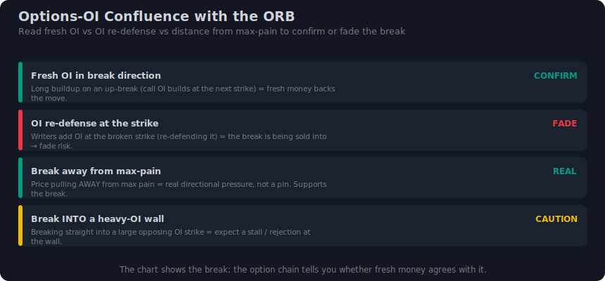
*OI confluence: fresh Call OI building (or Put writers stepping in) in the break direction and price pulling away from max-pain confirm a real break; an opposing OI wall re-defending the OR strike marks a fade.*

## 18. Prior-day high/low and the witness stack — real vs fake break

The last structural witness is the simplest and one of the strongest: the **prior-day high and low (PDH / PDL).** These are levels the *whole market* watches, so when an OR boundary lands *on or near* PDH/PDL, the break is no longer just about today's range — it is testing a battle line everyone respects.

> [!tip] PDH/PDL confluence at the OR edge
> - OR high ≈ **PDH**: a clean break+close above takes out yesterday's high too — a **double-level break**, much higher conviction. But a break that *sweeps* PDH and snaps back is the textbook stop-raid (turtle-soup / liquidity grab). The close decides.
> - OR low ≈ **PDL**: mirror logic for PE breaks.
> - OR boundary far from PDH/PDL: the break has **room** to run to that level as a natural first target (ties to measured-move targeting in Part 5).

(repo: research-orb.md §1, §4 — PDH/PDL confluence; the books-fade-the-trap framing; Author: Trader Dale, *Volume Profile* — Strategy 6, prior-day high/low requires 1–3 candles of acceptance before the retest entry; ICT/SMC — the first range break as a stop-raid before the real move.)

### The witness checklist — assemble the stack

No single witness is enough. ORB supplies the **level**; the witnesses decide whether to **trust** the break or **fade** it. Score them together:

> [!example] The ORB witness checklist
> 1. **Level** — OR edge broken on a *close* (not a poke); bonus if it coincides with PDH/PDL / a key strike.
> 2. **VWAP** — break is on the correct side of VWAP (§13).
> 3. **Volume** — break candle shows expansion, not a thin poke (§14).
> 4. **Profile** — break points into an **LVN** (room), not an **HVN** (wall) (§15).
> 5. **CVD** — confirms with no divergence (inferred-feed: divergence is the trustworthy read) (§16).
> 6. **OI** — fresh OI in the break direction; price pulling away from max-pain; no defended wall at the OR strike (§17).
>
> **Most witnesses agree → real break (trade it). Witnesses contradict the break → trap (fade it / stand aside).**

### Real vs fake break — the decision table

| Witness | REAL break (trust → trade the breakout) | FAKE break (fade → trap / fakeout-reversal) |
|---|---|---|
| **Close vs poke** | Candle **closes** decisively beyond OR edge | Wick/poke only; closes **back inside** the range |
| **VWAP** | Break on the **right side** of VWAP, VWAP sloping with it | Break **against** VWAP / VWAP rejection at the edge |
| **Volume** | Clear **expansion** on the break candle | **Thin** poke, or huge bar that closes back in (absorption) |
| **Volume profile** | Breaks **into an LVN** (air above/below) | Breaks **into an HVN** (wall) / pulled back to VPOC |
| **CVD** | New CVD extreme **with** price (no divergence) | **Divergence** — price new high, CVD fails to follow |
| **Open interest** | **Fresh OI** in break direction; moves **away** from max-pain | Opposing **OI wall re-defended** at the OR strike; drifts toward max-pain |
| **PDH/PDL** | Break+close **through** PDH/PDL (double level) | **Sweeps** PDH/PDL and snaps back (liquidity grab) |
| **Acceptance** | 1–3 candles **hold** beyond the level | Immediate rejection back inside within 1–2 candles |

> [!warning] The decisive asymmetry
> When the witnesses **split**, default to caution: a break with two or three contradicting witnesses is exactly the setup the books call a **stop-hunt trap** — and on a balance / range day it is the *fakeout-reversal* that pays, not the breakout. Which of the two plays you take is settled by **regime / day-type** — that fork is the whole of Part 4. The witness stack here tells you *which way the evidence points*; the regime tells you *whether to believe a break at all today.*

> [!summary] ORB supplies the level; the witnesses decide trust — VWAP (right side), volume (expansion not a poke), profile (into an LVN, not an HVN), CVD (no divergence — on Indian inferred feeds the *divergence* is the trustworthy read, see [[Intraday Options Decision Engine/note|Decision Engine]] §27), OI (fresh in-direction, away from max-pain, no defended wall) and PDH/PDL stack into a real-vs-fake verdict, with regime (Part 4) settling whether to trade the break or fade the trap.

---

## 19. The two ORB plays — breakout vs fakeout

Here is the secret the broker blogs bury and the books shout: **the opening-range break is not one trade — it is a fork.** When the 5m candle pierces the OR high or low, exactly one of two things is happening, and they want opposite actions from you.

1. **The real breakout** — initiative money has *accepted* prices beyond the range. Balance is becoming imbalance; the move extends. You **trade with the break** (CE on a high break, PE on a low break). This is the [[Breakout Trading/note|Breakout Trading]] play, narrowed to the OR boundary as the level.
2. **The trap (fakeout / sweep)** — the first poke beyond the OR was a **stop-hunt**: price ran the obvious resting orders just outside the range, found no follow-through, and snapped back inside. You **fade it** (PE after a swept high that fails, CE after a swept low that fails). This is the [[Fakeout Reversal Trading/note|Fakeout Reversal Trading]] play.

> [!warning] This is the whole game
> Every other section in this guide — windows, regimes, entries, stops — exists to answer one live question: *is this OR break a BREAK or a HOLD?* The naive "buy every ORB break" template loses because it answers "BREAK" every single time. The honest edge (~48% win rate, brutal drawdown — recall §4 of the foundations) comes entirely from getting this fork right. The break is the **trigger**; the fork is the **edge**. (repo: research-orb.md §1, §6)

The tell is **acceptance vs rejection**. A real breakout produces a wide-body 5m candle that *closes* beyond the OR edge, and the next one or two candles build value out there (Dale's "wait for a few candles to form below the open-drive to make sure the market accepted the lower prices as a temporary fair value"). A trap produces a long-wicked candle — price stabs out, the body closes *back inside* the range, often on a poke with no volume behind it. (Trader Dale, *Volume Profile*; repo: research-orb-books.md §1, §8)

| | Real breakout (trade it) | Trap / fakeout (fade it) |
|---|---|---|
| **What price does** | Closes *beyond* OR, builds value outside | Wicks beyond OR, *closes back inside* |
| **Candle shape** | Wide body, small opposing wick | Long wick into the sweep, small body |
| **Follow-through** | 1–3 acceptance candles out there | Snaps back within 1–2 candles |
| **Volume / effort** | Expansion on the break candle | Thin poke, or absorption (high vol, no progress) |
| **CVD / order flow** | Confirms (delta in break direction) | Diverges (delta fades or flips) |
| **Books' name** | Open-drive / Break of Structure | Judas swing · turtle soup · stop raid |
| **Your trade** | With the break (CE high / PE low) | Against it (PE swept-high / CE swept-low) |

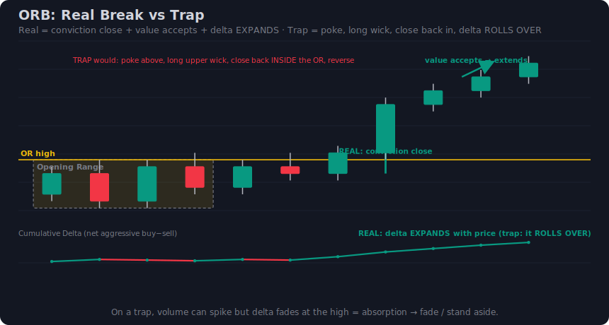
*Left — a real OR-high break: wide-body 5m close beyond the range, acceptance candles, then continuation (CE long). Right — a trap: a long upper wick stabs above the OR, closes back inside, and reverses (PE short). Same starting picture, opposite trades.*

*Animated: watch the break candle decide its own fate — body closing outside = breakout; wick out, body back in = trap.*

> [!note] Both directions are symmetric
> Everything above flips cleanly for the downside. A **real low break** = wide-body 5m close below OR low → **buy PE**. A **swept-low trap** = wick below OR low, close back inside → **buy CE** (fade the failed breakdown). Throughout this part, every "high / CE" rule has a mirror-image "low / PE" rule — never trade only one side of the range.

---

## 20. Regime decides which play is live

You do **not** decide breakout-vs-fakeout at the OR edge by gut feel in the heat of 9:30 AM. You decide it *before the break*, from the regime — exactly the discipline of the [[Intraday Options Decision Engine/note|Decision Engine]] §16, which collapses the menu to at most two plays before price ever reaches the level.

The single most useful frame: **a trend / negative-GEX day makes the breakout the live play; a balance / positive-GEX / near-max-pain day makes the fakeout the live play.**

| Regime read (before the open settles) | What the first OR break usually is | Play that is LIVE | Vehicle |
|---|---|---|---|
| **Trend day · negative GEX · away from max-pain · expanding range · trend HTF (1h)** | A *real* break that extends | **Breakout** — trade the break | CE on high / PE on low |
| **Balance day · positive GEX · near max-pain · contracting range · rotational HTF** | A *sweep* that reverts to value | **Fakeout** — fade the break | PE on swept high / CE on swept low |
| **Mixed / unclear · event pending · ultra-narrow first candles** | Coin-flip — no edge | **Stand aside** until acceptance is obvious | — |

> [!tip] Why GEX is the master switch
> When dealers are **short gamma (negative GEX)**, they hedge *with* the move — selling into falls and buying into rallies — which **amplifies** range breaks into trends. The OR break runs. When dealers are **long gamma (positive GEX)**, they hedge *against* the move — buying dips, selling rips — which **suppresses** breaks and pins price toward **max-pain**, so the first OR poke is a sweep that mean-reverts. Read GEX sign + distance-to-max-pain *first*; it tells you whether you are hunting breakouts or fakeouts today. (Decision Engine §16; repo: research-orb.md §4)

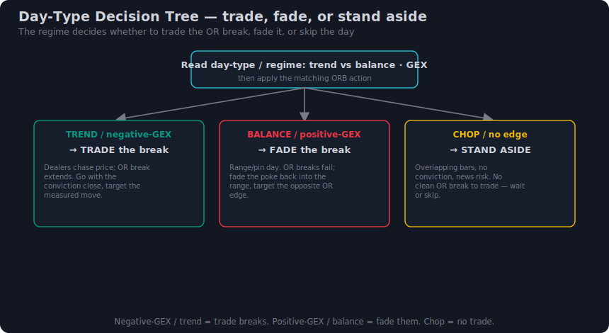
*Regime is the top gate: negative-GEX/trend funnels you into the breakout play (trade the break); positive-GEX/balance/near-max-pain funnels you into the fakeout play (fade it); ambiguous = stand aside.*

> [!warning] If you are debating fade AND break at the same edge, you skipped this step
> The Decision Engine's blunt rule applies verbatim to ORB: you should *rarely* be choosing between trading and fading the same OR boundary on the same day. The regime read decides it in advance. Arguing both live means you haven't read the regime. (Decision Engine §16; repo: research.md, lens 5)

**Expiry overlay (India-specific).** On **Nifty weekly-expiry afternoon (now Tuesday — verify on NSE)**, gamma is enormous and the base case is **pinning toward max-pain**, not expansion — so a 5m close beyond the OR means little against an OI wall, and directional *buying* after ~2:30 PM is theta-hostile and low-EV. On expiry afternoon the **fakeout-toward-max-pain** play dominates: fade failed moves away from the pin, or stand aside. BankNifty trades sit on **monthly** expiry (no weekly gamma squeeze), so its OR is less pin-dominated intraday. (repo: research-orb.md §7; Decision Engine §16)

---

## 21. Entry model A — the break-and-close

The first of two entry models, and the web's default: **enter when a 5m candle CLOSES beyond the opening range** (which you marked on the 15m). The close is the filter — it cuts the opening whipsaw and the single-tick wick fakeout that traps "buy-stop above the high" orders. Do **not** chase the wick. (Tradersmastermind, Groww; repo: research-orb.md §3)

**Long / CE (high break).**

| Step | Action |
|---|---|
| 1 | OR marked on the 15m (9:15–9:30 default), high = `ORH`. |
| 2 | Wait for a **5m candle to close above `ORH`** with a wide body (not a doji poke). |
| 3 | Enter CE on that close — ATM / slightly-ITM, delta ~0.40–0.60. |
| 4 | SL: opposite OR end (`ORL`) or the break-candle low + buffer (see §25–27). |
| 5 | Target: measured move (OR width projected) → next level / VWAP / PDH (§26). |

**Short / PE (low break).** Mirror it exactly: wait for a **5m candle to close below `ORL`**, wide body, then buy PE on the close; SL at `ORH` or the break-candle high + buffer; target the OR-width projection down toward the next level / VWAP / PDL.

> [!example] Nifty worked — break-and-close, CE
> OR (9:15–9:30) = high **24,560**, low **24,500** → width 60 pts. Regime: negative-GEX trend day, 1h up. At 9:45 a 5m candle closes at **24,572** (12 pts above `ORH`, wide body, volume expansion). **Buy CE** on the close. SL at `ORL` 24,500 (a 72-pt spot stop) or, tighter, the break-candle low 24,548 (a 24-pt stop). Convert to premium via delta (§25–27) and check the budget before firing.

**BankNifty / Sensex note.** Same mechanics, bigger numbers: a BankNifty OR width of ~150–250 pts is normal, so the opposite-end stop is large in points — lean on the break-candle stop or model B (retest) to keep the premium risk inside budget. Sensex (BSE) keeps **Thursday** weekly expiry; BankNifty is **monthly-only** — *verify lot sizes and expiry on the exchange* (Nifty 65 / BankNifty 30 / Sensex 20, subject to revision).

| Break-and-close | Pros | Cons |
|---|---|---|
| | No wick-chasing; the close filters one-tick traps | Entry is *after* the move started → worse average price |
| | Simple, mechanical, beginner-safe | Stop is wide (opposite OR end) → larger premium risk |
| | Works without waiting for a pullback that may not come | On trend days you can miss the runaway open-drive entirely |

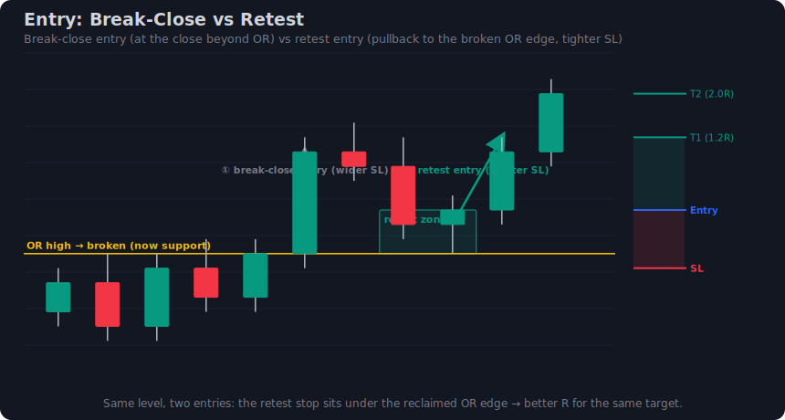
*Model A enters on the 5m close beyond the OR (the dot on the breakout candle); model B waits for the pullback to the broken edge. A fires earlier with a wider stop; B fires later with a tighter stop.*

*Animated comparison of the two entry timings on the same break — note where each places its stop.*

---

## 22. Entry model B — the retest (tighter stop)

The books' **preferred** entry, and the one that makes ORB options-friendly: after price breaks and *accepts* beyond the OR, **wait for it to pull back to the broken edge and hold**, then enter on the rejection. The broken OR high becomes support (long/CE); the broken OR low becomes resistance (short/PE). (Trader Dale: "I wait... 1–3 candles above the high... then I wait for the price to come back to this support. When it returns I enter long"; repo: research-orb-books.md §3)

**Why it is the smart-money entry.** The retest does two jobs at once:

- **It confirms the break is real** — a true breakout retests and *holds*; a trap fails to come back and instead collapses through the level. The pullback itself is a free filter against the fakeout.
- **It shrinks the stop** — your invalidation moves from the far OR end up to *just below the retest swing* (long) or *just above it* (short). A smaller spot-point stop converts to a **smaller option-premium stop**, which means a smaller per-trade risk for the same lot size — the single biggest reason ORB-on-options favours the retest. (repo: research-orb.md §3, §5)

**Long / CE (retest of broken `ORH`).**

| Step | Action |
|---|---|
| 1 | 5m closes above `ORH` (the model-A break) — *don't enter yet*. |
| 2 | Price pulls back **to `ORH`** and prints a bullish reaction candle that holds above it. |
| 3 | Enter CE on the hold (into the order-block / FVG left by the break, if present). |
| 4 | SL: just **below the retest swing low** (much tighter than `ORL`) + buffer. |
| 5 | Target: same OR-width projection / next level as model A. |

**Short / PE (retest of broken `ORL`).** Mirror: 5m closes below `ORL`; price rallies **back to `ORL`** and prints a bearish reaction that holds below it; enter PE on the hold; SL just **above the retest swing high** + buffer.

> [!example] Nifty worked — retest, CE (compare the stop to §21)
> Same break: `ORH` 24,560. Instead of buying the 24,572 close, you wait. By 10:05 price dips back to **24,558–24,562**, prints a bullish-pin 5m candle, and holds. **Buy CE** on the hold at ~24,565. SL just below the retest low at **24,548 → a 17-pt spot stop**, versus the 72-pt opposite-end stop in §21. Same trade, ~¼ the premium risk — so you can size the same lots for far less rupee risk, or hold the risk constant and size up.

> [!tip] The cost of the retest
> The tighter stop is not free: **the retest may never come on a runaway trend day** (a genuine open-drive often never looks back). Rule of thumb — on a *clear* negative-GEX trend morning, take model A and accept the wider stop rather than miss the move; on a *normal* or balance-leaning day, prefer model B for the cheaper option. This is the same trade-off taught in [[Breakout Trading/note|Breakout Trading]]; the ORB just supplies the level. (repo: research-orb.md §3)

---

## 23. Sweep-and-go vs sweep-and-reverse

Zoom into the exact moment at the OR edge and you see the fork from §19 in its rawest form. Almost every break *starts* the same way — price pushes past the boundary and takes the resting liquidity (the stops parked just outside). The difference is what happens **next**, and it has a name in [[Fakeout Reversal Trading/note|Fakeout Reversal Trading]]:

- **Sweep-and-GO** — price takes the liquidity *and keeps going*: the candle **closes beyond** the OR, volume/CVD confirms, acceptance follows. The sweep was the *fuel* for a real breakout. → **trade with it** (this is your model-A / model-B breakout entry).
- **Sweep-and-REVERSE** — price takes the liquidity *and rejects*: the candle wicks out and **closes back inside** the OR, often on absorption (high volume, no progress) or a CVD divergence. The sweep *was the trade* — for the other side. → **fade it** (the fakeout-reversal entry).

> [!note] The sweep is neutral — the close is the verdict
> Beginners see "price broke the high" and buy. Both a go and a reverse break the high. The **5m close** relative to the OR edge is what separates them: **body outside = go; body back inside = reverse.** This is why every entry model in this guide waits for the close. (repo: research-orb-books.md §1, §8)

**How to tell them apart live (in order of reliability):**

| Tell | Sweep-and-GO (real break) | Sweep-and-REVERSE (trap) |
|---|---|---|
| **5m close vs OR edge** | Body closes *beyond* the edge | Body closes *back inside* |
| **Wick** | Small wick past the edge | Long wick, body rejected |
| **Volume / effort** | Expansion behind the break | Thin poke, or absorption (vol up, price stuck) |
| **CVD / order flow** | Delta confirms direction | Delta diverges / flips at the edge |
| **Regime (§20)** | Negative-GEX / trend day | Positive-GEX / near-max-pain / balance |
| **OI / option chain** | Wall unwinds, fresh OI builds in break direction | Wall re-defends; OI builds *against* the break |
| **Follow-through** | 1–3 acceptance candles hold out there | Snaps back within 1–2 candles |

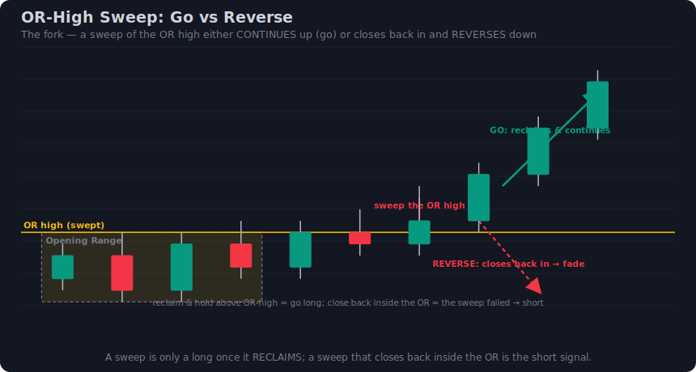
*The fork at the OR edge: identical liquidity grab, two outcomes. Left — sweep-and-go: liquidity taken, close beyond, continuation (trade with). Right — sweep-and-reverse: liquidity taken, close back inside, reversal (fade).*

*Animated: the sweep candle reaching past the edge, then resolving either as a hold-beyond (go) or a snap-back-inside (reverse).*

> [!warning] The stop-take is correct behaviour, not a mistake
> If you take a model-A breakout and it turns into a sweep-and-reverse, your stop fills — that is the method working. The liquidity grab is *how real moves start*, so a false break that hits your stop is the unavoidable cost of catching the real ones. Don't move the stop, and don't stop trading the pattern over one trap. (repo: research-orb.md §6)

---

## 24. The day-type decision tree

Now tie §19–23 into one read you can run every morning, in order. Each gate either narrows the menu or sends you to the sidelines.

```
1. OPEN TYPE (how did the range form?)
   Gap-up / gap-down / flat? Range narrow or wide? First candles violent or quiet?
        │
        ▼
2. REGIME (the master switch — §20)
   GEX sign? Distance to max-pain? Trend or balance HTF (1h)? Expiry day?
        │
   ┌────┴───────────────────────────┬──────────────────────────────┐
   ▼                                 ▼                              ▼
NEG-GEX / TREND                POS-GEX / BALANCE              MIXED / UNCLEAR
"breakout is live"            / NEAR-MAX-PAIN                 / event / ultra-narrow
   │                          "fakeout is live"                    │
   ▼                                 ▼                              ▼
3. WAIT FOR THE EDGE (§23)    3. WAIT FOR THE EDGE (§23)      STAND ASIDE
   sweep-and-GO?                 sweep-and-REVERSE?           (no edge today)
   (close beyond, vol/CVD        (wick out, close back in,
    confirms)                     absorption / CVD diverge)
   │                                 │
   ▼                                 ▼
4. TRADE THE BREAK             4. FADE THE BREAK
   CE on high / PE on low         PE on swept high / CE on swept low
   │                                 │
   ▼                                 ▼
5. ENTRY MODEL (§21–22)        5. ENTRY MODEL (§21–22)
   trend day → model A (break-    usually model B / on the
   close) OR model B (retest);     reclaim of the OR edge,
   prefer B for the cheaper        SL beyond the swept wick
   option when a pullback comes    (tiny stop = cheap option)
```

| Open type | + Regime | → Decision | Entry model |
|---|---|---|---|
| Gap-up, holds, wide range | Neg-GEX / trend | **Trade the break — CE** | A on a clear drive, else B (retest of `ORH`) |
| Gap-down, holds, wide range | Neg-GEX / trend | **Trade the break — PE** | A on a clear drive, else B (retest of `ORL`) |
| Flat open, narrow range, balance | Pos-GEX / near max-pain | **Fade the break** | B / reclaim — PE on swept high, CE on swept low |
| Gap-up *into* max-pain from below | Pos-GEX, spot below pain | **Fade the high sweep — PE** | B, SL above the wick, target max-pain |
| Any open, expiry PM (Tue, Nifty) | Pos-GEX / pinning | **Fade toward max-pain or stand aside** | B; avoid directional *buying* after ~2:30 PM |
| Violent first 5m, no acceptance | Mixed / unclear | **Stand aside** until a clean close forms | — |

> [!tip] Say it in one breath
> Before you trade, compress the tree into a sentence — e.g. *"Flat open, 50-pt range, positive-GEX, spot 40 pts above max-pain into Tuesday expiry — so I'm fading the first high sweep with a PE toward the pin, model B, stop above the wick."* If you can't say it out loud, you haven't read the day. (Decision Engine §16, §SOP)

> [!summary] Part 4 in one line
> The OR break is a **fork, not a signal** — regime decides whether today's first break is a real breakout (trade it, model A or the tighter-stop retest model B) or a sweep-and-reverse trap (fade it); the 5m **close** relative to the OR edge is the live verdict, and "stand aside" is a valid third answer.

*Next — §25 turns these plays into orders: stop placement (opposite-end / ATR / midpoint), measured-move and next-level targets at 1:1–2:1, and the options layer (strike, delta, the 20%-of-premium stop) that fits the point budget.*

## 25. Stop-loss placement — opposite end, midpoint, ATR

The stop-loss is not where you *hope* to be wrong — it is where the **idea is dead**. For an Opening Range Breakout, the idea is: "price has accepted beyond the opening range and will extend." The stop is the price that proves price has *not* accepted — it has fallen back inside the range. So every ORB stop lives **back inside the box**, never out in the open beyond your entry.

The research gives three placements, in order of popularity (repo: research-orb.md §3):

| Method | Where it sits | Stop distance (Nifty, OR = 24,000–24,060, width 60 pts) | When to use it |
|---|---|---|---|
| **Opposite OR end** (default) | The *other* boundary of the range. Long CE → stop at OR low. Short PE → stop at OR high. | Break-close entry ~24,072 → stop 24,000 = **72 pts** | The honest, conservative default. The break is only "wrong" if the *whole* range fails. Wide stop, but the cleanest logic. (Tradersmastermind, Groww) |
| **Range midpoint** | Halfway across the OR (here 24,030). | Entry 24,072 → stop 24,030 = **42 pts** | When the range is *wide* and the opposite-end stop blows your budget (§28). Tighter, but you eat more whipsaw stop-outs. |
| **Half-range / ATR** | A fixed fraction below the broken edge: half the OR width, or **10–20% of daily ATR**. | OR-high 24,060; half-range = 30 pts → stop 24,042 = **30 pts**. ATR(14)=300 → 15% = 45 pts → stop 24,027. | When you want a *volatility-normalised* stop that does not depend on a noisy range. Books' preferred. (repo: research-orb-books.md — Trader Dale, *VWAP*, ATR-based Stop Loss: "around 10–20% of the average daily volatility (ATR)") |

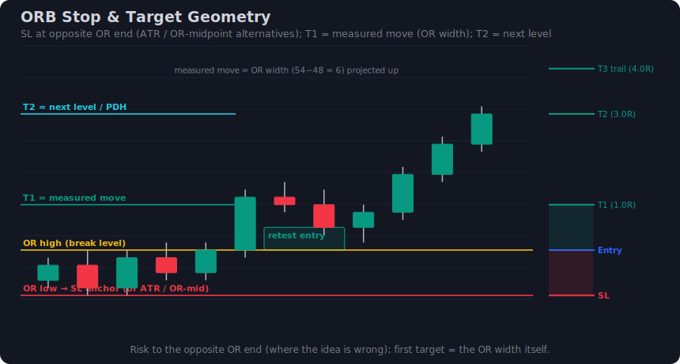
*The three SL placements measured off the same break: opposite-end (widest, safest logic), midpoint (tighter, more whipsaw), and ATR/half-range (volatility-normalised). The 🟡 band is the opening range; 🔴 marks each stop; 🟦 the targets.*

> [!tip] The retest is the cheat code for stops
> If you enter on the **retest** of the broken edge (price breaks 24,060, pulls back to ~24,060, then turns up) instead of chasing the break-close at 24,072, your stop moves to *just below the retest swing* — say 24,048. Now the stop is **12–15 pts**, not 72. Same idea, one-fifth the risk. This is why the books insist on the retest (repo: research-orb-books.md — Dale Strategy 6). We will cash this in directly in §26 and §27.

**Both directions, explicitly:**

- **Long CE (break of OR high):** entry above the OR high; stop at OR low (opposite end), or midpoint, or ATR-fraction below the OR high. The instrument falls *through* the range to invalidate.
- **Short PE (break of OR low):** entry below the OR low; stop at OR high (opposite end), or midpoint, or ATR-fraction above the OR low. The instrument rallies *back through* the range to invalidate.

The critical conversion comes next: **whatever the spot stop is in points, it becomes a premium stop on the option** — and *that* number, not the index points, is what actually leaves your account. See §27. For the full Greek derivation of why delta turns a point-stop into a premium-stop, do not re-derive it here — see [[Intraday Options Decision Engine/note|Decision Engine]] §32 (delta-based stop) and §33 (the per-instrument stop budget).

---

## 26. Targets and risk:reward — measured move, levels, R-multiples

A stop without a target is a wish. ORB has two natural targets, stacked.

**T1 — the measured move (project the OR width).** The opening range has a *width*; a clean break tends to travel at least that width again. So:

- **Long CE:** T1 = OR high + OR width. Here OR high 24,060 + 60-pt width = **24,120**.
- **Short PE:** T1 = OR low − OR width. Here OR low 24,000 − 60 = **23,940**.

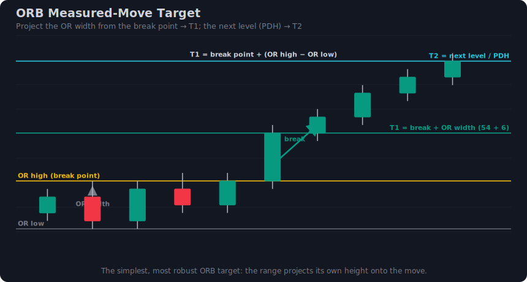
*The measured move: the 🟡 opening-range width is projected from the break point to set T1 (🟦). T2 is the next structural level — PDH/PDL, a naked VPOC, or an HVN.*

**T2 — the next structural level.** Beyond the mechanical measured move, the *real* target is the next place price will fight: **previous-day high/low (PDH/PDL), a naked VPOC, an HVN, or VWAP bands**. Always **exit a touch *before* the barrier**, not at it (repo: research-orb-books.md — Dale, *VWAP*: "exit your trade a bit before it reaches a significant barrier"). If PDH sits at 24,135, take profit at ~24,128, not 24,135.

**R-multiples — keep it honest.** The research anchors ORB at **1:1 to 2:1** (repo: research-orb.md §3). With a ~48% naive win rate (repo: research-orb.md §6), 1:1 *loses money after costs* — you need to push the runner toward 1.5–2R *and* be selective. Map both targets to R:

| | Opposite-end stop (72 pts) | Retest stop (15 pts) |
|---|---|---|
| **T1 measured move** (60 pts) | 0.83R — sub-1R, weak | **4.0R** — excellent |
| **T2 next level** (~110 pts to PDH) | 1.5R | **7.3R** |

This table is the whole argument for the retest in one frame: the *same target* is a feeble 0.83R off a chased break and a fat 4R off a retest. **The entry model, not the target, makes ORB's R:R.**

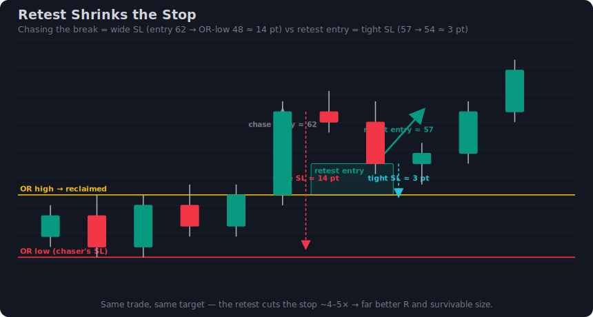
*Chasing the break (left) places the stop at the far OR end → big risk, small R. Entering on the retest (right) places the stop just under the retest swing → tiny risk, large R, identical target.*

*Animation: watch the stop distance collapse as the entry shifts from break-close to retest — the target never moves; only the risk shrinks.*

> [!warning] The hard time-exit overrides the target
> ORB is an *opening* edge. If your target has not hit by **~2:30 PM IST, flatten the position regardless** (repo: research-orb.md §3). After the afternoon, theta and chop work against an option buyer and the opening thrust is spent. A trade that has not worked by mid-afternoon is a trade that did not work.

**Partials and trailing.** A clean, professional ORB exit:

1. **Book half at T1** (the measured move). Risk is now off the table.
2. **Trail the remaining half** behind the 5m swing or VWAP toward T2 on a trend day; books explicitly trail beyond 1R on trend days (repo: research-orb-books.md — Dale, VWAP Trend).
3. **One trade per day** is the common discipline (repo: research-orb.md §3) — if the ORB stops out, you are done; do not revenge-trade the chop.

---

## 27. The options layer — strike, delta, and the premium stop

Everything above is in **index points**. You do not trade index points — you trade an **option**, and the option's premium moves a *fraction* of the index, set by **delta**. This section is where the spot plan becomes a real order. (For the full Greeks, see [[Intraday Options Decision Engine/note|Decision Engine]] §31–36; we use the results, not the derivation.)

**Pick the strike: ATM or slightly-ITM, delta 0.40–0.60.**

- **CE on a bull break / PE on a bear break**, struck **at-the-money or one strike in-the-money**, so delta sits **~0.40–0.60** (repo: research-orb.md §5; Zerodha Varsity Delta Pt.2).
- **Why this band:** at delta ~0.50 the premium moves about **₹0.50 per ₹1 (per 1 index point)** of favourable spot move — efficient, responsive, and it actually *participates* in the thrust.
- **Avoid deep OTM.** Delta is too low (0.10–0.20), the premium barely budges on a real move, theta eats it, and the "cheap" strike is the most expensive way to be right.

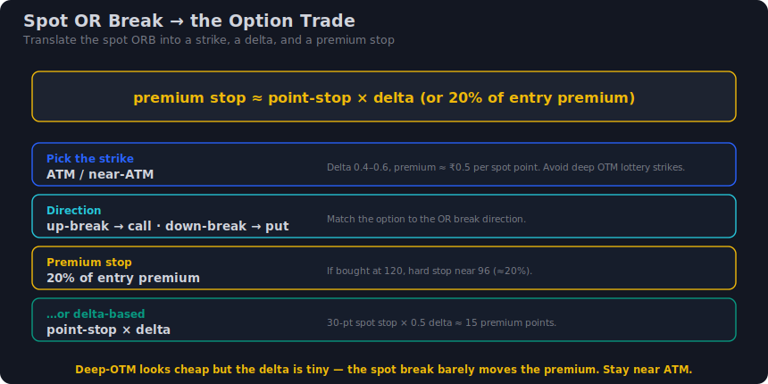
*Spot ORB signal → strike selection. The ATM/near-ATM strike (delta ~0.5) tracks the index thrust; the deep-OTM strike (delta ~0.15) barely responds. The premium stop is drawn from the spot point-stop via delta.*

**Two ways to set the premium stop (use whichever is tighter inside the budget):**

1. **Delta × point-stop** (the structural way). Premium stop ≈ delta × (spot point-stop), then place it below entry premium.
2. **20% of entry premium** (the Zerodha variant, repo: research-orb.md §5). Hard cap: if the premium drops 20% from entry, you are out.

> [!example] Worked CE — long, trend-day break (Nifty)
> - OR = 24,000–24,060 (width 60). Bull break, **retest entry** at spot 24,062.
> - Buy **24,050 CE** (slightly ITM), delta **0.55**, entry premium **₹120**.
> - Spot point-stop = retest stop at 24,048 → **14 pts**.
> - **Delta-based premium stop:** 0.55 × 14 ≈ **₹7.7** → stop premium ≈ **₹112**.
> - **20%-rule premium stop:** 0.20 × 120 = ₹24 → stop premium ₹96 (a *wider* 88-pt-equivalent stop). The delta stop is tighter and matches the actual idea — use **₹112**.
> - **T1** (measured move, +60 pts spot): premium ≈ 120 + 0.55×60 ≈ **₹153** (book half here).
> - **T2** (PDH ~+110 pts): premium ≈ 120 + 0.55×110 ≈ **₹180** (trail to here).
> - Risk ₹8/lot of premium to make ₹33–60 → ~4–7R on the runner.

> [!example] Worked PE — short, balance-day fade (Nifty)
> - OR = 24,000–24,060. Price sweeps the OR high to 24,072, **closes back inside** (a trap — the fakeout, see [[Fakeout Reversal Trading/note|Fakeout Reversal Trading]]). Short the failure.
> - Buy **24,050 PE** (near-ATM), delta **0.50**, entry premium **₹110**.
> - Spot stop = just above the sweep high, 24,078 → entry ~24,055 → **~23 pts**.
> - **Delta-based premium stop:** 0.50 × 23 ≈ **₹11.5** → stop premium ≈ **₹98.5**.
> - **T1** = OR low / measured move toward 23,940 (~115 pts): premium ≈ 110 + 0.50×115 ≈ **₹167**.
> - Risk ₹11.5 to make ₹57 → ~5R. (Note: the *selling* side of this fade carries the better drawdown profile — ~6% vs ~45% for buying, repo: research-orb.md §6 — but option *buying* the fade is the simpler retail expression.)

> [!warning] Spread and slippage are real
> ATM Nifty options can carry a ₹0.5–1 spread; on a fast ORB break it widens. A ₹8 premium stop with a ₹1 spread is *really* a ₹9 stop. Use limit orders on entry, market or SL-M on the stop, and never trade an option whose spread is more than ~10% of your premium stop. (repo: research-orb.md — Open question #4: costs erode a 2:1 ORB.)

---

## 28. Sizing, expiry and theta

**Size by the budget, not by the capital.** The cardinal ORB sizing rule: pick a fixed **per-instrument point-stop budget** (e.g. Nifty ≤ 30–40 pts, BankNifty ≤ 80–100 pts), and **only trade ORB setups whose stop fits inside it** (see [[Intraday Options Decision Engine/note|Decision Engine]] §33 — the stop budget). If today's OR is *wider* than your budget allows, you have three choices, in order:

1. **Wait for the retest** — it shrinks the stop into budget (§25–26). First choice.
2. **Use the midpoint/ATR stop** if the structure supports it (§25). Second choice.
3. **Skip the trade.** Never *widen the budget* to fit the trade.

> [!warning] Never widen the budget to fit the trade — widen nothing
> The single most account-destroying ORB habit is "the range is huge today, so I'll just risk more." No. A wide OR is the market *telling you* the day is messy and the break is low-quality. Shrink the entry (retest) or stand aside. The budget is a wall, not a suggestion.

**One-lot sizing, both directions (illustrative, verify on NSE/BSE — lots change):**

| Index | Lot size | Premium stop (from §27) | ₹ risk per lot | Lots to risk ₹1,000 |
|---|---|---|---|---|
| **Nifty** | **65** | ₹8 (CE) | 65 × 8 = **₹520** | 1 lot ≈ ₹520 (well inside ₹1,000) |
| **BankNifty** | **30** | ₹18 (wider OR, ~scaled) | 30 × 18 = **₹540** | 1 lot ≈ ₹540 |
| **Sensex** | **20** | ₹15 | 20 × 15 = **₹300** | up to 3 lots |

BankNifty's OR is typically ~1.6–2× Nifty's in points, so its point-stop and premium scale up proportionally — same *method*, bigger numbers. Size down to keep ₹-risk constant.

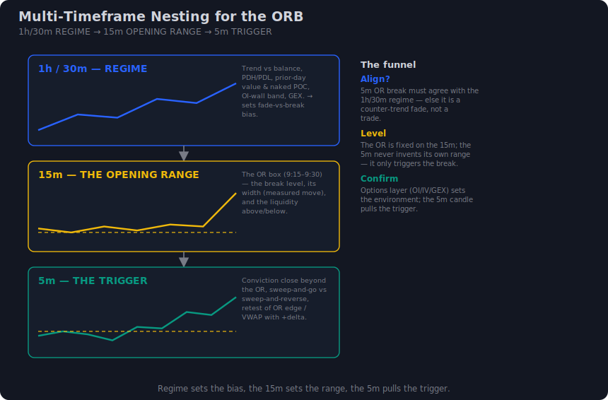
*The funnel that gates sizing: 1h/30m sets the regime (trade the break vs fade it), the 15m marks the opening range, the 5m times the entry. The stop budget sits at the bottom — if the 15m OR is too wide for the 5m entry to fit the budget, you do not size; you skip.*

**Expiry and theta — the calendar is a risk input.**

- **Nifty weekly expiry = Tuesday** (shifted from Thursday, Sep 1 2025; verify on NSE — repo: research-orb.md §7). **A weekly ATM option late on a Tuesday is theta-hostile**: the opening thrust must overpower fast premium decay. Buying ORB *late on expiry day* is the worst time to be long premium. Either trade ORB on expiry day **early** (9:15–10:30, max gamma works for you) or **sell** the fade instead of buying.
- **BankNifty has no weekly options** post-SEBI Nov 2024 — only **monthly** (verify on NSE — repo: research-orb.md §7). That is *good news* for ORB buying: no weekly-gamma cliff, slower theta, a calmer premium to hold for the measured move. BankNifty monthly ATM is the more forgiving ORB vehicle than a Nifty expiry-Tuesday weekly.
- **Sensex** keeps a weekly (Thursday, BSE) — treat it like Nifty's weekly for theta.

> [!tip] Match the vehicle to the day
> Non-expiry day → Nifty weekly ATM is fine. Expiry Tuesday afternoon → switch to BankNifty monthly, or sell the fakeout, or sit out. The strategy is the same; the *contract* adapts to the theta clock.

---

## 29. The ORB scorecard and two worked setups (long & short)

Before any ORB trade, score it. **A+ = take full size; A = take, smaller; below = skip.** This is how you convert a coin-flip pattern into a selective edge.

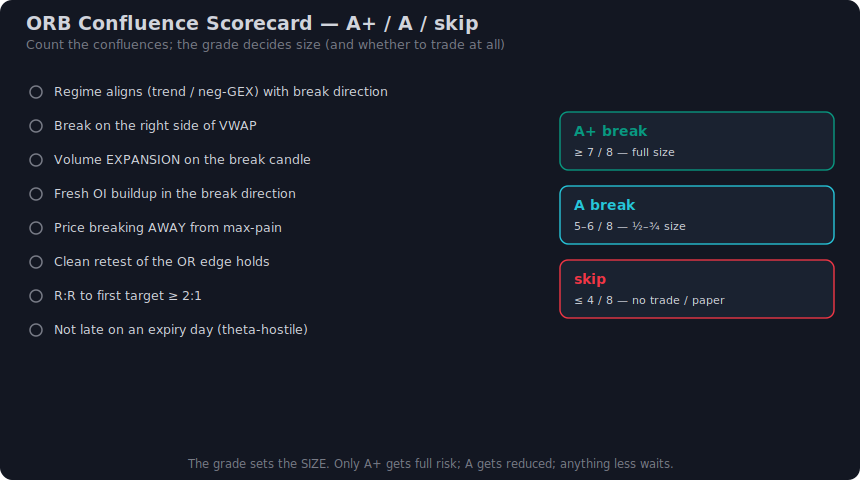
*The ORB confluence scorecard: each witness (regime, VWAP side, volume, OI, level, range width, entry model) scores, and the total tier (A+/A/skip) sets whether and how to trade.*

| Factor | A+ (2 pts) | A (1 pt) | Skip (0) |
|---|---|---|---|
| **Regime / day-type** | Trend day / negative-GEX, break direction agrees | Mild trend | Balance/positive-GEX & you're *chasing* the break (fade instead) |
| **VWAP side** | Break is on the correct side of VWAP | Price reclaiming VWAP | Break against VWAP |
| **Volume on break candle** | Clear expansion vs OR candles | Slight expansion | Flat/declining volume |
| **OI / option-chain** | Fresh OI in break direction, away from max-pain | Neutral | OI building *against* you / pinned at max-pain |
| **Level** | Break aligns with PDH/PDL/VPOC | Near a level | Mid-air, no level |
| **Range width vs budget** | Stop fits budget on break-close | Fits only on retest | Too wide even on retest |
| **Entry model** | Retest (tight stop) | Break-close with confirmation | Naked first-touch chase |

**Scoring:** ≥11 = **A+** (full lot). 8–10 = **A** (half size). <8 = **skip / wait**. A naive "buy every break" trade scores ~4–6 — exactly the ~48% coin-flip the research warns about (repo: research-orb.md §6).

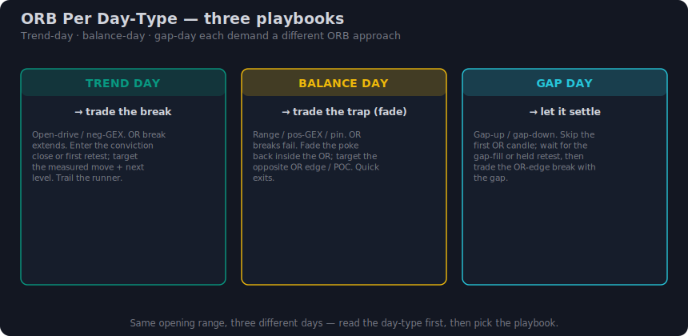
*Compact playbook cards: trend-day ORB (trade the break), balance-day ORB-fade (trade the trap reversal), gap-day ORB (let the open settle, then read acceptance).*

> [!example] WORKED SETUP A — Long CE, trend-day break (Nifty, full A+ )
> **Context:** 1h regime = uptrend, negative-GEX day. Gap-up open holds above PDH.
> 1. **Mark OR (9:15–9:30):** 24,000–24,060, width 60.
> 2. **9:42 — break:** 5m candle closes at 24,072, volume 1.8× the OR candles, price above VWAP, fresh CE OI building. **Score: regime 2 + VWAP 2 + volume 2 + OI 2 + level 2 (above PDH) + width 1 + entry (wait for retest) = 11 → A+.**
> 3. **9:50 — retest entry:** price dips to 24,061, holds, turns up → **enter spot-equivalent 24,062**. Stop just under retest swing 24,048 = **14 pts**.
> 4. **Option:** buy **24,050 CE**, delta 0.55, premium **₹120**. Premium stop 0.55×14 ≈ **₹112** (₹8 risk; 65 lot = ₹520 risk).
> 5. **T1 +60 pts → premium ~₹153:** book **half** (33% of full-position gain locked).
> 6. **Trail** remaining half behind 5m swings toward PDH-cluster +110 → premium ~₹180; trail-stop catches it at ₹172. **Exit by 2:30 PM** rule not needed — hit T2 at 11:40.
> 7. **Result:** half at +₹33, half at +₹52 → blended **~+₹42/lot premium on ₹8 risk ≈ +5R.** One trade, done for the day.

> [!example] WORKED SETUP B — Short PE, balance-day fade (Nifty, the trap)
> **Context:** 1h regime = balance/positive-GEX, flat open, price coiling around VWAP. This is a **fade-the-break** day, not a chase day.
> 1. **Mark OR (9:15–9:30):** 24,000–24,060.
> 2. **10:05 — false break:** price spikes the OR high to **24,072**, *no* volume expansion, then the next 5m candle **closes back inside** at 24,041. That is a sweep-and-reverse — the Judas/turtle-soup trap (repo: research-orb-books.md §8). Chasing it long would score ~5 (skip). **Fading it short scores: regime 2 (balance) + VWAP 2 (rejected from above) + volume 2 (no expansion on break = exhaustion) + level 2 (swept PDH liquidity) + entry 1 = 9 → A.**
> 3. **Entry:** short the failure at **~24,055** (close back inside). Stop just above the sweep high 24,078 = **23 pts**.
> 4. **Option:** buy **24,050 PE**, delta 0.50, premium **₹110**. Premium stop 0.50×23 ≈ **₹98.5** (₹11.5 risk; half size = A tier).
> 5. **Target:** mean-reversion to OR low / measured move 23,940 (~115 pts) → premium ~₹167. Book at ~₹160 (before the OR-low barrier).
> 6. **Result:** +₹50/lot on ₹11.5 risk ≈ **+4R**, half size. **Time-exit 2:30 PM** if it stalls at VWAP.

---

## 30. Mistakes, psychology, master SOP and one-page summary

**The five ORB mistakes that destroy accounts:**

| # | Mistake | Why it kills you | The fix |
|---|---|---|---|
| 1 | **Chasing the wick** | Entering on the first touch / spike beyond the OR — that spike is often the stop-hunt itself (repo: research-orb-books.md §8). | Wait for the **close beyond** or the **retest** (§25–26). |
| 2 | **Trading every day** | ORB is ~48% naive (repo: research-orb.md §6). Forcing a trade on a balance/chop day is the coin-flip with drawdown. | **Scorecard ≥8** or stand aside. One trade per day. |
| 3 | **Ignoring regime** | Trading the *break* on a fade day (or vice versa). The regime decides *which* play (§29 cards). | 1h/30m regime read **before** marking the OR. |
| 4 | **Deep-OTM strikes** | Delta too low; premium barely moves on a real break; theta + spread bleed you. | **ATM/near-ATM, delta 0.40–0.60** (§27). |
| 5 | **Holding past the time-exit** | The opening edge decays; afternoon theta/chop reverse open profits. | **Flatten by ~2:30 PM IST** no matter what (§26). |

**Psychology.** ORB triggers at the most emotional minute of the day — the open. The fixes are mechanical, not motivational: (1) **pre-commit** the OR levels, stop, target and strike *before* the break, so the break is just a checklist trigger, not a decision under stress; (2) **accept the coin-flip honestly** — a 48%-base pattern *will* string losses; the scorecard and 1:1.5–2 R:R are what make it positive, not being "right"; (3) **the retest feels like missing out** — that FOMO is the exact emotion the trap exploits; the retest is the disciplined entry, not the slow one; (4) **one trade per day** removes revenge trading at the source.

> [!note] Master SOP — the full ORB checklist
> **Before the open (pre-market):** mark PDH/PDL, naked VPOC, prior HVNs, VWAP anchor. Read 1h/30m **regime** (trend vs balance; negative- vs positive-GEX). Set your **stop budget** for the instrument.
> **9:15–9:30 — mark the range:** record OR high, OR low, width on the **15m**.
> **Classify the day:** gap up/down/flat × narrow/wide IB × Dalton open type → does today *favour the break or the fade*?
> **Wait for the trigger (5m):** close beyond the OR (break) **or** sweep-and-close-back-inside (fade). **Score it (§29).** <8 → skip.
> **Enter on the retest** (preferred) or confirmed break-close. Place the **spot stop** (opposite-end / midpoint / ATR).
> **Translate to the option:** ATM/near-ATM, delta 0.4–0.6; set the **premium stop** (delta×point-stop or 20%, tighter one); confirm ₹-risk fits the budget × lot size.
> **Manage:** book half at T1 (measured move), trail the rest to T2 (next level), exit before the barrier.
> **Hard rules:** time-exit ~2:30 PM; **one trade per day**; never widen the budget; expiry-Tuesday afternoon → BankNifty monthly / sell / sit out.

**One-page summary:**

| Element | The number / rule |
|---|---|
| **OR window** | 9:15–9:30 (15m default); mark on 15m, time entry on 5m |
| **Entry** | Close beyond OR (break) **or** retest of broken edge (tighter) **or** sweep-back-inside (fade) |
| **Stop** | Opposite OR end (default) / midpoint / ATR 10–20% of daily ATR; **retest shrinks it ~5×** |
| **Target** | T1 = OR width measured move; T2 = next level (PDH/PDL/VPOC); exit before the barrier |
| **R:R** | 1:1 to 2:1 minimum; retest entries reach 4–7R on the runner |
| **Strike** | ATM / slightly-ITM, **delta 0.40–0.60**; ~₹0.5 premium per index point; **never deep OTM** |
| **Premium stop** | delta × point-stop **or** 20% of entry premium (use the tighter), inside the point budget |
| **Sizing** | 1-lot baseline (Nifty 65 / BankNifty 30 / Sensex 20); size so ₹-risk fits the budget |
| **Expiry/theta** | Nifty weekly **Tuesday** (theta-hostile late) · BankNifty **monthly** (calmer) · verify on NSE/BSE |
| **Hard rules** | time-exit ~2:30 PM · one trade/day · scorecard ≥8 · never widen the budget |
| **Honest edge** | ~48% WR / ~45% DD naive buying; ~6% DD selling — **selectivity is the edge, not the break** |

See also: [[Breakout Trading/note|Breakout Trading]] (the parent pattern), [[Fakeout Reversal Trading/note|Fakeout Reversal Trading]] (the fade side), and [[Intraday Options Decision Engine/note|Decision Engine]] §31–36 (the options/Greeks layer) and §33 (the stop budget).

> [!summary] ORB is a coin-flip pattern that becomes an edge only through selectivity: regime-gate it, enter on the retest to shrink the stop ~5×, put it on an ATM delta-0.5 option with a premium stop inside the budget, target the measured move to the next level at 1.5–2R, and flatten by 2:30 PM — one disciplined trade a day.

---

## Related notes & sources

- **Where this sits:** deep-dive for the opening-range sub-case in [[Intraday Options Decision Engine/note|Intraday Options Decision Engine]] §10.1 · sibling of [[Breakout Trading/note|Breakout Trading]] (the general break) and [[Fakeout Reversal Trading/note|Fakeout Reversal Trading]] (the failed break).
- **In this folder:** [[research-orb|research-orb.md]] (web synthesis, cited) · [[research-orb-books|research-orb-books.md]] (book citations) · [[capture_plan|capture_plan.md]] (real-chart scenarios, deferred pass).
- **External sources:** Zerodha "In The Money" (ORB options backtest) · Tradejini · Groww · Sahi · Tradersmastermind · Wavesstrategy (VP+OI) · Ventura / Zerodha Z-Connect (SEBI expiry). **Books:** Trader Dale *Volume Profile / Order Flow* · Dalton *Mind Over Markets* (Initial Balance / open types) · ICT/SMC · Coulling *VPA*.

> [!quote] The whole game in one line
> The opening-range break is a trigger, not a system — read the regime first, trade the break only when it is *real* (trend / negative-GEX), fade it when it is a *trap* (balance / positive-GEX), put it on an ATM option whose stop fits your budget, and never confuse "popular" with "edge."

> [!warning] Verify before you trade
> Every exchange-set value here (lot sizes, weekly-expiry weekday — Nifty **Tuesday**, BankNifty **monthly-only**, charges/STT) changes — confirm current values on NSE/BSE. All win-rate/return figures are single-source and illustrative, not validated edges. Schematics are illustrative; real-chart captures are a deferred pass (see `capture_plan.md`).
